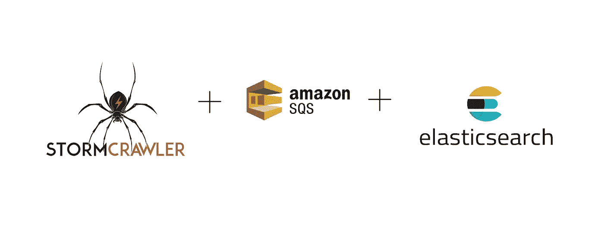
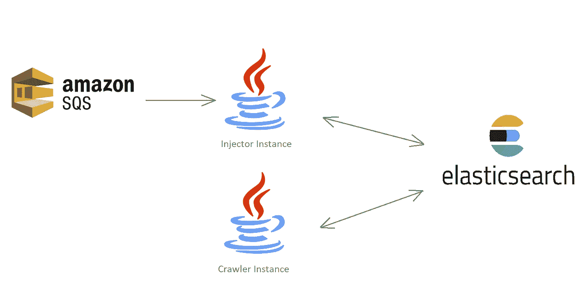

# 在本地模式下连续运行 StormCrawler，不使用 Storm cluster

> 原文：<https://towardsdatascience.com/running-stormcrawler-continuously-in-local-mode-without-a-storm-cluster-22e1aef72198?source=collection_archive---------24----------------------->



在之前的[文章](https://medium.com/@cnf271/web-scraping-and-indexing-with-stormcrawler-and-elasticsearch-a105cb9c02ca)中，我分享了我如何使用 [StormCrawler](http://stormcrawler.net/) 抓取网页并将其索引到 Elasticsearch 服务器的经验。然而，我使用了 [Apache Flux](https://storm.apache.org/releases/2.0.0/flux.html) 在本地模式下运行注入器和爬虫拓扑。运行这两种拓扑的缺点是，flux 使用 60 秒的 TTL，我们必须重复运行注入器和爬虫。此外，我们使用一个 *FileSpout* 从注入器拓扑中的一个文本文件中读取预定义的 URL。

在本文中，我将解释如何在没有 Storm 集群的情况下，在本地模式下同时运行注入器和爬虫拓扑。此外，我将使用 AWS 的简单队列服务(SQS)向注入器提供 URL，而不是从文本文件中读取 URL。

我将跳过最初的步骤，因为我在上一篇文章中简要地解释了它们。此外，我将本文分为两个部分。

# 第 1 部分— StormCrawler 基本配置

**第一步**

使用以下命令创建 maven 项目。假设你已经在你的电脑上安装了 [maven](https://maven.apache.org/) 。

```
mvn archetype:generate -DarchetypeGroupId=com.digitalpebble.stormcrawler -DarchetypeArtifactId=storm-crawler-archetype -DarchetypeVersion=1.15
```

我已经给了 *com.cnf271* 和 *stormcrawlersqs* 分别作为 groupId 和 artifactId。

**第二步**

删除 *crawler.flux* 文件，并将以下文件从 StormCrawler GitHub [资源库](https://github.com/DigitalPebble/storm-crawler)的*/external/elastic search*文件夹添加到 source 文件夹。

*   *ES_IndexInit.sh*
*   *es-conf.yaml*

另外，删除*src/main/Java/com/{ your-group-name }*文件夹中的以下文件

*   *爬虫拓扑*

**第三步**

将*storm crawler elastic search*依赖项和 *AWS Java SQS SDK* 添加到 *pom.xml* 文件中。

```
<dependency>
   <groupId>com.digitalpebble.stormcrawler</groupId>
   <artifactId>storm-crawler-elasticsearch</artifactId>
   <version>1.15</version>
</dependency><dependency>
   <groupId>com.amazonaws</groupId>
   <artifactId>aws-java-sdk-sqs</artifactId>
   <version>LATEST</version>
</dependency>
```

**第四步**

更改 *ES_IndexInit.sh* bash 脚本中的配置以启用内容存储。

```
..."_source": {  
  "enabled": true  
    }, 
  "properties": { 
        "content": {  
            "type": "text",  
            "index": "true",  
            "store": true  
        }
    }
}...
```

**第五步**

执行 *ES_IndexInit.sh* bash 脚本在 Elasticsearch 服务器中创建索引。

```
E:\stormcrawlersqs\stormcrawlersqs>ES_IndexInit.sh
```

既然基本配置已经完成，我将继续讨论本文的实际目标。

# 第 2 部分-为 URL 注入和 web 爬行创建单独的实例

**在没有风暴集群的情况下，在本地模式下连续运行 StormCrawler，实际上是什么意思？**

我将解释我是如何设法在没有任何风暴集群在后台运行的情况下连续运行爬虫的。为了做到这一点，我创建了两个单独的 StormCrawler 实例，Injector 和 Crawler 分别执行 URL 注入和 web 抓取。此外，我还创建了一个 *SQSSpout* 来读取来自 AWS SQS 的队列消息。下图给出了它是如何发生的大致情况。



从上图中可以明显看出，AWS SQS 已被用于向*注入器实例*发送队列消息，注入器实例用状态索引的域细节更新 Elasticsearch 服务器。

*Crawler 实例，*另一方面，持续寻找新的 URL(处于 *DISCOVERED* 状态的 URL ),这些 URL 已经由 Injector 实例发送到 ES 服务器。Crawler 实例将从相关页面中抓取数据，并用内容数据更新 Elasticsearch 服务器。

在源文件夹中为 Injector 和 Crawler 以及 SQSSpout 类创建两个单独的类。

*   *注射拓扑*
*   *爬虫拓扑*
*   *风暴 sqsqqueuespout*

**注射器实例(** *注射器拓扑* **)**

如前所述，注入器实例将使用*stormsqqueuespout*从 AWS 的 SQS 读取消息，我已经实现了类似于[*FileSpout*](https://github.com/DigitalPebble/storm-crawler/blob/master/core/src/main/java/com/digitalpebble/stormcrawler/spout/FileSpout.java)*的 [StormCrawler 核心](https://mvnrepository.com/artifact/com.digitalpebble.stormcrawler/storm-crawler-core/1.15)库。*

*因此，Injector 实例包含一个 spout 和两个 bolts，用于从队列中读取消息、过滤 URL 和更新爬行状态。*

*以下要点显示了使用*stormsqsquespout*从 SQS 队列中读取数据的注入器实例。我使用了一个 *config.properties* 文件来存储和读取 AWS 凭证以访问 SQS 消息。*

**保存在 config.properties* 文件中的 AWS 信息如下*、**

```
*# AWS SQS CREDENTIALS
aws.sqs.followerQueueUrl={queueUrl}
aws.sqs.accessKey={accessKey}
aws.sqs.secretAccessKey={secretAccessKey}
aws.sqs.region={Region}*
```

***SQS 壶嘴(***stormsqqueuespout***)***

*stormsqsquespout 是本文的重点之一。当注入器实例启动并运行时，它使用 StormSqsQueueSpout 来读取由 SQS 发送的要被爬网的 URL。*

*注意，我使用了下面的 json 格式来发送 *url* 到使用 SQS 的注射器实例。*

```
*{"url":"[https://www.bbc.co.uk/](https://www.bbc.co.uk/)"}*
```

*以下要点显示了如何使用 ISpout 接口的 *nextTuple()* 来接收和处理发送到消息队列的 SQS 消息。*

> *[**next tuple()**](https://storm.apache.org/releases/current/javadocs/org/apache/storm/spout/ISpout.html)**-**调用此方法时，Storm 请求 Spout 向输出收集器发出元组。此方法应该是非阻塞的，因此如果 Spout 没有要发出的元组，此方法应该返回。nextTuple、ack 和 fail 都是在 spout 任务的单线程中的一个紧循环中调用的。当没有元组要发出时，礼貌的做法是让 nextTuple 休眠一小段时间(比如一毫秒)，以免浪费太多 CPU。*

***爬虫实例(** *爬虫拓扑* **)***

*顾名思义，Crawler 实例使用单个喷口和几个螺栓来完成实际的爬行部分。*

*以下要点是如何使用[*aggregation spout*](https://github.com/DigitalPebble/storm-crawler/blob/master/external/elasticsearch/src/main/java/com/digitalpebble/stormcrawler/elasticsearch/persistence/AggregationSpout.java)*从 ES 服务器检索 URL，以及如何使用其他 bolts 获取、过滤、抓取和索引抓取的内容的示例。**

**一旦正确配置了所有必需的类，就可以构建 maven 项目。**

```
**mvn clean package**
```

**现在项目已经打包，您可以使用下面的命令启动两个独立的注入器和爬虫实例。打开两个终端并运行以下命令。**

****喷油器****

```
**java -cp target\stormcrawlersqs-1.0-SNAPSHOT.jar com.cnf271.InjectorTopology -conf es-conf.yaml -local**
```

****履带****

```
**java -cp target\stormcrawlersqs-1.0-SNAPSHOT.jar com.cnf271.CrawlerTopology -conf es-conf.yaml -local**
```

**继续发送 SQS 消息，并检查 Elasticsearch 服务器不断更新。**

## **使用 ExecutorService 在一个实例中同时运行注入器和爬虫**

**您可以使用 *util.concurrent* 包中的 [ExecutorService](https://docs.oracle.com/javase/7/docs/api/java/util/concurrent/ExecutorService.html) 来运行单个实例，而不是分别运行两个实例。**

```
**ExecutorService executorService = Executors.*newFixedThreadPool*(2);
executorService.execute(new InjectorTopology());
executorService.execute(new CrawlerTopology());**
```

**我已经将示例项目添加到我的 [GitHub](https://github.com/cnf271/stormcrawlersqs) 资源库中，供您参考。**