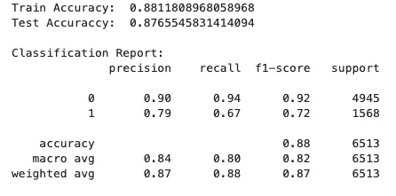
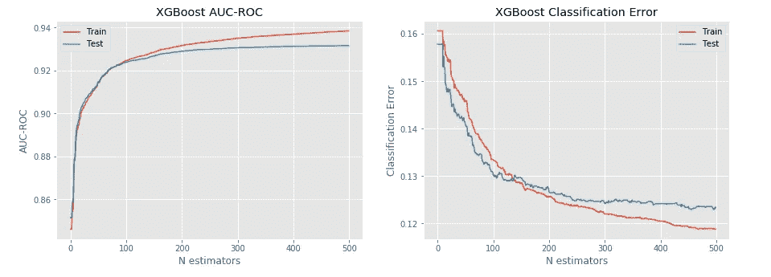
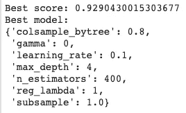
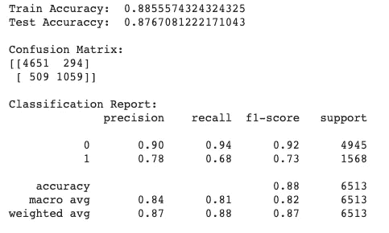
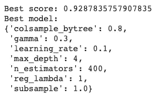
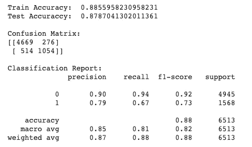
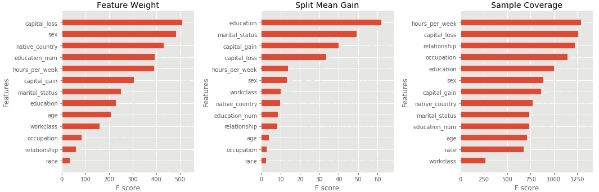
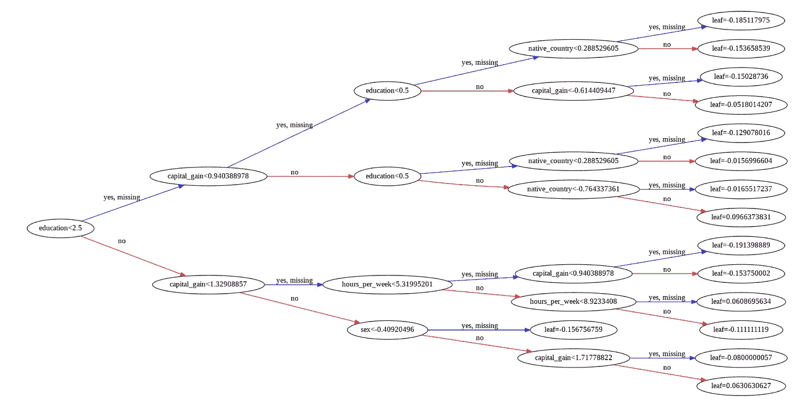

# 集成学习案例研究:在 Google Colab 免费 GPU 上运行 XGBoost

> 原文：<https://towardsdatascience.com/running-xgboost-on-google-colab-free-gpu-a-case-study-841c90fef101?source=collection_archive---------13----------------------->

本文是一个案例研究的第二部分，我们正在探索 1994 年人口普查收入数据集。在[的第一部分](/ensemble-learning-and-model-interpretability-a-case-study-95141d75a96c)中，我们深入研究了数据集，比较了一些集成方法的性能，然后探索了一些有助于模型可解释性的工具。

在第二部分中，我们将探索一种叫做**梯度增强**的技术和**谷歌合作实验室**，这是一个免费的 Jupyter 笔记本环境，不需要设置，完全在云中运行。

# 什么是梯度增强和 XGBoost？

梯度推进是一种集成方法，很像我们上次讨论的打包和粘贴。然而，Boosting 与前面提到的方法的不同之处在于它如何进行这种模型组合。它使用技术将几个*弱学习者*组合成一个*强学习者。*

其他集成方法依赖于同时构建几个孤立的基础学习器，然后用于进行预测，而 Boosting 算法依赖于顺序过程，其中每个模型试图纠正以前模型的错误。这导致了一个主要的效率缺陷，因为模型是一次创建一个，并且依赖于先前迭代获得的结果

梯度推进采用梯度下降算法来最小化顺序模型中的误差。因此，本质上，它是一个优化问题，目标是最小化误差(损失)函数。

XGBoost(极限梯度增强)反过来也是梯度增强算法的优化实现。它的特点(除了其他增强):并行树构建，缓存感知访问，稀疏感知，正则化(L1 和 L2)，加权分位数草图。该库已经成为近年来赢得许多数据科学竞赛的首选解决方案之一。

# 一些 XGBoost 超参数

原作者将 XGBoost 超参数分为 3 类:

*   **通用参数**:控制算法整体功能的超参数；
*   **助推器参数:**在算法的每一步控制单个助推器(树或回归)的超参数；
*   **学习任务参数:**配置要执行的优化的超参数；

XGBoost 最大的优势之一是可定制的数量。要查看可用超参数的完整列表(它非常广泛)，我强烈建议您查看项目文档页面。

XGBoost 提供了一个 scikit-learn 兼容的 API，一些参数的名称略有不同，但它们的工作方式与常规库 API 相同。

我们将简要回顾一些将在案例研究中调整的超参数，以便更好地理解它们:

*   **booster:** 允许我们选择要使用的每个 booster:GB tree，用于基于树的模型，或者 gblinear，用于线性模型。
*   **目标**:是学习任务超参数的一部分，它规定了优化过程中要使用的学习任务(回归、分类、排序等)和函数。
*   **tree_method:** 我们将使用选项“gpu_exact”在 gpu 上运行
*   **eval_metric:** 用于评估训练数据性能的指标。我们可以以 python 列表的格式传递多个指标，因此，我们将在案例研究中使用“error”(二进制分类错误)和“auc”。
*   **learning_rate (eta):** 在每一步树提升之后，对新增加的权重进行缩放。这种技术被称为“收缩”，负责减少每棵树的影响，为未来的树留下空间来改进模型。通常，发现低于 0.1 的 learning_rates 产生更好的泛化误差。
*   **gamma:** 当产生的分裂产生损失函数的正减少时，树节点被分裂。gamma 参数指定执行这种分割所需的最小缩减。它的值取决于所使用的损失函数。
*   **max_depth:** 限制树木允许生长的最大深度。较大的树容易过度生长。
*   **colsample_bytree:** 设置拟合每棵树时随机使用的要素(数据集列)的分数。
*   **子样本:**设置拟合每棵树时随机使用的观察值(数据集行)的分数。
*   **reg_alpha:** 控制 L1 正则化。由于 L1 正则化倾向于将权重拉至零，因此当使用线性增强器或高维数据时，更推荐使用 L1 正则化。
*   reg_lambda: 控制 L2 正则化。由于 L2 正则化鼓励较低的权重(但不一定是 0)，它可以用于树助推器。
*   **n_estimators:** 要拟合的树的数量

正如您所看到的，有多个超参数需要优化，上面给出的这些参数甚至还没有接近全部参数。

# 评估 XGBoost 性能

首先，我们将安装一个*现成的* XGBoost 分类器，以获得对模型性能的基本了解，这意味着我们不会调整模型的大多数参数。

XGBoost 库实现了两个用于模型训练的主要 API:默认的**学习 API** 、，对模型进行更精细的控制；以及 **Scikit-Learn API** ，这是一个 Scikit-Learn 包装器，使我们能够将 XGBoost 模型与 scikit-learn 对象结合使用，如**管道**和**随机搜索 CV** 。

我们现在将主要关注于 **Scikit-Learn API** 。这个 API 提供了一种方法来评估随着新树的增加模型的性能变化。为此，我们必须向 *fit* 方法提供以下附加参数: **eval_set** ，要使用的评估集(通常是训练集和测试集)，以及 **eval_metric** ，执行评估时要使用的度量。如果提供了这两个参数，评估结果将由拟合模型的 **eval_results** 属性提供。

但是说够了，让我们最后展示一些代码！由于本文是案例研究的第 2 部分，我们将不讨论预处理管道步骤的开发，因为这已经在本系列的第 1 部分中讨论过了。

首先，我们加载数据集，将其转换为 **X** 特征矩阵和 **y** 目标向量，执行预处理步骤，最后，将数据分成训练集和测试集。下面的代码突出显示了这个过程:

```
# load the dataset
income = pd.read_csv("income.csv")# Create the X feature matrix and the y target vector
X = income.drop(labels=["high_income", 'fnlwgt'], axis=1)
y = income["high_income"]# the only step necessary to be done outside of pipeline
# convert the target column to categorical
col = pd.Categorical(y)
y = pd.Series(col.codes)# validate the preprocessing pipeline by passing data through it
clean_X = preprocessing_pipeline.fit_transform(X)
clean_X_df = pd.DataFrame(clean_X, columns=X.columns)# split the clean_X into train and test sets
X_train, X_test, y_train, y_test = train_test_split(clean_X, y, test_size=0.20, random_state=seed, shuffle=True, stratify=y)
```

这样，我们终于可以训练我们的第一个 XGBoost 分类器了！为了更好地理解模型的演变，我们将把 **n_estimators** 超参数设置为 500。下面的代码片段突出显示了模型训练:

```
import time
from xgboost import XGBClassifier# create a default XGBoost classifier
model = XGBClassifier(n_estimators=500, random_state=seed)# define the eval set and metric
eval_set = [(X_train, y_train), (X_test, y_test)]
eval_metric = ["auc","error"]# fit the model
%time model.fit(X_train, y_train, eval_metric=eval_metric, eval_set=eval_set, verbose=False)
```

jupyter magic 命令返回 Python 语句或表达式的执行时间。在这种情况下，训练花费了 **11.2 秒**完成，对于一个开始来说还不错。

然后，我们可以通过进行一些预测来衡量模型性能:

```
# final model assessment
pred_test = model.predict(X_test)
pred_train = model.predict(X_train)print('Train Accuracy: ', accuracy_score(y_train, pred_train))
print('Test Accuraccy: ', accuracy_score(y_test, pred_test))print('Classification Report:')
print(classification_report(y_test,pred_test))
```



**Figure 1:** Default XGBoost performance

默认模型已经给了我们比上一篇文章中的 tunned random forest 更好的测试精度！让我们看看随着新估计量的增加，模型的表现如何:

```
# retrieve performance metrics
results = model.evals_result()
epochs = len(results['validation_0']['error'])
x_axis = range(0, epochs)fig, ax = plt.subplots(1, 2, figsize=(15,5))# plot auc
ax[0].plot(x_axis, results['validation_0']['auc'], label='Train')
ax[0].plot(x_axis, results['validation_1']['auc'], label='Test')
ax[0].legend()
ax[0].set_title('XGBoost AUC-ROC')
ax[0].set_ylabel('AUC-ROC')
ax[0].set_xlabel('N estimators')# plot classification error
ax[1].plot(x_axis, results['validation_0']['error'], label='Train')
ax[1].plot(x_axis, results['validation_1']['error'], label='Test')
ax[1].legend()
ax[1].set_title('XGBoost Classification Error')
ax[1].set_ylabel('Classification Error')
ax[1].set_xlabel('N estimators')plt.show()
plt.tight_layout()
```



嗯，看起来我们的模型运行良好，直到大约 300 个估计器，然后训练集的误差继续下降，而测试集的误差或多或少保持稳定。那可能是过度适应的迹象！避免这种情况的一种方法是使用 **early_stopping_rounds** 参数，一旦在指定的轮数后没有观察到改进，就停止执行。

# 使用随机搜索调整超参数

因此，看起来我们的默认模型通过其*开箱即用的*配置表现得相当好。然而，我们仍然可以通过调整一些超参数来从中获取更多信息，但是我们应该如何做呢？

想象一下，如果我们想要调整 7 个超参数，并为每个参数测试 3 个不同的值。手动调谐是不可能的，因为有大量不同的可能组合。如果我们随后决定使用简单的网格搜索来完成这项工作，我们将使用 37 = 2187 个不同的模型来结束 um！在这种情况下，如果我们将拟合默认模型所需的时间(11.2 秒)视为一般经验法则，那么训练将需要大约 408 分钟或 6.8 小时！

因此，正如我们上次所做的，我们将使用随机搜索来调整参数，它可能不会找到最佳解决方案，但会在合理的时间内找到“足够好”的解决方案。

使用 scikit-learn 的**randomzedsearccv**，我们配置了搜索空间，以包括 **learning_rate** 、 **colsample_bytree** 、**子样本**、 **max_depth** 、 **n_estimators** 、 **reg_lambda、**和 **gamma** 超参数。我们还将迭代次数限制为 50 次，这样实验不会运行太长时间。配置和安装该模型的过程如下所示:

```
# create a default XGBoost classifier
model = XGBClassifier(
    random_state=seed, 
    eval_metric=["error", "auc"]
)# Create the grid search parameter grid and scoring funcitons
param_grid = {
    "learning_rate": [0.1, 0.01],
    "colsample_bytree": [0.6, 0.8, 1.0],
    "subsample": [0.6, 0.8, 1.0],
    "max_depth": [2, 3, 4],
    "n_estimators": [100, 200, 300, 400],
    "reg_lambda": [1, 1.5, 2],
    "gamma": [0, 0.1, 0.3],
}scoring = {
    'AUC': 'roc_auc', 
    'Accuracy': make_scorer(accuracy_score)
}# create the Kfold object
num_folds = 10
kfold = StratifiedKFold(n_splits=num_folds, random_state=seed)# create the grid search object
n_iter=50grid = RandomizedSearchCV(
    estimator=model, 
    param_distributions=param_grid,
    cv=kfold,
    scoring=scoring,
    n_jobs=-1,
    n_iter=n_iter,
    refit="AUC",
)# fit grid search
%time best_model = grid.fit(X_train,y_train)
```

我们再次使用 **%time** 命令来测量训练过程的执行速度。这一次大约花了 **20 分 19 秒**在执行 50 轮后返回最佳模型。如果我们使用更大的搜索空间和更多的迭代次数，你现在可以知道这个过程是如何变得非常耗时的。

然后，我们可以检查最佳模型 AUC 分数和超参数:

```
print(f'Best score: {best_model.best_score_}')
print(f'Best model: {best_model.best_params_}')
```



**Figure 3:** XGBoost AUC score and hyperparameters after running on CPU

最后，我们可以进行一些预测来评估模型的整体性能:

```
pred_test = best_model.predict(X_test)
pred_train = best_model.predict(X_train)print('Train Accuracy: ', accuracy_score(y_train, pred_train))
print('Test Accuraccy: ', accuracy_score(y_test, pred_test))print('\nConfusion Matrix:')
print(confusion_matrix(y_test,pred_test))
print('\nClassification Report:')
print(classification_report(y_test,pred_test))
```



**Figure 4:** Tunned XGBoost performance

看起来我们在训练和测试的准确性上都有了一点点的提高，但是说实话并没有那么多。

# 利用 GPU 的力量

我们终于到达了你可能正在等待的部分！我们将使用 Google 联合实验室的免费 GPU 访问，有望加快拟合 XGBoost 模型的过程。

但是你如何配置你的工作空间呢？这是一个相当简单的两步过程:首先，你需要进入**编辑>笔记本偏好设置，**然后，在**硬件加速器**下拉菜单中选择 **GPU** 并按**保存**。就是这样！您的运行时将重新启动，然后就可以运行了。

在 XGBoost 方面，唯一改变的是包含了 **tree_method** 超参数。在创建模型时，随机搜索的其他内容保持不变！模型创建的变化可以在下面的代码片段中看到:

```
model = XGBClassifier(
    tree_method = "gpu_hist", 
    random_state=seed, 
    eval_metric=["error", "auc"]
)
```

在用这种配置重新训练模型后，我们证实完成整个过程大约需要 **18 分钟**。这可能看起来不是一个很大的进步，但它比之前的运行快了大约**10%****！使用 GPU 的优势在较大的数据集上更容易看到，其中并行化开销将更多地由并行化速度的提高来补偿。**

**之后，我们重复这个过程来检查最佳的模型参数和性能。结果如下图所示:**

****

****Figure 5:** XGBoost AUC score and hyperparameters after running on GPU**

****

****Figure 6:** GPUtunned XGBoost performance**

**我们可以看到培训和测试准确性的又一次轻微提高，这总是很好的，不是吗！？**

# **模型的可解释性如何？**

**因此，为了帮助更好地理解 XGBoost 模型预测，我们可以使用本系列最后一部分中介绍的任何技术:检查并绘制拟合模型的 **feature_importances_** 属性；使用 ELI5 特征权重表和预测说明；最后，使用 SHAP 图。**

**然而，XGBoost 库还有另一个锦囊妙计，它提供了一个内置的绘图 API，用于生成 boosting 中使用的各个树的特性重要性和表示图！**

**为了绘制全局特征重要性，我们可以使用 **plot_importances** 方法。可以指定三个度量之一来计算单个特征分数:**

*   ****特征权重:**根据特征在树中出现的次数计算得分**
*   ****增益:**根据使用该特性的拆分的平均增益计算得分**
*   ****覆盖率:**根据使用该特性的分割的平均覆盖率(受分割影响的样本数)计算得分**

**下面的代码显示了这三个示例:**

```
# store the winning model in a new variable
xgc = best_model_gpu.best_estimator_
# saving the feature names to the model
xgc.get_booster().feature_names = X.columns.to_list()# Create the feature importances plot
fig, ax = plt.subplots(1, 3, figsize=(15,5))# plot importances with feature weight
xgb.plot_importance(
    booster=xgc, 
    importance_type='weight',
    title='Feature Weight',
    show_values=False,
    height=0.5,
    ax=ax[0],
)# plot importances with split mean gain
xgb.plot_importance(
    booster=xgc,
    importance_type='gain',
    title='Split Mean Gain',
    show_values=False,
    height=0.5,
    ax=ax[1]
)# plot importances with sample coverage
xgb.plot_importance(
    xgc,
    importance_type='cover',
    title='Sample Coverage',
    show_values=False,
    height=0.5,
    ax=ax[2]
)plt.tight_layout()
plt.show()
```

****

****Figure 7:** XGBoost feature importances**

**最后，为了绘制特定的树，我们可以使用如下所示的 **plot_tree** 方法:**

```
# Create the feature importances plot
fig, ax = plt.subplots(figsize=(20,20))# plot a decision tree from the booster
xgb.plot_tree(booster=xgc, num_trees=0, ax=ax, rankdir='LR')plt.tight_layout()
plt.show()
```

****

****Figure 8:** XGBoost tree**

# **结论**

**至此，我们结束了这个关于整体学习的两部分系列，我希望它是令人愉快的，也许还有点用处！**

**感谢阅读！请在下面留下你的想法。**