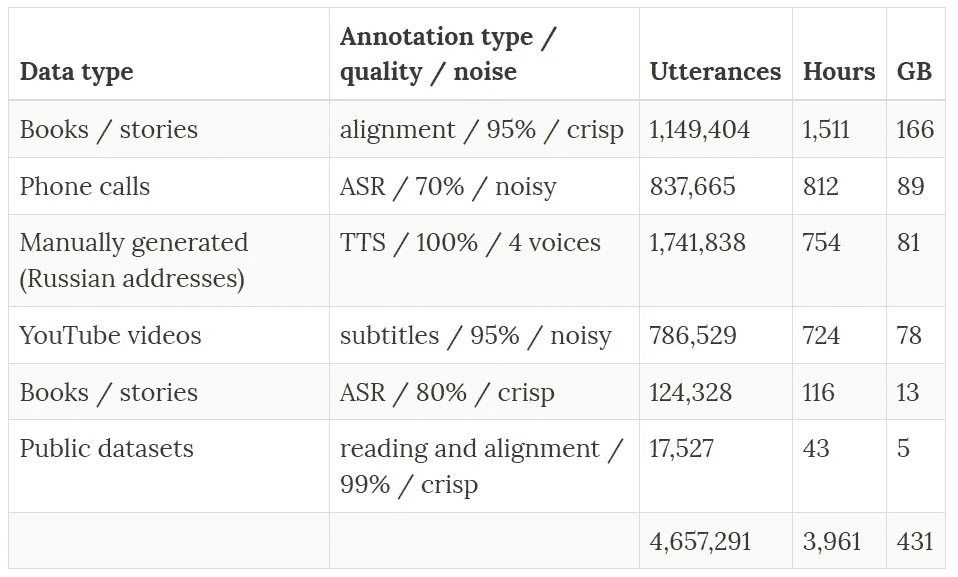

# 俄语开放语音转文本(STT/ASR)数据集

> 原文：<https://towardsdatascience.com/russian-open-speech-to-text-stt-asr-dataset-4c4e5d6a292c?source=collection_archive---------17----------------------->

## 4000 小时的俄语 STT 数据

***如果你不付铁价，你知道有人替你付了。生活的方方面面都是这样***

*原帖*[*spark-in . me*](https://spark-in.me/post/russian-open-stt-part1)*2019 年 5 月 1 日*

# TLDR

这是我们[发布](https://github.com/snakers4/open_stt/)的**俄语开放语音转文本(STT/ASR)数据集**的附带帖子。这意味着有点轻松和开玩笑。所有的观点都是我自己的，可能我的同事们的观点不一样。这是非技术性的总结。不要太认真，可能 50%的文字是某种微妙的玩笑(**如果你找到所有的复活节彩蛋，请敲我一下**！).

**总之，这里是数据集:**

Dataset composition

TLDR:

*   我们已经收集并发布了一个具有**4000+小时**的数据集，用于训练俄语的语音到文本模型；
*   数据非常多样，跨领域，注释的质量从足够好到几乎完美不等。我们的目的是收集一个数据集，以某种方式将现实生活/商业应用联系起来。以学术的方式只收集纯粹/干净的数据没什么意思。理想情况下，该数据集是使用预先训练好的 STT 模型进行回购的第一步；
*   我们打算将这一数量增加到大约 10，000 小时，甚至可能增加到 20，000 小时，如果情况合适的话(我们知道如何达到 6-7k，我们会随机应变)；
*   我们**没有投入任何真金白银**来创建这个数据集(当然除了我们的时间和精力)，所以我们在 [cc-by-nc](https://creativecommons.org/licenses/by-nc/4.0/) 许可下发布它。如果您想将数据集用于商业目的，请点击[此处](https://github.com/snakers4/open_stt/#contacts)；
*   你可以在这里看到发布历史；

# 加速 Imagenet 时刻

理想情况是这样的:

*   提取现有的公共模型和数据集；
*   收集一些你所在领域的 MVP 数据集；
*   建立一个 MVP 模型；
*   增加更多疑难病例；
*   验证、测试、冲洗和重复；

在计算机视觉(CV)和自然语言处理(NLP)等领域，有一些东西可以建立，这些东西只在 95%的情况下有效:

*   广泛共享的 Imagenet 预训练模型。每个框架都有一个类似于 [this](https://github.com/Cadene/pretrained-models.pytorch) 的回购——在这里你可以得到任何种类的带有权重的 CV 模型。加水就行了；
*   在 NLP 中，根据我的经验，像 FastText 这样的工具效果最好。像伯特这样的现代巨大网络也能工作，但是在现实生活中我们并没有发现它们[实用](/complexity-generalization-computational-cost-in-nlp-modeling-of-morphologically-rich-languages-7fa2c0b45909)；

**但是在俄罗斯的 STT，没有什么可以真正建设的**

*   当然也有付费的 APIs 商业最新产品/来自政府相关实体的产品——但是它们有它们的缺点(除了是私有的或者是由不太透明的技术构建的)；
*   公共数据集充其量是稀缺的(<100 hours) and non-diverse / too clean at worst;
*   Even English public datasets … are academic and detached from real life usage;
*   STT has a long history, and it has a bias towards being developed by large tech companies;
*   Unlike Google / Facebook / Baidu which are known to publish stellar research (FAIR’s papers are awesome and accessible, Google less so), Yandex is not really known to add anything to the community;

**在 STT 也有几个较少讨论的“抓住你”的好处:**

*   有一种推测，即您需要多少数据来进行适当的归纳-估计范围从 5，000 小时到 20，000 小时。例如，Librispeech ( **LS** ，最流行的数据集之一)是 1000 小时，非常“干净”。谷歌和百度在各种论文中报告了针对各种设置的 10，000-100，000 小时数据的培训；
*   如果在 CV 中，你学习特征的“领域”是例如在 STT 的**“猫”**(也就是说，在某些位置上，参见 Hinton 关于这个的 CapsNets 的解释)，那就有点复杂了。你的数据可以是**干净的/嘈杂的**。另外**每种声音都有自己的领域**，模特对声音的适应能力惊人。词汇也是一个问题。因此，基本上当有人报告 LS 提高了 3 个百分点(即 10%的 WER 降低到 7%的 WER)时，你应该对此持保留态度。我在 1-2 天内建立的初始管道能够很好地在 LS 上工作；
*   跨领域转移(即，当你在书本上训练，在电话上验证)是可行的，但效果很差。你很容易得到+20 便士的 WER。一些小事情也很重要，比如在嘈杂的环境中语调/说话方式的不同；

所以——你可以把我们的冒险视为第一步，为社区提供一套我们语言的公共模型(俄语，我们的大部分方法可以扩展到其他语言),让 Imagenet 时刻更近一步/为公众制作相当好的 STT 模型。

你可以说现在我们深陷在数据中。为了成功，我们需要更深入！请阻止我说出这些可怕的双关语。

# 寻求贡献者

如果你愿意为我们的数据集/事业做出合理的贡献，我们欢迎你！我们将确保尽可能友好地发布尽可能多的内容。

请在这里联系我们[。](https://github.com/snakers4/open_stt/#contacts)

可以这样框。如果 4 个人(不是只在这个项目上花费 100%的时间)可以有所作为，那么你的加入可能会使天平向构建一个真正灵活的可部署模型倾斜？

# 如何不共享数据集

首先，这里列出了我不喜欢人们在分享数据集时一直做的事情:

*   显然，付费墙没有办法预先检查你将得到什么；
*   学术象牙塔态度——“我们的数据集很酷，很大，但在现实生活中毫无用处”；
*   注册墙。是的，“我们的数据集是公开的，但我们将只为被选中者共享它”。这东西。是的，如果我们决定不与你分享，你不会得到通知。或者最有可能的是——没人付钱给版主；
*   通过 Google Drive 分享(顺便说一句，你可以通过 Google Drive 使用`wget`，你需要下载一个 cookie 并使用他们的链接结构)或者依靠临时/动态链接的东西。理想情况下，你应该能够使用`wget`或者更好的`aria2c`来获取数据；
*   托管差，CDN 差，速度差。当人们共享一个数据集时，这是可笑的，这可能会花费 10 万美元以上——从零开始手工注释需要 100 万美元，但每月节省 100 美元用于真正正确地托管数据集；
*   通过 torrent 共享…没有至少 100 Mbit/s 上行速度的活动种子。学术洪流是伟大的，但任何时候都没有种子；
*   文件夹组织不好，没有元数据文件，结构不合逻辑；
*   用于加载数据集(hello `xml`和对象检测数据集)的臃肿、过时的工具和文件格式；
*   晦涩难懂的代码来读取这样的数据。你可以在熊猫身上创造奇迹。不，真的；
*   没有办法检查你的数据；
*   一般不关心用户；
*   以专有格式共享数据/推动某种形式的议程；

**我们尽了最大努力不犯任何错误:**

*   首先，**所有链接都是公开的**。我们的大部分数据来源于互联网，所以我们尽可能地分享数据。
*   我们还没有做到这一点([帮助](https://github.com/snakers4/open_stt/issues/2)美国，为什么不)，但你可以写一个脚本，将下载一切，解压一切，检查 md5 和文件一气呵成；
*   数据集是托管在 **AWS 兼容桶**与 CDN 下载速度会很好。您可以使用带有-x 标志的`aria2c`来更快地加载文件；
*   数据大多以相同的格式检查和写入；
*   数据被收集在一个优化的磁盘数据库中(详情见 repo ),即使在硬盘上也能工作**(我们没有测试)。我相信 RAID 阵列或 NVME 高速缓存将完全解决 IO 问题(我们自己使用 SSD NVME 驱动器)；**
*   元数据文件；
*   一些基本的可破解代码片段，以便更容易开始；

# 寻找动机，有所作为，道德和动机

**最后，我想提出一组观点:**

*   在我做了一些基线原型和数据集之后，我对结果非常失望。如果没有尤里的建议、经验和合作，我可能会放弃这个项目。尤里，我永远感激你的帮助。是的，我看到 STT 在俄罗斯是成熟的“ImageNet 时刻”采摘，但我们不会保持动力，如果没有你；
*   显然，即使我们无法为公众提供可用/稳健的模型，我们的数据/模型也将作为这一方向的第一步；
*   “哦，这样的数据集应该很贵”。是的，从头开始建造这样的东西可能会花费数百万美元。但我们并不孤独，生活也不是零和游戏——所以更容易；
*   生活不是零和游戏——因此我们看到了公开数据集的机会——我们做到了；
*   不，以我们使用数据的方式使用数据并不是不道德的。首先，对于我们使用的 100%的数据— **我们没有放在那里**。有人做到了。我们不会将数据用于与上传时相同的目的；
*   最后，房间里的大象。通过发布这样一个数据集，**我们让奥威尔在《1984》中描述的即将到来的末日更加接近**。是也不是。你看，我不相信这是可行的，以达到这样的准确性，实际上**根据 STT 的结果关押人在经济上是有意义的**。如果你有 10%的真实 WER——对于大多数商业应用程序来说，你已经开发出了惊人的产品！但是把人关进监狱太过分了——你最终只会处理假阳性。据我所知，在更文明的国家，采取这种行动需要法院裁决。我相信其他一些**技术天生比 STT 更有毒**(比如人脸识别)。毕竟——如果你想私下说点什么——私下说点什么(使用加密或者只是当面说)。你不能私下出去。我知道我们正在谈论这种技术的大规模应用，但即使你正在做一些粗略的事情，你也可以选择打电话给某人来谈论它。去购物中心，因为看起来像少数民族而被逮捕(I)首先在许多国家已经是一个问题(ii)不是你的选择。隐藏你的外表也可能会带来问题；
*   “你的数据集烂是因为 X”！是的，请给出反馈，但要有逻辑性，最好给我们发一封电子邮件或 Github 问题。大多数情况下，我们只是收集了所有能得到的数据。但如果你这么在意，欢迎投稿！；
*   我也喜欢像这样的批评“你假装通过做某事(例如，分享数据集)来采取一种高尚的道德立场，你为什么这么做”。我在上面主要提到了这两点；