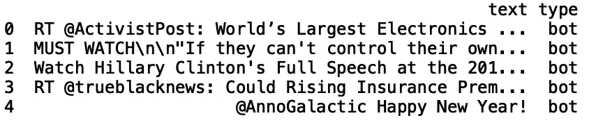
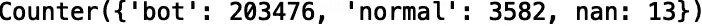
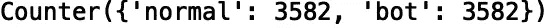
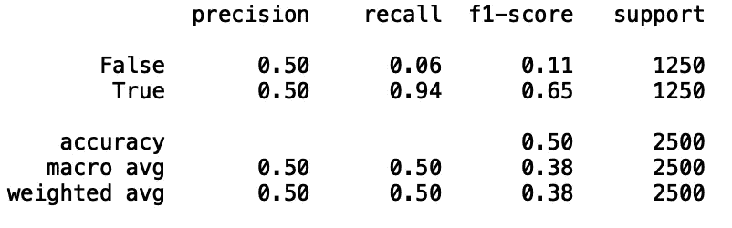

# 俄罗斯巨魔推文:使用 BERT 分类

> 原文：<https://towardsdatascience.com/russian-troll-tweets-classification-using-bert-abec09e43558?source=collection_archive---------16----------------------->


Photo by [Alex Knight](https://www.pexels.com/@agk42) on [Pexels](https://www.pexels.com/photo/high-angle-photo-of-robot-2599244/)

网络部队，也被称为俄罗斯巨魔机器人，是国家支持的匿名政治评论员。他们经常通过 Twitter 和脸书等社交媒体平台传播政治分裂内容。网络部队瞄准了一些事件，如 MH17 坠机事件、2014 年 T2 乌克兰冲突事件和 2016 年 T4 美国大选事件。考虑到政治分裂内容的大规模传播可能会产生严重后果，例如干扰选举，因此开发有助于准确检测这些不良行为者的方法非常重要。在本文中，我们将使用 BERT 构建一个机器学习分类器，来预测一条推文是否来自俄罗斯机器人。我们将使用来自 Kaggle 的*俄罗斯巨魔推文*数据集，可以在这里[找到](https://www.kaggle.com/vikasg/russian-troll-tweets)。

在我们进入数据之前，我们将简要回顾一下伯特。BERT 代表来自变压器的双向编码器表示。描述 BERT 算法的论文由 Google 发布，可以在这里找到。BERT 的工作原理是随机屏蔽单词标记，并用基于上下文的向量来表示每个被屏蔽的单词。BERT 的两个应用是“预训练”和“微调”。

**预训练 BERT**

对于预训练 BERT 算法，研究人员训练了两个无监督学习任务。第一个任务被描述为屏蔽 LM。其工作原理是随机屏蔽 15%的文档，并预测这些被屏蔽的标记。第二个任务是下一句预测(NSP)。这是由问答和自然语言推理等任务激发的。这些任务需要模型来准确捕捉句子之间的关系。为了解决这个问题，他们对二进制预测任务进行了预训练，该任务可以从单一语言的任何语料库中轻松生成。他们在论文中给出的例子如下:如果你有句子 A 和 B，A 有 50%的时间被标注为“isNext”，另外 50%的时间是从语料库中随机选取的句子，被标注为“notNext”。针对这一任务的预训练被证明对于问题回答和自然语言推理任务是有益的。

**微调伯特**

微调 BERT 的工作原理是用自我关注对连接在一起的文本对进行编码。自我注意是学习当前单词和先前单词之间相关性的过程。这一点的早期应用是在长短期记忆()论文(Dong2016)中，研究人员使用自我注意进行机器阅读。BERT 的好处在于，通过对具有自我关注的串联文本进行编码，可以捕捉句子对之间的双向交叉关注。

在本文中，我们将应用 BERT 来预测一个文档是否是假新闻。数据集的名称是*弄真假新闻*，在这里可以找到。这篇文章的灵感来自于[*BERT to Rescue*](/bert-to-the-rescue-17671379687f)，它使用 BERT 对 IMDB 数据集进行情感分类。从 [*伯特到营救*](/bert-to-the-rescue-17671379687f) 的代码可以在[这里](https://github.com/shudima/notebooks/blob/master/BERT_to_the_rescue.ipynb)找到。

BERT 算法的输入是单词序列，输出是编码的单词表示(向量)。对于单句分类，我们使用每个单词的向量表示作为分类模型的输入。

现在让我们开始吧！

1.  **导入包**

```
import pandas as pd 
import numpy as np 
import torch.nn as nn
from pytorch_pretrained_bert import BertTokenizer, BertModel
import torch
from torchnlp.datasets import imdb_dataset
from keras.preprocessing.sequence import pad_sequences
from sklearn.metrics import classification_report
```

2.**数据探索**

俄罗斯巨魔推文数据集只包括俄罗斯巨魔推文，所以我们需要提取一些额外的数据，我们可以将其标记为“非机器人”或“正常”推文。我使用 twitter python API Tweepy 来提取使用流行关键字的额外推文。关于使用 Tweepy 的综合教程，你可以阅读我写的另一篇文章:[来自 Twitter 的患者对药物的看法](/extracting-patient-sentiment-for-pharmaceutical-drugs-from-twitter-2315870a0e3c)。我使用的关键词是' #followfriday '，' #tuesdaymotivation '，' # thankful '，' #birthday '，' #pet '，' #funny '和' #influencer '，它们取自 twitter 上 2018 年以来的热门标签列表，可以在这里找到。拉“正常”推文的代码将在 [GitHub](https://github.com/spierre91/medium_code/tree/master/russian_troll_tweets_classification_BERT) 上提供。

现在让我们将数据读入 dataframe 并打印前五行。我们还可以将最大显示列数设置为“无”。为简单起见，让我们看看“文本”和“类型”列:

```
pd.set_option('display.max_columns', None)
df = pd.read_csv("training_data.csv")
df = df[['text', 'type']]
print(df.head())
```



3.**数据准备**

使用“计数器”方法，我们可以了解数据中“机器人”和“正常”值的分布情况:

```
print(Counter(df['type'].values))
```



让我们也放弃“南”值:

```
df.dropna(inplace = True)
```

接下来，我们希望平衡我们的数据集，使我们有相同数量的“机器人”和“正常”类型。我们还应该随机改变目标:

```
df_bot = df[df['type'] == 'bot'] 
df_normal = df[df['type'] == 'normal'] 
df_bot = df_bot.sample(n=len(df_normal))
df = df_normal.append(df_bot)
df = df.sample(frac=1, random_state = 24).reset_index(drop=True)
```

再次验证我们得到了想要的结果:

```
print(Counter(df['type'].values))
```



接下来，我们要格式化数据，这样它就可以用作我们的 BERT 模型的输入。我们将数据分为训练集和测试集。我们总共使用 100 条记录进行培训和测试:

```
train_data = df.head(50)
test_data = df.tail(50)
```

我们用“文本”和“类型”关键字生成一个字典列表:

```
train_data = [{'text': text, 'type': type_data } for text in list(train_data['text']) for type_data in list(train_data['type'])]
test_data = [{'text': text, 'type': type_data } for text in list(test_data['text']) for type_data in list(test_data['type'])]
```

从字典列表中生成元组列表:

```
train_texts, train_labels = list(zip(*map(lambda d: (d['text'], d['type']), train_data)))
test_texts, test_labels = list(zip(*map(lambda d: (d['text'], d['type']), test_data)))
```

生成令牌和令牌 id:

```
tokenizer = BertTokenizer.from_pretrained('bert-base-uncased', do_lower_case=True)
train_tokens = list(map(lambda t: ['[CLS]'] + tokenizer.tokenize(t)[:511], train_texts))
test_tokens = list(map(lambda t: ['[CLS]'] + tokenizer.tokenize(t)[:511], test_texts))train_tokens_ids = list(map(tokenizer.convert_tokens_to_ids, train_tokens))
test_tokens_ids = list(map(tokenizer.convert_tokens_to_ids, test_tokens))train_tokens_ids = pad_sequences(train_tokens_ids, maxlen=128, truncating="post", padding="post", dtype="int")
test_tokens_ids = pad_sequences(test_tokens_ids, maxlen=128, truncating="post", padding="post", dtype="int")
```

请注意，我们将输入字符串截断为 128 个字符。BERT 可以处理的最大长度是 512，但是为了节省计算时间，我们将使用 128。

最后，为我们的测试和训练集生成一个基于“type”值的布尔数组:

```
train_y = np.array(train_labels) == 'bot'
test_y = np.array(test_labels) == 'bot'
```

4.**模型建筑**

我们创建了我们的 BERT 分类器，它包含一个“初始化”方法和一个返回令牌概率的“转发”方法:

```
class BertBinaryClassifier(nn.Module):
    def __init__(self, dropout=0.1):
        super(BertBinaryClassifier, self).__init__()self.bert = BertModel.from_pretrained('bert-base-uncased')self.dropout = nn.Dropout(dropout)
        self.linear = nn.Linear(768, 1)
        self.sigmoid = nn.Sigmoid()

    def forward(self, tokens, masks=None):
        _, pooled_output = self.bert(tokens, attention_mask=masks, output_all_encoded_layers=False)
        dropout_output = self.dropout(pooled_output)
        linear_output = self.linear(dropout_output)
        proba = self.sigmoid(linear_output)
        return proba
```

接下来，我们生成训练和测试掩码:

```
train_masks = [[float(i > 0) for i in ii] for ii in train_tokens_ids]
test_masks = [[float(i > 0) for i in ii] for ii in test_tokens_ids]
train_masks_tensor = torch.tensor(train_masks)
test_masks_tensor = torch.tensor(test_masks)
```

生成用于训练和测试的令牌张量:

```
train_tokens_tensor = torch.tensor(train_tokens_ids)
train_y_tensor = torch.tensor(train_y.reshape(-1, 1)).float()
test_tokens_tensor = torch.tensor(test_tokens_ids)
test_y_tensor = torch.tensor(test_y.reshape(-1, 1)).float()
```

最后，准备我们的数据加载器:

```
train_dataset =  torch.utils.data.TensorDataset(train_tokens_tensor, train_masks_tensor, train_y_tensor)
train_sampler =  torch.utils.data.RandomSampler(train_dataset)
train_dataloader =  torch.utils.data.DataLoader(train_dataset, sampler=train_sampler, batch_size=BATCH_SIZE)test_dataset =  torch.utils.data.TensorDataset(test_tokens_tensor, test_masks_tensor, test_y_tensor)
test_sampler =  torch.utils.data.SequentialSampler(test_dataset)
test_dataloader =  torch.utils.data.DataLoader(test_dataset, sampler=test_sampler, batch_size=BATCH_SIZE)
```

5.**微调**

我们使用 Adam 优化器来最小化二进制交叉熵损失，并且我们使用 1 个时期的批量大小 1 来训练:

```
BATCH_SIZE = 1
EPOCHS = 1bert_clf = BertBinaryClassifier()
optimizer = torch.optim.Adam(bert_clf.parameters(), lr=3e-6)for epoch_num in range(EPOCHS):
    bert_clf.train()
    train_loss = 0
    for step_num, batch_data in enumerate(train_dataloader):
        token_ids, masks, labels = tuple(t for t in batch_data)
        probas = bert_clf(token_ids, masks)
        loss_func = nn.BCELoss()
        batch_loss = loss_func(probas, labels)
        train_loss += batch_loss.item()
        bert_clf.zero_grad()
        batch_loss.backward()
        optimizer.step()
        print('Epoch: ', epoch_num + 1)
        print("\r" + "{0}/{1} loss: {2} ".format(step_num, len(train_data) / BATCH_SIZE, train_loss / (step_num + 1)))
```

我们评估我们的模型:

```
bert_clf.eval()
bert_predicted = []
all_logits = []
with torch.no_grad():
    for step_num, batch_data in enumerate(test_dataloader):token_ids, masks, labels = tuple(t for t in batch_data)logits = bert_clf(token_ids, masks)
        loss_func = nn.BCELoss()
        loss = loss_func(logits, labels)
        numpy_logits = logits.cpu().detach().numpy()

        bert_predicted += list(numpy_logits[:, 0] > 0.5)
        all_logits += list(numpy_logits[:, 0])

print(classification_report(test_y, bert_predicted))
```



Classification Report

鉴于我们没有太多的训练数据，结果证明性能精度相当低。尝试将模型拟合到更多的数据，看看是否可以提高准确性。此外，你可以尝试使用 Tweepy 和一些常用的关键字来增加额外的推文，从而增强“正常”标签。

在[*BERT to the Rescue*](/bert-to-the-rescue-17671379687f)*中可以找到对代码的更详细的介绍。*这篇文章的代码可以在 [GitHub](https://github.com/spierre91/medium_code/tree/master/russian_troll_tweets_classification_BERT) 上找到。感谢阅读，机器学习快乐！