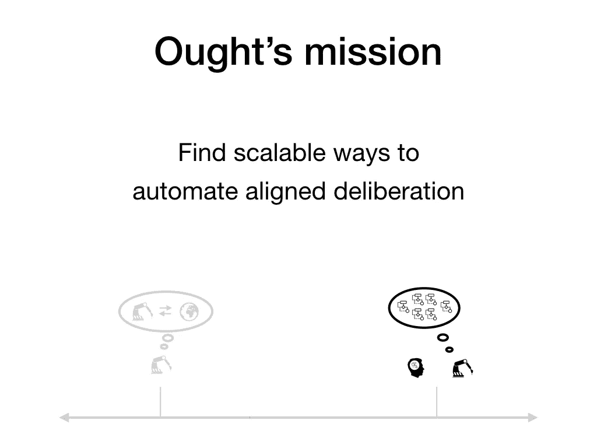
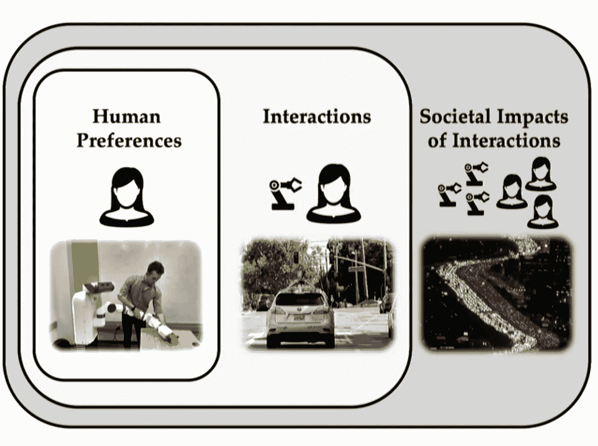

# 安全人工通用智能

> 原文：<https://towardsdatascience.com/safe-artificial-general-intelligence-29cb4ad0814e?source=collection_archive---------32----------------------->

Photo by [@the_las_memperor](https://unsplash.com/@the_las_memperor)

## 未来生命研究所的 AGI 安全研究人员 2018 项目

未来生命研究所(FLI)已经出现在人工智能领域的各种文章和领域中，至少在我看来是这样。他们似乎关心未知的未来以及它对我们的影响。由于我一直在探索人工智能安全的话题，现在它确实有意义，因为 FLI 在过去五年里资助了一系列不同的项目，特别是两轮，都是由埃隆·马斯克和不同的研究机构资助的。第一轮似乎是在 2015 年，重点是人工智能安全研究人员，第二轮是在 2018 年，重点是人工通用智能(AGI)安全研究人员。由于项目总结都在网上，我决定依次思考一下。

## 关于生命的未来研究所

FLI 有一个**使命:**促进和支持保护生命和发展未来乐观愿景的研究和倡议，包括人类在考虑新技术和挑战的情况下引导自身发展的积极方式*。* FLI 目前正专注于保持[人工智能](http://futureoflife.org/background/benefits-risks-of-artificial-intelligence)的益处，他们也在探索降低[核武器](http://futureoflife.org/background/the-risk-of-nuclear-weapons/)和[生物技术](http://futureoflife.org/background/risk-of-biotechnology/)风险的方法。他们位于波士顿，并于 2014 年在麻省理工学院举行了发布会。他们在 2015 年组织了一次关于人工智能未来的会议。5000 名研究人员在一封信上签名，让人工智能变得强大。2015 年，埃隆·马斯克宣布他将提供 1000 万美元的支持，第一笔 600 万美元的资金将在那时到位。37 名研究人员被选中，获奖者发表了超过 45 篇科学论文。我可能会从 2015 年开始接触这些出版物，但首先我将重点关注最近一轮及其大纲。

# FLI 2018 资助轮项目总结及对技术摘要的思考

2018 年春天，FLI 启动了他们的第二个人工智能安全研究计划，这次专注于人工通用智能(AGI。到夏天， [10 名研究人员获得了超过 200 万美元](https://futureoflife.org/2018/07/25/2-million-donated-to-keep-artificial-general-intelligence-beneficial-and-robust/)的奖金，以解决与筹备 AGI 相关的技术和战略问题。我已经重新发布了技术摘要，并将给出一些想法，或者看看我是否发现任何值得简单探索的术语或方向。如果你觉得这太简单，我很抱歉，我这样做是为了更好地理解这些建议。

## [1。艾伦·达福](http://www.allandafoe.com/)

***“技术摘要:*** *人工通用智能(AGI)可能在本世纪内开发出来。虽然这一事件可以带来巨大的好处，如科学和经济进步的急剧加速，但它也带来了重大的风险。最近的一项调查显示，中等人工智能研究人员认为，至少有二十分之一的可能性会出现像人类灭绝这样极端的负面结果。确保 AGI 得到安全有益的发展，避免最坏的风险，将需要尚不存在的机构。*

*然而，设计和理解这些机构的需求迄今为止还没有激发出多少学术工作。我们的项目旨在解决治理高级人工智能系统的几个基本问题。我们将朝着这一目标追求四个工作流，涉及中国人工智能研究和政策思想的状态，政府和人工智能研究公司之间不断发展的关系，验证人工智能使用和发展协议的前景，以及可能指导各国人工智能治理方法的人工智能系统的战略相关属性。该计划的产出将包括学术出版物，研讨会，以及与人工智能发展和政策的主要行为者的磋商。”*

**主线程**:

*   这是一个研究项目，旨在了解开发人工智能的机构，着眼于人工智能治理和国际关系的方法。

它有四个*【工作流】*；

1.  **中国人工智能研究与政策**思想
2.  政府和人工智能研究公司的关系。
3.  **验证**人工智能使用和开发协议的前景
4.  人工智能系统的战略相关**属性**，这些属性*可以* *指导国家对**人工智能治理**的方法*

Allan Dafoe 是人类未来研究所人工智能治理中心的主任。他是人工智能国际政治副教授。他的背景是政治学和经济学。他是和平与冲突研究部的客座研究员。

你可以在这里找到更多关于 GovAI 的信息:【https://www.fhi.ox.ac.uk/GovAI/ 

如果你想要一个关于这个主题的介绍和艾伦·达福的讲座，你可以在 Youtube 上看看这个视频。

## [2。斯特凡诺·埃尔蒙](https://cs.stanford.edu/~ermon/)

***"技术摘要:*** *报酬规范是价值调整中的一个关键挑战，在有多个主体的环境中尤其困难，因为设计者必须在个人收益和整体社会效用之间进行平衡。我们考虑逆向强化学习(IRL ),而不是手工设计奖励，这是一种模仿学习技术，代理直接从人类演示中学习。这些技术是为单个代理开发的，虽然它们有局限性，但它们通常被认为是解决价值一致性问题的关键组件。然而，多代理设置相对来说还没有被探索过。*

*我们建议填补这一空白，开发专门为多智能体设置设计的模仿学习和逆向强化学习算法。我们的目标是:1)开发模仿观察到的人类行为和交互的技术，2)显式地恢复可以解释多智能体系统中复杂策略行为的奖励，使智能体能够对人类行为进行推理并安全共存，3)开发可解释的技术，以及 4)处理非理性智能体以最大限度地提高安全性。这些方法将极大地提高我们理解和推理复杂环境中多主体间相互作用的能力。”*

**主线程**:

*   通过模仿学习和反向强化学习算法在复杂的多主体设置中平衡奖励规范。

目标。

1.  ***开发技法*** ***模仿观察人类行为*** ***以及互动***
2.  *显式* ***恢复奖励*** *能够解释多智能体系统中复杂的策略行为，使智能体能够对人类行为进行推理并安全共存*
3.  *培养* ***可解释性*** *技巧*
4.  ***对付不理智的特工*** *最大化安全。*

Stefano Ermon 是斯坦福大学计算机科学系的助理教授和伍兹环境研究所的研究员。他隶属于[人工智能实验室](http://ai.stanford.edu/)。他拥有电子工程教育背景，计算机科学博士学位，辅修应用数学。你可以在这里阅读他关于 arXiv 的一篇论文。

如果你想看斯特凡诺的演讲，请点击这里。他谈到了他对这个话题的一些想法，这些想法可能更符合当前的情况:

# [3。欧文·埃文斯](https://owainevans.github.io/)

***"技术摘要:*** *我们的目标是了解机器学习如何以一种“安全可扩展”的方式用于 AGI，即随着 ML 组件的改进，变得越来越符合人类的利益。现有的 AGI 方法(包括 RL 和 IRL)被认为是不安全的:一旦智能体的认知资源超过人类监督者的认知资源，智能体就会变得不一致。Christiano 的迭代蒸馏和放大(IDA)是一个有前途的替代方案。在 IDA 中，通过允许人类调用代理的前一次迭代，人类和代理被“放大”成一个足智多谋(但缓慢)的监督者。从结构上来说，这个监督者总是要走在被监督者的前面。*

*如果有足够先进的 ML 成分，IDA 能生产出高性能的校准试剂吗？虽然我们今天无法直接获得经验证据，但我们可以通过将人类作为人工智能的替身进行放大来间接研究它。这对应于对“分解认知”的研究，即复杂的推理是否可以被分解成许多小的和大部分独立的子任务。我们将根据经验探索分解认知的方案，并通过 ML 开发自动化来处理更大的任务。”*

**主螺纹**:

*   *如何在迭代提取和放大(IDA)中使用分解认知通过允许人类调用代理的前一次迭代，人类和代理被“放大”成一个足智多谋(但缓慢)的监督者。*

你可以在这里阅读更多关于因子认知的内容:

 [## 因素认知

### 注:本帖(最初发布于此[https://ough . org/presentations/factured-cognition-2018-05])是…

www.alignmentforum.org](https://www.alignmentforum.org/posts/DFkGStzvj3jgXibFG/factored-cognition) 

我认为这篇文章中的一幅图片可以更简洁地解释它，然而我可能是错的:

欧文·埃文斯是牛津大学人工智能领域的亚历山大·塔马斯研究科学家。他是在[人类未来研究所](https://www.fhi.ox.ac.uk/)(由[尼克·博斯特罗姆](http://www.nickbostrom.com/)导演)从事人工智能安全和强化学习研究的科学家。他的博士学位来自麻省理工学院，在那里他研究了认知科学、人工智能和哲学。

# [4。韩英豪](http://tees.ac.uk/schools/scm/staff_profile_details.cfm?staffprofileid=U0029688)

***"技术摘要:****AI 为了技术优势而向强大的 AI 系统的竞赛可能会导致严重的负面后果，尤其是当伦理和安全程序被低估甚至忽视的时候。为了让所有人都享受到安全、道德和值得信赖的人工智能所带来的好处，关键是要制定适当的激励策略，确保所有相关方的互利、规范行为和安全合规性。使用进化博弈论的方法，该项目将开发计算模型(分析和模拟),捕捉人工智能竞赛的关键因素，揭示在竞赛的不同条件和假设场景中可能出现的战略行为。*

*此外，应用激励和协议建模的方法，我们将系统地分析不同类型的激励(即积极与消极、同行与机构及其组合)如何随着时间的推移影响安全合规行为，以及应如何配置此类行为以确保预期的全球结果，同时避免会减缓发展的不当限制。因此，该项目将提供基础，在此基础上，激励将刺激这种结果，以及如何需要在适合玩家类型的激励边界内使用和部署它们，以便在合作安全协议中实现高水平的合规性，并避免 AI 灾难。”*

**主螺纹**:

*   用进化博弈论的方法模拟和分析人工智能竞赛建筑计算模型，以观察随着时间的推移影响安全合规行为的不同激励。

Anh Han 目前是蒂塞德大学计算、媒体和艺术学院的计算机科学高级讲师。

# [5。何塞·埃尔南德斯-奥拉洛](http://users.dsic.upv.es/~jorallo/)

***"技术摘要:*** *存在许多范式，并且将会创造更多，用于开发和理解 AI。在这些范式下，关键的利益和风险以非常不同的方式出现。贯穿所有这些范式的一个维度是一般性的概念，它起着核心作用，并提供了中间的字母，在 AGI，人工一般智能。该项目从一般性措施的角度探索了目前和未来 AGI 范式的安全问题，作为性能的补充维度。*

*我们考察以下研究问题:
1 .我们应该根据任务、目标或优势来定义一般性吗？通用性与能力、计算资源以及最终的风险有什么关系？
2。在具有有限能力的通用系统和具有更高能力的不太通用的系统之间的安全权衡是什么？这与自动化的效率和风险有什么关系？
3。我们可以用广度增长来取代性能爆炸的单一概念吗？这如何帮助开发更强大的 AGI 系统的安全途径？*

*对这些问题进行了范例分析，例如强化学习、反向强化学习、对抗设置(图灵学习)、神谕、认知即服务、通过演示、控制或跟踪进行学习、教学情景、课程和迁移学习、自然化归纳、认知架构、大脑启发的人工智能等。”*

**主线程**:

*   探索一般性测量的观点，作为绩效的补充维度:(1)定义，(2)权衡，(3)替代。

José Hernández-Orallo 是西班牙瓦棱西亚理工大学的信息系统和计算教授。他已经出版了四本书和一百多篇关于人工智能、机器学习、数据挖掘、认知科学和信息系统的文章和论文。他在机器智能评估领域的工作已经被科学和大众媒体报道，包括《经济学人》和《新科学家》。他率先将算法信息论应用于人工智能测试的开发。

# [6。马库斯·哈特](http://www.hutter1.net/)

***《技术摘要:*** *智能体框架、期望效用原理、顺序决策理论以及归纳推理和机器学习的信息论基础，已经为人工智能(AI)这个以前异构分散的领域带来了显著的秩序。在此基础上，在过去的十年里，我发展了通用人工智能理论。这是第一个也是目前唯一一个数学上严格的自顶向下的方法来形式化人工智能。*

这个项目将推动通用人工智能理论的发展，以解决可能是 21 世纪最重大的存在风险:解决控制问题，即随着人工超级智能代理的产生而出现的独特的委托代理问题。目标是扩展现有的理论，使一般智能代理的控制问题的正式调查成为可能。我们的重点是通用人工智能理论所缺乏的最基本的属性，即嵌入现实世界的智能体理论:它不能可靠地建模，它是对单个智能体的约束，它不能安全地探索，以及它不能很好地理解如何指定与人类价值观一致的目标。”

**主线程**:

*   推进通用人工智能理论，通过嵌入现实世界的智能体理论来解决超级智能体产生的控制问题的风险。

马库斯·赫特是澳大利亚国立大学( [ANU](http://www.anu.edu.au/) )计算机科学研究院( [RSCS](http://cs.anu.edu.au/) )的教授。之前他在瑞士和 IDSIA 以及 NICTA 在一起。他在 RSCS/ANU/NICTA/IDSIA 的研究围绕着[通用人工智能](http://www.hutter1.net/ai/uai.htm)，这是一种[自上而下的人工智能](http://www.hutter1.net/ai/aixigentle.htm)数学方法，基于 Kolmogorov 复杂性、算法概率、通用 Solomonoff 归纳、奥卡姆剃刀、莱文搜索、序列决策理论、动态编程、强化学习和理性代理。

# 7。詹姆斯·米勒

***【技术摘要:*** *经济学家长期以来致力于创造描述超理性人行为的数学工具，他们可能已经设计出了一种模拟未来计算机超级智能的出色方法。本指南解释了效用函数的用途、假设和限制，希望成为人工通用智能(AGI)理论家的宝贵资源。*

该指南将对 AGI 关于工具收敛的文献进行评论，该文献认为对于许多类型的效用函数，AGI 将具有相似的中间目标。该指南考虑了正交性论题，该论题认为增加 AGI 的智能并不缩小它可能具有的效用函数集。本指南探讨了在 AGI 中可能出现但在经济研究中通常不会出现的效用函数，例如不稳定的效用函数、总是增加的边际效用函数、极高或极低的贴现率函数、可以自我修改的效用函数，或者偏好违反冯诺依曼-摩根斯坦效用定理假设之一的效用函数。

该指南考虑了外星人已经开发出计算机超级智能的可能性，这种智能已经收敛于与费米悖论一致的效用函数。最后，探索了 AGI 从人类效用函数中获取其值的合理性，即使给定了人类具有不同偏好的挑战。”

**主线程:**

*   一本评论 AGI 文学和探索效用函数的指南。

让我来解释两个看起来容易混淆的概念。

***冯诺依曼-摩根斯坦效用定理*** *表明，在理性行为的某些公理下，面对不同选择的风险(概率)结果的决策者会表现得好像他或她正在最大化定义在未来某个特定点的潜在结果上的某个函数的期望值。*

**费米悖论:暗示我们应该寻求基于天文观测的科学数据，而这些数据是远古时代的文明无法获得的，我们应该制造机器，在我们的文明崩溃的情况下，用无线电信号淹没我们的星系。**

*费米悖论可能听起来令人困惑，确实如此，所以这里有一个 Kurzgesagt 视频可能有助于解释。*

# *8。多尔萨·萨迪格*

****"技术摘要:*** *人工智能(AI)的最新发展使我们能够建造能够执行复杂任务的 AI 智能体和机器人，包括许多与人类互动的智能体和机器人。在这些任务中，机器人需要建立人类行为和偏好的预测性和鲁棒性模型:与人类合作的机器人操作者需要预测她的未来轨迹，或者坐在自动驾驶汽车中的人类可能对汽车应该如何谨慎驾驶有偏好。**

*在现实中，人类有不同的偏好，这些偏好可以以混合奖励函数的形式被捕获。由于有不同类型的人，学习这种混合可能具有挑战性。通常还假设这些人在近似优化习得的奖励函数。然而，在许多安全关键场景中，由于缺乏数据或对奖励函数结构的错误描述，人类遵循的行为不容易用学习到的奖励函数来解释。我们在这个项目中的目标是通过从一组混合的人类中引出比较来主动学习一种混合的奖励函数，并进一步分析这种模型的可推广性和鲁棒性，以便与 AI 代理进行安全和无缝的交互。”*

***主线程**:*

*   *目标是从具有不同偏好的不同人那里学习混合的奖励函数。在安全至关重要的场景中，人类遵循的行为不容易用习得的奖励函数来解释。*

*多尔萨·辛格是斯坦福大学计算机科学系和电子工程系的助理教授。她的工作专注于自主系统的算法设计，这些系统可以安全可靠地与人交互。*

*她在斯坦福大学 HAI 的发布会上谈到了这个话题，在这方面，一个特别的图像引起了我的注意。*

**

*你可以在这里看到图片拍摄的完整视频:*

# *[9。皮特·斯通](https://www.cs.utexas.edu/~pstone/)*

****【技术摘要:*** *随着技术的发展，智能体将能够长期(通用)自主，即在很长一段时间内需要自己选择自己的行为，这只是时间问题。因此，在许多情况下，代理将不能预先与它们可能交互的所有其他代理进行协调。**

*相反，代理将需要合作，以便在没有预先协调的情况下完成意想不到的联合目标。因此，“特别团队合作”问题，即队友必须一起工作以获得共同的目标，而事先没有任何关于如何做到这一点的协议，已经成为人工智能文献中最近的研究领域。*

*然而，到目前为止，还没有人关注代理人行为的道德方面。在这项研究中，我们介绍了 M-TAMER 框架(TAMER 的一种新变体),用于向代理传授人类道德的理念。使用混合团队(代理人和人)，如果采取被认为是道德上不好的行动，代理人将收到来自人类队友的负面反馈。使用 M-TAMER，代理人将能够发展一种“内心良知”,这将使他们的行为与人类道德一致。"*

***主线程**:*

*   *代理人专门解决问题的团队合作引起了关于代理人行为的道德方面的问题。驯兽师框架用于通过负反馈向代理传授人类道德的理念。*

*皮特·斯通是德克萨斯大学奥斯汀分校计算机科学系计算机科学系计算机科学系计算机科学系计算机科学系计算机科学系计算机科学系计算机科学系计算机科学系计算机科学系计算机科学系计算机科学系计算机科学系计算机科学系计算机科学系计算机科学系计算机科学系计算机科学系计算机科学系计算机科学系计算机科学系计算机科学系计算机科学系计算机科学系计算机科学系计算机科学系计算机科学系计算机科学系计算机科学系计算机科学系计算机科学系计算机科学系的创始人和主任，德克萨斯大学计算机科学系计算机科学系计算机科学系计算机科学系计算机科学系计算机科学系计算机科学系计算机科学系计算机科学系计算机科学系计算机科学系计算机科学系计算机科学系计算机科学系计算机科学系计算机科学系计算机科学系计算机科学系计算机科学系计算机科学系。*

*你可以在这里观看他关于机器人世界杯的 TED 演讲:*

# *10。乔希·特南鲍姆*

****《技术摘要:*** *人类认知的一个标志就是在存在不确定性的情况下，与他人一起跨越新奇情境进行规划的灵活性。我们与各种复杂程度和知识的合作伙伴一起行动，对抗那些自身既不同又灵活的对手。虽然一个代理团队可能因为共同的目标而团结在一起，但是这个团队通常有多种方式来实际实现这些目标。**

**在缺乏集中规划或感知以及受限或昂贵的通信的情况下，代理团队必须针对代理之间的潜在差异有效地协调他们的计划。不同的代理可能具有不同的技能、能力或获取知识的途径。当环境和目标发生变化时，这种协调具有临时性的因素。**

*不协调会导致不安全的互动，并造成伤害和财产损失，因此人类和代理之间的特别团队合作必须不仅高效，而且稳健。我们将研究人类的特别和动态合作，并建立正式的计算模型，逆向工程这些能力。这些模型是构建能够像人一样协作并与人协作的机器的关键一步。"*

***主线程**:*

*   *这项研究将调查人类的特别和动态合作，并建立正式的计算模型，逆向工程这些能力。这是制造能够协作的机器的关键一步。*

***约书亚·布雷特·特南鲍姆**是麻省理工学院认知科学和计算教授。他因对数学心理学和贝叶斯认知科学的贡献而闻名。*

*他在 2018 年的视频中谈到了这一研究方向:*

## *结论*

*从 2018 年开始，未来生命研究所项目中有很多有趣的研究人员。因此，我现在确实比以前有更多的东西需要探索。对于人工通用智能安全，似乎既有批判性的方法，也有好奇心。*

*这是#500daysofAI 的第 68 天。我目前第 50-100 天的重点是人工智能安全。如果你喜欢这个，请给我一个答复，因为我确实想提高我的写作或发现新的研究，公司和项目。*