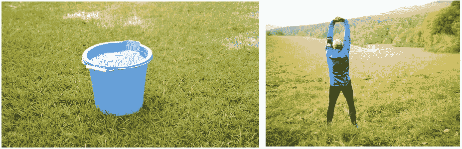
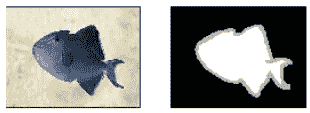
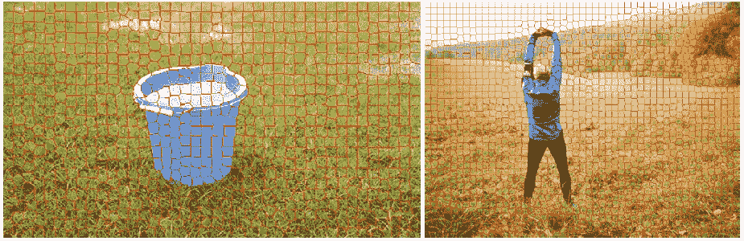
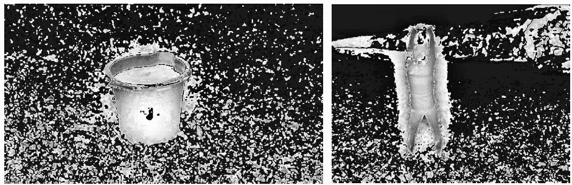
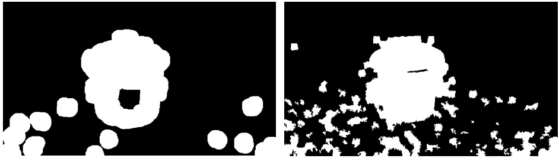
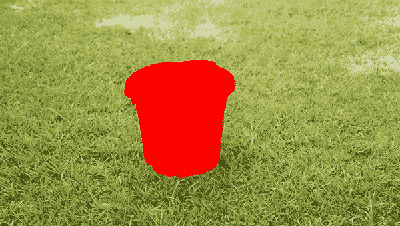
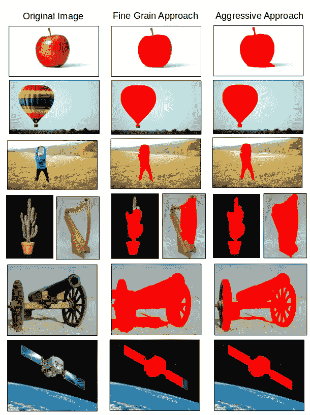

# 基于显著性的图像分割

> 原文：<https://towardsdatascience.com/saliency-based-image-segmentation-473b4cb31774?source=collection_archive---------16----------------------->

## 一种寻找物体的自主方法

通常当我们看到一幅图像时，图像中会有一个焦点。这可能是一个人，一座建筑，甚至是一个桶。图像中有些清晰的部分没什么意思。这种区域通常以图像中缺少焦点、单调着色或平滑纹理为特征。当呈现这样一类图像时，可能希望从图像的其余部分中分割出感兴趣的对象。本文探讨了这种突出的图像分割。

Examples of salient images. The bucket (left) and person (right) are the objects of interest.

这个项目最初源于开发一种自动生成图像三分图的方法的兴趣。三分图是图像遮罩，当与抠图算法结合时，用于分割图像，同时注意前景和背景之间的细节。三分图通常包含定义前景的白色区域、定义背景的黑色区域以及代表不确定区域的灰色区域。

Example of Trimap from [2]

大多数抠图算法的问题是，它们期望三分图由用户提供，这是一项耗时的任务。我引用的两篇主要论文试图解决自主三分图生成[【1】](https://ieeexplore.ieee.org/document/6694178)[【2】](https://www.researchgate.net/publication/318119848_Automatic_Trimap_Generation_for_Image_Matting)。在第一篇论文中，Hsieh 等人使用了一种相当简单且易于实现的方法。不幸的是，他们的方法不是完全自主的，因为它要求用户为 Grabcut 算法提供一个矩形区域。相反，Gupta 等人使用显著性方法来预测感兴趣的区域是什么。然而，他们的显著性方法相当复杂，结合了三种不同的显著性算法的结果。其中一种算法利用了复杂的神经网络，这是一种我为了易于实现而想避免的技术。

除了需要人工协助之外，Hsieh 等人的算法产生了合理的结果。我想如果我能自动完成论文的 Grabcut 部分，他们算法的其余部分将解决最初的问题。我从古普塔等人提出的创造这种自主性的方法中获得了灵感。

## 方法

对于大多数形式的图像分割，目标是将图像二值化为感兴趣的区域。这个项目的目标没有什么不同。首先，我想大致确定感兴趣的对象在哪里。对图像应用高斯模糊滤波器。从模糊的图像中，产生平均 15 像素大小的超级像素。超级像素算法旨在根据像素区域中的颜色和距离值来分割图像。具体来说，使用了简单的线性迭代聚类(SLIC)算法。

Superpixel map of a bucket and a person

超像素将图像分割成大致相同的区域。这样做的一个优点是超像素允许区域的一般化。我们可以假设超像素中的大多数像素具有相似的属性。

在确定图像中超像素的同时，计算图像的显著图。使用了两种不同的显著性技术。第一种方法使用内置的 OpenCV 方法，称为细粒度显著性。第二种方法包括取精细颗粒显著性图像的平均值，并将其从图像的高斯模糊版本中减去，随后是新图像的绝对值。

这两种方法在结果的激进程度上有所不同。下图都突出显示了感兴趣的区域。由细颗粒显著性产生的图像要柔和得多。此外，细粒度显著性图像主要勾勒出显著图像的边界，而替代方法也捕捉显著图像的内部。与细粒度方法相比，主动方法确实会拾取更多噪声。噪声去除是该过程的下一步。

Salience images for the bucket and person using fine grain approach.

Salience images for the bucket and person using aggressive saliency.

下面的技术是从 Gupta 等人的论文中挖掘出来的。为了将图像二值化，迭代从彩色图像生成的每个超像素。如果显著性图像内的超像素区域的中值像素值大于阈值`T1`，则整个超像素被二值化为白色。否则，整个超像素保持黑色。`T1`，由用户选择。在[2]中，`T1`被设置为显著性图像中最大像素值的 30%，然而，在该项目中使用了 25%的值。

在图像的二值化之后，基于所使用的显著性技术对图像进行膨胀。在细粒度显著性方法中，图像被放大了平均超像素大小的两倍。积极凸极法没有扩大。图像中的噪声越大，任何扩张都有风险。

Bucket after dilated with fine grain saliency (left) and binarized aggressive saliency (right)

最后一步还是取决于使用哪种显著性方法。在这两种情况下，白色像素的最大区域被提取。在 OpenCV 中，这样的操作是通过在图像中找到轮廓并选择具有最大面积的轮廓来执行的。边界框适合所选区域。

据观察，细粒度显著性方法经常导致碎片化的区域。生成边界框后，落入该框中不属于最大区域的任何其他白色区域都被添加到该框中。盒子的边界增加到包括这些区域。积极的显著性方法不需要这样做。经常地，最大的地区捕获了比期望更多的东西。

最后一步是将最终找到的边界框提供给 Grabcut 算法。 [Grabcut](https://www.microsoft.com/en-us/research/publication/grabcut-interactive-foreground-extraction-using-iterated-graph-cuts/?from=http%3A%2F%2Fresearch.microsoft.com%2Fapps%2Fpubs%2Fdefault.aspx%3Fid%3D67890) 是一种常用的图像分割方法。赋予 Grabcut 函数的边界框将算法认为明确的背景和前景分开。在大多数包含 Grabcutting 应用程序的软件包中，用户可以编辑矩形区域，并可以为算法提供更多信息，以获得更清晰的结果。在这个项目中，使用了 OpenCV 的内置 Grabcut 函数。

In the case of the bucket, both approaches produced the same solution.

此过程在[1]开始的地方结束。在未来，我计划继续开发这个自动旅行地图生成器。

## 结果

在这两者中，积极的显著图似乎为大多数图像产生了精确的遮罩。精细颗粒方法难以处理突出物体不“庞大”的图像。如果图像很长或有卷须，这些片段与图像的其余部分断开是很常见的。然而，由于其保守性，当图像特别嘈杂时，细粒度方法更好。蒙版不一定能捕捉到完整的图像，但它不会像侵略性方法那样频繁溢出。

Sample results of the two methods

还需要指出的是，对于[1]中开发的算法，不发达的掩模并不坏。因为最终目标是开发一个三分图图像，所以遮罩将由一个灰色区域填充。这个灰色区域将有助于区分前景和背景。

*对于任何周刊读者来说，学习 C++中的 OpenCV 并实现这个算法都是惊人的耗时。抱歉的延误，但期待这个项目在未来的延续以及更多的内容！*

*Github 代码:*

 [## TimChinenov/GraspPicture

### 用于分割显著的彩色图像并确定抓取的代码。- TimChinenov/GraspPicture

github.com](https://github.com/TimChinenov/GraspPicture) 

## 参考

[1] C. Hsieh 和 M. Lee，“数字图像抠图的自动三分图生成”， *2013 年亚太信号与信息处理协会年度峰会和会议*，高雄，2013 年，第 1–5 页。

[2]古普塔，维卡斯&拉曼，尚穆加纳坦。(2017).用于图像抠图的三分图自动生成。