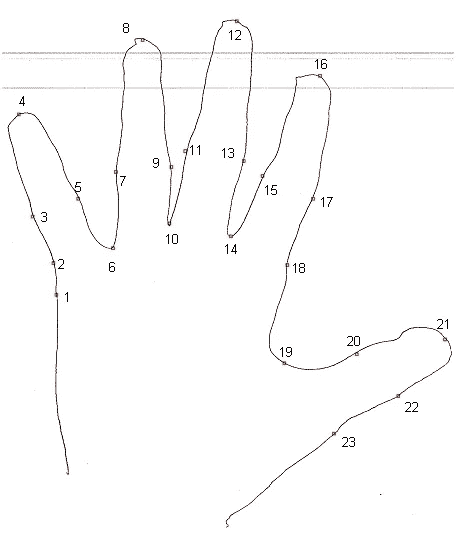
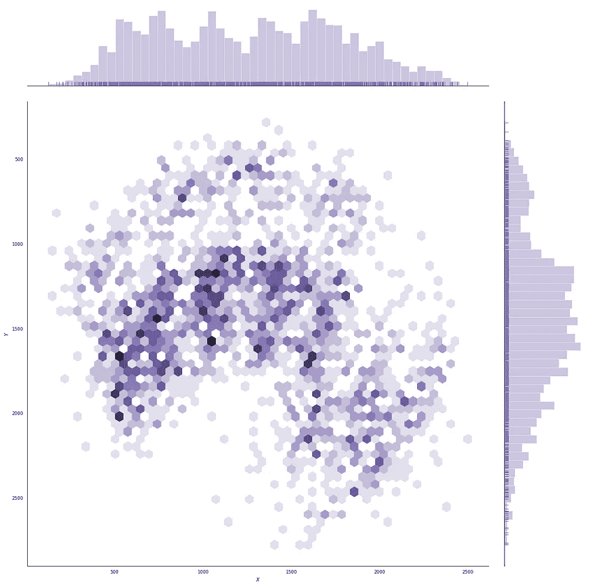
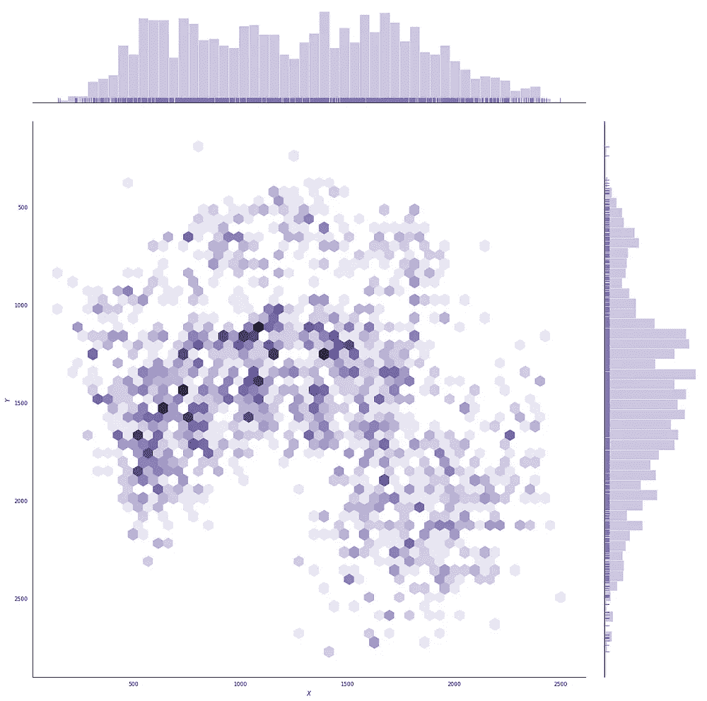
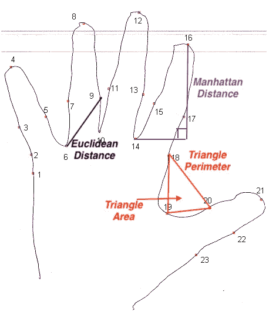
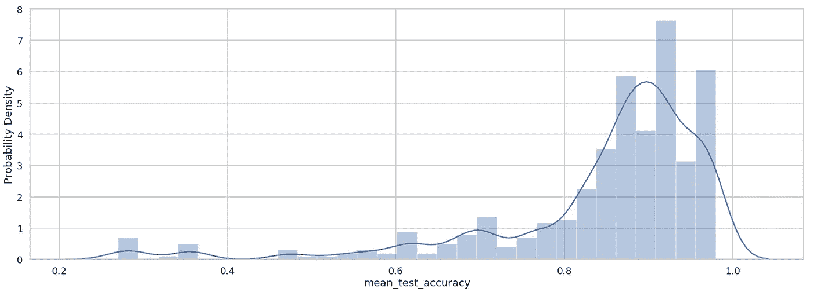
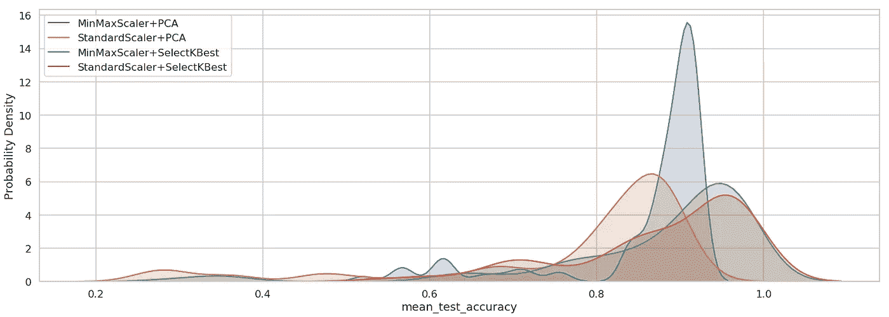
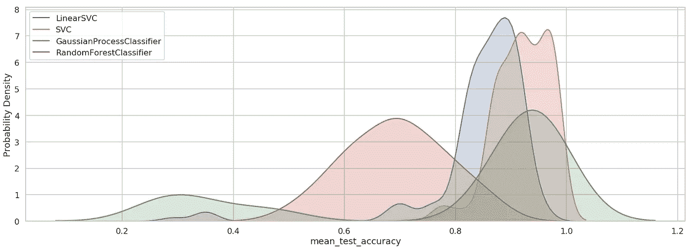
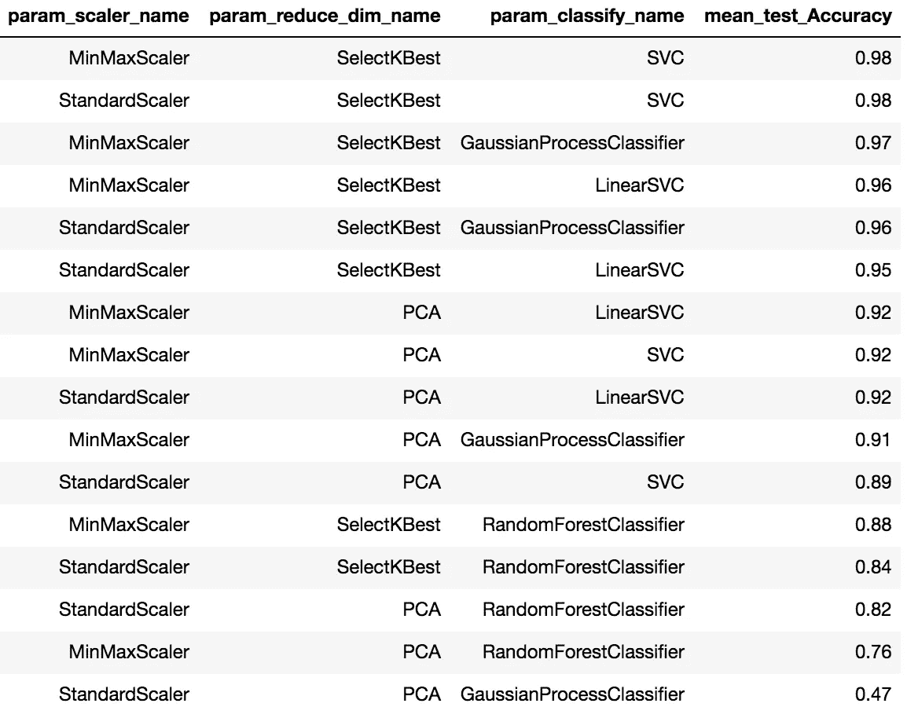
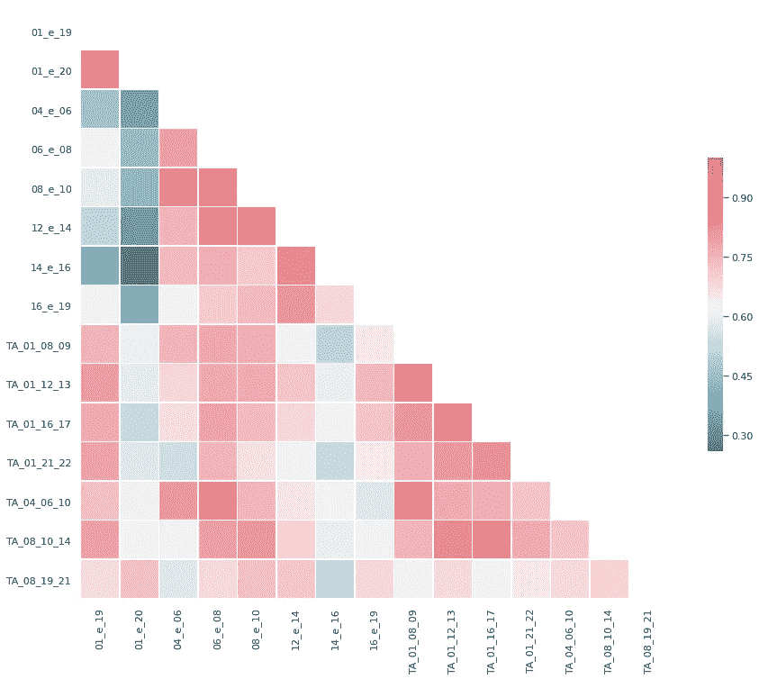
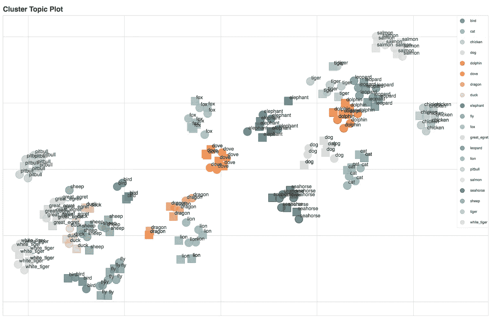

# 样本手形生物特征识别系统

> 原文：<https://towardsdatascience.com/sample-hand-geometry-biometric-identification-system-b122446e3fdb?source=collection_archive---------27----------------------->

## 生物识别建模过程的一个简单示例

> 这篇文章改编自我完成的一项任务——我认为这个项目很好地展示了数据建模的基本过程，并且有一个直观的应用程序，使人们更容易理解。这个例子强调了数据分析的 6 个一般步骤，并讨论了它将涉及哪种元素。

[完整的代码(一个 Jupyter 笔记本)可以在这里找到。](https://github.com/S-Farooq/hand-geo-A2)

# 1.0 实验目标

本报告解释了一种使用监督学习实现“基于手形的实体识别”系统的方法。提供带标签的训练数据，测试数据必须由设计的系统进行分类和标记。分类系统将通过准确性来衡量。

准确度定义为所有评估中正确评估的百分比。

```
Accuracy = (TN + TP)/ (TN + TP + FN + FP)
```

# 2.0 数据准备

我们得到了训练和测试数据——每个数据由 23 个 2D 点的 100 个样本组成，描绘了手的几何形状**(图 2.0)** 。训练数据被标记(我们知道这是谁的手)，而测试数据是我们必须识别的(这是谁的手？).



Figure 2.0: Hand Geometry Data Points

训练和测试数据被加载到数据帧中，23 个 2D 点中的每一个都相应地标注在适当的栏中。为了以后的计算和分类目的，所有分类标签都被转换成整数代码。所有原始数据点都被确认为非空的和数字的。

**下面的图 2.1** 显示了训练和测试数据的六进制图，以查看数据点的高级概述。他们展示了一个手印的轮廓。



**Figure 2.1:** Hex-bin plots of training (left) and test (right) datasets

# 3.0 特征工程

为数据集中的每个轮廓生成了以下要素:

*   欧几里得和曼哈顿任意两点之间的距离
*   任意 3 个点的三角形周长和面积

**图 3.1** 描绘了这些几何特征，它们似乎是理解手部轮廓和位置的直观方法。



Figure 3.1: Geometric Feature Extraction

在去除原始原始数据点之后，这导致了`4049`总特征。进行相关性分析以去除高度相关的特征(因为它们不具有辨别能力)。这导致剩下总共`460`个特征，用于后续步骤。

# 4.0 分类

该实验的分类需要特征缩放、特征缩减或选择，以及训练分类器。

## 4.1 特征缩放

由于我们准备了特征来区分不同标签的手形轮廓，因此特征缩放将我们的特征转换为相对于任何给定特征的其余值的相对度量。特征缩放还经常用于将特征空间转换为固定范围的值，以减少标准偏差，从而减少异常值的影响。在本实验中，比较了两种流行的缩放方法:最小-最大缩放和标准缩放。

最小-最大缩放将特征缩放到`[0,1]`之间的固定范围内，而标准缩放通过移除平均值和缩放来转换特征空间，使得每个特征分布具有单位方差。

## 4.2 特征简化或选择

特征缩减或选择将特征空间缩减为一个极小的高鉴别特征集。这有助于训练分类器，从而更好地进行归纳以及提高计算效率。当训练集只有很少的样本(只有 100 个)时，使用 as 的所有特征会导致过度拟合，从而无法准确预测测试集中的样本。该实验比较 PCA(称为`PCA`)来减少特征，以及 ANOVA F 值分数(称为`*SelectKBest*`)来选择顶部的`N`特征。尝试了各种`N`值，以找到最高精度的值。

## 4.3 训练分类器

使用缩放和简化的特征，执行监督学习任务以使用提供的分类标签训练分类器。四个分类器— `LinearSVC`、`SVC`、a `Gaussian Process Classifier`和 a `Random Forest Classifier` —与它们各自的超参数一起进行了超参数调整实验。进行超参数调整是为了根据经验确定分类器的哪个设置会产生最佳结果。这些参数很难从理论上推导出来，因为它们的效果严重依赖于训练数据的种类和形式。

## 4.4 交叉验证

对特征缩放、特征缩减/选择(具有不同的`N`值)和分类(具有不同的超参数值)的所有组合进行了模拟，总共产生了 500 次模拟。

分层的五重交叉验证方法——因此每类中的一个标签被留出作为验证数据——被用于评估每个模拟的准确性。这导致一起选择特征减少/选择和分类器的最佳组合，其导致跨交叉验证集的最佳准确度。执行交叉验证是为了有效地判断模型的准确性——训练和验证样本的简单分割可能会让模型变得幸运。将每个类的 5 个样本中的每一个作为验证样本放入我们的训练集中，保证了模型的准确性将由所有的拆分组合来判断。

# 5.0 培训和验证结果

模拟的最终精度分布如图 5.1 中的**所示。可以看出，大多数模拟导致了`[0.8,0.98]`之间的精确度。**



**Figure 5.1:** Accuracy Probability Density Distribution across 500 simulations

**图 5.2** 比较了各种预处理(特征缩放+特征缩减/选择)方案的精度，发现方差分析 F 值评分(`SelectKBest`)特征选择方法通常会在系统中产生更好的精度。这在某种程度上是意料之中的，因为 ANOVA F 值方法通过根据类别标签执行统计测试来直接确定特征区分，而 PCA 是一种“无监督”的特征约简方法，并不直接处理分类的特征区分。这也可能是为什么缩放方法的选择似乎显著影响 PCA 而不是 ANOVA F 值分数的原因。



**Figure 5.2:** Comparing Accuracy distributions for various Pre-processing schemes

**图 5.3** 比较了各种分类器的准确度。`SVC`和`Gaussian Process Classifier`的表现普遍优于其他品牌，`SVC`的得分更为稳定。



**Figure 5.3:** Comparing Accuracy distributions for various Classifiers

**图 5.4** 给出了更详细的视图，显示了不同预处理方案、分类器以及特征减少/选择组件数量的精度分布(跨超参数值)。**图 5.5** 中的表格显示了超参数调整后，通过不同配置获得的最大精度。

与线性 SVC 相比，SVC 的优异表现表明非线性决策边界更好地区分不同的类别。高斯过程分类器在正确的条件下也表现得和 SVC 一样好，并且在其模拟中具有 0 的标准偏差。这显示了 SVC 相对于高斯过程分类器的灵敏度——正则化超参数`C`必须被调整以获得最佳结果，而高斯过程分类器隐式地学习正则化参数本身，而不管你从哪个随机状态开始。这表明高斯过程分类器一般更稳定。高斯过程分类器在寻找类之间的最佳决策边界时也隐式地学习核，而 SVC 核必须预先定义(在这个实验中它被设置为`rbf`)。然而，SVC 对于训练来说要快得多，并且当 hyper 参数调整正确时可以做得稍微好一点。


**Figure 5.4:** Box Charts of Accuracies for each classifier, preprocessing scheme, and # of reduced components



**Figure 5.5:** Final Results (max Accuracy obtained by configuration with best hyper-parameters)

# 6.0 结论和分析

从上述数据中，系统的最佳配置(导致平均交叉验证准确度为`98%`)选择如下:

*   **特征定标器:**标准定标器
*   **特征选择:** ANOVA F-value 得分，用于选择顶部的`15`特征
*   **分类器:**带正则化超参数的 SVC`C=10.0`

## 6.1 最显著的特征

功能选择方法选择了以下 15 大功能:

```
{P1}_e_{P2} = Euclidean Distance between P1 and P2
TA_{P1}_{P2}_{P3} = Area of Triangle made with P1, P2, and P*where Point #s correspond to the positions in Figure 3.1.
Top 15 Features:['01_e_19',
 '01_e_20',
 '04_e_06',
 '06_e_08',
 '08_e_10',
 '12_e_14',
 '14_e_16',
 '16_e_19',
 'TA_01_08_09',
 'TA_01_12_13',
 'TA_01_16_17',
 'TA_01_21_22',
 'TA_04_06_10',
 'TA_08_10_14',
 'TA_08_19_21']
```

**图 6.1** 显示了手部轮廓样本图像上最具鉴别性的特征。红色实线形成三角形，黑色实线表示欧几里得距离。似乎自动特征选择已经找到了我们可能凭直觉猜测为最具辨别能力的特征——主要是三角形和从指尖到手的边缘或手指开始的长度，这将在很大程度上定义手的大小和范围。


**Figure 6.1:** Discriminative Features (Black= Euclidean Distance, Red=Triangles)

**图 6.2** 显示了所选区别特征之间的相关性——表明它们相关性不高，并且各自提供了有价值(或至少不同)的信息。



**Figure 6.2:** Correlation Heat map between Top Discriminative Features

# 6.4 推理

然后，所选择的分类器以及预处理方法被用于在测试数据集上进行预测。虽然由于我们有未标记的样本，很难看到测试数据集的结果，但我们可以通过将特征空间缩减到 2D(使用 PCA 或 TSNE)并绘制出结果来了解预测的质量。(这丢失了信息，但只是粗略地了解我们结果的聚类结构)。在**图 6.3 中，***方块*是测试分类——视觉表明分类器确实在将测试样本分类到一个标签中，该标签的训练样本表现出与测试特征向量相似的特征集。图中出现的聚集行为是一个很好的迹象，表明我们的特征具有足够的区分能力，可以将相同标签的样本分组在一起。



**Figure 6.3**: 2D Reduced Mapping for Visualization of Results (Squares are test classifications)

总之，分类系统成功地选择了有价值的区别特征，导致正的 98%确认分数，并预测测试样本标签，使得它们在缩减的特征空间中接近相应的训练样本。