# 样本大小和相关性

> 原文：<https://towardsdatascience.com/sample-size-and-correlation-eb1581227ce2?source=collection_archive---------15----------------------->

面临的一个典型问题是多少数据被认为是足够的。答案是视情况而定。首先，我们需要知道总人口是由什么组成的。如果人口很少，并且有足够的资源来获得你想要的关于总人口的任何信息，那么这就足够了——事实上，这是最好的情况。在这种情况下(大多数情况下都是这样)，我们会进行调查。下一个问题是调查多少人。同样，答案是视情况而定。1.这取决于总人口的规模。2.这取决于你愿意接受的误差幅度。3.这取决于置信区间(通常为 0.95)。此外，我们必须确保在进行样本选择时，样本能够代表总体，并且是随机选择的(即每个人都有平等的机会被选中)。

有一些在线计算器可以为我们提供在一定的误差范围和置信水平下收集的适当数量的回答，以估计[平均值](https://select-statistics.co.uk/calculators/sample-size-calculator-population-mean/)和[比例](https://select-statistics.co.uk/calculators/sample-size-calculator-population-proportion/)的影响大小。样本量越大，我们就越有可能检测到小的效应量。在相关性的情况下，我们通常对大的相关系数感兴趣(因为这意味着我们可以尝试改变一个变量来影响另一个变量)，情况如何？这是否意味着样本量越大，我们就越能发现强相关性？根据经验，统计学家认为 0.7 的 r 值是很强的。

让我们看看这个例子。对某一水平的三分之二的学生群体进行了一项调查，我们观察到，对任何一对问题的回答之间都没有很强的相关性。

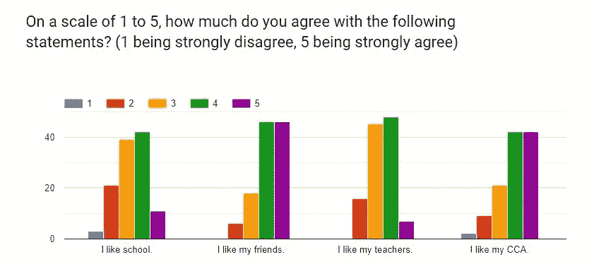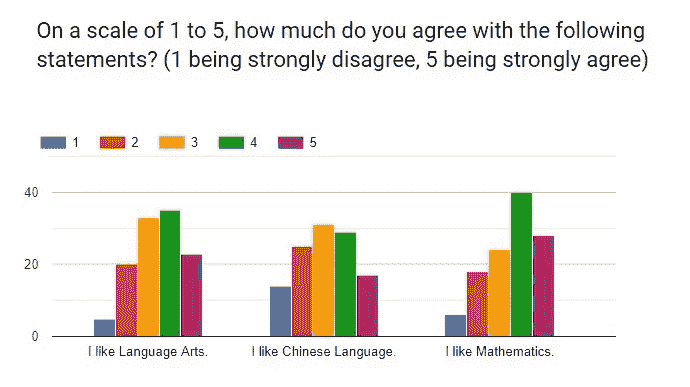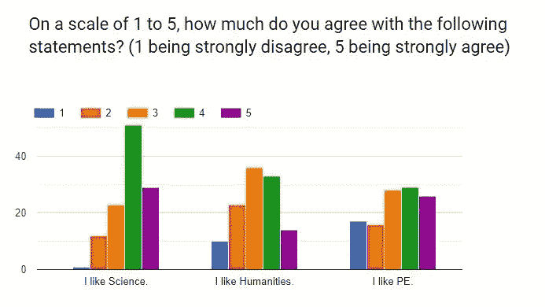

基于 116 份调查问卷，我们发现相关系数在 0.11 到 0.59 之间。接下来，我想知道在较小的样本量下是否有不同的结果。

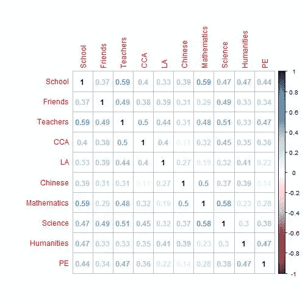

All survey respondents (N=116)

然后，我执行了 bootstrapping，从全部调查对象中随机抽取了 50 名受访者的样本十次。即使样本量现在变小了，自举样本 6(学校对数学，学校对人文，数学对科学)和样本 10(学校对数学)观察到了很强的相关性。因此，如果我们实际上只对 bootstrapped 样本 6 中的受访者样本进行了调查(以代表整个人口)，我们就会得出这些变量之间有很强相关性的结论。这表明，样本量大并不意味着我们更有可能观察到更强的相关性；在这种情况下，较大的样本量实际上会削弱相关性。这表明，更重要的是理解人口的同质性和我们如何进行抽样(即样本是否是随机选择的，是否代表人口的分层)。具有高同质性的较小样本将比具有低同质性(高异质性)的较大样本显示出更大的相关系数。因此，如果我们选择关注同质人群，我们可能不需要大样本量来反映相关性。当然，如果要保守一点，可以调整我们认为强相关的阈值，同时考虑相关系数的置信区间。R 中有在线[计算器](https://www2.ccrb.cuhk.edu.hk/stat/confidence%20interval/CI%20for%20correlation.htm)和[包](https://www.r-bloggers.com/how-to-calculate-confidence-intervals-of-correlations-with-r/)，可用于计算相关系数的置信区间。它考虑了观察到的样本相关系数、样本大小和置信水平(通常为 0.95)。

在这里，我还想引用一篇关于“相关性在多大的样本量下稳定？”的论文，其结果表明，在典型情况下，稳定估计的样本大小应接近 250。在这种情况下，这将是一个微不足道的解决方案，因为这意味着我必须调查整个人群(学生群体是< 250)。换句话说，我们应该尽可能地获取更多的样本。克里斯·德拉海姆在[的一个帖子](https://www.researchgate.net/post/What_is_the_minimum_sample_size_to_run_Pearsons_R)中的评论，“运行皮尔逊 R 的最小样本量是多少？”，也强调了小样本的不稳定性:*“没有至少 50 或 60 次观察，我不会相信任何相关性，80-100 次在我感觉舒适的范围内。根据我处理试点数据和分析数据集子集或在正在进行的研究中展示数据的经验，与 20-40 名受试者的相关性可能会与 80-100 名受试者的相关性明显不同，我甚至看到当观察值加倍时，两项任务之间的相关性从. 70 到+40。识别异常值也很重要，即使样本量较大，一两个异常值也会对相关性的大小产生很大影响，因为这毕竟是最小二乘法。”*

另外，研究自举样本 6 的分布如何不同于其余样本以显示相关性分析中的这种差异将是有趣的。

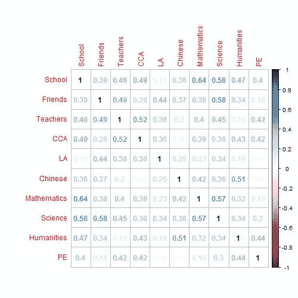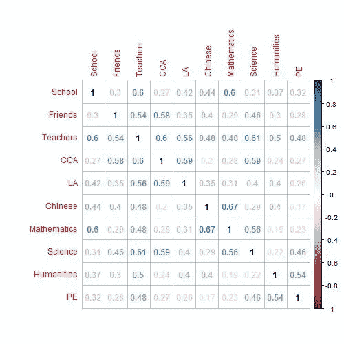

Correlation coefficients for bootstrapped sample 1 and bootstrapped sample 2

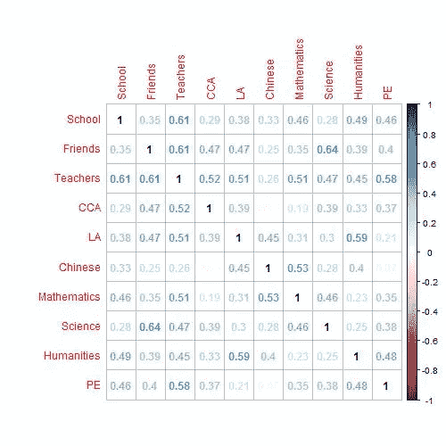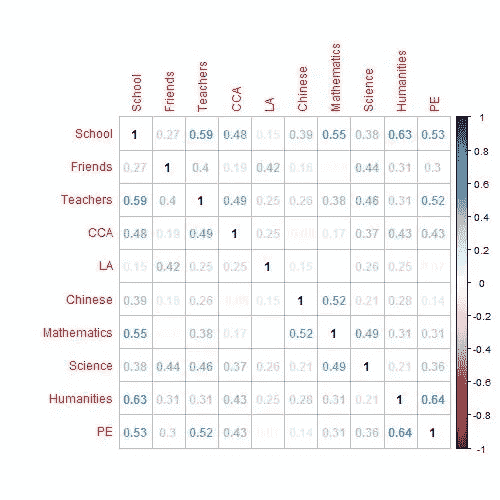

Correlation coefficients for bootstrapped sample 3 and bootstrapped sample 4

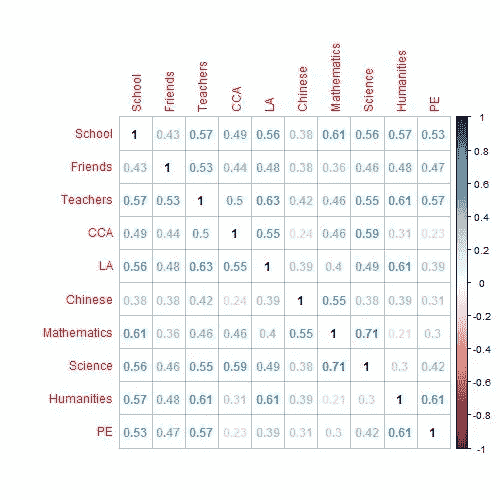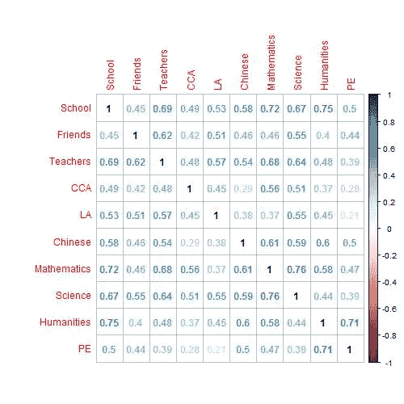

Correlation coefficients for bootstrapped sample 5 and bootstrapped sample 6

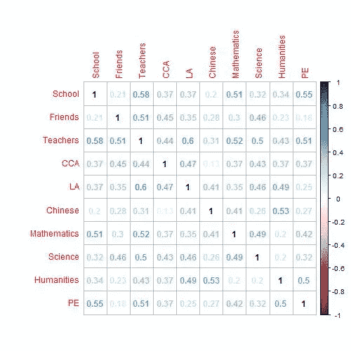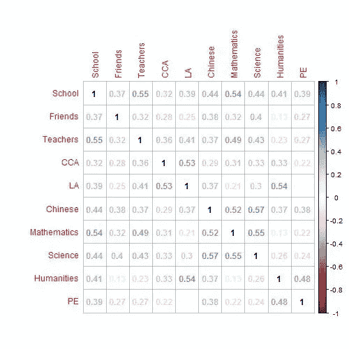

Correlation coefficients for bootstrapped sample 7 and bootstrapped sample 8

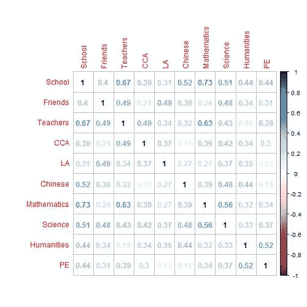

Correlation coefficients for bootstrapped sample 9 and bootstrapped sample 10

参考资料:

[https://www . check market . com/blog/how-to-estimate-your-population-and-survey-sample-size/](https://www.checkmarket.com/blog/how-to-estimate-your-population-and-survey-sample-size/)
[https://www . r-bloggers . com/how-to-calculation-confidence-intervals-of-of-correlations-with-r/](https://www.r-bloggers.com/how-to-calculate-confidence-intervals-of-correlations-with-r/)

*原载于*[*https://projectosyo.wixsite.com*](https://projectosyo.wixsite.com/datadoubleconfirm/single-post/2019/05/07/Sample-size-and-correlation)*。*