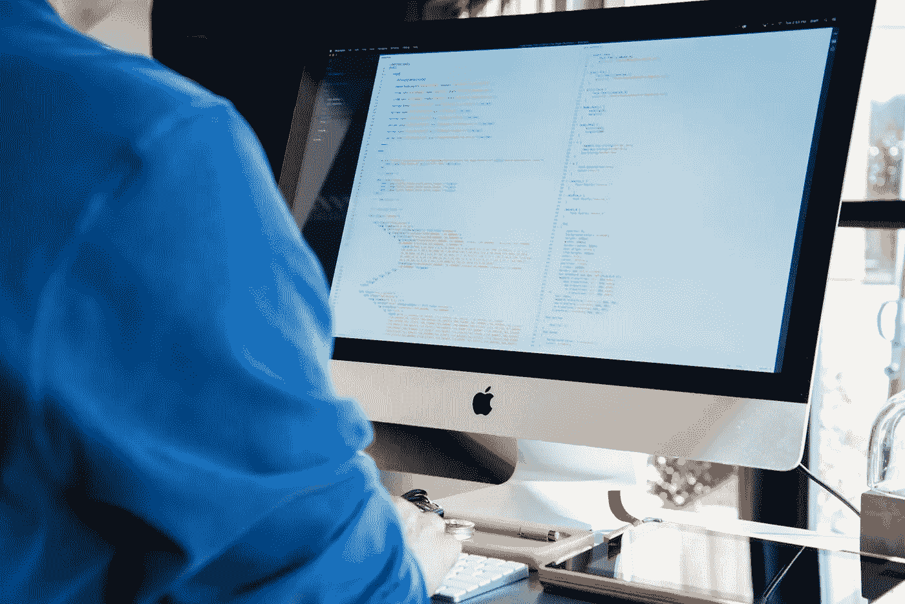

# 数据科学家职位的家庭编码练习示例

> 原文：<https://towardsdatascience.com/sample-take-home-coding-exercise-for-a-data-scientist-position-8086dd195a76?source=collection_archive---------12----------------------->

**Image Source: Photo by** [**Lee Campbell**](https://unsplash.com/@leecampbell?utm_source=unsplash&utm_medium=referral&utm_content=creditCopyText) **on** [**Unsplash**](https://unsplash.com/s/photos/coding?utm_source=unsplash&utm_medium=referral&utm_content=creditCopyText)

将编码练习带回家是数据科学家工作面试流程的重要组成部分。数据科学家工作面试流程通常从一些初步接触开始，例如通过 LinkedIn 等平台从招聘人员那里，或者从申请的公司或组织的代表那里。随后通常会进行 Skype 或电话面试，以了解申请人的资格。一旦 Skype 或电话面试完成，下一步就是带回家编码挑战。

我认为带回家的挑战是数据科学家工作面试过程中最重要的一步。在此过程中，您会被指派解决一个数据科学问题。带回家练习的难度因组织而异。有时，如果你幸运的话，你可能会得到一个清晰的数据集，上面有关于做什么的明确说明，也就是说，这个练习会准确地告诉你要构建的模型的类型。如果你不是很幸运，你可能会得到一个非常复杂的数据集(需要一些清理和结构化)和一个开放的问题。在这种情况下，您必须仔细研究问题，然后决定哪种预测模型适合给定的问题。此外，关于完成“带回家”挑战的时间，根据公司的不同，时间可能从 2 天到 7 天不等。

在本文中，我将展示一个数据科学家工作岗位的带回家编码练习示例。这是你能要求的最简单的带回家练习之一。数据集结构良好且干净，相对较小(9 个要素和 159 个观测值)，没有缺失值。我对一个有 50，000 个观察值和如此多缺失值的数据集做了一次带回家的练习。

现在我将展示带回家练习的样本，然后我会在最后做一些评论。

# 数据科学家职位的家庭编码练习示例

## **指令**

这个编码练习应该用 python 来执行(python 是团队使用的编程语言)。你可以自由使用互联网和任何其他图书馆。请将您的作品保存在 Jupyter 笔记本中，并通过电子邮件发送给我们进行审核。

数据文件: [cruise_ship_info.csv](https://github.com/bot13956/ML_Model_for_Predicting_Ships_Crew_Size/blob/master/cruise_ship_info.csv) (该文件将通过电子邮件发送给您)

## **目标:建立一个回归方程，为潜在的船只购买者推荐“船员”数量。**

请执行以下步骤(提示:使用 numpy、scipy、pandas、sklearn 和 matplotlib)

1.读取文件并显示列。

2.计算数据的基本统计数据(计数、平均值、标准差等)，检查数据并陈述你的观察结果。

3.选择对预测“团队”规模可能很重要的列。

4.如果您删除了列，请解释为什么要删除这些列。

5.对分类特征使用一次性编码。

6.创建训练集和测试集(将 60%的数据用于训练，其余用于测试)。

7.建立一个机器学习模型来预测“船员”的规模。

8.计算训练集和测试数据集的皮尔逊相关系数。

9.描述模型中的超参数，以及如何更改它们来提高模型的性能。

10.什么是正规化？你的模型中的正则化参数是什么？

11.绘制正则化参数值与测试集和训练集的 Pearson 相关性，并查看您的模型是否有偏差问题或方差问题。

# 关于带回家练习示例的一般说明

这里展示的带回家的编码练习是一个非常简单的问题。数据集是干净的，结构良好的，它是一个相对较小的数据集，并且做什么的指令非常清楚。

有时，带回家的编码练习可能非常复杂和具有挑战性。不管是什么情况，你都需要尽最大努力提供最好的解决方案。

此外，如果你发现自己被困在这个问题上，你可以随时给你的数据科学面试团队发电子邮件，他们可以提供一些指导或提示。

# 将编码练习带回家的一般建议

数据科学带回家挑战练习为您提供了展示数据科学项目工作能力的机会。你需要在这里展示出非凡的能力。例如，如果要求您构建多元回归模型，请确保您能够充分理解以下高级概念:

(一)特征标准化

(二)超参数调谐

㈢交叉验证

(四)降维技术，如 PCA(主成分分析)和 Lasso 回归

(五)泛化误差

㈥不确定性量化

㈦展示使用先进的数据科学技术的能力，例如 sklearn 的管道工具来建立模型。

(viii)能够根据实际应用解释您的模型。

总之，我们已经讨论了数据科学家职位的家庭编码练习。这里给出的示例编码练习只是一个例子。有时，带回家的编码练习可能非常广泛，提供的数据集可能非常复杂。无论情况如何，带回家的编码练习为求职者提供了一个展示他们的数据科学技能的绝佳机会。

如果你对我提出的带回家编码练习的解决方案感兴趣，请发邮件到**benjaminobi@gmail.com 给我。**