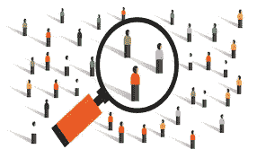
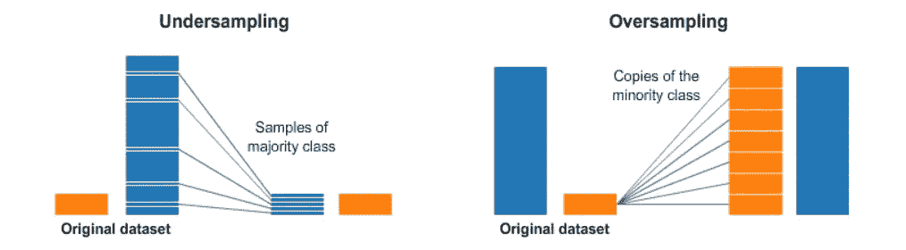

# 采样！

> 原文：<https://towardsdatascience.com/sampling-79075e9176cb?source=collection_archive---------16----------------------->

## 一种解决鸟类计数问题的方法

当你有一个很大的数据集，而你的算法需要很长时间才能运行时，你会怎么做？或者说如果你想知道一天内喝星巴克的总人数？你打算一整天都站在星巴克外面数进入星巴克的人数吗？好吧，那将是荒谬和浪费时间的！因此，这里我们使用抽样技术，选择一部分数据进行分析。获得感兴趣的整个数据集太昂贵或太耗时。此外，处理收集到的所有数据既耗时又昂贵。因此，使用采样算法可以减少数据量，但可以使用更好但更昂贵的算法。取样有助于回答与鸟类计数问题有关的问题，即地震中幸存的人数。

有效抽样的关键是样本应该和使用整个数据集一样有效。以星巴克为例，如果我只收集上午 9 点到 11 点的数据，那么显然会有更多的人喝星巴克，因为现在是早上，人们已经养成了早上上班前喝咖啡的习惯。因此，应该选择一种有效且无偏的方法从大数据集中进行采样，该方法将覆盖在大数据集中发现的所有变化。

# **采样方式:**

一一**。随机抽样:**对于这种类型的抽样，选择任何特定项目的概率是相等的。例如:从 1-100 中挑选 10 个数字。在这里，每个数字被选中的概率是相等的。

1.  *替换取样*:在这种技术中，物体不会从群体中移除。假设在一包 52 张牌中，我想选一张，这里所有牌的概率都是 1/52。所以，如果我随机抽了一张红心，现在我必须再抽一张牌，但是如果我不放红心，那么我的概率是 1/51。但在这种技巧中，我放回了一张红心 k，这样所有牌的概率都是一样的。在这里，先取出的东西不应该影响第二个或任何其他东西。数学上，两个样本之间的协方差为零。当我们有一个大的数据集时，我们应该使用替换抽样。因为如果我们使用没有替换的抽样，那么每件商品被挑选的概率将会不断变化，在某个点之后将会变得太复杂。替换抽样可以告诉我们在我们的数据中什么是更频繁的。
2.  *无替换取样*:在这种技术中，对象从群体中被移除。在这里，无论我们先取出什么，都会影响第二个。没有替换的采样有助于数据集变小。数学上，两个样本之间的协方差不为零。

我们使用的取样类型在很大程度上取决于我们试图回答的问题。

当总体由具有大量对象的不同类型的对象组成时，简单的随机抽样可能无法代表出现次数较少的那些类型的对象。这可能会给分析带来问题，因为样本中不包括稀有类。因此，采用分层抽样的方法。

B. 分层抽样:在这种技术中，我们从总体中的一组特定对象中进行抽样。即使各组的大小不同，也会从每组中抽取相同数量的对象。此外，还有一种变化，即从每个组中抽取的对象数量与该组的大小成比例。让我们以一个著名的泰坦尼克号问题为例，在这个问题上女性幸存者多于男性。因此，如果我们随机抽取男性和女性样本，那么我们将得到一个错误的答案，我们的训练模型将会不平衡。我们必须使用分层抽样方法，仔细地对男性和女性进行抽样。我们可以根据男性和女性的存活情况进行取样。

取样并不总是有用的。有时会丢失信息。确定合适的样本量也非常重要。人们已经开始使用自适应或渐进采样。这种方法从小样本开始，然后增加样本量，直到获得足够的样本。

看看这个很好的例子，当班级不平衡时，抽样是如何帮助学生的:

 [## 解决阶级失衡

### 下载数千个项目的开放数据集+在一个平台上共享项目。探索热门话题，如政府…

www.kaggle.com](https://www.kaggle.com/shahules/tackling-class-imbalance) 

**结论:**

采样技术广泛用于解决各种问题。取样有助于降低成本，节省时间，有助于组织数据，它收集密集和详尽的数据，适用于我们资源有限的情况。然而，我们需要领域知识来从人群中取样。此外，当测量单位不一致时，采样没有意义，当然也有可能出现偏差。

**参考:**

 [## 数据挖掘简介

### 庞-谭宁，密歇根州立大学，迈克尔·斯坦巴克，明尼苏达大学

www-users.cs.umn.edu](https://www-users.cs.umn.edu/~kumar001/dmbook/index.php)