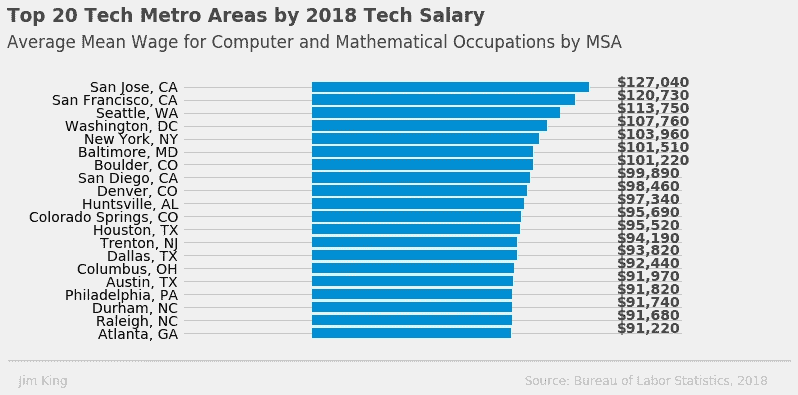
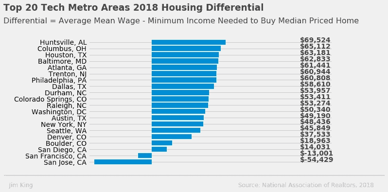

# 旧金山的技术工作？先查房价！

> 原文：<https://towardsdatascience.com/san-francisco-tech-job-check-home-prices-first-8ef0367b31b?source=collection_archive---------19----------------------->

## 房价让旧金山技术人员的高薪相形见绌。

如果你有一份技术工作，并且住在加州以外的地方，你可能会考虑搬到科技世界的中心——硅谷或旧金山。快速浏览一下求职网站，你会赚很多钱！但在你接受 12 万美元的薪水之前，请确保你仔细看看住房成本。

点击下面的互动图表，详细了解旧金山独户住宅有多贵。该图表按中位数销售价格、最低收入要求、平均销售价格、每平方英尺平均销售价格、平均平方英尺和销售数量(10 年的数据)对单户家庭房屋销售进行了细分。

[**2009–2018**](https://sf-real-estate.herokuapp.com/SF_Real_Estate_Project)旧金山独栋房屋销售互动图

让我们根据计算机和数学职业的最高平均工资来比较一下旧金山和美国前 20 大科技都市地区。

现在，让我们以 2018 年住房差异为依据，对这 20 个科技大都会中心进行排名。住房差异是指技术工人的平均工资减去购买一套家庭住房所需的收入。例如，一名旧金山的技术工人平均收入为 120，730 美元，但需要 133，731 美元的收入才能购买中值住房——因此，该工人需要 13，001 美元的工资才能购买住房！

正如你所看到的，旧金山和硅谷(圣何塞大都会区)显示出负的住房差距。换句话说，你的高技术工资不够支付抵押贷款！

你的技术工资最高在哪里？你可能会惊讶地发现，在阿拉巴马州的亨特维尔，有近 4000 名航空航天工程师为波音和蓝色起源等公司工作。与房价相比，它的工资相对较高。亨茨维尔的一名技术工人平均收入为 97，340 美元，但只需要 27，816 美元就能买到中等价位的房子。

我欢迎建设性的批评和反馈，请随时给我发私信。这篇文章最初发表在 jimking100.github.io/2019–09–02-Post-2/的。

在 Twitter 上关注我 [@The_Jim_King](https://twitter.com/The_Jim_King)

*这是探索旧金山房地产数据系列文章的第 1 部分*

*旧金山房地产数据来源:旧金山 MLS，2009–2018 年数据*

*工资数据:劳动统计局—职业就业统计，2018 年数据*

*全国单户家庭房屋销售价格中位数数据:美国全国房地产经纪人协会，2018 年数据*

*最低收入要求——使用加州房地产经纪人协会住房负担指数——传统方法。它使用中位数价格、20%的首付、基于每年 4%的利率、1%的税率和. 38%的保险费率的每月房屋付款，并假设不超过 30%的家庭收入可用于房屋付款。*