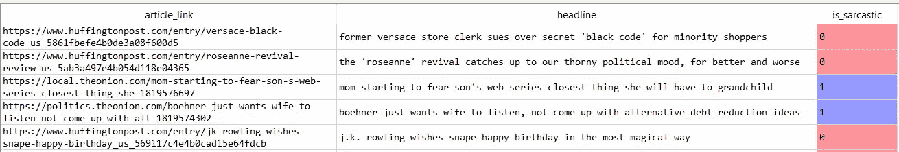
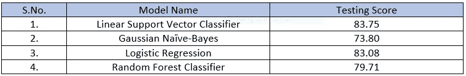
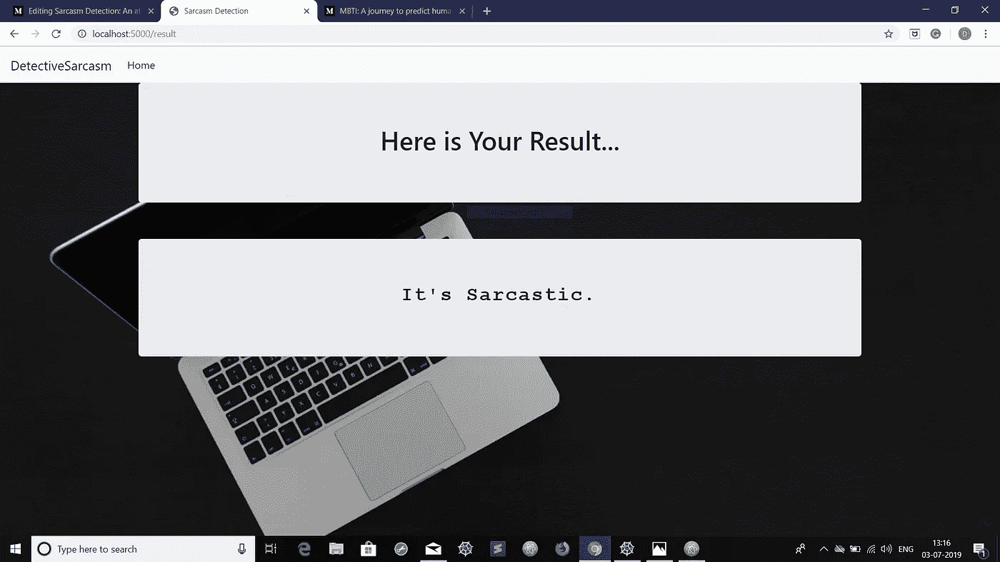

# 讽刺检测:走向情感分析的一步

> 原文：<https://towardsdatascience.com/sarcasm-detection-step-towards-sentiment-analysis-84cb013bb6db?source=collection_archive---------7----------------------->

人类具有社会性。社会性意味着我们以积极友好的方式相互交往，也意味着我们知道如何以非常消极的方式操纵他人。

讽刺在人类社会交往中起着重要的作用，它既有积极的滑稽，也有消极的下流。


但是有时候很难察觉有人是不是带着某种讽刺在取笑我们。所以为了简单起见，我们建立了一些东西来帮助你发现讽刺的文字，但是在进入更多细节之前，让我们来定义一下讽刺

> **讥讽**是“尖锐、尖刻或尖刻的表达或言论”。用讽刺来嘲弄或表达轻蔑。

所以现在是时候充电开始讽刺检测之旅了。

让我们从定义问题开始:-

**问题描述:-**

我们已经给出了**新闻标题数据集**，我们的目标是预测一个给定的文本是否是*讽刺的*。

> 这个用于讽刺检测的**新闻标题数据集**收集自**旨在制作时事讽刺版本的洋葱**网站和**收集真实新闻标题的赫芬顿邮报**网站。
> 
> 你可以从令人惊叹的网站 [**Kaggle**](https://www.kaggle.com/) **，**轻松获得这个数据集，下面是链接:-
> 
> [点击此处下载数据集](https://www.kaggle.com/rmisra/news-headlines-dataset-for-sarcasm-detection/downloads/news-headlines-dataset-for-sarcasm-detection.zip/1)

我们的数据集有三列，其中

*   `article_link`(类型:对象):包含新闻文章的链接。
*   `headline`(类型:对象):包含新闻文章的标题。
*   `is_sarcastic`(类型:int64):包含 0(非讽刺文本)和 1(讽刺文本)。

**源代码(Python):-**

T 他的讽刺检测器是内置的 *Python* 语言，所以是时候导入基本的库和模块了，如果你不知道这些模块，不要担心，我们将在下一步中学习这些

```
import pandas as pd, numpy as np, re, time
from nltk.stem.porter import PorterStemmer
```

现在是时候获取我们的模型和一些依赖项了

```
from sklearn.model_selection import train_test_split
from sklearn.metrics import confusion_matrix
from sklearn.svm import LinearSVC
from sklearn.model_selection import cross_val_score
from sklearn.naive_bayes import GaussianNB
from sklearn.linear_model import LogisticRegression
from sklearn.ensemble import RandomForestClassifier
```

不要担心，如果您没有任何模块，您可以使用:-

`pip install <module/library Name>`

安装任何依赖项。

在获得所有的依赖关系之后，是时候将我们的数据集加载到 Pandas Dataframe 中了。

```
# Loading data from json file
data = pd.read_json(‘Sarcasm_Headlines_Dataset.json’, lines = True)
```

现在让我们使用**熊猫数据帧**的`data.head()`方法来看看我们数据集的前五行。



Fig: a glimpse of our dataset

最好是**先检查数据集中的空值**。

```
print(data.isnull().any(axis = 0))
# Output :-
# ----------------------
# article_link    False
# headline        False
# is_sarcastic    False
# dtype: bool
# ----------------------
```

因为我们的数据集没有任何空值。因此，我们可以继续清理数据。

**清理数据:-**

虽然看起来我们的数据是干净的，但是标题栏中有一些特殊的符号需要被删除。

所以，我们使用正则表达式来消除特殊符号。

```
# Relacing special symbols and digits in headline column
# re stands for Regular Expression
data['headline'] = data['headline'].apply(lambda s : re.sub('[^a-zA-Z]', ' ', s))
```

**特征和标签提取:-**

是时候从我们的数据中提取**特征和标签**了。看来我们可以把 **article_link** 和 **headline** 当做特色。但是， **article_link** 在预测标签方面并没有起到重要作用。因此，我们仅有的功能是**标题**栏。而**是 _ 讽刺**是唯一的标签。

```
# getting features and labels
features = data['headline']
labels = data['is_sarcastic'**]**
```

**特征词干:-**

S temming 是将一个单词简化为词干的**过程，词干附加于后缀和前缀或单词的*词根，称为*引理*。词干在自然语言理解(NLU)和自然语言处理(NLP)中很重要。***

例如:-

原话:**【读书】****【读书人】**。

词干后:**读作**(以上两个词都适用)。

```
# Stemming our data
ps = PorterStemmer()features = features.apply(lambda x: x.split())
features = features.apply(lambda x : ‘ ‘.join([ps.stem(word) for word in x]))
```

**使用 TF-IDF 矢量器对特征进行矢量化:-**

T***F-IDF***是 ***术语频率-逆文档频率*** 的缩写，是一种非常常见的*算法****将*** 文本转换成有意义的数字表示。该技术广泛用于在各种 *NLP 应用*中提取特征*。*

```
# vectorizing the data with maximum of 5000 features
from sklearn.feature_extraction.text import TfidfVectorizer
tv = TfidfVectorizer(max_features = 5000)
features = list(features)
features = tv.fit_transform(features).toarray()
```

**训练和测试数据:-**

做完所有重要的事情后，是时候把我们的数据分成训练和测试部分了。

```
# getting training and testing data
features_train, features_test, labels_train, labels_test = train_test_split(features, labels, test_size = .05, random_state = 0)
```

**模型的训练和测试:-**

现在是表演时间，我们将使用不同的机器学习算法来训练我们的模型。

```
# model 1:-# Using linear support vector classifier
lsvc = LinearSVC()
# training the model
lsvc.fit(features_train, labels_train)
# getting the score of train and test data
print(lsvc.score(features_train, labels_train)) # 90.93
print(lsvc.score(features_test, labels_test))   # 83.75# model 2:-# Using Gaussuan Naive Bayes
gnb = GaussianNB()
gnb.fit(features_train, labels_train)
print(gnb.score(features_train, labels_train))  # 78.86
print(gnb.score(features_test, labels_test))    # 73.80# model 3:-# Logistic Regression
lr = LogisticRegression()
lr.fit(features_train, labels_train)
print(lr.score(features_train, labels_train))   # 88.16
print(lr.score(features_test, labels_test))     # 83.08# model 4:-# Random Forest Classifier
rfc = RandomForestClassifier(n_estimators = 10, random_state = 0)
rfc.fit(features_train, labels_train)
print(rfc.score(features_train, labels_train))  # 98.82
print(rfc.score(features_test, labels_test))    # 79.71
```

应用上述所有模型后，得分如下



Table: Score(Accuracy) of different models

可以看出，最好的评分器是**线性支持向量分类器**，其**准确率**为**的 83.75%** 。并且剩余模型具有更接近于*线性支持向量分类器*的精度。因此，我们选择了最好的一个。

**用户界面:-**

F 或者为了让它对用户友好，我们还使用 **HTML、CSS 和 Bootstrap** 构建了一个**用户界面**，它由 **The Flask** 支持。

这就是我们的*用户界面*的样子


Fig: Home Page



Fig: Result Page

基于输入的文本，我们的模型预测它是否是**讽刺的**。

**总结:-**

由此可见，我们可以多么好地利用**机器学习**算法的力量，让这个*情感分析*变得更加容易。

**特别感谢:-**

这个项目的实现是在了不起的导师们的指导下在 Forsk-Labs 完成的，他们在建造这个奇妙的项目时给了我们很多帮助。我将永远感谢他们的支持和善意。

**关于我们:-**

我们(作为一个由两名成员组成的团队- [DIGVIJAY SINGH](https://medium.com/u/f3c17acaf100?source=post_page-----84cb013bb6db--------------------------------) 和 [Sourabh Prajapati](https://medium.com/u/cb1a1a55e7c3?source=post_page-----84cb013bb6db--------------------------------) )在***Forsk Technologies***的暑期实习期间构建了这个项目。

**GitHub 回购二维码:-**


QR Code to GitHub Repository