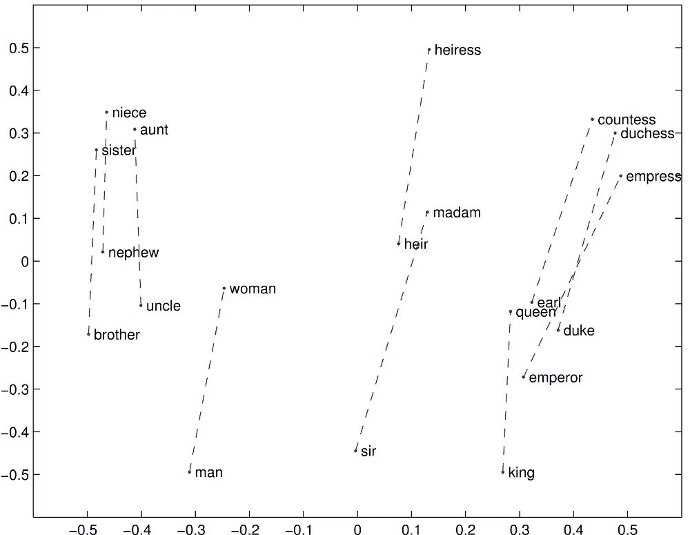

# Android 中基于单词嵌入的讽刺检测

> 原文：<https://towardsdatascience.com/sarcasm-detection-using-word-embeddings-in-android-999a791d676a?source=collection_archive---------20----------------------->

## 📱[移动机器学习](https://equipintelligence.medium.com/list/stories-on-mobile-ml-with-kotlin-and-tf-lite-3ebee822c87b)

## 在 Android 中使用单词嵌入的惊人力量。


Photo by [Kelly Sikkema](https://unsplash.com/@kellysikkema?utm_source=medium&utm_medium=referral) on [Unsplash](https://unsplash.com?utm_source=medium&utm_medium=referral)

喜欢在 [TensorFlow Keras](https://www.tensorflow.org/guide/keras) 中使用[预训练嵌入](https://keras.io/examples/pretrained_word_embeddings/)？他们只是把验证精度提高到 80 和 90。无论是 [GloVe](https://nlp.stanford.edu/projects/glove/) 还是 [Word2Vec](https://www.tensorflow.org/tutorials/representation/word2vec) ，单词嵌入在[自然语言处理(NLP )](https://machinelearningmastery.com/natural-language-processing/) 中都显示出了巨大的成效。我们如何在您的 Android 应用中利用这种强大的嵌入功能？此外，没有使用任何第三方库和 API，只有 [TensorFlow Lite](https://www.tensorflow.org/lite) 和 Android SDK。兴奋吧？我们走吧！

Python 项目的源代码可从→[https://github . com/Shu bham 0204/sarcash _ Detection _ NLP _ tensor flow](https://github.com/shubham0204/Sarcasm_Detection_NLP_TensorFlow)获得

Android 应用程序的代码→[https://github.com/shubham0204/Sarcaso_for_Android](https://github.com/shubham0204/Sarcaso_for_Android)

# 一目了然。

See the code!

我们将创建一个应用程序，检测 Android 应用程序中讽刺的推文/文本。

> 我们的主要挑战是将`tf.keras.layers.Embedding`层导出到包含单词嵌入对的 JSON 文件。

JSON 文件将在我们的 Android 应用程序中被解析。它将包含成对的*单词嵌入*，其中*嵌入*将是 50 个浮点数的数组。

## 什么是单词嵌入？

[单词嵌入](https://machinelearningmastery.com/what-are-word-embeddings/)是属于某个语料库的单词的密集表示。比如，

```
[ [ 'king' ] , [ 'queen' ] ] = [ [ 0.1 , 0.78 ] , [ 0.456 , 0.23 ] ]
```



当投影到 2 或 3 维空间时，嵌入向量在方向或接近度上表现出某种相似性。因此，在我们的例子中，一个单词的上下文(来自语料库)被打包在一个 50 维的向量中。

*它们建立文档之间的关系。被分类为同一类别的文档在它们的嵌入中具有相似性，这由神经网络学习。*

## 在张量流和 Keras 的背景下。

在 Keras ( TensorFlow)中，我们在`tf.keras.layers`模块中有一个`[Embedding](https://www.tensorflow.org/api_docs/python/tf/keras/layers/Embedding)`层。

```
embedding = tf.keras.layers.Embedding( input_dim , output_dim , input_length )
```

`input_dim`:一个值为`max_index_in_vocab + 1`的`int`对象。`max_index_in_vocab`是分配给词汇表中一个单词的最大索引。

`output_dim`:嵌入的维度。每个记号/单词将被转换成一个`output_dim`维嵌入向量。

`input_length`:输入序列的长度。

# Keras 模型入门。

Keras with TensorFlow is just…

我建议看一下下面的文章，以便更好地理解。有些步骤已经在里面详细说明了。

[](https://medium.com/dataseries/spam-classification-in-android-with-tensorflow-lite-cde417e81260) [## 基于 TensorFlow 的 Android 文本分类

### 事实证明，机器学习在一些使用案例中非常出色，例如垃圾邮件分类，我们将在…

medium.com](https://medium.com/dataseries/spam-classification-in-android-with-tensorflow-lite-cde417e81260) 

Snippet: 1.1

这是我们的 Keras 模型。我们将使用`Conv1D`层而不是`LSTM`层(尽管`LSTM`层提供了更高的精度)，因为 TensorFlow Lite 不支持该 op(操作)。见[此处](https://www.tensorflow.org/lite/guide/ops_compatibility)。

Snippet: 1.2

我们将模型转换为带有`TFLiteConverter`和`post_training_quantize=`标志的`.tflite`模型，以减小模型的大小。见[此处](https://www.tensorflow.org/lite/convert)。

***注意:*** *我们需要先从模型中去掉* `*Embedding*` *图层。TF Lite 中也不支持* `*Embedding*` *图层。我们将在推理时直接向模型提供 Android 中的嵌入。*

## 将嵌入层权重导出到 JSON 文件。

下面是代码中发生的事情的摘要:

Snippet: 1.3

1.  从文件中加载模型。使用`model.layers[0].get_weights()[0]`获得第一层的权重，在我们的例子中是`Embedding`层。
2.  加载分词器的`word_index`。`word_index`是一个`dict`，它将单词映射到它们的索引。我们对这个`dict`进行转换，以便它将索引映射到单词(为了方便)。
3.  使用`embedding_matrix`和修改过的`word_index`，我们创建一个新的`dict`，命名为`embedding_dict`，它将单词映射到嵌入。这是一个简单的 for 循环。
4.  使用 Python 的`[json](https://docs.python.org/3/library/json.html)`模块将`embedding_dict`转换成 JSON 文件。

代码片段中也标记了这些步骤。

`*tokenizer.pkl*` *是* `[*tf.keras.preprocessing.text.Tokenizer*](https://www.tensorflow.org/api_docs/python/tf/keras/preprocessing/text/Tokenizer?hl=en)` *的腌制版。最终，我们需要分词器的* `*word_index*` *。还有，* ***注:*** *在提供的源代码中，我自己创建了一个自定义的分词器，同样包含* `*word_index*` *。看这里。*

## 源代码中的代码片段引用:

*   [片段:1.1](https://github.com/shubham0204/Sarcasm_Detection_NLP_TensorFlow/blob/master/Model.py)
*   [片段:1.2 和片段:1.3](https://github.com/shubham0204/Sarcasm_Detection_NLP_TensorFlow/blob/master/EmbeddingExporter.py)

# 现在在安卓。

I just you can try this in iOS too!

我们需要读取使用`[JSONObject](https://developer.android.com/reference/org/json/JSONObject?hl=en)`在 Python 中创建的嵌入的 JSON 文件。对于嵌入了 50 维的大约 18000 个单词的词汇表，JSON 文件的大小是 17–19mb。这就足够挂 Android 里的 UI 线程了。我们需要解析一个`[AsyncTask](https://developer.android.com/reference/android/os/AsyncTask)`中的文件。

Snippet: 2.1

嵌入已经被解析为一个`DoubleArray`，并且该单词已经被传递给一个`String`。`VocabCallback`用于在词汇表或 JSON 文件加载后调用方法。

原始文本的填充和标记也有所改变。这些是填充和标记原始字符串文本的方法。

Snippet: 2.2

这里，`embeddingDim`是嵌入的维数，在我们的例子中是 50。`embeddingData`是`Hashmap`，我们通过解析 snippet-2.1 中的 JSON 文件创建的。这里的可以看到`Tokenizer.getTokens()`方法[。](https://github.com/shubham0204/Sarcaso_for_Android/blob/master/app/src/main/java/com/ml/quaterion/sarcaso/Tokenizer.kt)

## 加载 TFLite 模型和词汇表。

Snippet: 2.3

`loadModelFile()`返回存储在应用程序的 assets 文件夹中的 TFLite 模型的`MappedByteBuffer`。

由于 TensorFlow Lite 不支持`Double`数据类型，`classifySequence()`做出最终推断，并将`Array<DoubleArray>`转换为`Array<FloatArray>`。

我们创建了一个回调函数，当词汇表加载到后台线程中时，这个回调函数就会被触发。

Snippet: 2.4

当点击“分类”按钮时，我们执行最后的推断。

Snippet: 2.5

## 源代码中的代码段引用。

*   [片段:2.1 和 2.2](https://github.com/shubham0204/Sarcaso_for_Android/blob/master/app/src/main/java/com/ml/quaterion/sarcaso/EmbeddingBuilder.kt)
*   [片段:2.3、2.4、2.5](https://github.com/shubham0204/Sarcaso_for_Android/blob/master/app/src/main/java/com/ml/quaterion/sarcaso/MainActivity.kt)

# 对 TensorFlow 和 Android 有帮助的资源。

我知道上面的东西对初学者来说可能是惊人的。参考这些资料。

*   [如何用 Keras 使用单词嵌入层进行深度学习](https://machinelearningmastery.com/use-word-embedding-layers-deep-learning-keras/)
*   [在 Keras 模型中使用预训练的单词嵌入。](https://blog.keras.io/using-pre-trained-word-embeddings-in-a-keras-model.html)
*   [如何在 Java 中解析 JSON](https://stackoverflow.com/questions/2591098/how-to-parse-json-in-java)
*   [AsyncTask Android 示例](https://stackoverflow.com/questions/9671546/asynctask-android-example)
*   [科特林阵](https://www.javatpoint.com/kotlin-array)

# 还有呢！

# 仅此而已。

有一个专业建议。在源代码中，我使用了手套字嵌入。自己看代码实现。

Machine Learning on Android!

希望你喜欢。机器学习快乐！