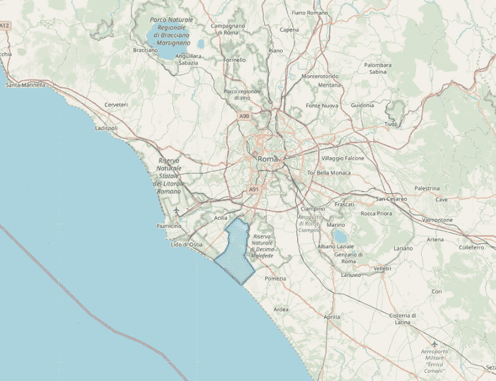
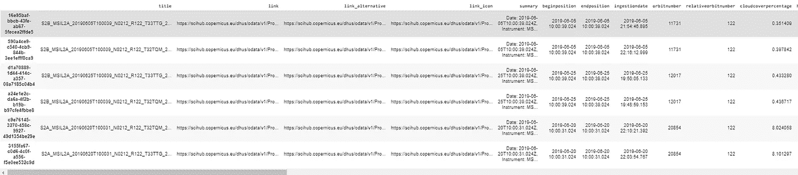
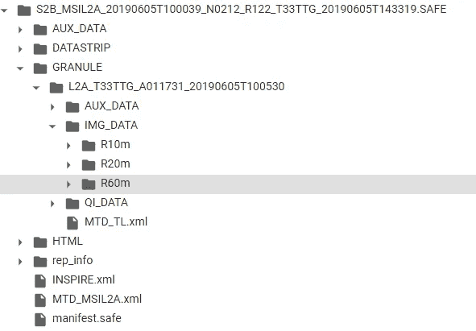
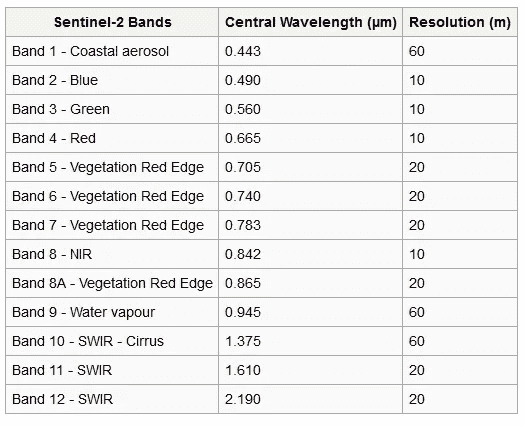
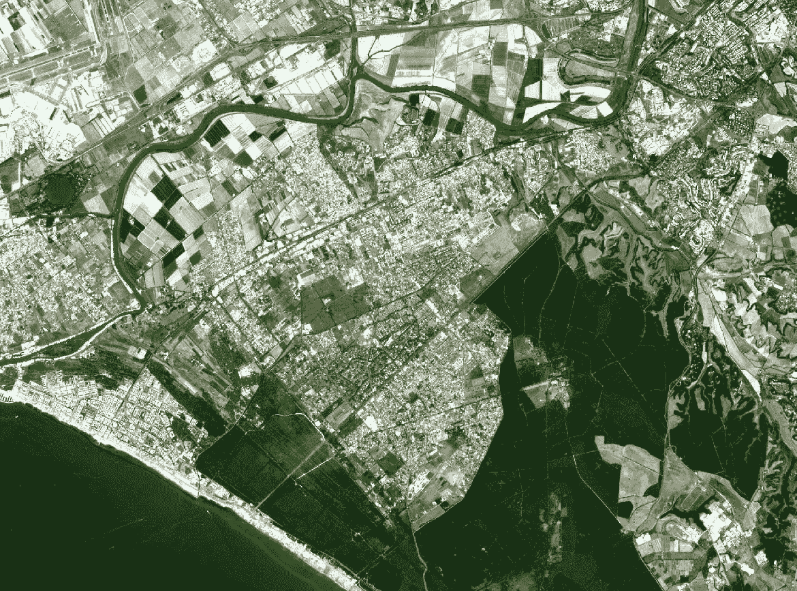
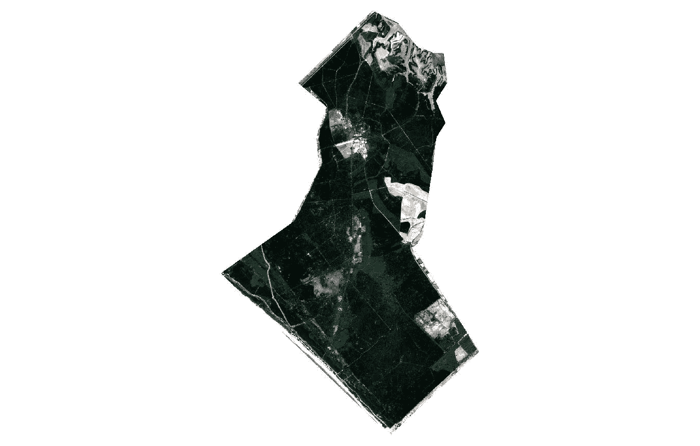
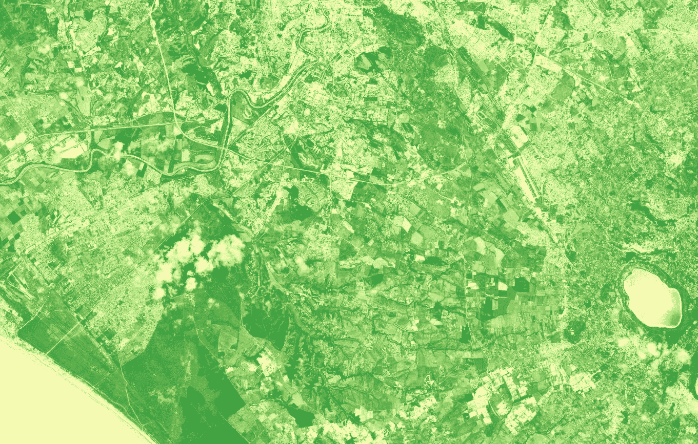

# Python 和 Jupyter 笔记本中的卫星图像访问和分析

> 原文：<https://towardsdatascience.com/satellite-imagery-access-and-analysis-in-python-jupyter-notebooks-387971ece84b?source=collection_archive---------3----------------------->

## 使用 Python 在 Jupyter 笔记本中访问、预处理、分析和可视化卫星图像。


SENTINEL-2 GLOBAL COVERAGE. [Source](https://m.esa.int/spaceinimages/Images/2017/03/Sentinel-2_global_coverage)

全球每天收集的大量卫星图像是巨大的。地球的频繁全球覆盖和公众随时可获得的高分辨率数据有助于监测地球及其环境。

在本教程中，我们将学习如何使用 python 在 Jupyter 笔记本环境中访问、分析和可视化卫星图像。卫星图像是像素化的数据，就像你用过的任何其他类型的图像一样。在地理和遥感术语中，这被称为栅格。光栅图像主要由卫星图像、激光雷达数据以及地理参考地图组成。正如我们将看到的，栅格由像元和行的矩阵组成，每个像元/行包含位置信息，如高程、温度和植被。

我们将在本教程中介绍以下内容:

1.  在 Jupyter 笔记本中直接用 Python 查询、检索、下载卫星图片。
2.  在 Python 中读写光栅图像。
3.  从 Sentinel 2 波段创建 RGB 和 NDVI 图像

# 访问数据

在本教程中，我们将使用 Sentinel 2 数据。访问 Sentinel 2 图像有许多选择，其中大多数都需要你通过网站交互来访问，无论是直接通过[下载服务实用程序](https://scihub.copernicus.eu/dhus/#/home)还是通过云。然而，由于我们使用的是 Jupyter notebook，我们将在这里使用一个 python 库来访问它们，这个库使搜索、检索和下载 Sentinel 卫星图像变得容易。所以让我们通过 pip 开始安装`sentinelsat`。

```
pip install sentinelsat
```

在我们能够使用`[sentinelsat](https://github.com/sentinelsat/sentinelsat)`之前，我们需要在 [Copernicus Open Access Hub](https://scihub.copernicus.eu/dhus/#/home) 中注册一个用户名，记下你的用户名和密码，并将它们粘贴到代码中。

Set up sentinelsat python library authentication

您已经准备好使用`sentinelsat`并下载 Sentinel 卫星图像。在本教程中，我们将使用意大利罗马市的边界数据。在罗马的南部，有一个名为 [Castel Porziano](https://it.wikipedia.org/wiki/Castel_Porziano) 的自然保护区，我们将使用它作为边界，从整个卫星图像切片中进行裁剪。

我将自然保护区的边界作为 Shapefile，我们将使用 Geopandas 读取它，并使用 yellow python 库可视化它(请注意，我已经在这里提供的 3 部分系列文章中介绍了 Geopandas 和矢量数据分析:[第 1 部分](/master-geographic-data-science-with-real-world-projects-exercises-96ac1ad14e63)、[第 2 部分](/getting-started-with-geographic-data-science-in-python-part-2-f9e2b1d8abd7)和[第 3 部分](/getting-started-with-geographic-data-science-in-python-part-3-ddf55130840b))

Read boundary data and visualize

使用上面的代码，我们已经在 Geopandas 中读取了自然保护区 shapefile，并将其命名为`nReserve`，然后在 foyl 中创建了一个以该区域坐标为中心的空底图，我们将其命名为`m`。最后，我们可以将 Geopandas 数据添加到我们创建的底图中，以可视化我们感兴趣的自然保护区边界。下面你可以看到地图。



Castel Porziano natural reserve, Souther part of Roma, Italy.

在我们可以搜索和下载哨兵 2 图像之前的最后一步是从`nReserve`几何体*创建一个足迹。*这里我们将使用 Shapely Python 库，因为我们的数据位于 Shapefiles 中，并且已经作为 Geopandas GeodataFrame 读取。(注意，如果您有 Geojson 数据，`sentinelsat`提供了一种简便的方法，可以在查询中将您的数据转换成[适当的格式](https://sentinelsat.readthedocs.io/en/stable/api.html?highlight=query))。

Create a footprint for the query.

现在我们可以在上面创建的`api`上运行一个查询。根据您的用例，这里有不同的方法来构造您的查询。在本例中，我们将创建 Sentinel 2 影像等级 2A 的查询，其云覆盖率介于 0 和 10 之间，与覆盖区(研究区域)相交。对于该时间段，我们只对“20190601”和“20190626”之间拍摄的哨兵级别 2A 卫星图像感兴趣(关于有效搜索查询的参考，请参考 [scihub](https://scihub.copernicus.eu/twiki/do/view/SciHubUserGuide/FullTextSearch?redirectedfrom=SciHubUserGuide.3FullTextSearch) )。

Query for satellite images available

我们用查询规范得到一个包含这一时期所有可用产品的字典。在这种情况下，我们只接收到 6 张拍摄的图像，但是您可以针对您的用例示例调整查询，扩展时间段或增加云覆盖百分比。

在这里，我们可以从`product`字典创建地理数据框架或数据框架，并根据云覆盖百分比对它们进行排序。我更喜欢地理数据框架，而不是普通的数据框架，因为前者包含每个卫星图像切片的几何图形。一旦我们创建了地理数据框架并对其进行排序。因为我们这里没有很多产品，所以我们直接调用`products_gdf_sorted`表来查看所有 6 行的属性。

Convert satellite images available metadata into GeoDataFrame.

下表只显示了`products_gdf_sorted`表的前几列。在索引中，您有可以用来下载特定图像的图块。其他列还包括一个标题，其中包含切片的全名和一些其他有用的列，如云覆盖率。



Sorted Products table by Cloud coverage percentage

假设我们对第一幅卫星图像感兴趣，因为这是所有可用图像中云层覆盖最少的。我们可以简单的调用 download，提供产品名称(注意可以用 api.download_all()函数一次性下载所有图片)。

这需要一段时间(Sentinel 2 卫星图像切片大约为 1 GB)。一旦下载完成，我们可以简单地解压它。在下一节中，我们将使用下载的卫星图像来处理、分析和可视化它们。

# 使用 Rasterio 探索卫星图像

一旦我们解压缩下载的文件夹，我们会得到许多子文件夹，有时很难浏览这些文件夹。这是一个文件夹树。



Sentinel 2 downloaded data tree.

Sentinel-2 的数据是多光谱的，在可见光、近红外和短波红外光谱中有 13 个波段。这些波段具有不同的空间分辨率，从 10 米到 60 米不等，因此图像可被归类为高-中分辨率。虽然有其他更高分辨率的卫星可用(1 米至 0.5 厘米)，但 Sentinel-2 数据是免费的，重访时间长(5 天)，这使其成为研究环境挑战的绝佳选择。这是一个有用的 sentinel 2 波段颜色表。



Sentinel-2 Bands, Wavelength, and Resolution

## 创建 RGB 图像

卫星图像的真实颜色通常是由红、绿、蓝三种颜色组合而成的。让我们首先用 Rasterio 读取数据，并从波段 4、3 和 2 创建一个 RGB 图像。

首先，我们在 Rasterio 中用相同的参数打开一个空的 RGB.tiff 文件，即宽度、高度、CRS 等..—波段 4(您可以选择三个波段中的任何一个)。然后，我们需要将这些条带写入空的 RGB 图像。



RGB Image tile visualized with QGIS — Souther part of Roma, Italy.

## 剪辑卫星图像

裁剪或遮蔽研究区域的一项重要预处理任务。由于这个 RGB 图像很大，你可以节省计算能力和时间，只使用感兴趣的区域。我们将从 RGB 图像中截取自然保护区。

这里，我们首先用与原始图像相同的投影重新投影我们的自然保护区。接下来，我们打开 RGB 图像，获取元数据并使用投影边界进行蒙版。



Masked image from RGB.

结果只是如上图所示的被遮罩/裁剪的感兴趣区域。

## 创造 NDVI

计算归一化植被指数(NDVI)是从卫星影像上评估绿色植被存在与否的一个重要指标。为了计算 NDVI，你需要红色波段和近红外波段(NIR)。不同的卫星图像为这些波段分配不同的编号。哨兵图像在第 4 波段有红色，在第 8 波段有 NIR。NDVI 的计算公式是:

`nir - red /(nir + red)`

为了在 Rasterio 中实现这一点，我们首先需要将第 4 和第 8 个波段作为数组读取。我们还需要确保数组是浮点数。

Write an NDVI image from the bands

输出是一幅 NDVI 图像，显示了卫星图像中区域的植被水平，如下所示。例如，水的植被很少(在图像中显示为红色)。



NDVI image visualized in QGIS.

# 结论

使用 Python 访问 Sentinel 2 图像通过`sentinelsat`变得简单。在本教程中，我们介绍了如何构建查询并从可用图像中检索信息，以及如何在 Jupyter 笔记本中下载 Sentinel 2 图像。我们还了解了如何预处理、创建 RGB 和 NDVI 图像以及用 Rasterio 可视化光栅图像。本教程的代码可以在这个 Github 存储库中找到，带有 Google Colab 笔记本，您可以直接运行。请随意尝试，如果您有任何意见或问题，请告诉我。

[](https://github.com/shakasom/rs-python-tutorials) [## shaka som/RS-python-教程

### Python 遥感教程。通过在…上创建帐户，为 shakasom/rs-python-tutorials 开发做出贡献

github.com](https://github.com/shakasom/rs-python-tutorials)