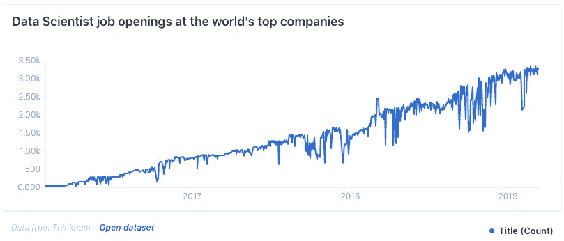
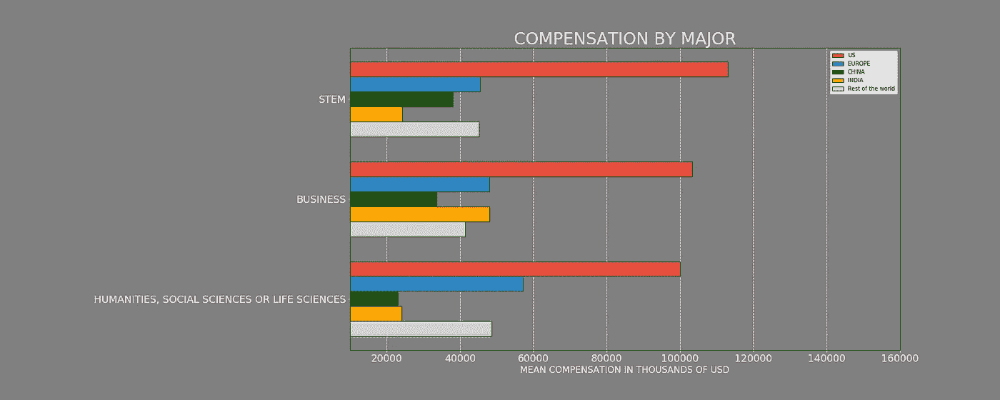
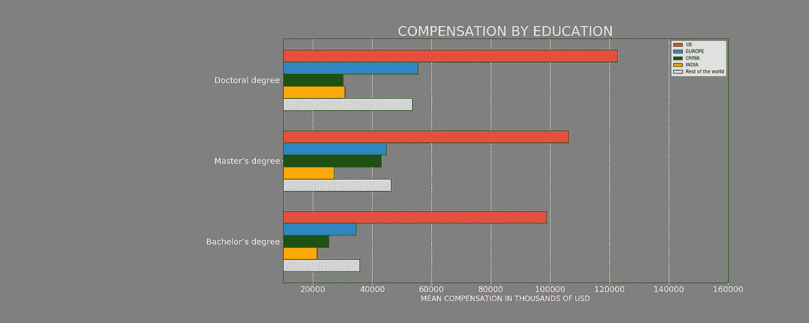
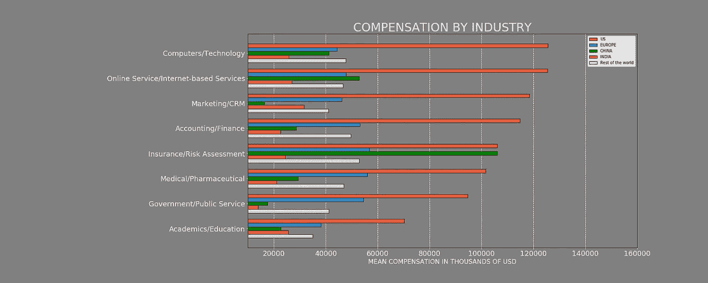
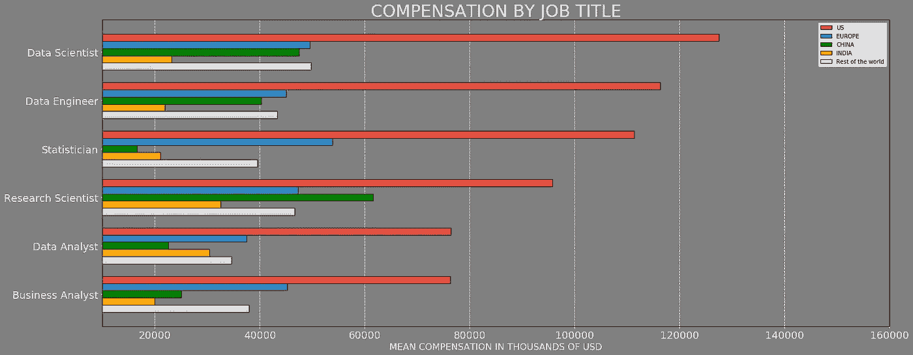
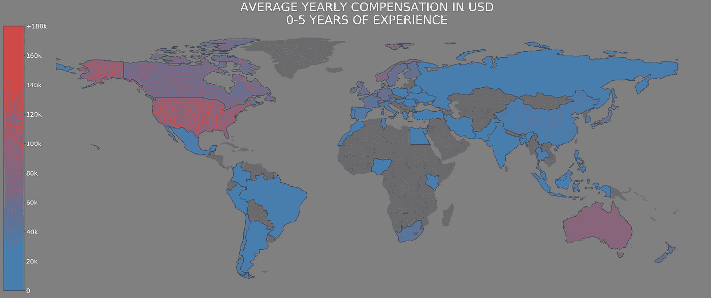
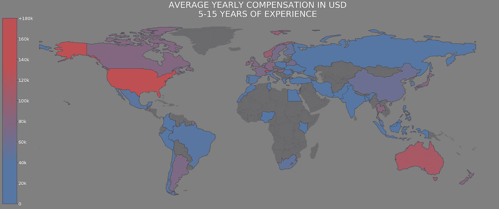
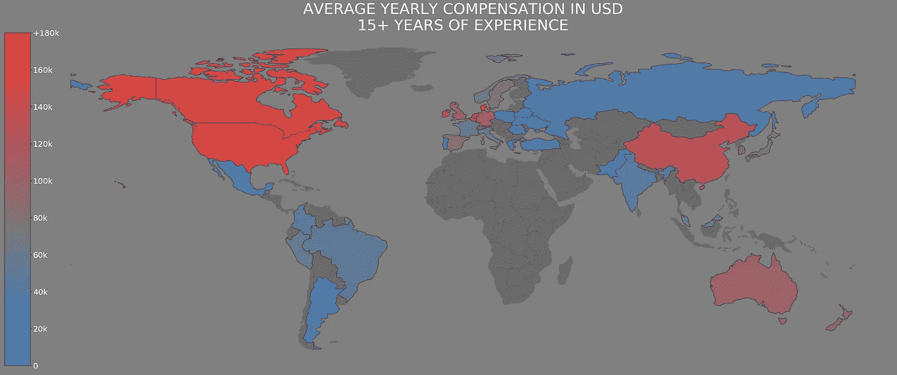

# 作为一名数据科学家，你能挣多少钱

> 原文：<https://towardsdatascience.com/saturncloud-ds-pay-1773952302b9?source=collection_archive---------37----------------------->

# **简介**

[SaturnCloud.io](https://www.saturncloud.io/?source=sm-1) 团队与 Reddit 的顶级数据可视化专家之一 [thiagobc23](https://www.saturncloud.io/published/thiagobernardescarvalho?source=sm-1) 合作，深入研究世界各地、各行各业的数据科学家的[薪酬，以及许多个人资料属性。(数据来源于](https://www.saturncloud.io/published/thiagobernardescarvalho/data-scientists-compensation/ds_jobs/ds_jobs.ipynb?source=sm-1) [Kaggle DS & ML 调查 2018](https://www.kaggle.com/kaggle/kaggle-survey-2018) )。

您可以在此查看和使用我们的笔记本:

[数据科学家报酬](https://www.saturncloud.io/published/thiagobernardescarvalho/data-scientists-compensation/ds_jobs/ds_jobs.ipynb?source=sm-1)

点击*跑土星！*执行笔记本。

> 披露:我们让发布和分享笔记本变得非常容易

# 为什么要看这个？

在这篇文章中，你会对这个世界上发展最快的工作的实际收入有多高有一个很好的认识。也许你会得到一些想法，如何把你的职业塑造成你喜欢的东西，同时还能得到很好的报酬。

[Credit](https://www.reddit.com/r/dataisbeautiful/comments/b699un/data_science_jobs_at_2500_of_the_worlds_top/)

# **应该学什么？**

想象你又是一个孩子，你不知道该选哪个专业。

在美国，科学、技术、工程和数学(STEM)专业的平均薪酬往往比商业和人文科学、社会科学或生命科学专业的同龄人高出 20%。与此同时，在欧洲，分布完全相反，STEM 比他们的 HSSLS 同行少挣大约 20%。

一旦你选择了一个专业，你最终会面临选择是继续深造还是加入劳动大军。

# 你的岔路口时刻

想读研吗？有些人会指出，你会再花几年时间积累债务，放弃薪水；但是你的平均工资会高出 10-20%。你也将受到更多的教育，并开始做许多有趣的研究。

读研以增加你的收入潜力值得吗？

除非你留在学术界，否则你会(希望)在某个时候毕业，得到很多面试，一些工作机会，以及一个有聪明同事的工作场所。

但是哪个行业为其宝贵的数据科学家付出的代价最高呢？

# 按行业支付

这并不奇怪，但它是技术(计算机/技术&在线服务/基于互联网的服务)。如果你是一名拥有生物医学背景的数据科学家，你仍然有很高的收入潜力，可以留在你的领域内，尽管你的收入明显低于你在风投支持的科技公司 WeWork 的邻居。如果你留在学术界，你的收入基本上只有科技行业的一半。在这一点上，真正的问题是你的激情是什么。

你在申请目标行业的工作——但是这些不同的头衔是怎么回事呢？工作会有所不同，但报酬会有很大影响。

> 附注——我们正在[土星云](https://www.saturncloud.io/?source=sm-1)招聘员工，所以如果你有兴趣与一家构建下一代数据科学平台的科技公司合作，请查看我们的[职位空缺](https://www.linkedin.com/company/saturn-cloud/jobs/?viewAsMember=true)！您将与一些世界最大品牌的数据科学家合作。

# 按职位支付工资

这就像顾问对临时承包商；如果你想赚尽可能多的钱，做一个数据科学家，而不是统计学家。也就是说，这些其他角色的性质可能涉及一些非常有趣的工作，如果那是你正在寻找的。

现在让我们来看看地形。(平均年薪，以美元计)。

# 按地域和经验付费

如果你刚出校门，很少有地方能让你快速赚到六位数。

幸运的是，在你进入职业生涯的第一个五年后，这种情况会发生变化，那时你的薪水可以接近 20 万美元。

职业生涯 15 年:

所以你有它。数据科学家的全球报酬率。

# 祝你好运！

希望这有助于你的教育、职业和未来成为一名数据科学家。

[土星云](https://www.saturncloud.io/?source=sm-1)是一个数据科学平台，它实际上自动化了您的开发运营。从 Anaconda、NumPy 和 SciPy 的创建者来看，Saturn Cloud 使发布和共享笔记本、定制您的环境、在 GPU 上运行以及与您的工作流程的许多关键集成一起工作变得容易。

请登录 www.saturncloud.io 查看我们的网站，了解为什么有数十家科技公司在使用我们的平台。