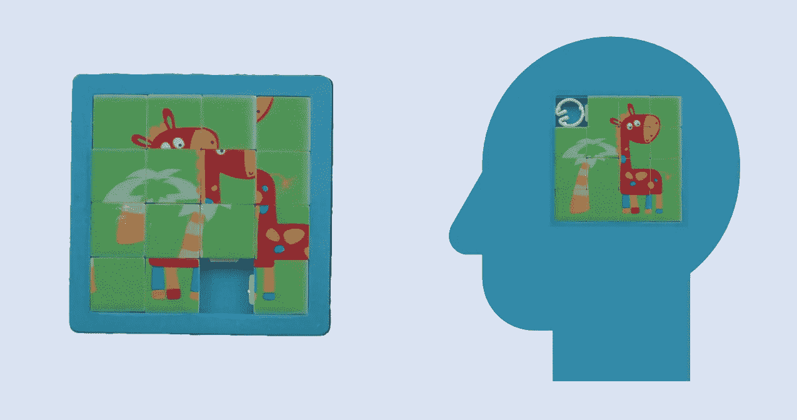
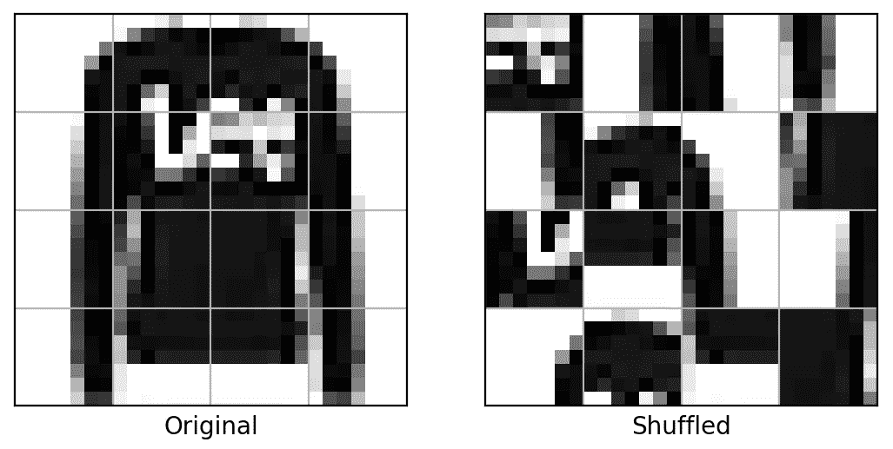
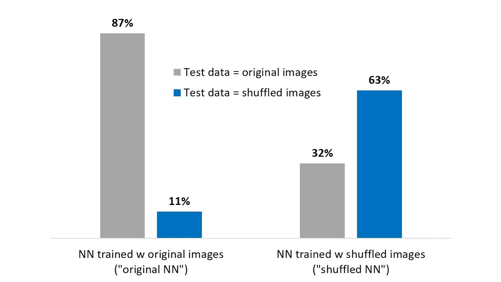
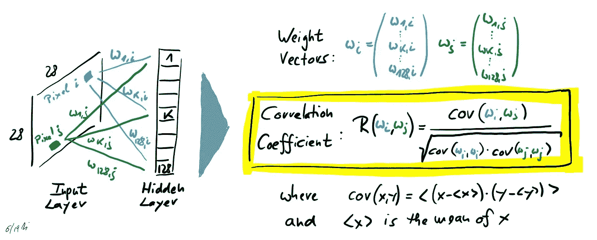
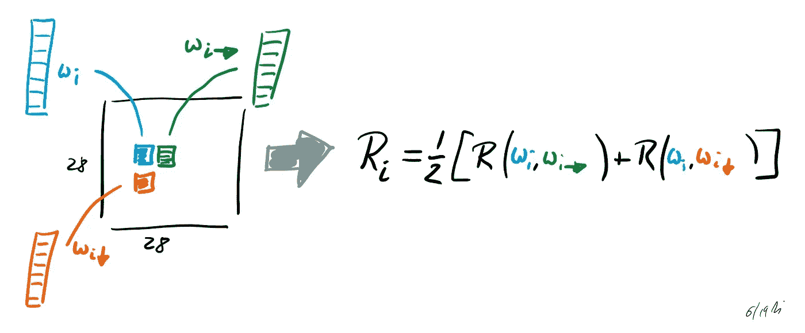
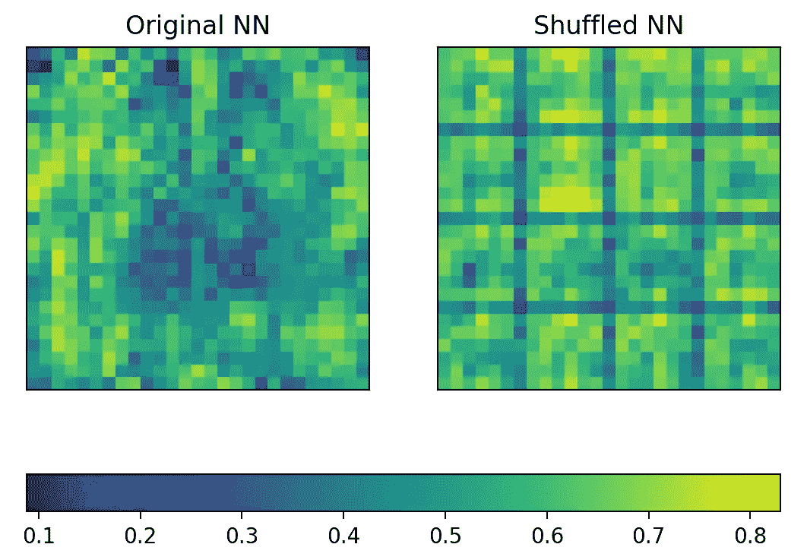

# 神经网络的学者综合症

> 原文：<https://towardsdatascience.com/savant-syndrome-of-neural-networks-2e8e95eaf704?source=collection_archive---------24----------------------->

Illustration by Frank Zielen (puzzle images shop.korsches-hits-for-kids.de)

## 配备了惊人的能力，但为特定任务量身定制的神经网络表现得像数字世界中的专家。在这篇文章中，我们通过挑战一个简单的马赛克图片图像识别模型，展示了他们强大的技能。我们发现了惊人的“雨人”行为。为了更好地理解，我们深入到网络的隐藏层，通过相关性分析可视化其逻辑，并看到数据的混合性质在神经连接中变得明显。

我喜欢通过简单的模型来研究基本问题，例如，神经网络(NN)可以在多大程度上复制人类行为。因此，让我们用一个“令人困惑”的任务来处理一个简单的用于图像识别的神经网络。

# 设置和传统培训

为此，我们依靠时尚-MNIST 数据集，该数据集包含服装图片(60.000 用于训练，10.000 用于测试)以及相关类别(套头衫、裤子、运动鞋等)，并设置一个神经网络进行分类。因此，我们可以输入一张图片，神经网络预测类别。我们使用一个完全连接的 3 层模型:一个 784 节点的输入层捕获 28x28 灰度图像(每个像素一个节点)，一个 128 节点的隐藏层，最后一个 10 节点的输出层用于分类。这个用例是众所周知的，例如，你可以在 TensorFlow Keras 框架的[教程中找到它。](https://www.tensorflow.org/tutorials/keras/basic_classification)

这个简单的神经网络的性能相当不错。经过 5 个时期(用 300，000 幅图像训练)后，它已经显示出 87%的准确度。

# 混乱的图像

现在我们来挑战 NN。为此，我们通过应用一个规则的 4x4 网格并随机洗牌来转换图像，以便每个块都改变位置(这被称为固定点自由排列或[错位](https://en.wikipedia.org/wiki/Derangement))。这种图像此后被称为“混洗”。

Example for an original and a shuffled Fashion-MNIST image

然后我们洗牌 10000 张测试图片，要求预测。准确率下降到 11%。这意味着 NN 任意选择类别(因为从 10 个类别中随机选择的命中率是 10%)。只是猜测而已！

这是可以理解的，因为混洗的图像对神经网络来说是全新的，并且从来没有建立神经连接来解开这样的输入。

# 用混洗的图像训练

但是如果我们把它倒过来会怎么样呢？我们用混洗图像(还是 60.000)训练网络，并验证原始和混洗测试数据集的性能。在下图中，您可以看到所有结果的组合。

Accuracy of NNs

用混洗图像训练的 NN(“混洗 NN”)获得 63%的性能，即大约 3 个图像中的 2 个被正确分类。这是一个非常好的表现，绝对了不起，如果你记住有！16 ≈ 7，7 万亿个选项来混洗一幅图像的 16 个网格块(这里是符号！n 表示第 n 个错位数)。

我们还注意到，正常图片的准确率仅为 32%，远低于混洗输入的预测水平。这可能是因为我们仅用错位来训练神经网络，即，没有图片的任何一部分保持在相同的位置。因此 NN 被触发来混洗输入数据，而原始图像不需要混洗。

# 通过相关性分析揭示神经联系

NN 必须学习两项技能:

1.  根据 10 个服装类别进行适当分类
2.  碎片图片的正确组合

对于第二种技能，NN 必须认识到输入图像由 4×4 块组成。所以我问我自己:被打乱的 NN 是否意识到被碎片化的图像喂养？

为此，我们将混合神经网络与“原始神经网络”(用原始图片训练)进行比较，并查看隐藏层的权重，该权重将所有输入像素与所有隐藏层神经元连接起来(我们使用完全连接的神经网络)。请记住权重的矩阵结构:每个像素都有一个关联的权重向量，所有权重都将像素连接到隐藏层神经元。大的正权重值(向量中的条目)意味着该像素是相应隐藏层神经元的相关输入，因为该像素的值被放大，而小的(零或负)权重值意味着该像素与隐藏层神经元不相关。

但是我们如何从权值中提取神经网络包含关于输入数据的网格结构的知识呢？为此，我们计算两个权重向量之间的相关系数 R，由下式给出

Definition of correlation between weight vectors of two pixels

相关系数值在-1 和 1 之间。如果两个像素在隐藏层中触发相似的节点区域，则相关权重的相关性往往较高，目标为 1。然而，如果两个像素寻址隐藏层中的不同区域，R 趋向于零甚至-1。

现在我们在最后一英里。我们假设网格结构反映在隐藏层中。因此，如果像素对位于同一网格块内，相邻像素的相关性应该是高的，如果像素位于不同网格块的边界内，相邻像素的相关性应该是低的。因此，我们为每个像素计算与其向右下方最近的邻居的相关性的平均值。

Definition of weight vector correlation between adjacent pixel pairs

如果我们将这两个 NNs 的值可视化，我们将获得以下热图:

Weight vector correlation between adjacent pixel pairs for original NN and shuffled NN

这表明，混合神经网络进化出一个单独的隐藏层，其区域专用于每个网格段，而原始神经网络考虑图像整体。

# 结束语

请注意，我们使用了一个简单的 3 层稠密神经网络用于分类。特别是，我们没有使用卷积网络。然而，我们的网络能够识别困惑的图像。

有人可能会认为，迷惑只是图像表现的一个额外自由度，即一只鞋可以显示为原始的，也可以显示为几个迷惑的变体，然而，所有这些图片仍然只是一只鞋(尽管迷惑的版本在现实生活中非常罕见)。但是如果是这样，NN 将整体处理输入图像，并且不显示分离的权重结构。

此外，我问自己，所应用的令人困惑的算法是否也是一种形式的[数据扩充](https://medium.com/nanonets/how-to-use-deep-learning-when-you-have-limited-data-part-2-data-augmentation-c26971dc8ced)。至少它不是像旋转或缩放那样的经典变换来放大训练数据量。

最后，随意浏览我的[代码](https://gist.github.com/frankzielen/1c8469652f9d1cc24e1a1e6fd99ac208)。所以你可以复制我上面提到的所有发现。用 Python 写的 TensorFlow Keras。

感谢阅读这篇文章！如果你喜欢这个神经会议，我会很高兴听到你鼓掌。但也许我的发现是一顶旧帽子？如果您能提供进一步的见解、替代方法或了解相关主题，请随时添加您的评论！