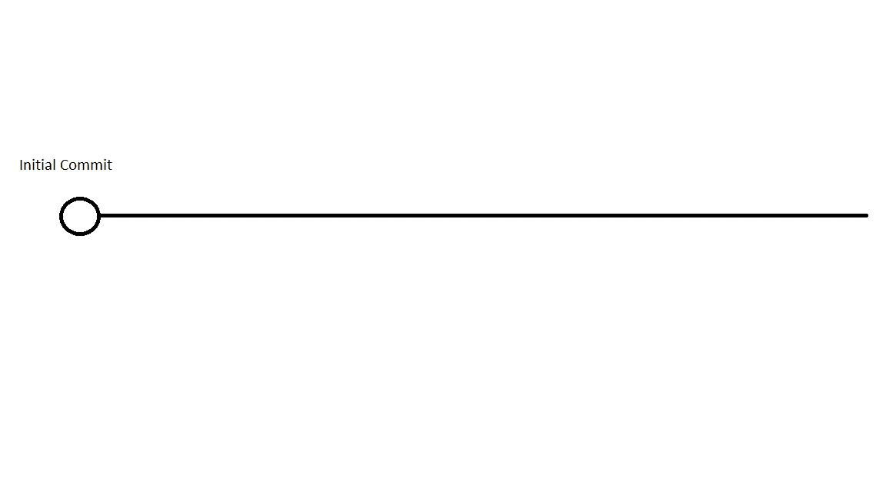
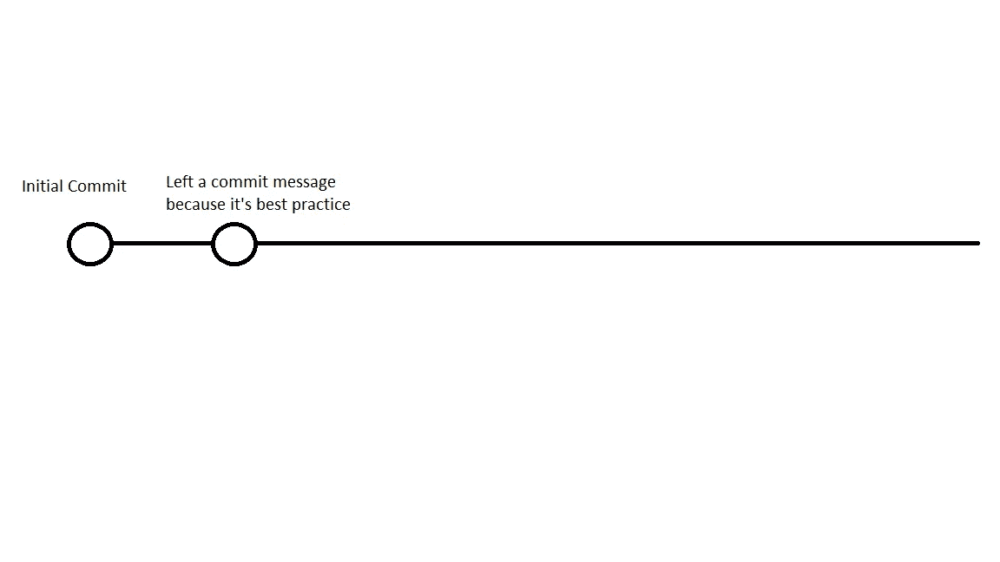
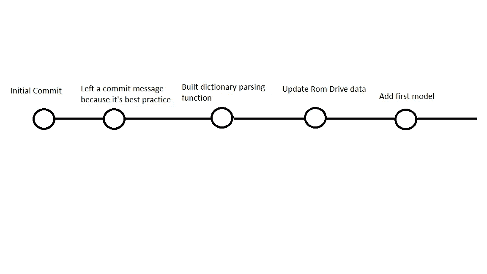
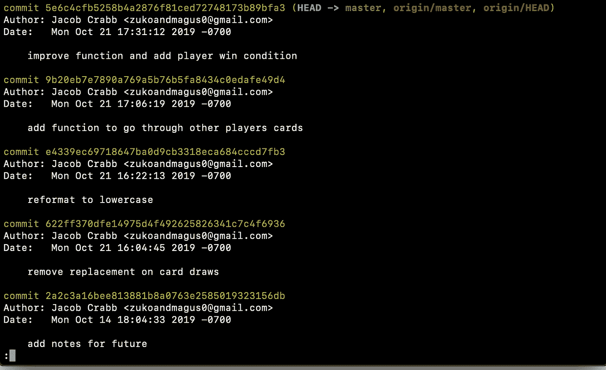
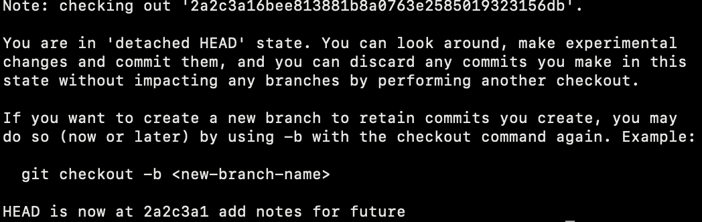
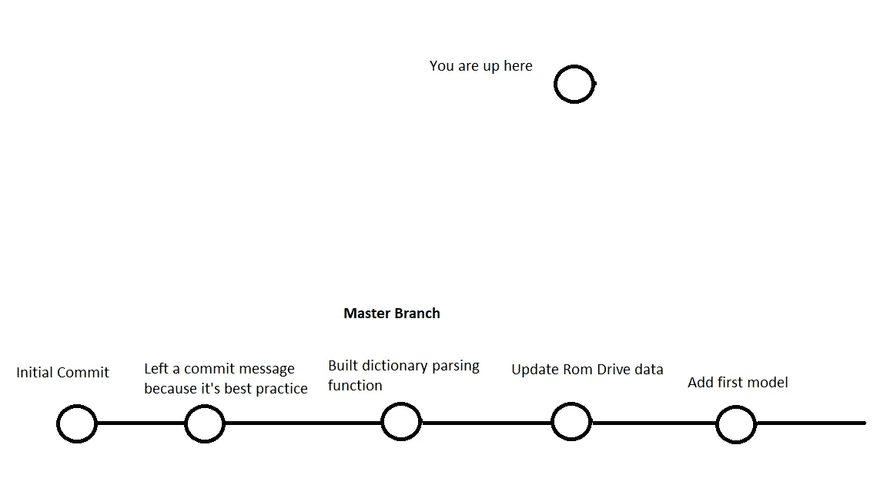
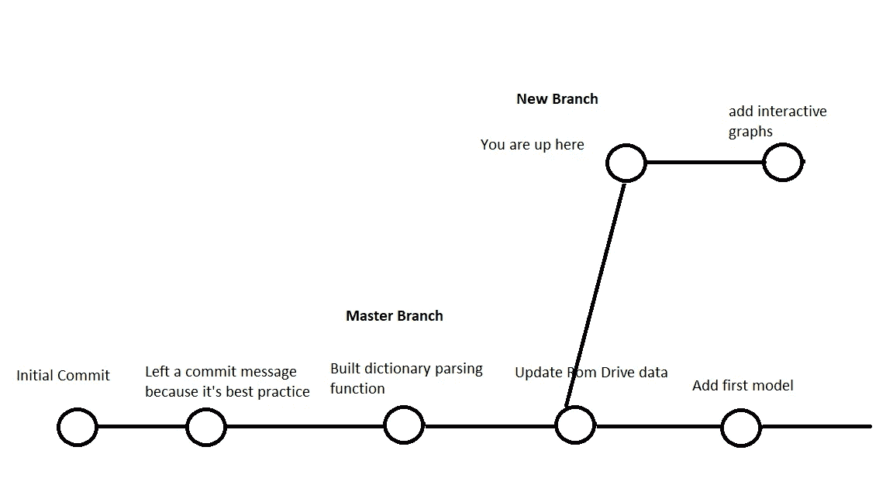

# 进入地牢前保存！Git 简介

> 原文：<https://towardsdatascience.com/save-before-entering-the-dungeon-an-introduction-to-git-8ec5f9fdda7?source=collection_archive---------34----------------------->


所以你是勇敢的冒险者，站在深渊的入口处，黑暗，未知的表面之下。你已经做好了所有的准备。你的包里装满了有用的药水、工具和滋补品。你磨快了你的刀刃，增强了你的盔甲。你鼓起勇气，穿过了这片土地上最臭名昭著的地牢的入口。你准备好了。

…但是如果你不是呢？即使是最勇敢的英雄也需要后备计划。你应该保存你的游戏，以防事情变得糟糕或者致命。

还有你，卑微的程序员，站在一个项目的开端，一个伟大的，未知的潜在未来的开端。你也应该保存你的游戏，用 Git！


Git 是一个分布式版本控制系统，用于在软件开发过程中跟踪源代码的变化。它是为协调程序员之间的工作而设计的，但也可以用来跟踪任何一组文件中的变化。

那么它是如何工作的呢？一旦你在你的机器上安装了它(如果你还没有的话，点击这里获取)第一步是创建一个 Git 库。当您在本地机器上构建项目时，您可能会将它放在某个本地工作目录中。Git 存储库只是一个启用了 Git 的目录。

有两种方法可以启动 Git 存储库。第一种是将现有目录转换成 Git 存储库，这是通过以下方式完成的:

```
$ git init
```

这将向目录中添加一个. git 文件，并允许您开始跟踪对文件所做的更改。第二种方法用于克隆现有的 Git 存储库:

```
$ git clone
```

从 [GitHub](https://github.com/) (一个用于共享项目和代码的网站)克隆仓库是非常普遍的，并且受到高度鼓励！在 GitHub 上创建一个空的项目资源库，然后将其克隆到您的本地机器上是非常正常的。

所以现在让我们开始跟踪一些变化吧！事实上，制作存储库本身就是一个跟踪变更。现在，您的存储库看起来像这样:



没什么了不起的，对吧？但是让我们为你的项目做一点工作。假设你花了几个小时在你的项目上，但是你不确定如何继续下去。现在是使用 git commit 保存您的工作的最佳时机。提交您的工作就像告诉 git 您想要将哪些文件添加到提交中一样简单:

```
$ git add <files you want to include in the commit>
```

添加您已经更改的任何文件，或者如果您不确定哪些文件已经更改，请使用:

```
$ git status
```

已修改的文件将以红色显示。一旦决定了要将哪些文件添加到提交中，请使用:

```
$ git commit -m "Left a commit message because it's best practice"
```

重要的是留下描述你所做的改变的信息，这样你未来的自己就能发现它们，以防出错。现在，如果你不得不回到这个“保存”它会更容易找到。我们现在可以想象您的存储库是这样的:



在任何时候，当您将变更提交到您的存储库时，如果您从 GitHub 克隆了您的存储库，您可以通过以下方式将您的变更推回到远程 GitHub 存储库:

```
$ git push
```

好的，很好！但是，假设你已经为你的项目工作了一段时间，你意识到别人，肯定不是你，犯了一个严重的错误，危及了项目。你知道这个错误是在他们更新“Rom 驱动器数据”时犯的，所以你想回到那个提交并修复它。



这可以通过使用:

```
$ git log
```

检查你以前犯下的罪行。这将显示类似这样的内容:



Feel free to email me. I don’t bite often :)

这里有很多信息。这些是以前的提交，从最近的开始在顶部。您可以看到每个提交的唯一 id、提交者、提交时间以及提交消息。为了返回到以前的提交，复制提交的唯一 id，点击“q”退出 Git 日志，然后使用:

```
$ git checkout <unique id>
```

您将会收到如下消息:



啊！你是个无头僵尸！不完全是。它说的是你不再在树枝上了。Git 中的流是在分支中建立的，而在新的存储库中只有一个分支，称为“主”它看起来像这样:



在超脱的头部状态下，你可以尝试其他事情，添加其他提交，随心所欲地自由实验。但是，如果您想要保存这些更改，您必须创建一个新的分支。这可以通过以下方式轻松实现:

```
$ git checkout -b <new-branch-name>
```

它创建了一个新的分支(“b”部分)，然后转移到它(“checkout”部分)。如果您在分离的 head 状态下发出此命令，它将自动使分支脱离您的当前状态。

就像我们这个大胆的冒险者穿过地牢，来到一个十字路口。他在走左边的路之前保存了他的游戏，在那里他找到了黄金和战利品，但是也许他也想知道如果他走右边的路会发生什么。所以我们做了一个分支:



如前所述，使用以下命令在分支之间导航:

```
$ git checkout <branch you want to go to>
```

使用 Git 可以做的事情太多了！开始学习的一个好地方是 [Git 文档](https://git-scm.com/doc)。愿你所有的版本控制都快乐而明亮！周三快乐:)