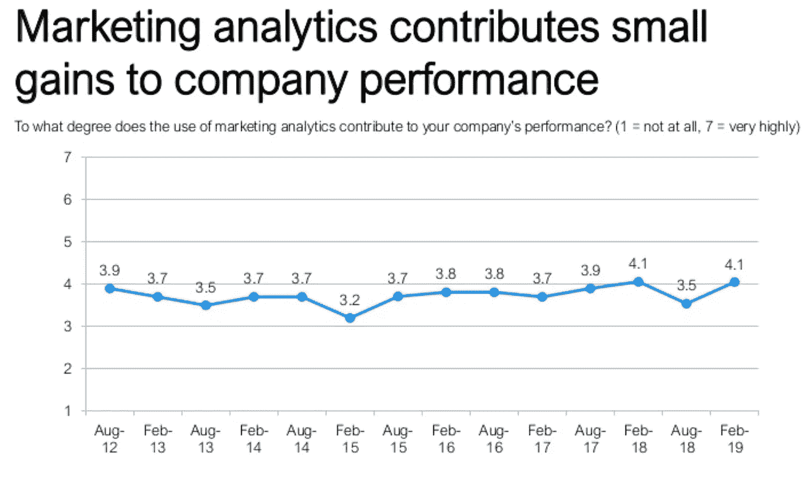
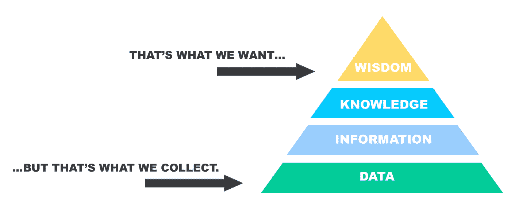
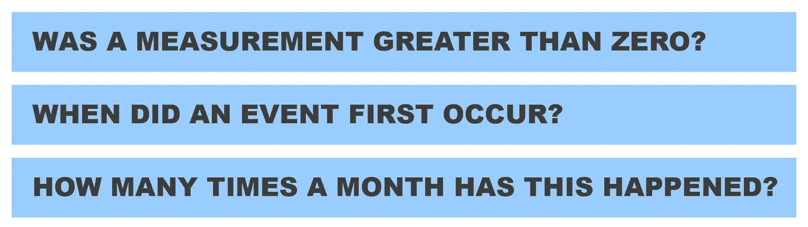
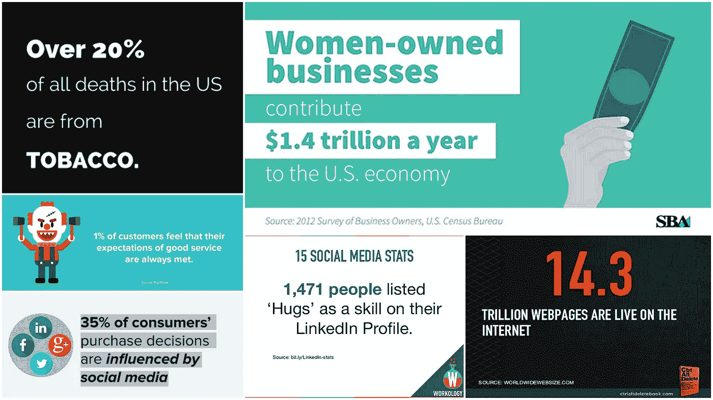
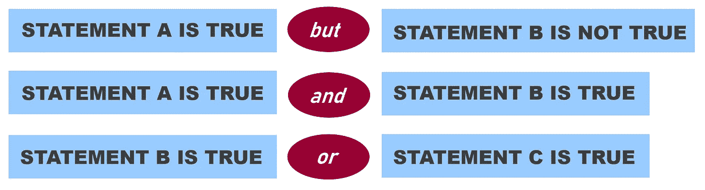
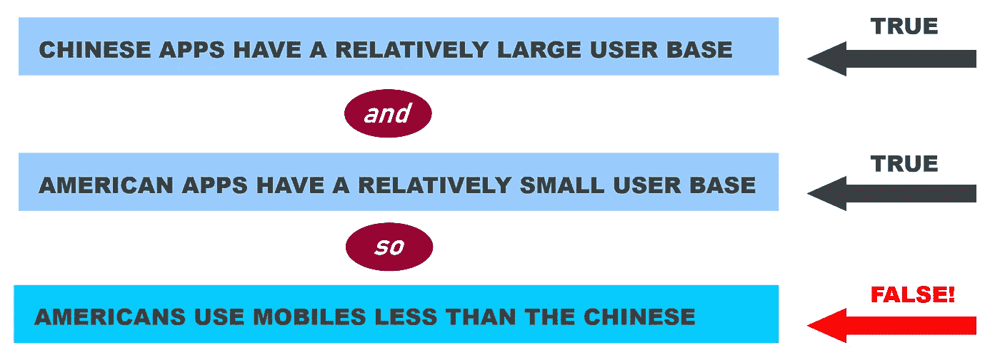
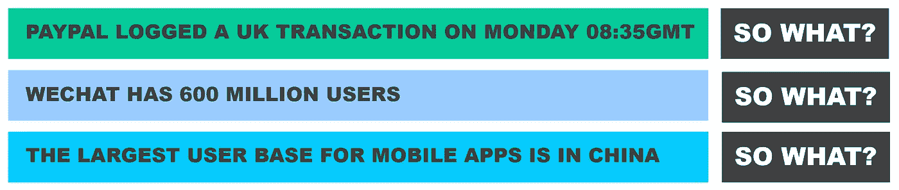

# 从垃圾箱中保存数据研究

> 原文：<https://towardsdatascience.com/save-your-data-study-from-the-dumpster-e4d4a78753fb?source=collection_archive---------23----------------------->

## 将数字转化为有用见解的秘诀

Source: Steve Johnson, Pexels

想象一下，你是一个热门的新移动支付服务的首席执行官。每天晚上，你都梦见杰夫·贝索斯买下你的公司，给你大把大把的钞票。但是为了让杰夫在乎，你需要尽快扩大你的用户群。怎么会？

决策总是归结为这类问题。我们应该如何做某事？*我们应该采取哪种行动？*

然而，即使淹没在数据中，你似乎也永远没有做出明智决策所需的信息。这篇文章不仅解释了为什么这种情况不断发生，而且实际上提供了一个解决方案。就在我们之间，这是我知道的最有用的东西。

有一点是肯定的，我们缺少的不是*的数字*。例如，在你想象中的移动支付公司，你会遇到大量看似深刻的统计数据，通常以图表的形式呈现，就像[这个](https://www.statista.com/statistics/744944/mobile-payment-platforms-users/):

它当然告诉你，在移动支付 app 中，微信的用户基数最大。

因为你已经在这个行业呆了至少两个月了，你知道支付宝和微信都主要针对中国市场。所以，看看这些列的相对大小，你就可以推断出使用移动支付的中国客户比世界其他地方的都多。

但差不多就是这样了。这张图表没有告诉我们的是:

## **一个超级有用的心智模型**

当寻求解决一个商业问题时，我们有一些——也许很多——关于如何解决它的潜在想法。我们对更多的想法持开放态度，但我们真正想要的是指出哪些想法可能效果最好。

为了找出回答这些问题我们需要知道的东西，使用一个叫做 DIKW 金字塔的心智模型是很有用的。

它的名字是你能知道的四层东西的缩写:数据、信息、知识和智慧。我们将很快分解每一层的含义。

但是最突出的一点是，并非所有类型的“知道”都是一样的——有些比其他的更有价值。

这里有一个很好的例子:尽管商业解决方案爆炸式增长，但营销分析仍未能给人留下深刻印象，在过去的六年里，它对公司整体业绩的贡献一直是微不足道的。

你不觉得奇怪吗，公司拥有所有这些数据，却一直在努力利用它们？

Chief Marketing Officer Survey, February 2019

进行调查的研究人员非常清楚需要改变什么:

> “企业应该先决定做什么，然后决定需要哪些数据，而不是创建数据，然后再决定如何处理这些数据。”

这看起来很简单，但是当我们看金字塔时，问题突然变得很明显:

**我们追求的可操作的洞察在智慧层，一路在顶端；但是我们为了获得洞察力而收集的东西是数据，就在底部。**

因此，要获得商业问题的有意义的答案，仅仅收集数据，甚至分析数据是远远不够的。这是一个从数据到智慧的过程。

拥有这样的路线图意味着你可以从一个业务问题回溯到你想要的那种数据。因此，在设计调查问卷或决定收集哪些数据的最初阶段，你就能知道以后需要什么。

考虑到这一点，你能想象如果从一个级别到下一个级别仅仅是一个具体的正式步骤的问题，那会有多好吗？

我说过这是我所知道的最有用的东西之一。

## **数据**

有了数据，你什么都不懂。

数据仅仅是观察的集合:计算机服务器日志；交易清单；项目的集合。在一无所知的情况下，我们从数据中获得的任何洞察力都将是处理数据的结果。

## **信息**

我们通过询问关于数据的可量化的问题来获取信息。一个简单但有用的经验法则是，信息本质上是计算数据点:

*为什么*或*如何*永远无法在数据上要求导出信息。所以，当我们获得信息时，我们知道了一些事情，但是没有什么有用的，因为我们缺乏背景。

看看这些杂乱的信息点。每个*看似*有见地，但实际上告诉你的很少，因为你没有任何参考点。

Useless.

## **知识**

当我们比较和对比两个或更多的单位或信息时，我们就获得了知识。请注意，它总是使用信息位，而不是数据位。要看到这一点，回想一下数字支付图表。

想想看，如果说:微信有 6 亿用户，Paypal 在周一 08:35GMT 记录了一笔英国交易，这将是多么毫无意义。

一个是信息点，一个是数据点；这两者不一致。

相反，我们统计了每个支付平台有多少用户。这是从数据中获得的信息。通过对这些结果进行排序，我们可以看出微信拥有最大的用户群。这就是知识——一个相关的事实。

更一般地说，从信息点获取知识的方法是使用逻辑量词进行推理:

请注意，您可以使用来自不同数据集的信息点。例如，我们的图表没有说明每个应用程序的用户群位于何处。微信和支付宝的客户大多来自中国，这是我们从别处得到的信息。

不过要小心！逻辑推理必须有效。例如，我们不能说下面的话，因为这个推论是错误的:

我看到很多研究、调查和分析都落入了这个陷阱:它们给出了一个结论，却从未停下来考虑其他同样有效的解释。(*经济学家*是一个特别的惯犯。)

通过列出不同的可能解释，你会显得更有洞察力，而不是直接选择你碰巧更喜欢的那个。

## **智慧**

所有先前类型的认知都有一个共同的特征；他们都可以被两个简单的词击垮:**那又怎样？**

相比之下，智慧是一种可操作的洞察力。你可以把它区分开来，因为它不能被类似地击倒:

智慧是非常可取的，因为它是将数据研究变得有用的唯一结果。它通常解决因果关系问题——比如*如何*和*为什么*——这些正是我们真正想要回答的问题。

解决商业问题的逻辑方法从来都不是只有一种，因为总会有几种相互竞争的可能答案。不过，这里有两个从知识到智慧的有用的提示。

第一，智慧来源于知识，再次使用逻辑量词，这次是在知识陈述之间。像以前一样，试图混淆知识和信息是没有用的。

第二，你不可能从一个数据集中获得所有需要的知识。

请再读一遍最后一句话。无论你的客户调查、每日网站流量日志或 Kaggle 数据集多么精彩，这可能都是不够的。你要么需要更多的信息(来组合成新的知识)，要么需要预先获得的知识。

## **综合考虑**

到目前为止，我们已经意识到，在做决策时，我们追求的是金字塔顶端的东西，而我们实际收集的数据是金字塔底部的东西。如果没有事先的计划，我们很可能永远不会收集到正确的数据来考虑完整的逻辑推理链。

因此，为了用数据驱动的方法评估行动的替代过程，您需要沿着支持每个行动的逻辑链回溯:

首先，这将给您一堆知识陈述，由逻辑绑定在一起。但是每一个都可以分解成一系列的信息陈述。这些会准确地告诉您需要计数的内容，直接建议您应该收集哪些数据点。

然后，一旦你真的收集了数据，你就开始按照你的步骤。这时你会发现数据、信息或知识是否在现实中积累起来:

也许你认为瞄准低收入客户是个好主意，因为他们更喜欢支付应用程序，因为交易成本更低。但随后你收集并统计了数据，得到的信息显示，使用支付应用的大多是中等收入人群。或者你可能认为在富裕的顾客中，拥有更多信用卡的人会对数字支付持更好的态度。通过回溯，你现在意识到你想知道你的潜在客户持有多少张信用卡。一旦你对数据进行了统计和分类——你所获得的知识表明这实际上没什么区别。

肯定，这些瞄准的想法原来是哑弹。但是你能够预先知道你需要什么数据来判断这些选项，因为你已经设计了从行动过程到数据的完整路径。

## **遗言**

这篇文章几乎没有发表，尽管我已经写了几个星期了。当我把早期的草稿给我信任的聪明读者看时，他们有点畏缩:

“太抽象了”。他们说。

"此外，没人关心数字支付."

心智模型*是*抽象的，但这并没有降低它们的有用性。知道要问哪些问题具有难以置信的商业价值，我袖手旁观我说过:DIKW 金字塔模型是一种生成可操作见解的实用工具，因为它穿透了从数据层到智慧层的迷雾。

所以我还是发表了这篇文章。