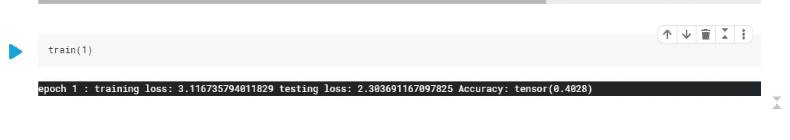
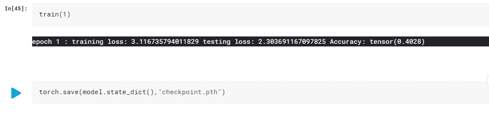
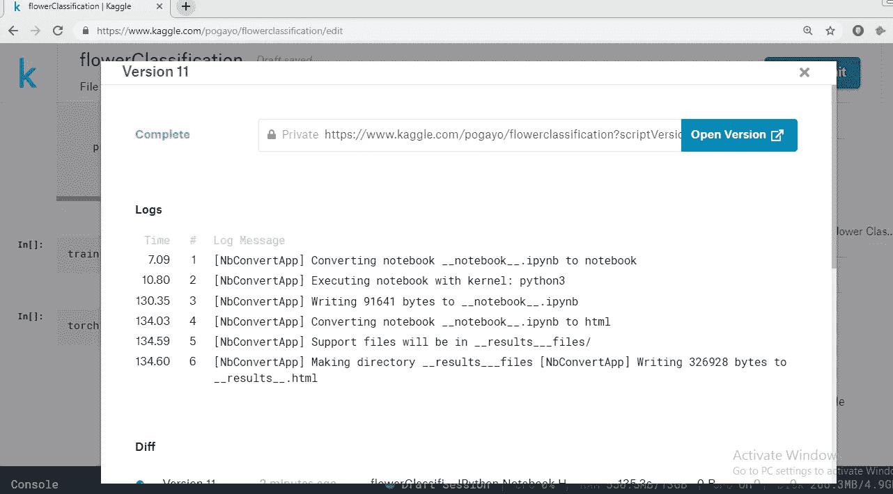
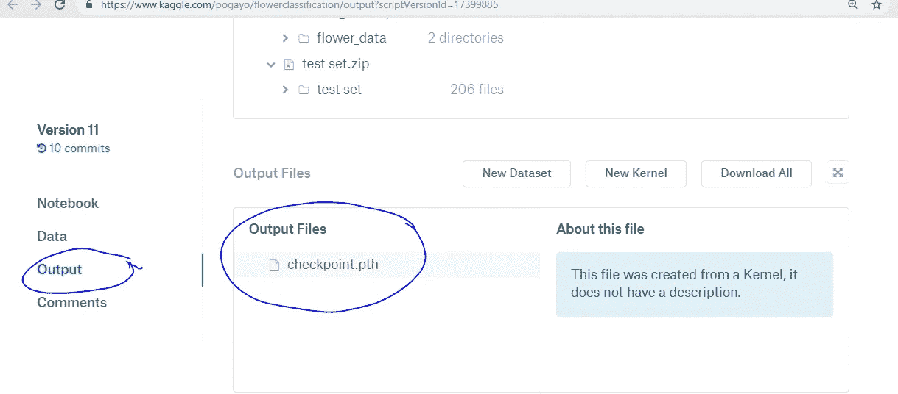
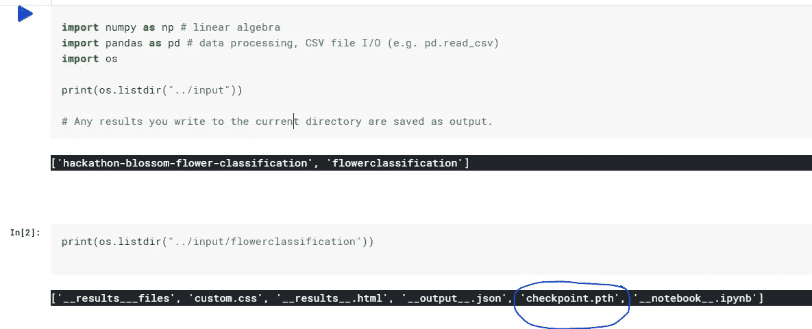
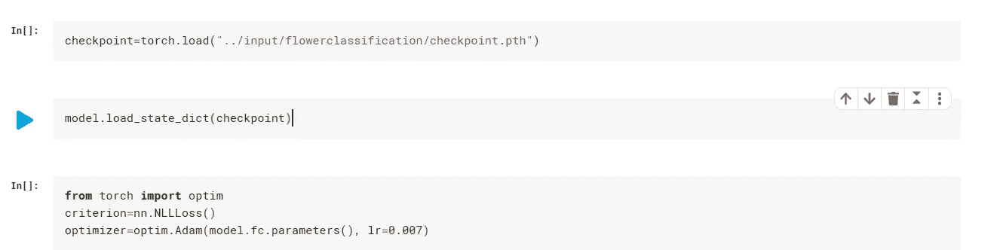

# 在 Kaggle 中保存和加载 Pytorch 模型

> 原文：<https://towardsdatascience.com/saving-and-loading-pytorch-models-in-kaggle-3dadc0af1bd9?source=collection_archive---------21----------------------->

## 在 Kaggle 上训练 Pytorch 模型的初学者指南

[source](https://www.google.com/url?sa=i&source=images&cd=&ved=2ahUKEwiSttqlub7jAhVOQBoKHdbLCFwQjRx6BAgBEAU&url=https%3A%2F%2Fwww.jessicayung.com%2Fgetting-started-with-kaggle-1-text-data-quora-question-pairs-spam-smses%2F&psig=AOvVaw2Pf-0QVvxFFJh1xMOqY_EZ&ust=1563537857106408)

你听说过卡格尔很棒。你也在努力提高你的数据科学技能，并开始深度学习或刚刚开始 Kaggle。

就在你认为你正在 Kaggle 上训练你的深度神经网络的时候，你卡住了。

# 那么问题出在哪里？

所以你已经知道你可以保存 Pytorch 模型(严格地说，是状态字典)并在以后方便的时候加载它们。你已经在 Kaggle 上训练了你的模型并保存了它。当您需要访问保存的模型时，您就是找不到它，这可能会迫使您重新开始。😓😓😓

我们都知道训练一个模特可能是一个非常痛苦的过程，所以不得不从头再来一遍不是一个选择。别担心，我(和卡格尔)抓住你了！

在本文中，我将向您展示如何通过 5 个简单的步骤加载您训练过的 Pytorch 模型。

## 假设

我将假设:

1.  你已经知道如何训练一个模特了。
2.  你理解 Pytorch 的模型状态字典的概念。查看[该资源](https://medium.com/udacity-pytorch-challengers/saving-loading-your-model-in-pytorch-741b80daf3c)了解更多信息。
3.  您至少对如何保存和加载 Pytorch 模型有了基本的了解。如果没有，[这个帖子](https://medium.com/udacity-pytorch-challengers/saving-loading-your-model-in-pytorch-741b80daf3c)是一个很好的起点。

我正在进行的项目以及随后撰写这篇文章的需要都源于我对 [Udacity Pytorch 挑战赛](https://www.udacity.com/facebook-pytorch-scholarship?source=post_page---------------------------)的参与。

第一步:训练你的模型

在这个例子中，我编写了一个名为 train()的函数，它将历元数作为参数。

Step 1: Training the model

**第二步:保存你的模型**

Step 2: Save your model

**注意**:上述方法(仅保存状态字典)可能不是最好的，因为当您加载时，您将需要构建一个与您保存的模型具有相同架构的模型。

**第三步:提交你的内核**

Step 3: Committing your Kernel in Kaggle

完整的提交看起来像什么。

Successfully completed commit

您可能需要等待几分钟，Kaggle 服务器才会发布您保存的文件。然后您可以打开您的内核，您将在输出部分看到您的文件，如下所示。

Viewing the saved checkpoint file

**第四步:添加你的内核作为数据集**

这还不是结束。转到最右边的 **+dataset** 选项卡，点击它来添加您的内核输出文件作为数据源。

Adding your kernel output as a dataset

您的内核现在被列为数据源。打印输入文件夹的内容会将您的内核列为来源之一。

有关如何使用代码查看和访问输出文件，请参见下图。

Accessing your saved output file

要在侧边栏上查看您的文件，单击 Workspace -> input，然后您会看到您的内核被列为输入目录中的内核下的一个文件。

**第五步:加载你的模型**

现在你知道如何访问你保存的检查点，你准备好加载你的重量！

确保您构建的模型与您保存其状态字典的模型具有相同的架构。有一种方法可以将架构和状态字典都保存在一个文件中，这样你就不用去记忆了，但这不是本教程的重点。

Loading the state dictionary to your model

就是这样！

我希望这个->😃😃😃是您成功加载第一个模型后的心情。勇往直前，繁荣昌盛！当然，请在下面的评论区留下您的反馈。