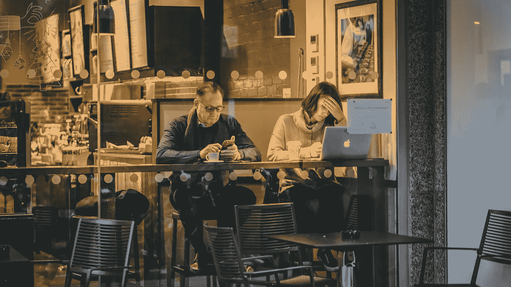

# 从假货和人工智能滥用中拯救民主

> 原文：<https://towardsdatascience.com/saving-democracy-from-fakes-and-ai-misuse-15b831f5c870?source=collection_archive---------35----------------------->

Photo by [abi ismail](https://unsplash.com/@abiismail?utm_source=unsplash&utm_medium=referral&utm_content=creditCopyText) on [Unsplash](https://unsplash.com/s/photos/cafe-brussels?utm_source=unsplash&utm_medium=referral&utm_content=creditCopyText)

今天是柏林又一个下雨的星期五下午。下午 4 点整，我的一位亲爱的同事来到我工作的地方，带我去喝杯咖啡。一边走，一边避开地板上的小水坑，她说:“昨天我看了一部关于这对夫妇的电影。在一起 9 年还爱着对方，分手了。女孩在另一个地方有一个惊人的工作机会，而男孩不想要异地恋。严重交配，令人心碎。”一件事接着一件事，突然我说:“听着，不管大家怎么说。我相信，当两个人相爱，真心相爱，一切都可以解决。他们可以克服一切。我理解并尊重他人的观点，但爱是我所做的一切的核心。“但是，伙计，真的，为什么你不能从你周围的其他人的经历中培养自己。你难道看不出生活是残酷的，意识到爱是不够的吗？”，她回答道。

与你已经想到的相反，这篇文章不是关于爱情的。这篇文章是关于民主、观点和不可理解的人工智能技术被低估的缺点。你看到我们喝咖啡的时候发生了什么吗？即使我没有告诉你，我的同事和我，我们都有非常有效和强有力的论点。问题原来是概念的定义。我们可以把它留在那里，然后继续前进。但是我们没有。我们是开放和好奇的。我们决定花几分钟时间试着更好地理解对方。结果如何？对我们双方来说都是重要的教训，共同的现实让我们能够继续沟通。

如今，我们中的许多人根据我们在新闻中看到的东西、我们在媒体上读到的东西、instagram 上展示给我们的广告或一些有影响力的人说的话来定义我们的概念和我们的现实是什么样子的。尽管人类总是自然而然地选择与认同我们世界观的人和想法互动，但这是历史上第一次如此强烈地强化我们的身份。只需在谷歌搜索为什么爱情不够，统计会出现的文章数量。

让我们以丽莎为例。丽莎是一名 30 岁的女同性恋者。她住在纽约的一个时尚街区，阅读《纽约时报》，支持民主党，最近还在推特上谈论大麻合法化。如果我们要推广一个关于进步政治的新博客，丽莎将是我们的完美搭档。Lisa 可能会用她的 iphone 打开我们的博客。她可能会读几篇文章，欣赏它们，并幸运地与她在脸书的朋友分享一两篇。她的朋友可能也会喜欢它们。他们可能属于同一个社交圈。在打开 Lisa 分享的内容后，这种行为会转化为数据，并输入算法来预测 Lisa 的朋友是否对另一个类似的事情感兴趣。

你知道这是怎么回事吗？今天比以往任何时候都更难逃避对我们身份的确认。我们喜欢它。我们的自我喜欢它。我们的孤独感减少了。但是我们个人和集体必须付出的代价是高昂的。

就个人而言，我们最终会为缺乏与其他世界观和经验的互动而付出代价。我们因此失去了多少个人成长？你还记得我喝咖啡的时间吗？总的来说，代价是社会凝聚力的崩溃和民主制度面临风险。我们不再能在我们的政治体系中找到迫切需要的共同点。我们避免任何持相反观点的互动。它们威胁着我们的身份，我们的自我。它威胁着我们。我们开始怀疑我们是否一直站在错误的一边。但是，即使我们愿意敞开心扉，对他人的立场感到好奇，也很难做到。我们不再具备积极参与这种对话的技能。我们失去了工具。我们的数字生活不是为此而设计的。

但是让我们再深入一层。如果你看到的和读到的都不是真的呢？如果我们正在消费的信息，以及通过不透明的算法得到强化的信息，是虚假的，或者是对现实的过度简化，那该怎么办？如果给我们提供这类信息的目的是为了获得政治权力呢？现在它开始变得不仅可怕而且危险。

一旦我们把眼睛从屏幕上移开，体验这个世界，我们看到的并不像我们想象的那样客观。如果我们走出去，我们消费的信息是假的，被操纵的，或者是我们复杂社会的过度简化，现实不再与我们被鼓励相信的相匹配。我们不再知道什么是真实的，什么不是。这正是我们感到最孤独的时刻。作为一种反应，我们倾向于全力抓住自己的身份，避免与相反的观点有任何接触。媒体向我们展示了一个现实，如果我们想继续成为我们团体的一部分，我们就必须捍卫它。我们注册了一个现实，我们不想退订。

民主的最高目标之一是辩论并以辩论取胜。一个健康的民主制度中的政治家希望说服人们一条需要采取的特殊道路，以通过争论来克服我们当前的挑战。但是那艘船很久以前就起航了。今天的政客们试图用金钱和扭曲的现实而不是争论来赢得胜利。社交媒体和人工智能的滥用是做到这一点的完美结合。为了拯救民主，我们必须认识到，我们离其最高的崇高目标还差一步。我们首先需要解决基础上的问题:我们愿意并有能力倾听其他意识形态的人，并对他们保持建设性的好奇。

大概深度假货和假新闻的解药不是只能在另一个算法里找。或许这更多的是与我们的人性联系在一起。我们需要开始对我们的信仰充满信心，并意识到没有一个单一的真理，而是许多；我们都是能力有限的人，没有机会拥有客观的真理。或许这也与赋予不同的政治观点权力有关，让它们在数字领域有发言权。只有到那时，我们才能面对我们现在的现实，而不会对未知感到恐惧，也不会对被过分美化的过去感到怀旧；极右翼和民粹主义政客的众所周知的秘方。

卡洛斯·阿胡马达是宇航员&公司的数据科学家，这是一家总部位于柏林的公司，旨在帮助政治和社会行为者在数字空间进行有效沟通。他们的使命是支持这些行动者使用技术和数据来建立对民主话语的信任。