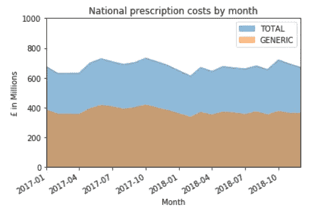
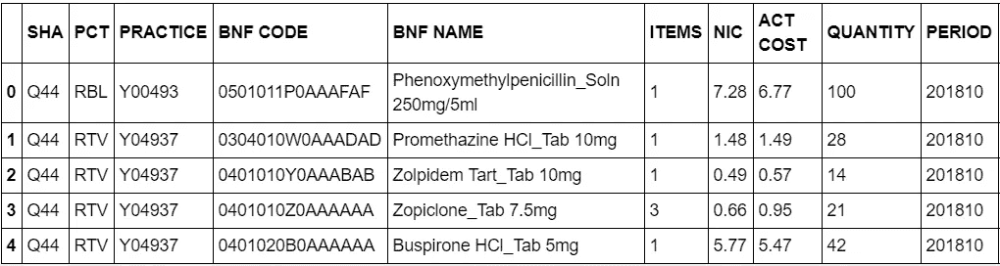
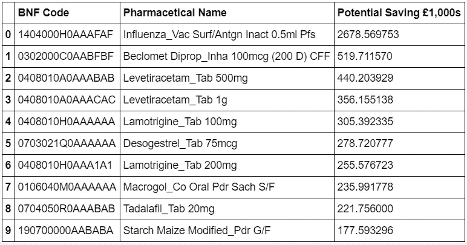

# 用熊猫为英国国民保健服务节省数百万英镑

> 原文：<https://towardsdatascience.com/saving-millions-for-the-nhs-with-pandas-338341fea340?source=collection_archive---------13----------------------->

Photo by [Debbie Molle](https://unsplash.com/@djmle29n?utm_source=medium&utm_medium=referral) on [Unsplash](https://unsplash.com?utm_source=medium&utm_medium=referral)

# 介绍

自 2010 年 data.gov.uk 创立以来，英国就有了开放数据的倡议。9 年后，我们现在在网站上有大量可浏览的数据集，可以下载并用于您自己的分析。

其中一个较大的数据集是 [GP 实践处方数据](https://data.gov.uk/dataset/176ae264-2484-4afe-a297-d51798eb8228/gp-practice-prescribing-data-presentation-level)，每月约有 1000 万行数据。对于普通的电子表格来说，这需要处理大量的数据，所以像[熊猫](https://pandas.pydata.org/)这样的工具就派上了用场。Pandas 是 python 的一个数据分析库，可以处理数百万行数据，并对它们进行统计分析，以尝试提取有用的信息。

# 我们发现了什么？

全英国国民保健服务的总处方支出约为每月 7 亿英镑。它每个月都在上下波动，但是它保持在同一个值附近。在这 7 亿美元中，超过一半的支出用于非专利药物，其余用于品牌药物。完整的逐月分析记录如下:

 [## Simon h10/NHS-笔记本

### NHS 时间序列分析——Jupyter 笔记本](https://github.com/simonh10/nhs-notebooks/blob/master/nhs-generic-branded-time-series.ipynb) 

需要明确的是，品牌药和仿制药的平均成本非常相似，而且在很多情况下，标有品牌的药物比同等的仿制药便宜。但是这个平均值隐藏了大量的细节。

Total Prescription costs by month

如果我们看原始数据，你会看到它是如何呈现的，以及我们可以从中提取的信息。初级保健信托和个人处方实践是有用的信息，将在未来的地理分布分析中使用，但在本次分析中将被忽略。这种分析的主要信息是 BNF 代码、实际成本和数量。

First few rows of the raw prescription data available.

## BNF 什么？

自 1949 年第一版以来，BNF 或英国国家处方集一直是医生手边的基础医学信息。它每 3 年出版一次，有多种数字格式。该出版物的一部分是编码标准，描述了通过国民医疗服务体系提供给患者的每一种药物。它遵循标准的层级结构，这对于分析药物组的分配是有用的，牛津大学有关于这方面的优秀资源。

 [## 处方数据:BNF 代码

### OpenPrescribing 从 NHS Digtal 和 NHS Business Services Authority 获取开放数据集，并使人们更容易…

ebmdatalab.net](https://ebmdatalab.net/prescribing-data-bnf-codes/) 

BNF 编码的一个特点是每个编码描述了一种获得等效仿制药的 BNF 编码的方法。BNF 代码的最后两个字母给出了通用等效物的强度和配方代码。例如

*   040702040 biac(***AM)****—Tradorec XL 片 300mg*
*   *040702040 aa(***AM)(AM)*—**同等通用版本*

# *我们给自己设定的挑战*

*我们能否通过将一些药物转换成使用非专利药而不是品牌药来为国民保健服务系统节省一大笔钱？我们用于计算的源信息都包含在这个数据集中。*

*使用这个单一数据集，我们仅限于:*

*   *只考虑已经由至少一个 NHS 处方实践开出的仿制药。*
*   *使用品牌和非专利药物的现有定价，因为它已经由 NHS 进行了成本核算。*

## *我们是如何进行分析的*

*我们在 2018 年 10 月随机选择了一个最近的数据集，并以下列方式处理了数据:*

*   *我们为每种药品生成了等效的通用代码，并标记了它是否已经是一种仿制药。*
*   *我们为每个通用 BNF 代码创建了所有数量和所有成本的总和，一组总和用于品牌等价物，另一组用于通用版本。*
*   *我们计算了同等品牌药物和非专利药物之间的单位成本差异，并将其乘以所开品牌药物的数量。*
*   *这就造成了对每一种仿制药的超额成本计算，而在这种情况下也开了品牌药。*

# *结果呢*

*如果所有可能的仿制药替代品牌药品，将为 NHS 节省 11，347，859.11 英镑，每月仅超过 1，100 万英镑。这是为所有可能的产品提取所有可能的节约。如果我们只取了 10 种最节省成本的药物替代品。*

**

*计算出替换这些品牌产品的总成本，我们每月将节省 5，469，671.30 英镑，即大约 550 万英镑。*

# *结论*

*要明确的是，我不是一个健康专业人士。我们在此概述的成本节约只是一个数字分析，并没有考虑到处方或配药实践可能做出的任何医疗决策。*

*考虑到 NHS 每月在处方上的花费，我们只能在处方费用上节省 1-2 %,我认为他们在降低药物费用方面做得很好，应该对他们已经做的工作给予高度赞扬。*

*有关用于这些计算的完整分析和注释代码，可以在以下位置找到该项目:*

* [## Simon h10/NHS-笔记本

### NHS 仿制药与品牌成本节约分析。

github.com](https://github.com/simonh10/nhs-notebooks/blob/master/nhs-prescription-analysis.ipynb) 

# 进一步分析的方向

这只是触及处方数据集的表面，还有很多事情可以做。以下是我考虑对该数据集进行的一些未来分析:

*   使用数据集中的地理信息创建健康状况流行的热图。例如抗抑郁药、他汀类药物、糖尿病等。
*   找出一贯偏爱品牌药而非仿制药的做法。
*   使用美国和 SNOMED 数据集计算美国医疗保险系统比国民保健系统多支付多少同等药物。
*   确定仿制药可用但目前未在 NHS 中使用的品牌药物。*