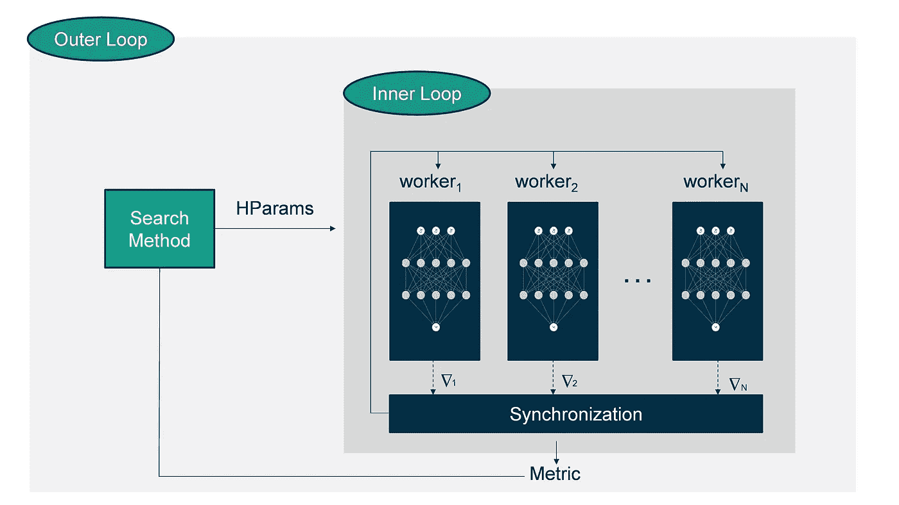
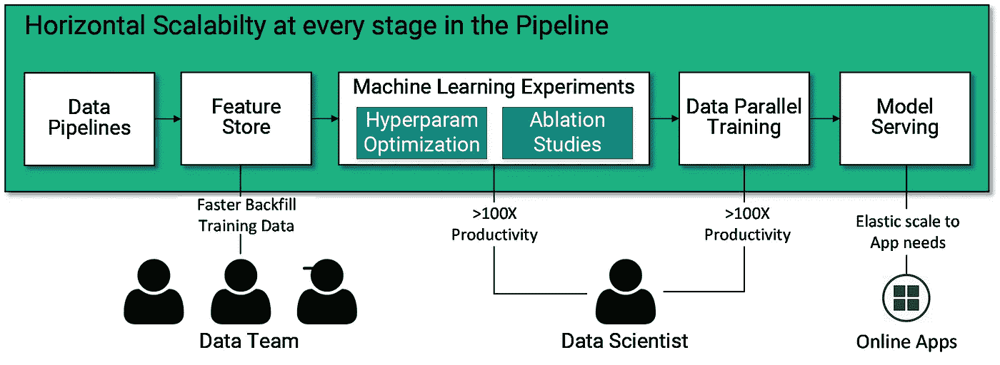
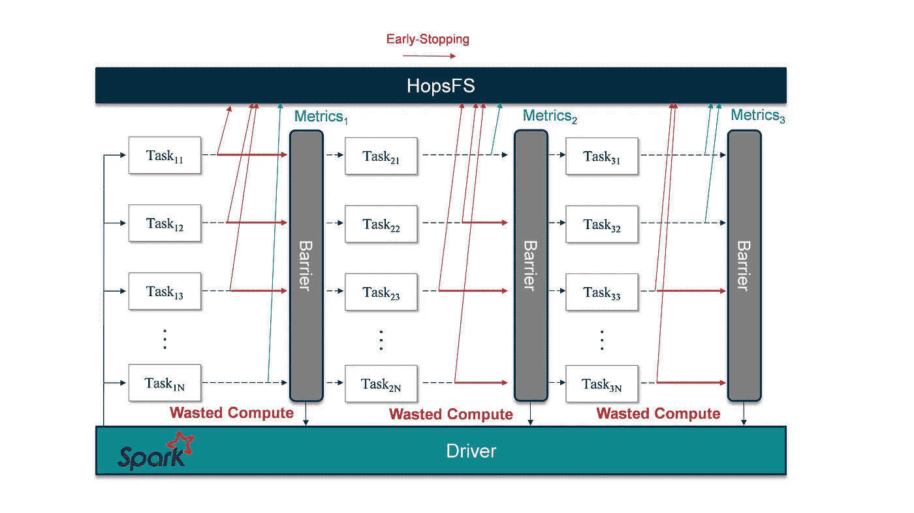
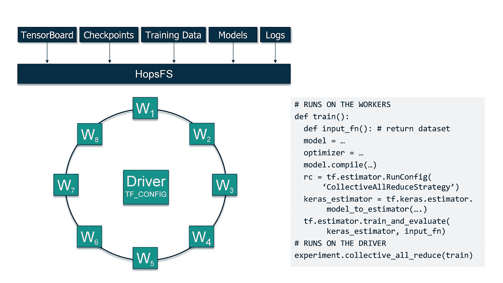

# 向 PySpark 的异步搜索问好

> 原文：<https://towardsdatascience.com/say-hello-to-asynchronous-search-for-pyspark-64c692a05595?source=collection_archive---------32----------------------->

# PySpark 异步搜索简介

> **“与计算成比例的方法是人工智能的未来”**[***【1】***](https://www.youtube.com/watch?v=EeMCEQa85tw) **“这两种(通用)方法认为..规模……是搜索和学习。”**[***【2】***](http://www.incompleteideas.net/IncIdeas/BitterLesson.html)

Rich Sutton 教授——强化学习之父

TLDR；Hopsworks 使用 PySpark 在许多容器上并行化机器学习应用程序，如果您需要的话，可以包含 GPU。PySpark 的基于阶段的执行模型与用于分布式训练的最新方法 Collective-AllReduce 配合得很好，但与超参数优化配合得不太好，在超参数优化中，最新方法涉及异步定向搜索。以前，为了利用最先进的超参数优化，研究人员使用了像 Ray 这样的[框架，但在这篇博客文章中，我们将这一能力引入到我们的新框架](https://medium.com/riselab/cutting-edge-hyperparameter-tuning-with-ray-tune-be6c0447afdf)[玛吉](https://github.com/logicalclocks/maggy)中，该框架为黑盒子超参数优化提供了 PySpark 上的异步定向搜索。

当有足够数量的高质量标记训练数据可用时，‍Deep 学习是一种强大的监督学习方法，用于建立预测模型。当一个组织选择深度学习的平台时，它需要迎合尽可能多的潜在用例，而一个越来越频繁出现的用例是使用具有更多训练数据的更大模型[3]。神经机器翻译和图像分类等不同领域的实证研究表明，对于可用的每多一个数量级的训练数据，预测模型的准确性都会有对数提高。AutoML，即建立机器学习模型的自动化，已被证明在设计模型架构方面优于人类，ImageNet 分类挑战的[最准确模型已由搜索算法设计。我们能得出的唯一结论是，从长远来看，更多的数据和更多的计算将产生更好的模型，拥有更好模型的公司将在他们的业务领域具有竞争优势。](https://ai.googleblog.com/2018/03/using-evolutionary-automl-to-discover.html)

# 水平扩展机器学习

在图 1 中，我们可以看到扩展深度学习面临的挑战。在*内循环*中，通过添加大量 GPU 来减少训练模型所需时间的当前最佳实践是数据并行、同步随机梯度下降。为了找到好的超参数(在我们用大量 GPU 训练模型之前)，*定向的* *搜索算法*(如遗传算法、贝叶斯优化、HyperOpt、ASHA)被认为是[最先进的](https://databricks.com/session/advanced-hyperparameter-optimization-for-deep-learning-with-mlflow)。

在 Hopsworks 中，我们使用 PySpark 来扩展机器学习的内循环和外循环，见图 1(下图)。内部循环是我们训练模型的地方——这里的扩展意味着添加更多的 GPU 以使训练进行得更快([数据并行训练](https://www.oreilly.com/ideas/distributed-tensorflow))。外部循环是我们运行许多实验来为我们要训练的模型建立良好的超参数的地方。我们通常运行许多实验，因为我们需要搜索好的超参数——超参数在训练期间不更新，超参数空间通常不平滑，因此基于梯度的方法通常不起作用——无向和有向搜索通常效果更好。

Spark 为分布式计算提供了*批量同步并行计算*框架，该框架很好地映射到*内循环*(同步随机梯度下降是分布式训练的最新技术水平)，但是 Spark 不能有效地扩展用于超参数调整的*定向搜索*。为此，我们稍后介绍了一个新的框架，玛吉，并描述了玛吉的新的异步基于任务的计算模型，以实现更高效的超参数调优。但最重要的是，我们展示了如何只需几行代码，就可以更新您的单主机 Python 程序，使其成为一个庞然大物，可以使用数百个并行 GPU 调整其超参数，或者在数百个 GPU 上并行训练。我们向您展示了如何在 Jupyter 笔记本电脑中完成这一切——即使 GPU 将位于集群中，您也可以在 Jupyter 笔记本电脑中舒适地实时查看并行培训任务的日志。

*图 1:横向扩展训练 ML/DL 需要横向扩展内循环(采用同步随机梯度下降的数据并行训练)和外循环(超参数搜索——定向或非定向)。向外扩展外循环使您能够并行运行大量实验，以找到具有良好超参数的良好模型。向外扩展内循环将减少训练模型所需的时间，当在大量数据上训练大型模型时，可以看到更多收益。*

# 具有 Hopsworks 的可水平扩展的 ML 流水线

[Hopsworks](https://www.logicalclocks.com/hopsworks) 是一个开发和运营数据密集型 AI 应用的开源平台。Hopsworks 利用 PySpark 为 Python 提供集群支持。借助 PySpark，TensorFlow/Keras/PyTorch 程序只需修改几行代码，就可以在集群中多达数百个 GPU 上运行超参数优化或分布式训练。从图 2 中可以看出，通过在许多 GPU 上并行化 ML/DL，我们不仅可以加快 ML 管道的速度，还可以大大提高数据科学家的工作效率。

*图 2: Hopsworks 支持构建水平可伸缩的 ML 管道。机器学习阶段可以扩展到 ML 实验和训练(数据并行训练)，从而大幅提高数据科学家的工作效率。*

# PySpark 上的同步超参数调谐

Hopsworks 从版本 0.4(2018 年 10 月发布)开始就支持使用 PySpark 进行超参数调优。在图 3 中，我们可以看到 PySpark (workers)中的执行器是如何并行运行超参数试验的，其中每个执行器也可能有一个或多个 GPU 来运行训练函数。在超参数调优中，*试验*是用一组给定的超参数进行的实验(训练运行)，其结果作为*度量*返回。在同步超参数调优(参见图 4)中，试验(指标)的结果被写入 [HopsFS](https://www.usenix.org/conference/fast17/technical-sessions/presentation/niazi) ，驱动程序读取结果，然后可以将新试验作为 Spark 任务发布给执行器，不断迭代，直到超参数优化完成。

*图 3:在右边显示的 GridSearch 示例代码中，使用所有不同的 learning_rate (lr)和 dropout 组合运行了六次试验。执行者将并行运行这些试验，因此如果您用 6 个执行者运行这个 Gridsearch 代码，它将比顺序运行试验快 6 倍。HopsFS 用于存储 TensorBoard 的试验结果、日志、任何经过训练的模型和任何可视化数据。*

虽然同步方法对非定向搜索算法(如网格搜索和随机搜索)很有效，但对定向搜索算法(基于群体的方法、贝叶斯优化等)效率较低。在图 4 中，我们可以看到 3 个 Spark 阶段(即 3 个障碍),每个阶段有 N 个 Spark 任务，在单独的 Spark 执行器上执行。在 Spark 的批量同步执行模型中，一旦启动了一个作业，Spark 就创建了要执行的任务和阶段的有向非循环图，就不可能动态地停止、添加或删除阶段中的任务。此外，只有前一阶段的所有任务完成后，新阶段才能开始。因为我们评估每个任务的一个试验，这引入了低效率——早期停止不会释放执行者进行新的试验，它只能在下一阶段开始时接收新的试验。如果任何一个执行者速度慢(掉队)或者失败，就会拖慢所有其他执行者的速度。由于不同的超参数设置，试验自然会有不同的训练时间。与基于阶段的执行一起，这对于诸如 Bayesian 优化之类的定向搜索算法来说是次优的。贝叶斯优化器能够根据试验的最终性能指标来整合反馈，只要它一完成就产生更好的新样本。然而，元级贝叶斯优化器只会在完成后用一个阶段的所有指标进行更新。因此，我们希望在试验结束后尽快更新我们的知识。

*图 4:由 3 个阶段组成的 Spark 作业，每个阶段有 N 个任务。每个任务都是一次试验，评估一些超参数的组合。只有当一个阶段中的所有任务完成时，该阶段的试验才结束。也就是说，驱动程序从共享文件系统中读取所有试验的结果，然后可以将新的试验作为任务发布给执行者。如果一个试验执行得很差，提前停止将没有帮助，因为执行者无论如何都必须等到阶段结束才能接收新的试验。*

# 使用浪费的 GPU 提前停止

在超参数调优中，一些试验的性能会很差，在试验执行的早期，很明显可以停止试验，因为相对于其他正在执行的试验，它的性能非常差。在 Hyperband 上使用 RESNET-50 进行的实验中，他们看到[通过提前停止](https://www.slideshare.net/databricks/advanced-hyperparameter-optimization-for-deep-learning-with-mlflow)节省了高达 96.5%的成本。然而，要获得这些节约，提前停止需要在执行者之间共享审判的当前表现，以了解审判的相对表现是否差。在图 5 中，我们引入了提前停止来触发——红色箭头表示提前停止的试验。在这里，我们可以看到有大量的计算浪费(GPU ),在试验停止后，执行器一直闲置到阶段结束。在这个例子中，早期停止决策不是最优的，因为它们是由执行者本地做出的——执行者不知道其他执行者试验的性能。在 Spark 中，任务是独立的工作单元，它们之间没有通信。可以通过将空闲的执行器列入黑名单来释放资源，以便其他作业可以使用这些资源，但是在多租户平台上，很难重新获得这些资源。

*图 5:提前停止的超参数搜索导致大量 GPU 周期浪费。PySpark 的执行者必须等到下一阶段(关卡)到达，才能执行新的审判。为了让提前终止法更好地发挥作用，执行者应该不断地分享他们审判的当前表现，这样最差的相对表现者就可以被提前终止。*

# 玛吉异步超参数搜索

玛吉是一个框架，在优化器的指导下，利用全局知识进行异步试验和提前停止。开发者可以使用现有的*优化器*，比如异步连续减半(ASHA)，或者提供他们自己的优化器。参见图 6，我们遵循的基本方法是添加对驱动程序和执行器通过 RPC 进行通信的支持。引导超参数搜索的*优化器*位于驱动程序上，它将试验分配给执行者。执行器会定期向驱动程序发送其试验的当前性能，优化器可以决定提前停止正在进行的试验，然后向执行器发送新的试验。由于试验和 Spark 的基于阶段/任务的执行模型之间的阻抗不匹配，我们正在阻止具有长时间运行任务的执行者为每个任务运行多个试验。通过这种方式，执行器总是忙于运行试验，高效提前停止所需的全局信息在优化器中进行汇总。

*图 6 使用玛吉的定向异步搜索。执行器运行单个长时间运行的任务，并接收来自驱动程序(优化器)的命令，以便执行试验。执行器还定期向驱动程序发送指标，以使优化器能够采取全局提前停止决策。*

玛吉提供了两个高级 API:一个用于黑盒优化实验(超参数调整)，另一个用于并行消融研究。由于玛吉有一个通用的 RPC 框架用于从驱动程序的执行者那里收集事件，我们也从执行者生成的训练中收集日志，这样这些日志可以在 Jupyter 笔记本中实时显示。这样，用户可以直接在笔记本上调试和跟踪超参数调整。

# 集体分散培训减少

一旦设计了好的超参数和好的模型架构，就可以在整个数据集上训练模型。如果训练很慢，可以通过添加更多的 GPU 进行并行训练来加快速度，这就是所谓的数据并行训练，其中每个工作人员(执行者)都在训练数据的不同片段上进行训练。这种类型的分布式培训从拥有分布式文件系统(Hopsworks 中的 HopsFS)中受益匪浅，在该系统中，工作人员可以读取相同的培训数据，并写入相同的目录，这些目录包含所有工作人员的日志、培训因某种原因崩溃时的恢复检查点、TensorBoard 日志以及培训结束时生成的任何模型。

同步随机梯度下降是当前最先进的算法，用于更新深度学习模型中的权重，它很好地映射到 Spark 基于阶段的执行模型。CollectiveAllReduce 是同步随机梯度下降的当前最先进的实现，因为与参数服务器模型相比，它是带宽最优的(为所有工作线程使用上传和下载带宽)，参数服务器模型可以在参数服务器上绑定 I/O。

在 CollectiveAllReduce 中，在一个阶段内，每个工人将读取其小批量的碎片，然后将其梯度(作为学习算法的结果，其权重发生变化)发送到其在环上的继任者，同时并行接收来自其在环上的前任的梯度。假设所有工人在每次迭代中以相似的批量进行训练，并且没有掉队者，那么 GPU 的使用将会非常高效。发布 TensorFlow/Keras 程序所需的代码更改很少，如图 7 所示。

*图 7 使用 Ring-all reduce(collective AllReduce)的分布式训练。Hopsworks 确保用于构建环的共享*[*TF _ CONFIG*](https://cloud.google.com/ml-engine/docs/tensorflow/distributed-training-details)*环境变量由驱动程序分发给 Spark 执行器(或 TensorFlow 术语中的 Workers)。如果您运行 1 个或 1000 个工人，这里显示的代码片段保持不变。train 函数将在 Workers 上运行，每个 Worker 将在训练期间从 HopsFS 中读取它的小批量碎片。*

# 入门笔记本

我们有许多示例笔记本可以帮助您使用 Keras/TensorFlow 在 Hopsworks 上开始分布式深度学习:

*   [使用差分进化对 MNIST 进行同步超参数优化](https://github.com/logicalclocks/hops-examples/blob/master/notebooks/ml/Parallel_Experiments/TensorFlow/evolutionary_search/auto_ml_fashion_mnist.ipynb)
*   [使用 FashionMNIST (GridSearch)的同步超参数优化](https://github.com/logicalclocks/hops-examples/blob/master/notebooks/ml/Parallel_Experiments/TensorFlow/grid_search/grid_search_fashion_mnist.ipynb)
*   [使用 FashionMNIST(玛吉的随机搜索)进行异步超参数优化](https://github.com/logicalclocks/hops-examples/blob/master/notebooks/ml/Parallel_Experiments/Maggy/maggy-fashion-mnist-example.ipynb)
*   [使用遗传算法的同步定向搜索](https://github.com/logicalclocks/hops-examples/blob/master/notebooks/ml/Parallel_Experiments/Keras/evolutionary_search/keras_mnist.ipynb)
*   [在 Keras/TensorFlow 上使用 CollectiveAllReduce 进行分布式培训](https://github.com/logicalclocks/hops-examples/blob/master/notebooks/ml/Distributed_Training/collective_allreduce_strategy/)
*   [使用玛吉的平行消融研究](https://github.com/logicalclocks/hops-examples/blob/master/notebooks/ml/Parallel_Experiments/Maggy/maggy-ablation-titanic-example.ipynb)

对于 PyTorch，我们有超参数优化示例:

*   [使用差分进化的 MNIST 同步超参数优化](https://github.com/logicalclocks/hops-examples/blob/master/notebooks/ml/Parallel_Experiments/PyTorch/differential_evolution/mnist.ipynb)

# 外卖

借助 PySpark，我们可以将 ML 程序从单主机扩展到集群应用，使我们能够执行更快的实验，更快地训练模型并使用更多数据，成为全方位更高效的 ML 工程师。PySpark 在支持异步搜索方面有局限性，GPU 利用率会受到影响，我们引入玛吉作为框架，向 Spark 添加异步任务，实现新的高效定向超参数搜索算法。Hopsworks 还为简单的分布式训练提供框架支持，使用来自 TensorFlow 的 PySpark 和 CollectiveAllReduce，使模型能够在更多的 GPU 上更快地训练，实现更精确的模型，从而推动业务向前发展。

[1][https://www.youtube.com/watch?v=EeMCEQa85tw](https://www.youtube.com/watch?v=EeMCEQa85tw)

[http://www.incompleteideas.net/IncIdeas/BitterLesson.html](http://www.incompleteideas.net/IncIdeas/BitterLesson.html)

[https://www.logicalclocks.com/blogs](https://www.logicalclocks.com/blogs)

[https://github.com/logicalclocks/maggy](https://github.com/logicalclocks/maggy)