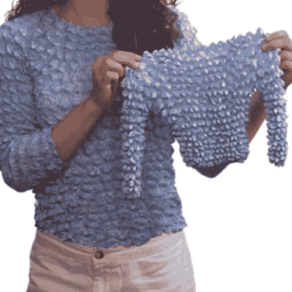

# 对适应和转变说是！

> 原文：<https://towardsdatascience.com/say-yes-to-the-fit-and-transform-f1727e929196?source=collection_archive---------18----------------------->

## 理解 Fit 和 Transform Python 方法的简单寓言

> 我注意到数据科学的同学们正在努力理解方法“fit”和“transform”之间的区别和应用。所以，这里有一个简单的比喻(*下面的 python 元素用斜体显示*)。

# 你需要一件新年晚会礼服。

如果你不穿礼服，那么你可以想象你需要一套定制的西装或者一辆自行车。这个寓言仍然有效，但是我想要一件漂亮的衣服。有口袋！

所以，你需要一件新衣服。你当然只是在预测什么样的裙子会在除夕夜感觉良好，因为现在才六月。

*你需要一个可以用来根据 x 预测 y 的模型*

# 拆分您的数据

就像我们说的，现在才六月，但是这个派对将会像孩子们说的那样充满活力。你需要尽快订购这条裙子。所以，虽然你不确定你在 12 月会有什么样的外观和感觉，但你现在已经把它建立在你的身体上了。

*将数据集分为训练数据和测试数据。您不知道测试数据看起来如何，所以您将根据训练数据建立模型。*

# 拟合训练数据

你去当地的裁缝店，她给你量尺寸。她根据你的尺寸做衣服。

*您根据训练数据拟合您的模型。你根据 X_train 建立模型。*

# 转换训练数据

这件衣服大约一周后到达。你试穿一下，看看感觉如何。不出所料，感觉棒极了。那是因为你一个星期都没怎么变，傻瓜。

*您可以转换您的训练数据，但该模型可能会几乎符合您的训练数据，如果不是完全完美的话。那是因为你只是把你的模型放在上面，傻瓜。*

# 转换测试数据

今天是除夕！六个月后，你的身体与七月时不同。你试穿了这件衣服，但它的手感和外观都没有你第一次试穿时好。

*你转换测试数据。这是我们保留的数据，因此它不同于模型所基于的训练数据。我们转换测试数据，它不能完美地预测一切。*

# 过度拟合

这条裙子很完美——如果你还有七月的身材。当裁缝做的时候，她把它做得太特别了，不允许有任何改动。所以，现在，不管是太紧还是从你身上掉下来，这条裙子在除夕夜都不能穿了。

*该模型生成的预测对训练集来说非常好，但无论是超出还是低于其预测，它都不能很好地预测测试数据目标。它太专为你的训练数据而调整了，而且它不能作为一个模型使用。*

# 欠拟合

因为你的衣服不适合你，你考虑买一件均码的新衣服。它是否适合你过新年完全是个未知数，因为它甚至不一定适合你在七月。

*欠拟合模型不能很好地预测训练数据。它是否能很好地预测测试数据完全是个未知数。*

# 正规化

你决定修改裙子。那只是意味着裁缝会在不适合你的地方把它改小或改大。你可以得到不同种类的修改。

*为了惩罚有大量错误的模型，你决定使用正则化。有几个常见的像套索，脊。*

# 为什么准确性不是一个很好的评估标准

在聚会上，一群人告诉你，你穿这件衣服看起来很棒，非常合身。是真的。你看起来棒极了！但问题是。你花了一大笔钱在裁缝、衣服、修改上……你怎么知道它值不值？你将如何评价这是一件好衣服？花那么多时间难道不比从你的朋友谢尔比那里借一条裙子好吗？

*通常，模型的准确性是一个倾斜的数字，因为我们忽略了随机猜测并得到相同预测的模型的准确性。当评估您的预测模型时，评估指标应该基于您的业务用例。*

> 这里有很多不同的方法来扩展或改变这个寓言，但我希望它对认识 fit 和 transform Python 方法的不同和有用性有所帮助。

# PS 拟合 _ 转换

难道你不希望你能得到一件衣服，它的材料考虑到了你的曲线，而且立即合身，有点像 90 年代的泡泡衫吗？

These shirts are the same shirts!

*拟合变换适用于您要立即形成并使用您要拟合的对象的情况，这就是为什么当您的对象是模型时不常见，但当您使用 StandardScaler 或其他数据准备对象时却很常见。*