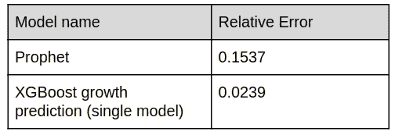

# 构建时间序列预测管道的可扩展方法

> 原文：<https://towardsdatascience.com/scalable-approach-to-building-time-series-forecasting-pipelines-eadfd75b15ff?source=collection_archive---------11----------------------->

## 以较少的工程负担解决更复杂的问题

[https://unsplash.com/photos/WY70Ay0WHRg](https://unsplash.com/photos/WY70Ay0WHRg)

# 这篇文章的目的和文章概述

写这篇文章的动机是分享如何构建工具来帮助定义 ML 管道以预测复杂过程的结果。

本文不是要解决一个具体的问题，而是要介绍一种提高工程师和数据科学家工作效率的方法(众多方法中的一种),这种方法是通过对重复性任务(如存储/检索特征、训练模型和从基本块构建管道)引入更高层次的抽象。

[免责声明]开源目前没有计划这个框架，但是，我希望下面描述的观点可能对社区有所帮助。

为了了解要解决的问题，我们将首先查看领域问题示例。然后将愿望清单定义到我们的工具箱中，并进行高级解决方案概述。接下来的章节将深入介绍该方法的各个方面。

# 问题示例

假设我们想要预测上市公司的净收入。虽然我们可能使用统计和最大似然法来预测净收入的最终值，但是让我们检查一下通过预测我们的目标所包含的变量是否可以提高准确性。以下是净收入计算的简化分类:

Decomposition of Net Income calculation (simplified)

其他可能有用的功能:

*   公司财务报告
*   宏观经济数据
*   行业趋势
*   竞争对手指标

根据过去的经验，我们知道我们希望:

*   进行重复的实验——当你试图重复一周前的好实验时，这是非常令人难过的
*   使用不同类型的 ML 模型
*   在另一个计算中引用一个计算的结果
*   有一个比较模型和实验结果的标准方法
*   有一个简单的方法来验证单元测试的功能
*   系综和堆栈模型

随着预测中使用的公司数量超过 5000 家，似乎有一种框架来帮助我们解决这个问题会很好。

# 框架概述

一个可能的解决方案是将问题表达为一个计算图(有向和无环)，节点是处理步骤，边是依赖关系。

节点类型:

*   数据提供者(data Provider )-将数据纳入管线并创建一组初始特征
*   特征提取器-将一个或多个数据源作为输入并产生输出的任何操作。最常见的是数学运算或时移
*   统计/最大似然模型训练和预测
*   服务步骤，如生成指标或选择最佳模型以传递到下一步

每个计算步骤输出数据，这些数据被保存在一个共享的存储库中，如果需要，其他步骤可以从这里请求这些数据。

Forecast new feature from inputs and put into a repository

以下是净收入计算的明细:

Defining Net Income forecast as a graph

有一个框架来简化这些图的构造、执行并允许在另一个计算中使用一个计算的结果将是很好的。

# 高级需求

1.  声明性和可测试的图形定义
2.  惰性图形处理，仅重新计算缺失的特征
3.  定义新计算类型的容易程度
4.  支持特征和特征块元数据
5.  支持时间序列和数据的关系性质
6.  [ML]内置交叉验证和堆叠

## 声明性计算图定义

计算的每一步都可以抽象为一个函数，它获取输入参数并输出数据。不同类型的运算(移动平均计算或差值计算)是不同的函数。无状态和幂等也是计算步骤的有用属性。

节点声明则是包含以下参数的容器:

1.  将处理此工作单元的类名—提取器
2.  如果不可用，则计算依赖项-输入要素
3.  要处理的功能组的名称

以下是此类节点声明的示例，它计算功能组中所有功能的相对增长:

Computing relative growth of all input features

另一个将两个块链接在一起的例子是，假设我们想要计算过去的收益估计和预测收益之间的差异。要做到这一点，我们可以在第一个块中及时移动过去的收益估计，然后在另一个块中加入并计算相对差异:

Computing relative difference between variables shifted in time

需要机器学习训练的计算由稍微不同的块表示，其需要许多附加参数:

1.  模型工厂名称
2.  模型参数
3.  目标变量名

Example of Training Configuration

这个处理步骤由工作流引擎以稍微不同的方式处理，具有交叉验证支持和按时间滚动训练。

将图声明从执行上下文中分离出来允许自动化测试和配置生成。

## 图形处理

定义了计算图后，只需将我们想要计算的特征传递给处理引擎就足够了，处理引擎随后会展开依赖关系，并只重新计算存储库中缺失的数据。

## 计算步骤的类型

**数据提供者** —将不同种类的数据注入系统。提供商示例:

1.  公司特有的功能—股票价格、季度报告
2.  全国范围的数据—通货膨胀、国内生产总值

**对特征进行一元运算**

1.  滚动窗口上的计算。示例—移动平均计算
2.  时移

**二元运算** —按时间和关键字连接两个特征并执行数学运算:

1.  加入和减去。使用示例—通过从收入中减去成本得出营业收入
2.  合而分之。使用示例—将收入与随时间转移的收入结合起来定义增长
3.  加入并倍增。使用示例—将过去的收入与增长预测相结合，得出未来的收入

**其他类型的服务步骤**

1.  选择前 N 名最佳功能预测
2.  计算用于分析的预测质量指标

通过实现这样的基本块，然后组合成更高级的结构，可以定义相当复杂的逻辑。每种类型的特征提取器都是一个实现公共接口的类，在负责计算特征的组件中注册，并通过名称从图中引用。

## 功能元数据

保存与要素相关联的元数据也很方便-如果是未来预测、要素类型等，则该要素的直接父要素是什么。

有了这些元数据，就很容易找到某个特征的所有预测，计算它们的准确度，选择 N 个最佳预测，计算置信区间，并创建一个新的特征块供以后使用

## 支持时间序列和数据的关系性质

每一个计算步骤都会产生一些特征，这些特征被组合成一种特征块——特征库。

为了支持时序定位(要素可以按时间进行索引),为了支持关系(按关键字分组)。

例如，股票价格的每日变化将按天索引，并按股票代号(公司标识符)分组

块的描述和示例:

计算时，将特征块与从提取器名称和参数计算的关键字一起放入存储库中，不同的参数会导致不同的块名称。

在计算阶段，如果可用，从存储库中读取特征块，否则进行计算。

## 特征的顺序定位

为了支持序列不变算法(如决策树或回归)中的时间序列问题性质，常规特征存储(平面)被转换为序列的，其中要包括的时间步数是提取器的参数。

以下是微软季度收入和收入成本的一个例子:

Regular orientation

到顺序表示:

Sequential orientation

为了防止有关未来事件的信息泄漏到 ML 模型中，从传递到模型的要素视图中过滤掉元数据中具有 Seq 0 且不是预测的所有连续要素。

## 训练 ML 模型

该框架与不同 ML 模型的细节无关，所需要的只是实现一个标准接口。默认的训练模式是训练和预测时间滑动，在此期间，模型根据过去的事件{0:t-1}进行训练，以预测未来的事件{t}。在完成对周期{t}的所有预测后，训练数据将扩展到{0:t}，并再次训练以预测{t + 1}

每个时间步长的训练被分成[个 k 倍](https://en.wikipedia.org/wiki/Cross-validation_(statistics)#k-fold_cross-validation)，保持集用于检测早期停止点(对于基于树的模型)和选择超参数:

My wife calls this Mattress split — looks like old Soviet mattress

尽管现在验证和预测集不是[同分布](https://en.wikipedia.org/wiki/Independent_and_identically_distributed_random_variables)，但这种分解足以检测过度拟合。

另一种经常用于执行快速实验的训练模式是所有事件的简单 k 倍分割。虽然这种方法并不完善，并且会导致关于未来事件的信息泄露，但是它已经被证明是默认训练模式的良好近似。

[堆叠](https://blog.statsbot.co/ensemble-learning-d1dcd548e936)是通过对不同的模型一个接一个的排序来实现的。

## 结果评估和误差分析

有许多服务特征提取器，当放置在图中的 ML 模型之后时，可以将预测值与原始数据(标签)相关联，并产生不同种类的度量和结构以供进一步分析:

1.  与其他模型相比，预测精度有所提高
2.  预测区间
3.  残差分析
4.  自相关检查
5.  正态分布检验
6.  边缘校验

# 工作进展

## 自动图形构建

手动迭代可能的配置选项可能会耗费时间和精力。下一个逻辑步骤是将图形构造公式化为具有约束(例如计算时间)和优化目标(例如精度)的优化问题

## 调整解决方案以在多台机器上运行

框架中易于并行化的部分:

1.  图形中孤立部分的处理
2.  分层特征——我们可以将公司 A 的特征与公司 B 的特征分开计算
3.  时间特征

# 我们在准确性方面有什么提高吗？

虽然这篇文章是关于一般的框架，而不是关于解决具体的预测问题，但我们仍然想知道与更简单的 ML 算法相比，结果是否有所改善？

答案是肯定的，对于所有要预测的变量来说，准确性都有相当大的提高。

以下是 awesome library [Prophet](https://github.com/facebook/prophet) 和 Pipeline models 预测公司(本例中为 **ROST** )的收入预测对比:

Earnings Per Share for POST ticker — Actual (Label), Prophet and Pipeline forecasts

POST Relative Error comparison

另一家随机公司 **EBAY** 的盈利预测

Earnings Per Share for EBAY — Actual (Label), Prophet and Pipeline forecasts

EBAY Relative Error comparison

# 结论

虽然这是一项相当重要的初始投资，但拥有一个类似于上述框架的框架可以:

1.  缩短每次实验->验证->整合周期的时间
2.  花在修复错误和编写测试上的时间更少
3.  不同模型、超参数和特征对最终预测影响的整体观点
4.  减少重复过去实验的时间

这个解决方案是从自动化和改进日常活动逐步发展而来的。如果需要从头实现这样一个框架，我也会考虑在现有开源技术的基础上构建，例如——[https://airflow.apache.org](https://airflow.apache.org)

感谢您阅读这篇文章，我们非常欢迎您的反馈或对具体领域的更详细深入的要求。