# 使用 Apache Spark 的可扩展日志分析—综合案例研究

> 原文：<https://towardsdatascience.com/scalable-log-analytics-with-apache-spark-a-comprehensive-case-study-2be3eb3be977?source=collection_archive---------7----------------------->

## 半结构化数据的大规模数据分析和可视化


Photo by [Robin Pierre](https://unsplash.com/photos/dPgPoiUIiXk?utm_source=unsplash&utm_medium=referral&utm_content=creditCopyText) on [Unsplash](https://unsplash.com/collections/291422/night-lights?utm_source=unsplash&utm_medium=referral&utm_content=creditCopyText)

# 介绍

当今利用分析的最流行和最有效的企业案例研究之一是日志分析。如今，几乎每个小型和大型组织都有多个系统和基础架构日复一日地运行。为了有效地保持业务运营，组织需要知道其基础架构是否发挥了最大潜力。这包括分析系统和应用程序日志，甚至可能对日志数据应用预测分析。日志数据量通常很大，这取决于组织基础架构的类型以及在其上运行的应用程序。由于计算限制，我们只能尝试在单台机器上分析数据样本的日子已经一去不复返了。


Source: [Doug Henschen](https://doughenschen.com/2015/06/17/spark-on-fire-why-all-the-hype/)

在大数据、更好的分布式计算、大数据处理和 Spark 等开源分析框架的支持下，我们可以每天对潜在的数百万甚至数十亿条日志消息执行可扩展的日志分析。本案例研究导向教程的目的是采用实践方法展示我们如何利用 Spark 对半结构化日志数据执行大规模日志分析。如果您对 Spark 的可伸缩 SQL 感兴趣，可以随意查看 Spark 的 [*SQL 和 Spark 的*](/sql-at-scale-with-apache-spark-sql-and-dataframes-concepts-architecture-and-examples-c567853a702f) 。

今天，我们将在本文中讨论以下主要话题。

*   [**主要目标——NASA 日志分析**](#2226)
*   [**设置依赖关系**](#2b55)
*   [**加载并查看 NASA 日志数据集**](#9c29)
*   [**数据角力**](#c893)
*   [**我们的网络日志数据分析**](#511f)

虽然有很多优秀的开源日志分析框架和工具，包括 elasticsearch，但本教程的目的是展示如何利用 Spark 来大规模分析日志。在现实世界中，当分析日志数据时，您可以自由选择工具箱。我们开始吧！

# 主要目标——NASA 日志分析

正如我们之前提到的，Apache Spark 是一个优秀的、理想的开源框架，用于大规模地对结构化和非结构化数据进行辩论、分析和建模！在本教程中，我们的主要目标是关注业界最流行的案例研究之一——日志分析。通常，服务器日志是企业中非常常见的数据源，通常包含可操作的见解和信息的金矿。企业中的日志数据有许多来源，如 web、客户端和计算服务器、应用程序、用户生成的内容、平面文件。它们可以用于监控服务器、提高业务和客户智能、构建推荐系统、欺诈检测等等。


Spark 允许您廉价地将日志转储和存储在磁盘上的文件中，同时仍然提供丰富的 API 来执行大规模的数据分析。这个动手案例研究将向您展示如何在 NASA 的真实生产日志上使用 Apache Spark，并学习数据争论和探索性数据分析中的基本而强大的技术。在本案例研究中，我们将分析来自佛罗里达州 NASA 肯尼迪航天中心 web 服务器的日志数据集。完整的数据集可以免费下载 [**这里**](http://ita.ee.lbl.gov/html/contrib/NASA-HTTP.html) 。

这两个数据集包含了两个月来对佛罗里达州 NASA 肯尼迪航天中心 WWW 服务器的所有 HTTP 请求。您可以前往 [**网站**](http://ita.ee.lbl.gov/html/contrib/NASA-HTTP.html) 并根据需要下载以下文件(或直接点击以下链接)。

*   **07 月 01 日至 07 月 31 日，ASCII 格式，**T0:**ftp://ita.ee.lbl.gov/traces/NASA_access_log_Jul95.gz**
*   **04 年 8 月至 08 月 31 日，ASCII 格式，**T1:**ftp://ita.ee.lbl.gov/traces/NASA_access_log_Aug95.gz**

确保这两个文件与包含教程的笔记本在同一个目录下，该教程可以在[***my GitHub***](https://github.com/dipanjanS/data_science_for_all/tree/master/tds_scalable_log_analytics)上找到。

# 设置相关性

第一步是确保您能够访问 Spark 会话和集群。为此，您可以使用自己的本地设置或基于云的设置。一般来说，目前大多数云平台都会提供 Spark 集群，你也可以免费选择，包括 [Databricks 社区版](https://community.cloud.databricks.com)。本教程假设您已经有了 Spark 设置，因此我们不会花费额外的时间从头开始配置或设置 Spark。

通常，当您启动 jupyter 笔记本服务器时，预先配置的 Spark 设置已经预先加载了必要的环境变量或依赖项。在我的情况下，我可以使用笔记本中的以下命令来检查它们。

```
**spark**
```

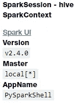

这表明我的集群目前运行的是 Spark 2.4.0。我们还可以使用下面的代码检查`**sqlContext**` 是否存在。

```
**sqlContext****#Output:
<pyspark.sql.context.SQLContext at 0x7fb1577b6400>**
```

现在，如果您没有预先配置这些变量并得到一个错误，您可以加载它们并使用下面的代码配置它们。除此之外，我们还加载了一些其他库来处理数据帧和正则表达式。

使用正则表达式将是解析日志文件的主要方面之一。正则表达式是一种非常强大的模式匹配技术，可用于提取和发现半结构化和非结构化数据中的模式。


Source: [xkcd](https://www.xkcd.com/1171/)

正则表达式可能非常有效和强大，但它们有时可能令人不知所措或困惑。不过不要担心，通过更多的练习，你可以真正发挥它的最大潜力。以下示例展示了在 Python 中使用正则表达式的方法。

```
**<_sre.SRE_Match object; span=(0, 25), match="I'm searching for a spark"> 0 25
<_sre.SRE_Match object; span=(25, 36), match=' in PySpark'> 25 36**
```

让我们进入分析的下一部分。

# 加载和查看 NASA 日志数据集

假设我们的数据存储在下面提到的路径中(以平面文件的形式)，让我们将它加载到 DataFrame 中。我们会一步一步来。下面的代码获取我们磁盘中的日志数据文件名。

```
**['NASA_access_log_Jul95.gz', 'NASA_access_log_Aug95.gz']**
```

现在，我们将使用`**sqlContext.read.text()**`或`**spark.read.text()**`来读取文本文件。这将产生一个 DataFrame，其中有一个名为`**value**`的字符串列。

```
**root
 |-- value: string (nullable = true)**
```

这使我们可以看到日志数据的模式，它看起来很像文本数据，我们将很快对其进行检查。您可以使用下面的代码查看保存日志数据的数据结构的类型。

```
**type(base_df)****#Output:**
**pyspark.sql.dataframe.DataFrame**
```

我们将在整个教程中使用 Spark 数据帧。但是，如果您愿意，也可以将数据帧转换为 RDD，即 Spark 的原始数据结构(弹性分布式数据集)。

```
**base_df_rdd = base_df.rdd
type(base_df_rdd)****#Output
pyspark.rdd.RDD**
```

现在让我们看一下数据帧中的实际日志数据。

```
**base_df.show(10, truncate=False)**
```

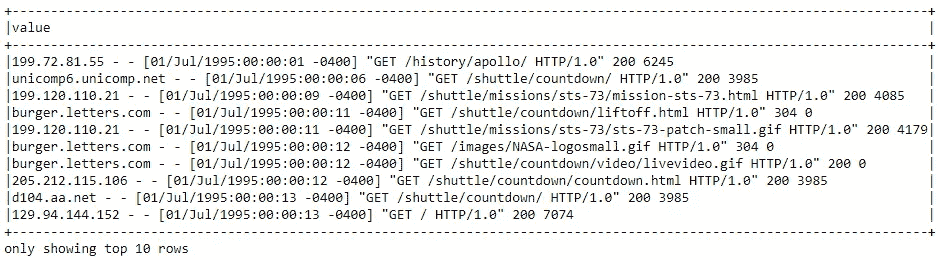

这肯定看起来像半结构化的标准服务器日志数据，我们肯定需要做一些数据处理和争论，然后才能有用。请记住，从 rdd 访问数据与下面看到的略有不同。

```
**base_df_rdd.take(10)**
```

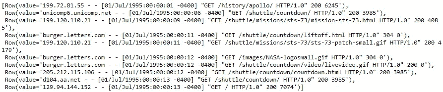

现在我们已经加载并查看了日志数据，让我们来处理和讨论它。

# 数据争论

在这一节中，我们将尝试清理和解析我们的日志数据集，以真正从每个日志消息中提取具有有意义信息的结构化属性。

## 日志数据理解

如果您熟悉 web 服务器日志，您会发现上面显示的数据是以[通用日志格式](https://www.w3.org/Daemon/User/Config/Logging.html#common-logfile-format)显示的。

这些字段是:`**remotehost rfc931 authuser [date] "request" status bytes**`

我们将需要使用一些特定的技术来从日志数据中解析、匹配和提取这些属性。

## 用正则表达式解析和提取数据

接下来，我们必须将半结构化日志数据解析成单独的列。我们将使用特殊的内置`[**regexp_extract()**](http://spark.apache.org/docs/latest/api/python/pyspark.sql.html#pyspark.sql.functions.regexp_extract)`函数来进行解析。该函数将一列与一个或多个[捕获组](http://regexone.com/lesson/capturing_groups)的正则表达式进行匹配，并允许您提取一个匹配的组。我们将为希望提取的每个字段使用一个正则表达式。

到目前为止，您一定听说过或使用过相当多的正则表达式。如果您发现正则表达式令人困惑(它们当然*也可能*困惑)，并且您想了解更多关于它们的知识，我们建议查看一下 [RegexOne 网站](http://regexone.com/)。你可能还会发现 Goyvaerts 和 Levithan 的 [*正则表达式手册*](http://shop.oreilly.com/product/0636920023630.do) 作为参考很有用。

让我们看看我们在数据集中处理的日志总数。

```
**print((base_df.count(), len(base_df.columns)))****#Output
(3461613, 1)**
```

看起来我们总共有大约 346 万条日志消息。不是一个小数目！让我们摘录并查看一些示例日志消息。

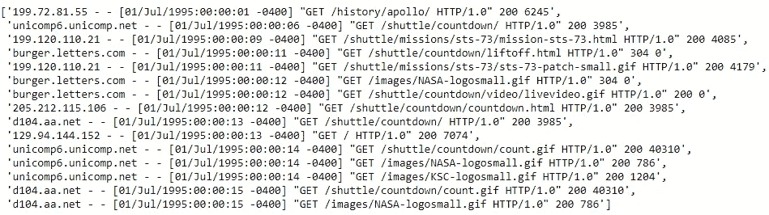

## 提取主机名

让我们尝试编写一些正则表达式来从日志中提取主机名。

```
**['199.72.81.55',
 'unicomp6.unicomp.net',
 '199.120.110.21',
 'burger.letters.com',
 ...,
 ..., 
 'unicomp6.unicomp.net',
 'd104.aa.net',
 'd104.aa.net']**
```

## 提取时间戳

现在让我们尝试使用正则表达式从日志中提取时间戳字段

```
**['01/Jul/1995:00:00:01 -0400',
 '01/Jul/1995:00:00:06 -0400',
 '01/Jul/1995:00:00:09 -0400',
  ...,
  ...,
 '01/Jul/1995:00:00:14 -0400',
 '01/Jul/1995:00:00:15 -0400',
 '01/Jul/1995:00:00:15 -0400']**
```

## 提取 HTTP 请求方法、URIs 和协议

现在让我们尝试使用正则表达式从日志中提取 HTTP 请求方法、URIs 和协议模式字段。

```
**[('GET', '/history/apollo/', 'HTTP/1.0'),
 ('GET', '/shuttle/countdown/', 'HTTP/1.0'),
  ...,
  ...,
 ('GET', '/shuttle/countdown/count.gif', 'HTTP/1.0'),
 ('GET', '/images/NASA-logosmall.gif', 'HTTP/1.0')]**
```

## 提取 HTTP 状态代码

现在让我们尝试使用正则表达式从日志中提取 HTTP 状态代码。

```
**['200', '200', '200', '304', ..., '200', '200']**
```

## 正在提取 HTTP 响应内容大小

现在让我们尝试使用正则表达式从日志中提取 HTTP 响应内容大小。

```
**['6245', '3985', '4085', '0', ..., '1204', '40310', '786']**
```

## 把所有的放在一起

现在让我们尝试利用我们之前构建的所有正则表达式模式，并使用`**regexp_extract(...)**`方法来构建我们的数据帧，将所有日志属性整齐地提取到它们自己的单独列中。

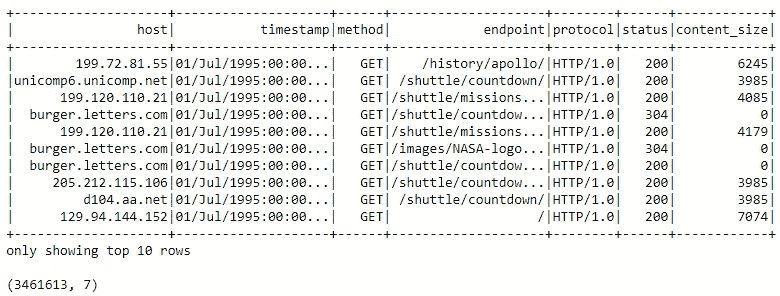

## 查找缺失值

缺失值和空值是数据分析和机器学习的祸根。让我们看看我们的数据解析和提取逻辑工作得有多好。首先，让我们验证原始数据帧中没有空行。

```
**0**
```

一切都好！现在，如果我们的数据解析和提取工作正常，我们不应该有任何可能为空值的行。让我们来测试一下吧！

```
**33905**
```

哎哟！看起来我们的数据中有超过 33K 个丢失的值！我们能处理这件事吗？

请记住，这不是一个常规的 pandas 数据框架，您可以直接查询并获得哪些列为空。我们所谓的*大数据集*驻留在磁盘上，它可能存在于 spark 集群的多个节点中。那么我们如何找出哪些列有潜在的空值呢？

## 查找空计数

我们通常可以使用下面的技术来找出哪些列有空值。

(**注:**此方法改编自 StackOverflow 上的一个[精彩回答](http://stackoverflow.com/a/33901312)。)

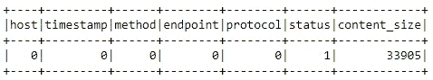

嗯，看起来我们在`**status**` 列中少了一个值，其他的都在`**content_size**`列中。让我们看看是否能找出问题所在！

## 在 HTTP 状态下处理空值

我们最初解析`status`列的正则表达式是:

```
**regexp_extract('value', r'\s(\d{3})\s', 1).cast('integer')
                                          .alias( 'status')**
```

会不会是数字多了让我们的正则表达式错了？还是数据点本身不好？让我们试着找出答案吧！

**注**:在下面的表达式中，`**~**`的意思是“不是”。

```
**1**
```

我们来看看这个不良记录是什么样的！

```
**null_status_df.show(truncate=False)**
```

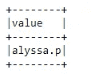

看起来像是有很多缺失信息的记录！让我们通过我们的日志数据解析管道来传递它。


看起来记录本身是一条不完整的记录，没有任何有用的信息，最好的选择是删除这条记录，如下所示！

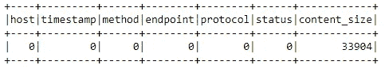

## 处理 HTTP 内容大小中的空值

基于我们之前的正则表达式，我们对`**content_size**` 列的原始解析正则表达式为:

```
**regexp_extract('value', r'\s(\d+)$', 1).cast('integer')
                                       .alias('content_size')**
```

我们的原始数据集本身会有缺失的数据吗？让我们试着找出答案吧！我们首先尝试找出基本数据帧中可能缺少内容大小的记录。

```
**33905**
```

该数量似乎与我们处理的数据帧中缺失的内容大小值的数量相匹配。让我们来看看数据框中缺失内容大小的前十条记录。

```
**null_content_size_df.take(10)**
```


很明显，坏的原始数据记录对应于错误响应，没有内容被发回，服务器为`**content_size**`字段发出一个“`**-**`”。

因为我们不想从分析中丢弃这些行，所以让我们将它们估算或填充为 0。

## 修复 content_size 为空的行

最简单的解决方案是像我们之前讨论的那样用 0 替换`**logs_df**`中的空值。Spark DataFrame API 提供了一组专门用于处理空值的函数和字段，其中包括:

*   `[**fillna()**](http://spark.apache.org/docs/latest/api/python/pyspark.sql.html#pyspark.sql.DataFrame.fillna)`，用指定的非空值填充空值。
*   `[**na**](http://spark.apache.org/docs/latest/api/python/pyspark.sql.html#pyspark.sql.DataFrame.na)`，它返回一个`[**DataFrameNaFunctions**](http://spark.apache.org/docs/latest/api/python/pyspark.sql.html#pyspark.sql.DataFrameNaFunctions)`对象，该对象具有许多用于操作空列的函数。

有几种方法可以调用这个函数。最简单的方法是用已知值替换所有的空列。但是，为了安全起见，最好传递一个包含`**(column_name, value)**`映射的 Python 字典。这就是我们要做的。文档中的一个示例如下所示

```
**>>> df4.na.fill({'age': 50, 'name': 'unknown'}).show()
+---+------+-------+
|age|height|   name|
+---+------+-------+
| 10|    80|  Alice|
|  5|  null|    Bob|
| 50|  null|    Tom|
| 50|  null|unknown|
+---+------+-------+**
```

现在我们使用这个函数，用 0 填充`**content_size**`字段中所有缺失的值！

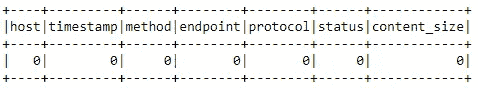

看看，没有丢失值！

## 处理时态字段(时间戳)

现在我们有了一个干净的、解析过的数据帧，我们必须将时间戳字段解析成一个实际的时间戳。通用日志格式时间有些不标准。用户定义的函数(UDF)是解析它最直接的方法。

现在让我们使用这个函数来解析 dataframe 中的`**time**`列。

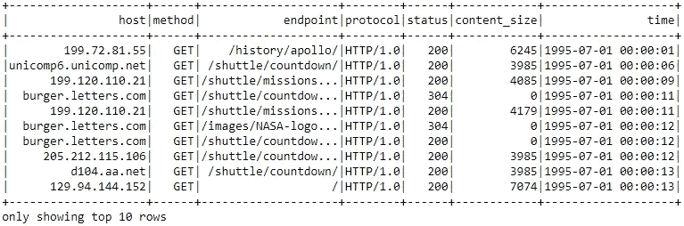

事情看起来不错！让我们通过检查数据帧的模式来验证这一点。

```
**logs_df.printSchema()****root
 |-- host: string (nullable = true)
 |-- method: string (nullable = true)
 |-- endpoint: string (nullable = true)
 |-- protocol: string (nullable = true)
 |-- status: integer (nullable = true)
 |-- content_size: integer (nullable = false)
 |-- time: timestamp (nullable = true)**
```

现在让我们缓存`**logs_df**`,因为我们将在下一部分的数据分析部分广泛使用它！

```
**logs_df.cache()**
```

# 对我们的网络日志进行数据分析

现在我们有了一个数据帧，其中包含了作为数据帧的经过解析和清理的日志文件，我们可以执行一些有趣的探索性数据分析(EDA)来尝试获得一些有趣的见解！

## 内容大小统计

让我们计算一些关于 web 服务器返回的内容大小的统计数据。特别是，我们想知道平均、最小和最大内容大小是多少。

我们可以通过调用`**logs_df**`的`**content_size**`列上的`**.describe()**`来计算统计数据。`**.describe()**`函数返回给定列的计数、平均值、标准偏差、最小值和最大值。

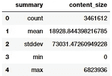

或者，我们可以使用 SQL 直接计算这些统计数据。您可以在[文档](https://spark.apache.org/docs/latest/api/python/pyspark.sql.html#module-pyspark.sql.functions)的`**pyspark.sql.functions**`模块中探索许多有用的功能。

在我们应用了`**.agg()**`函数之后，我们调用`**toPandas()**`来提取结果并将其转换成一个`**pandas**`数据帧，这个数据帧在 Jupyter 笔记本上有更好的格式。

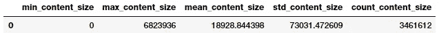

我们可以验证结果，看它们是否和预期的一样。

## HTTP 状态代码分析

接下来，让我们看看日志中出现的状态代码值。我们想知道哪些状态代码值出现在数据中，出现了多少次。我们再次从`**logs_df**`开始，然后按`**status**` 列分组，应用`**.count()**`聚合函数，并按`**status**` 列排序。

```
**Total distinct HTTP Status Codes: 8**
```

看起来我们总共有 8 个不同的 HTTP 状态代码。让我们以频率表的形式来看看它们的出现情况。

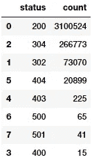

看起来状态代码 200 OK 是最常见的代码，这是一个很好的迹象，表明大部分时间工作正常。让我们想象一下。

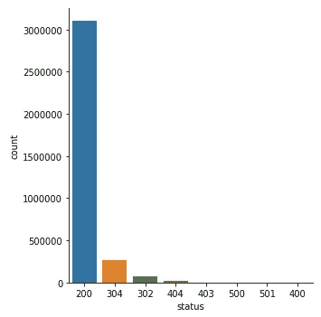

HTTP Status Code occurrences

不算太差！但是由于数据中的巨大偏差，几个状态代码几乎不可见。让我们进行一次对数变换，看看情况是否有所改善。

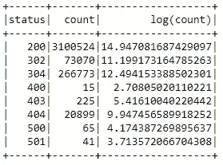

结果肯定看起来不错，似乎已经处理了偏斜，让我们通过可视化这些数据来验证这一点。

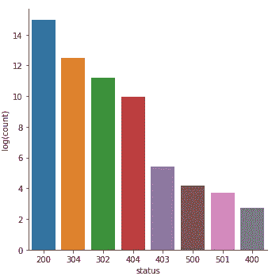

HTTP Status Code occurrences — Log Transformed

这绝对看起来更好，更少歪斜！

## 分析频繁主机

让我们看看频繁访问服务器的主机。我们将尝试获得每个`**host**` 的总访问次数，然后按次数排序，只显示前十个最频繁的主机。

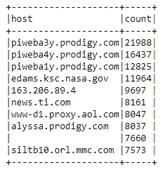

这看起来不错，但是让我们更仔细地检查第 9 行中的空白记录。

```
**host_sum_pd_df = host_sum_df.toPandas()
host_sum_pd_df.iloc[8]['host']****''**
```

看起来我们有一些空字符串作为顶级主机名之一！这给我们上了宝贵的一课，不仅要检查空值，还要在数据冲突时检查潜在的空字符串。

## 显示前 20 个常用端点

现在，让我们来看看日志中对端点(URIs)的点击数。为了执行这个任务，我们从我们的`**logs_df**` 开始，按`**endpoint**`列分组，按计数聚合，并像上一个问题一样按降序排序。

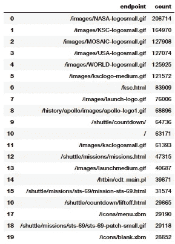

毫不奇怪，gif、主页和一些 CGI 脚本似乎是最常被访问的资产。

## 十大错误终点

请求的没有返回代码 200 (HTTP 状态正常)的前十个端点是什么？我们创建一个排序列表，其中包含端点和它们被访问的次数，返回代码不为 200，并显示前十名。


看起来 gif(动画\静态图像)加载失败最多。你知道为什么吗？考虑到这些日志是 1995 年的，考虑到当时的网速，我一点也不惊讶！

## 唯一主机的总数

在这两个月中，访问 NASA 网站的独特主机的总数是多少？我们可以通过几个变换找到这个答案。

```
**137933**
```

## 每日唯一主机的数量

作为一个高级示例，我们来看一种方法，它可以每天确定整个日志中唯一主机的数量。该计算将为我们提供每日唯一主机的数量。

我们希望有一个数据帧，按月中增加的一天排序，其中包括一个月中的一天，以及这一天的唯一主机的相关数量。

考虑一下您需要执行哪些步骤来计算每天发出请求的不同主机的数量。*由于日志仅涵盖一个月，您可以忽略该月。*您可能想要使用`**pyspark.sql.functions**`模块中的`[**dayofmonth**](https://spark.apache.org/docs/latest/api/python/pyspark.sql.html#pyspark.sql.functions.dayofmonth)` [功能](https://spark.apache.org/docs/latest/api/python/pyspark.sql.html#pyspark.sql.functions.dayofmonth)(我们已经将其作为`**F**`导入)。

`**host_day_df**` **:** 有两列的数据帧

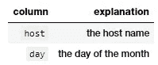

对于`**logs_df**`中的每一行，该数据帧中将有一行。本质上，我们只是在变换`**logs_df**`的每一行。例如，对于`**logs_df**`中的这一行:

```
**unicomp6.unicomp.net - - [01/Aug/1995:00:35:41 -0400] "GET /shuttle/missions/sts-73/news HTTP/1.0" 302 -**
```

你的`**host_day_df**` 应该有:`**unicomp6.unicomp.net 1**`

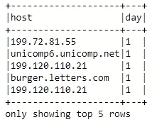

`**host_day_distinct_df**` **:** 该数据帧具有与`**host_day_df**`相同的列，但删除了重复的 **(** `**day**` **，** `**host**` **)** 行。

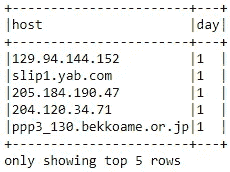

`**daily_unique_hosts_df**` **:** 有两列的数据帧:

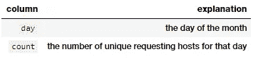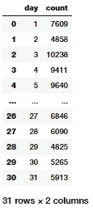

这为我们提供了一个很好的数据框架，显示了每天唯一主机的总数。让我们想象一下！

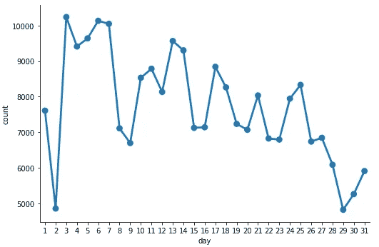

Unique Hosts per Day

## 每台主机的平均每日请求数

在前面的示例中，我们研究了一种方法来确定每天整个日志中唯一主机的数量。现在让我们试着根据我们的日志找出每台主机每天向 NASA 网站发出的平均请求数。我们希望有一个数据帧，按一个月中增加的日期排序，包括一个月中的某一天，以及每台主机在这一天发出的平均请求数。

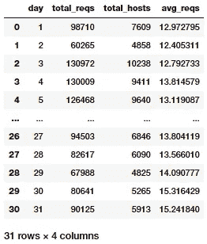

我们现在可以直观地看到每台主机的平均每日请求。

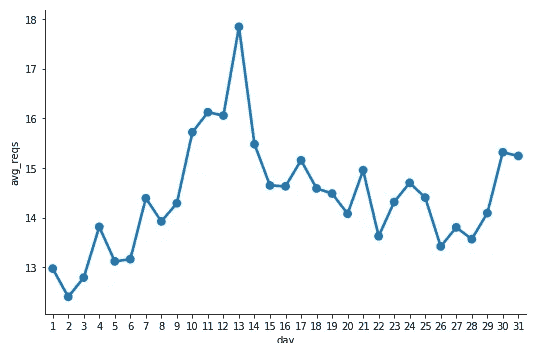

Average Daily Requests per Host

看起来第 13 天每个主机的请求数达到了最大值。

## 统计 404 个响应代码

创建一个只包含带有 404 状态代码(未找到)的日志记录的数据帧。我们确保`**cache()**``**not_found_df**`**数据帧，因为我们将在这里的其余示例中使用它。你觉得日志里有多少 404 记录？**

```
**Total 404 responses: 20899**
```

## **列出前二十个 404 响应代码端点**

**使用我们之前缓存的仅包含带有 404 响应代码的日志记录的数据帧，我们现在将打印出生成最多 404 错误的前 20 个端点的列表。*记住，顶部端点应该是有序的。***

**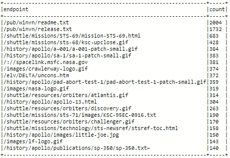**

## **列出前二十个 404 响应代码主机**

**使用我们之前缓存的仅包含带有 404 响应代码的日志记录的数据帧，我们现在将打印出生成最多 404 错误的前 20 台主机的列表。请记住，顶级主机应该按顺序排列。**

**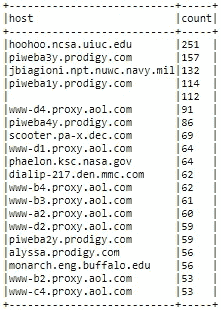**

**给了我们一个好主意，哪个主机最终为 NASA 网页产生了最多的 404 错误。**

## **每天可视化 404 个错误**

**现在让我们暂时(按时间)探索我们的 404 记录。类似于显示每日唯一主机数量的示例，我们将按天分解 404 个请求，并在`**errors_by_date_sorted_df**`中按天排序每日计数。**

**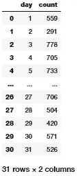**

**现在让我们想象一下每天总共有 404 个错误。**

**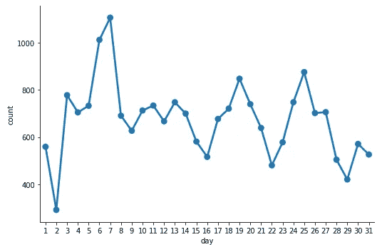**

**Total 404 Error per Day**

## **404 错误的前三天**

**根据前面的情节，一个月中出现 404 错误最多的前三天是哪三天？为此，我们可以利用我们之前创建的`**errors_by_date_sorted_df**`。**

**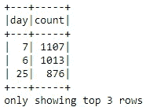**

## **可视化每小时 404 次错误**

**使用我们之前缓存的 DataFrame `**not_found_df**` ，我们现在将按照一天中的小时以升序进行分组和排序，以创建一个 DataFrame，其中包含一天中每个小时(午夜从 0 开始)对 HTTP 请求的 404 个响应的总数。然后，我们将从数据帧构建一个可视化。**

**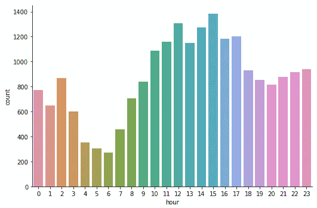**

**Total 404 Error per Hour**

**看起来 404 错误在下午最多，在凌晨最少。我们现在可以将 pandas 显示的最大行数重置为默认值，因为我们之前已经将其更改为显示有限的行数。**

```
**pd.set_option('max_rows', def_mr)**
```

# **结论**

**我们在一个关于日志分析的非常常见但重要的案例研究中，采取了动手操作的方法来进行大规模的数据争论、解析、分析和可视化。虽然从规模或数量的角度来看，我们在这里处理的数据可能不是传统意义上的“大数据”，但这些技术和方法足够通用，可以扩展到更大数量的数据。我希望这个案例研究能够让您很好地了解如何轻松地利用 Apache Spark 这样的开源框架来处理大规模的结构化和半结构化数据！**

**本文附带的所有代码和分析都可以在 [***我的 GitHub 资源库***](https://github.com/dipanjanS/data_science_for_all/tree/master/tds_scalable_log_analytics) 中找到。**

**你可以在这个 [***Jupyter 笔记本***](https://nbviewer.jupyter.org/github/dipanjanS/data_science_for_all/blob/master/tds_scalable_log_analytics/Scalable_Log_Analytics_Spark.ipynb) 里找到一步一步的方法。**

**我利用数据科学、人工智能、机器学习和深度学习来解决现实世界的问题。我也在业余时间做一些咨询、研究和指导。如果您需要集中咨询、培训课程，希望我在活动中发言，或者如果您想发表一篇关于[***TDS***](https://towardsdatascience.com/)*的文章，请随时通过[**LinkedIn**](https://www.linkedin.com/in/dipanzan/)**联系我。*****

***[](https://www.linkedin.com/in/dipanzan/) [## Dipanjan Sarkar -数据科学家-红帽| LinkedIn

### 查看 Dipanjan Sarkar 在世界最大的职业社区 LinkedIn 上的个人资料。Dipanjan 有 9 份工作列在…

www.linkedin.com](https://www.linkedin.com/in/dipanzan/)***