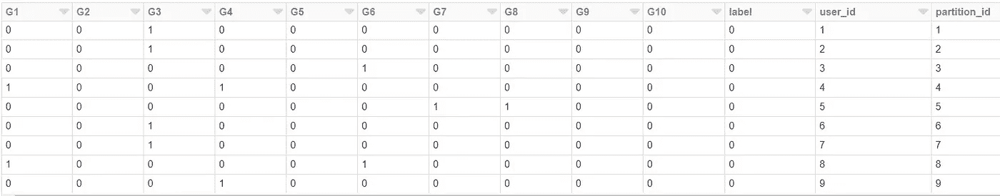
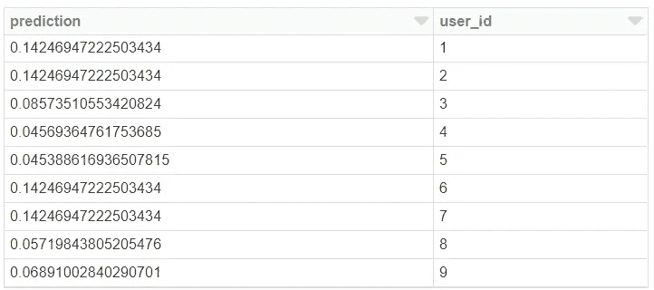
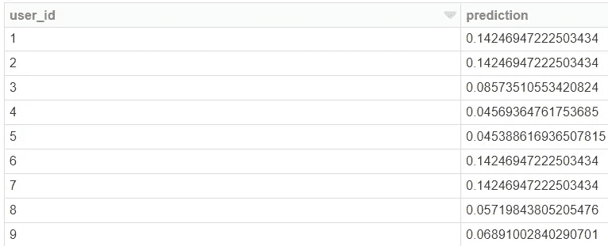

# 带有熊猫 UDF 的可伸缩 Python 代码:一个数据科学应用

> 原文：<https://towardsdatascience.com/scalable-python-code-with-pandas-udfs-a-data-science-application-dd515a628896?source=collection_archive---------5----------------------->

Source: [https://pxhere.com/en/photo/1417846](https://pxhere.com/en/photo/1417846)

## 让 Python 代码在云中大规模运行

PySpark 是一个非常强大的工具，因为它能够编写可以从单台机器扩展到大型集群的 Python 代码。虽然 MLlib 等库很好地覆盖了数据科学家可能希望在这种环境中执行的标准任务，但 Python 库提供的大量功能并不适合在这种分布式环境中工作。虽然像[koala](https://github.com/databricks/koalas)这样的库应该可以更容易地将 Python 库移植到 PySpark，但是在开发人员希望在可伸缩运行时中应用的库集和支持分布式执行的库集之间仍然存在差距。这篇文章讨论了如何使用 Spark 2.3+中的[熊猫 UDF](https://databricks.com/blog/2017/10/30/introducing-vectorized-udfs-for-pyspark.html)提供的功能来弥合这一差距。

我遇到了熊猫 UDF，因为我在 Zynga 开发的一个项目需要一种扩大自动化特征工程的方法。我们有几十个具有不同事件分类的游戏，需要一种自动化的方法来为不同的模型生成功能。计划是使用[功能工具](https://github.com/Featuretools/featuretools)库来执行这个任务，但是我们面临的挑战是它只能在一台机器上处理熊猫。我们的用例需要扩展到大型集群，我们需要以并行和分布式模式运行 Python 库。我能够在 2019 年 Spark 峰会上展示我们实现这一规模的方法。

我们采用的方法是首先使用数据样本在 Spark 集群中的驱动程序节点上执行任务，然后使用 Pandas UDFs 扩展到完整的数据集，以处理数十亿条数据记录。我们在建模流程中的特征生成步骤中使用了这种方法。这种方法还可以应用于数据科学工作流中的不同步骤，也可以用于数据科学以外的领域。在 Medium 上的以下帖子中，我们将深入探讨我们的方法:

 [## Zynga 的投资组合规模机器学习

### 自动化几十个游戏的预测模型

medium.com](https://medium.com/zynga-engineering/portfolio-scale-machine-learning-at-zynga-bda8e29ee561) 

这篇文章介绍了一个例子，在这个例子中，Pandas UDFs 用于按比例增加批量预测管道的模型应用步骤，但是 UDF 的用例比这篇博客中介绍的要广泛得多。

## 数据科学应用

熊猫 UDF 可用于数据科学的各种应用，从特征生成到统计测试到分布式模型应用。然而，这种扩展 Python 的方法并不局限于数据科学，而是可以应用于各种各样的领域，只要您可以将数据编码为数据框，并且可以将任务划分为子问题。为了演示如何使用 Pandas UDFs 来扩展 Python 代码，我们将通过一个示例，在这个示例中，使用批处理来创建购买模型的可能性，首先使用单台机器，然后使用集群来扩展到潜在的数十亿条记录。这篇文章的完整源代码可以在 [github](https://github.com/bgweber/StartupDataScience/blob/master/python/SK_Scale.ipynb) 上获得，我们将使用的库预装在 Databricks 社区版上。

我们笔记本中的第一步是加载我们将用来执行分布式模型应用程序的库。我们需要 Pandas 来加载数据集并实现用户定义的函数，需要 sklearn 来构建分类模型，需要 pyspark 库来定义 UDF。

接下来，我们将加载一个数据集来构建分类模型。在这个代码片段中，使用 Pandas `read_csv`函数将一个 CSV 文件急切地提取到内存中，然后转换成 Spark 数据帧。该代码还为每条记录附加了一个唯一的 ID，以及一个分区 ID，用于在使用 PDF 时分发数据帧。

这一步的输出如下表所示。Spark 数据帧是记录的集合，其中每个记录指定用户以前是否购买过目录中的一组游戏，标签指定用户是否购买了新的游戏版本，user_id 和 parition _ id 字段是使用上面代码片段中的 spark sql 语句生成的。

我们现在有了一个 Spark 数据框架，可以用来执行建模任务。然而，在这个例子中，我们将重点关注在将数据集样本拉至驱动程序节点时可以执行的任务。当运行`toPandas()`命令时，整个数据帧被急切地提取到驱动程序节点的存储器中。对于这个例子来说，这很好，因为我们正在处理一个小的数据集。但是在使用 toPandas 函数之前，最好对数据集进行采样。一旦我们将数据框拉到驱动节点，我们就可以使用 sklearn 来构建逻辑回归模型。

只要您的完整数据集能够放入内存，您就可以使用下图所示的单机方法对应用程序进行建模，将 sklearn 模型应用于新的数据框。但是，如果您需要对数百万或数十亿条记录进行评分，那么这种单机方法可能会失败。

这一步的结果是用户 id 和模型预测的数据框。

在笔记本的最后一步，我们将使用熊猫 UDF 来缩放模型应用程序流程。我们可以使用 Pandas UDFs 在 spark 集群中分发数据集，并使用 pyarrow 在 Spark 和 Pandas 数据框表示之间进行转换，而不是将整个数据集放入驱动程序节点的内存中。结果与上面的代码片段相同，但在这种情况下，数据帧分布在集群中的工作节点上，任务在集群上并行执行。

结果和以前一样，但是现在计算已经从驱动程序节点转移到一个工作节点集群。这个过程的输入和输出是一个火花数据帧，即使我们使用熊猫在我们的 UDF 内执行任务。

要了解更多关于建立熊猫 UDF 的细节，请查看我之前发布的关于使用 PySpark 的帖子。

 [## PySpark 简介

### PySpark 是一种很棒的语言，可以进行大规模的探索性数据分析，构建机器学习管道，以及…

towardsdatascience.com](/a-brief-introduction-to-pyspark-ff4284701873) 

这是一个介绍，展示了如何将 sklearn 处理从 Spark 集群中的驱动节点转移到工作节点。我还使用该功能来扩展 [Featuretools](https://github.com/Featuretools/featuretools) 库，以处理数十亿条记录并创建数百个预测模型。

## 结论

Pandas UDFs 是一个使 Python 代码能够在分布式环境中运行的特性，即使该库是为单节点执行开发的。数据科学家在构建可伸缩数据管道时可以受益于这一功能，但是许多不同领域也可以受益于这一新功能。我提供了一个批处理模型应用程序的例子，并链接到一个使用 Pandas UDFs 进行自动特征生成的项目。UDF 的许多应用还没有被探索，Python 开发人员现在可以使用新的计算规模。

本·韦伯是 T2 Zynga 公司的杰出科学家，也是 T4 恶作剧公司的顾问。