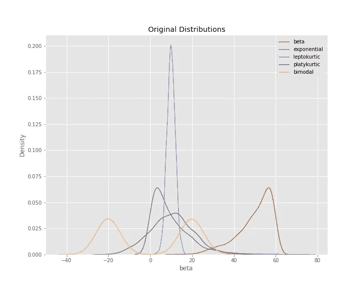
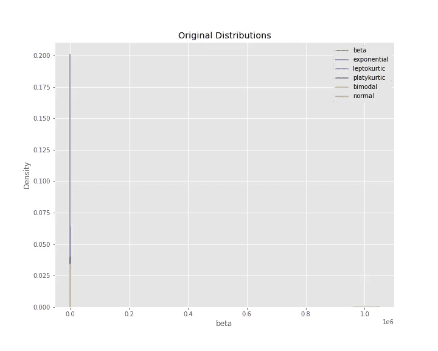
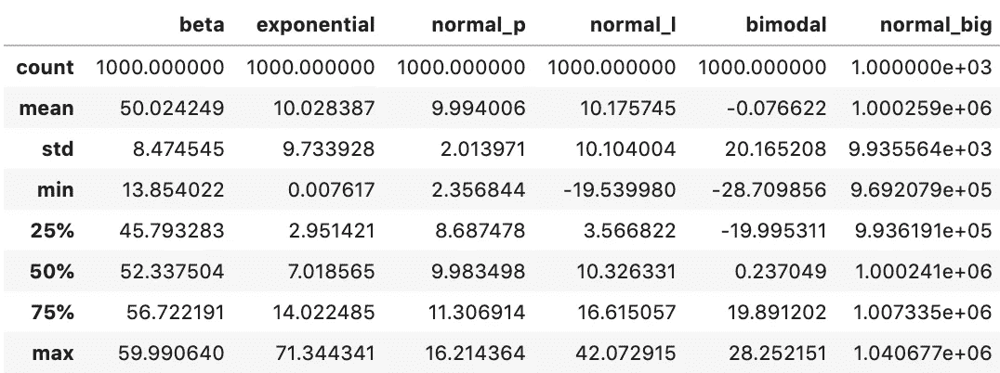
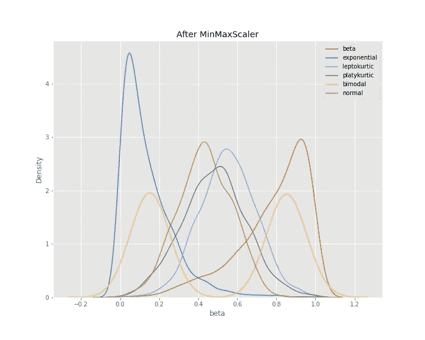
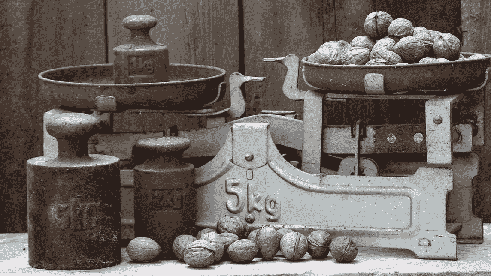
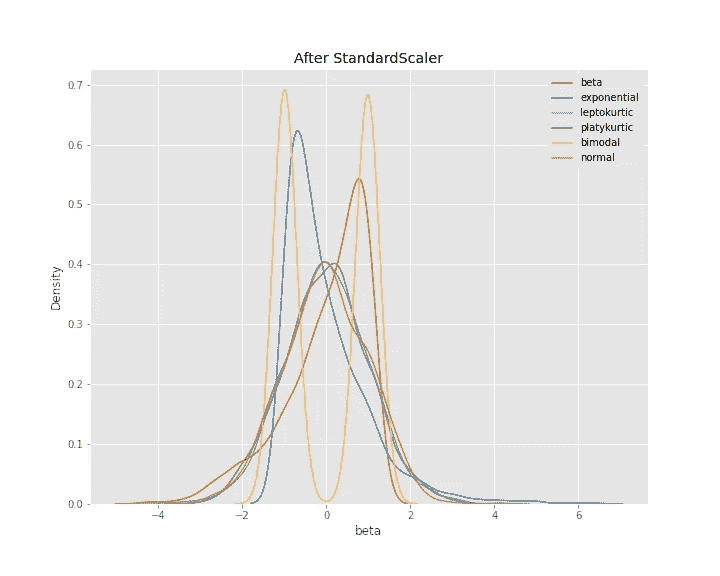
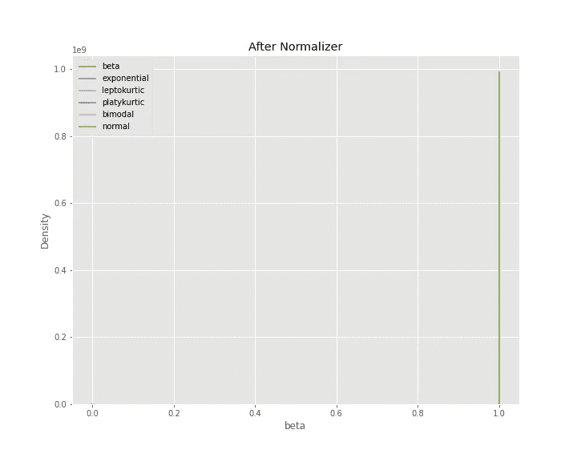
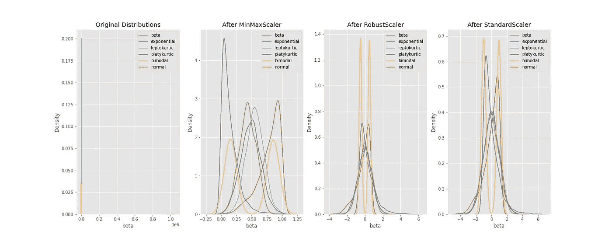
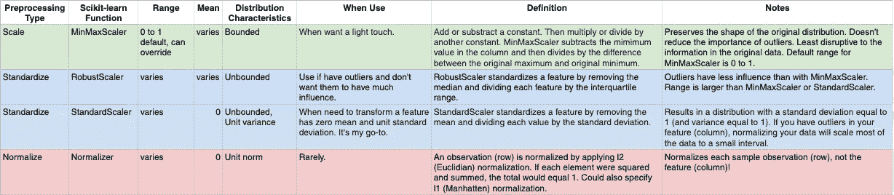

# 使用 Scikit-Learn 进行扩展、标准化或规范化

> 原文：<https://towardsdatascience.com/scale-standardize-or-normalize-with-scikit-learn-6ccc7d176a02?source=collection_archive---------1----------------------->

## 何时使用*最小最大缩放器*、*鲁棒缩放器*、*标准缩放器*和*规格化器*

当要素处于相对相似的规模并且接近正态分布时，许多机器学习算法会工作得更好。 *MinMaxScaler* 、 *RobustScaler* 、 *StandardScaler* 和 *Normalizer* 是 [scikit-learn](https://scikit-learn.org/stable/index.html) 方法，用于为机器学习预处理数据。您需要哪种方法(如果有)取决于您的模型类型和特征值。

本指南将重点介绍这些方法之间的差异和相似之处，并帮助您了解何时使用哪种工具。


Scales

这些方法经常出现在机器学习工作流中，我发现很难找到关于何时使用哪种方法的信息。评论员经常交替使用术语*标度*、*标准化*和*正常化*。然而，它们也有一些不同之处，我们将研究的四个 scikit-learn 函数做不同的事情。

首先，请注意以下几点:

*   这篇文章所基于的 Jupyter 笔记本可以在[这里](https://www.kaggle.com/discdiver/guide-to-scaling-and-standardizing)找到。
*   在本文中，我们不考虑对数变换或其他旨在减少误差异方差的变换。
*   本指南自 [scikit-learn v0.20.3](https://scikit-learn.org/stable/index.html) 起生效。

# 这些术语是什么意思？

[缩放](https://en.wikipedia.org/wiki/Scaling_(geometry))一般是指改变数值的**范围**。分布的形状不会改变。想想一个建筑的比例模型是如何与原始模型具有相同的比例，只是比例更小。这就是为什么我们说它是按比例绘制的。该范围通常设置为 0 到 1。

[标准化](https://en.wikipedia.org/wiki/Standard_score)通常是指改变数值，使分布的 ***标准*** 偏差等于 1。缩放通常是隐含的。

[Normalize](https://en.wikipedia.org/wiki/Normalization_(statistics)) 可以用来表示以上任何一种(以及更多！).我建议你避免使用术语 *normalize，*，因为它有很多定义，容易造成混淆。

如果你在交流中使用这些术语，我强烈建议你定义它们。

# 为什么要扩展、标准化或规范化？

当特征处于相对相似的规模和/或接近正态分布时，许多机器学习算法执行得更好或收敛得更快。这种算法族的例子包括:

*   线性和逻辑回归
*   最近的邻居
*   神经网络
*   具有径向偏向核函数的支持向量机
*   主成分分析
*   线性判别分析

缩放和标准化可以帮助这些算法以更易理解的形式获得特性。

我们正在检查的四个 scikit-learn 预处理方法遵循如下所示的 API。 *X_train* 和 *X_test* 是通常的数字数组或熊猫数据帧。

```
from sklearn import preprocessingmm_scaler = preprocessing.MinMaxScaler()
X_train_minmax = mm_scaler.fit_transform(X_train)mm_scaler.transform(X_test)
```

我们将查看一些发行版，并对它们应用四种 scikit-learn 方法中的每一种。

# 原始资料

我创建了四个具有不同特征的发行版。这些分布是:

*   **贝塔**——负偏斜
*   **指数**——正偏斜
*   **轻微型** —正常，轻微型
*   **板状软骨** —正常，板状软骨
*   **双峰** —双峰

这些值都具有相对相似的比例，如下面的内核密度估计图(kdeplot)的 x 轴所示。



然后我添加了第六个分布，它有更大的值(正态分布)——**正态**。

现在我们的 kdeplot 看起来像这样:



仔细看显示器，你可能会注意到右边有一个绿色的大数值小条。这是我们特征的描述性统计数据。



好吧，让我们开始缩放！

# 最小最大缩放器

对于特性中的每个值，[最小最大值缩放器](https://scikit-learn.org/stable/modules/generated/sklearn.preprocessing.MinMaxScaler.html#sklearn.preprocessing.MinMaxScaler)减去特性中的最小值，然后除以范围。该范围是原始最大值和原始最小值之间的差值。

MinMaxScaler 保留原始分布的形状。它不会有意义地改变嵌入在原始数据中的信息。

注意，MinMaxScaler 不会降低异常值的重要性。

MinMaxScaler 返回的特征的默认范围是 0 到 1。

下面是应用 MinMaxScaler 后的 kdeplot。



请注意这些特征是如何以相同的相对比例呈现的。每个要素值之间的相对间距保持不变。

MinMaxScaler 是一个不错的起点，除非您知道您希望您的要素具有正态分布，或者您有异常值，并且您希望它们具有较小的影响。



Different types of scales

# 鲁棒定标器

[RobustScaler](https://scikit-learn.org/stable/modules/generated/sklearn.preprocessing.RobustScaler.html) 通过减去中值，然后除以四分位数范围(75%值-25%值)来转换特征向量。


像 MinMaxScaler 一样，我们的具有大值的特征—*normal—big*—现在与其他特征具有相似的比例。请注意，RobustScaler 不像 MinMaxScaler 那样将数据缩放到预定的间隔。它不符合我前面介绍的*规模*的严格定义。

请注意，应用 RobustScaler 后，各功能的范围比应用 MinMaxScaler 时更大。

相对于最小最大缩放器，如果要减少异常值的影响，请使用鲁棒缩放器。

现在让我们转向 StandardScaler。

# 标准缩放器

StandardScaler 是业界公认的算法。🙂

[标准缩放器](https://scikit-learn.org/stable/modules/generated/sklearn.preprocessing.StandardScaler.html)通过减去平均值然后缩放至单位方差来标准化特征。单位方差是指所有值除以标准偏差。StandardScaler 不符合我前面介绍的*标度*的严格定义。

StandardScaler 产生标准差等于 1 的分布。方差也等于 1，因为*方差=标准差的平方*。而 1 的平方= 1。

StandardScaler 使分布的平均值约为 0。



在上图中，你可以看到所有四个分布都有一个接近于零的平均值和单位方差。这些值的比例相似，但范围比 MinMaxScaler 之后的更大。

深度学习算法通常要求零均值和单位方差。回归型算法也受益于小样本的正态分布数据。

现在让我们看看规格化器。

# 标准化者

[规格化器](https://scikit-learn.org/stable/modules/generated/sklearn.preprocessing.Normalizer.html)作用于行，而不是列！我觉得这很不直观。在文档中很容易遗漏这些信息。

默认情况下，L2 归一化应用于每个观测值，以便一行中的值具有单位范数。*具有 L2 的单位范数*意味着如果每个元素被平方并求和，则总和等于 1。或者，可以应用 L1(又名出租车或曼哈顿)归一化来代替 L2 归一化。



Normalizer 确实将所有特征转换为-1 和 1 之间的值(*此文本更新于 2019 年 7 月*)。在我们的示例中， *normal_big* 的所有值都转换为. 9999999。

你找到 Normalizer 的好用例了吗？如果有，请在 Twitter @discdiver 上告诉我。

在大多数情况下，上面的其他预处理工具会更有帮助。

同样，scikit-learn 的规格化器作用于行，而不是列。

# 比较

以下是应用最小最大缩放器、鲁棒缩放器和标准缩放器之前和之后的原始分布图。



请注意，在这三种变换中的任何一种变换之后，这些值的比例都是相似的。🎉

# 包装

扩展和标准化您的数据通常是一个好主意。我强烈建议在将数据输入深度学习算法之前，使用标准缩放器，或者使用依赖于观察相对距离的算法，或者使用 L2 正则化的算法。请注意，标准缩放会使回归系数的解释变得有点棘手。😉

## 小贴士:

*   如果希望每个要素都具有零均值、单位标准差，请使用 StandardScaler。如果您想要更多正态分布的数据，并且愿意转换您的数据。查看 scikit-learn 的`[QuantileTransformer(output_distribution='normal')](https://scikit-learn.org/stable/modules/generated/sklearn.preprocessing.QuantileTransformer.html)`。
*   如果你想轻触，使用 MinMaxScaler。它不失真。
*   如果您有异常值并希望减少它们的影响，您可以使用 RobustScaler。
*   谨慎使用规格化器——它规格化样本行，而不是特征列。它可以使用 l2 或 l1 归一化。

## 这里有一个我在谷歌表单中做的[备忘单，帮助你保持选项的直线性:](https://docs.google.com/spreadsheets/d/1woVi7wq13628HJ-tN6ApaRGVZ85OdmHsDBKLAf5ylaQ/edit?usp=sharing)



在本文中，您看到了 scikit-learn 如何帮助您对数据进行缩放、标准化和规范化。* * *我在 2021 年 8 月更新了这篇文章的图片和一些文字。感谢读者的反馈！***

深入研究的资源:

*   [这里有一个关于预处理数据的 scikit-learn 文档](http://scikit-learn.org/stable/modules/preprocessing.html#preprocessing-scaler)。
*   [这是另一篇关于 sci kit-learn scaler 对异常值的影响的文档](http://scikit-learn.org/stable/auto_examples/preprocessing/plot_all_scaling.html#sphx-glr-auto-examples-preprocessing-plot-all-scaling-py.)。
*   肖恩·欧文为概率分布提供了一个很好的指导。
*   [这是 Ben Alex Keen 的另一个比较这些功能的指南](http://benalexkeen.com/feature-scaling-with-scikit-learn/)。

我希望这个指南对你有所帮助。如果你有，请分享到你最喜欢的社交媒体频道。👏

我写关于 [Python](https://memorablepython.com) 、 [Docker](https://memorabledocker.com) 、 [SQL](https://memorablesql.com) 、[熊猫](https://memorablepandas.com)以及其他数据科学主题。如果你对这些话题感兴趣，阅读更多[这里](https://medium.com/@jeffhale)并关注我的 Medium。😃

[](https://dataawesome.com)

Scale on!