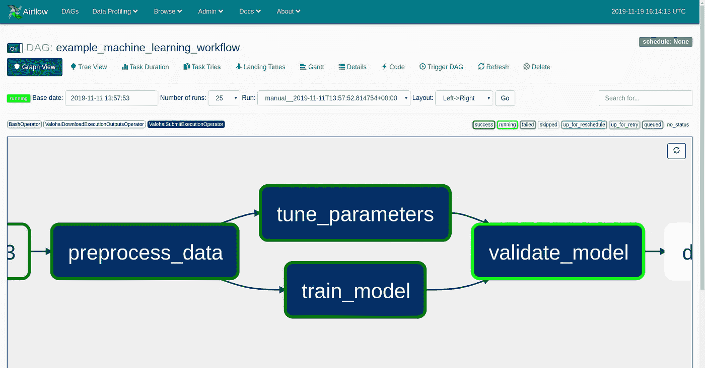
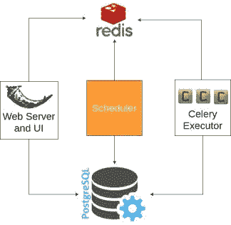
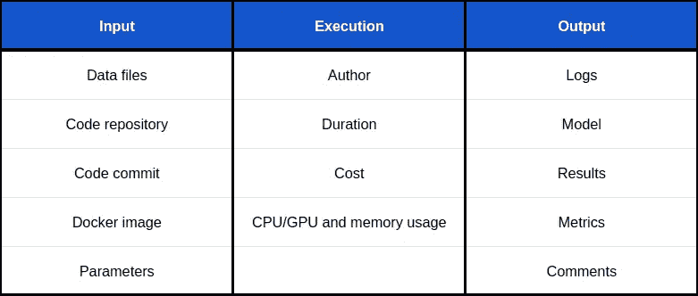
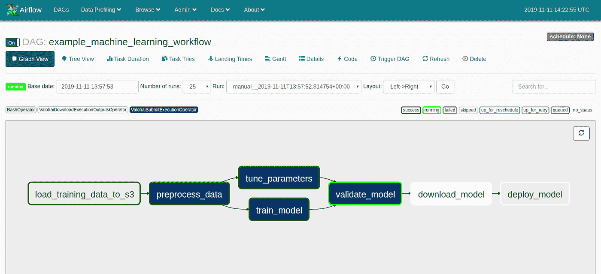
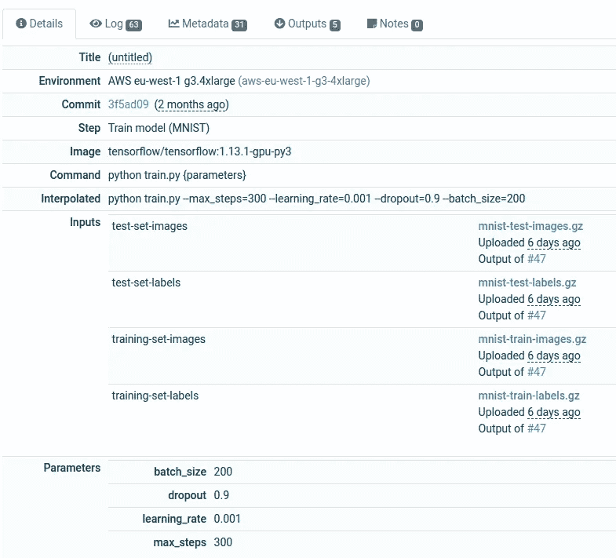
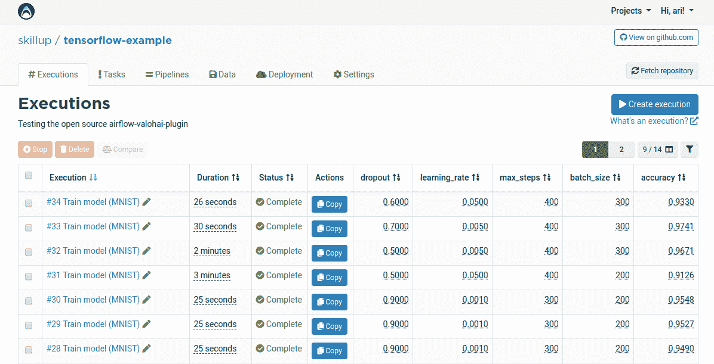

# 为机器学习工作流扩展 Apache 气流

> 原文：<https://towardsdatascience.com/scaling-apache-airflow-for-machine-learning-workflows-f2446257e495?source=collection_archive---------8----------------------->

## 了解如何在云上轻松执行 Airflow 任务，并获得每个机器学习任务的自动版本控制。

Apache Airflow 是一个用 Python 创建、调度和监控工作流的流行平台。它在 Github 上有超过 15k 颗星，被 Twitter、Airbnb 和 Spotify 等公司的数据工程师使用。

如果您使用的是 Apache Airflow，那么您的架构可能已经根据任务的数量及其需求进行了改进。在 Skillup.co 工作时，我们首先有几百个 Dag 来执行我们所有的数据工程任务。然后我们开始做机器学习。

我们希望继续使用气流来编排机器学习管道，但我们很快意识到我们需要一种解决方案来远程执行机器学习任务。

在本文中，我们将看到:

*   在气流中扩展工作节点的不同策略。
*   机器学习任务与传统 ETL 管道的不同之处。
*   如何在云上轻松执行气流任务？
*   如何获得每个机器学习任务的自动版本控制？

# 使用执行器扩展 Apache 气流

Apache Airflow 具有基于调度器、工作节点、元数据数据库、web 服务器和队列服务的多节点架构。

Example Airflow architecture.

使用气流时的首选之一是执行器的类型。执行器与调度器通信，在任务排队时为每个任务分配资源。遗嘱执行人之间的区别在于他们拥有的资源。

## 顺序执行者

默认的执行器使得在本地测试气流变得很容易。它在一台机器上顺序运行任务，并使用 SQLite 存储任务的元数据。

## 本地执行者

本地执行器可以并行运行任务，并且需要像 PostgreSQL 这样支持并行性的数据库。虽然您可以在生产环境中运行本地执行器，但通常会迁移到 Celery executor 来提高可用性和可伸缩性。

## 芹菜执行者

Celery executor 要求设置 Redis 或 RabbitMQ 来向工作人员分发消息。气流然后将任务分配给芹菜工人，他们可以在一台或多台机器上运行。这是我们在 Skillup.co 使用的执行器，能够运行多达 256 个并发数据工程任务。

## 库伯内特遗嘱执行人

Kubernetes 执行器为每个任务实例创建一个新的 pod。它允许您根据任务需求动态地伸缩。

# 与运营商一起扩展 Apache 气流

另一种扩展气流的方法是让操作员远程执行一些任务。2018 年，[杰西卡·拉夫林认为我们都在错误地使用气流](https://medium.com/bluecore-engineering/were-all-using-airflow-wrong-and-how-to-fix-it-a56f14cb0753)，正确的方法是只使用 Kubernetes 算子。她认为应该有一个单一的无 bug 操作符来执行任意任务，而不是一个不断增长的特定功能操作符列表。

## Kubernetes 算子

Kubernetes 操作员将在一个新的 pod 中启动一个任务。当您有一组需要定期运行的任务时，我发现只对有特定需求的任务使用 Kubernetes 操作符是一个更好的主意。

我认为 Kubernetes 操作符的主要问题是，您仍然需要理解 Kubernetes 配置系统并设置一个集群。例如，Dailymotion 在谷歌 Kubernetes 引擎上的一个集群中部署了 Airflow，并决定通过 KubernetesPodOperator *来扩展 Airflow 用于机器学习任务。*

在我们的案例中，我们是一个小型数据团队，几乎没有资源来建立一个 Kubernetes 集群。我们希望专注于构建机器学习模型，而不是管理基础设施。

# 机器学习任务与 ETL 任务有何不同？

在 Skillup.co，我们不得不作为一个小团队在一年内构建和部署几个数据产品。我们知道我们想要使用开源库来构建我们的模型，从经典的机器学习模型到深度学习。我们也在寻找一个机器学习平台来帮助我们**扩展和版本控制我们所有的模型**。

Airflow 在跟踪元数据数据库中的每个任务细节方面做得很好，但机器学习任务与 ETL 任务有不同的要求。机器学习任务与[数据、代码、环境、参数和指标](https://blog.valohai.com/how-to-track-machine-learning-experiments)相关联。这些信息不是由气流收集和显示的。Kubernetes 只在基础设施方面帮助你。

在一个地方收集每次执行的所有相关信息有助于调试机器学习模型。在下表中，你可以看到我们跟踪的信息，以更快地迭代机器学习模型。

Important information for machine learning version control.

# 我们对扩展机器学习任务的选择

你已经可以找到几个像谷歌数据流，亚马逊 SageMaker 和 Databricks 这样的机器学习平台的气流运营商。这些操作符的问题在于，它们都有不同的规范，并且仅限于在这些平台上执行代码。

在我们开始在 Skillup.co 做任何机器学习之前，我们将 Airflow 用于所有数据工程，这些工程主要由 Airflow *BashOperator* 调用的 Python CLIs 组成。

然后我们决定使用 [Valohai](https://valohai.com) ，一个基于开放标准构建的机器学习平台，帮助我们远程启动机器学习任务，并获得自动版本控制。

拥有一个混合解决方案使我们能够将敏感数据保存在我们的 Airflow 装置中，并将机器学习委托给 Valohai。

Machine learning workflow with an Airflow DAG. Blue tasks are executed remotely thanks to Valohai.

感谢 [Valohai 的开放 API](https://docs.valohai.com/valohai-api/index.html) ，我们开发了开源的 [airflow-valohai-plugin](https://github.com/skillupco/airflow-valohai-plugin) 来整合两个平台。去年，我们用它在生产中发布了四个机器学习模型。

## 瓦罗海算子

Valohai 运算符背后的思想类似于 Kubernetes 运算符。好处是你不需要理解 Kubernetes，你也可以获得机器学习的自动版本控制。

Valohai 将根据您的需求、代码和数据启动和停止云实例。Valohai 操作符只是在 Docker 容器中执行一个命令，轮询它的完成情况并返回最终的状态代码。

通过提供 Docker 映像和您的代码库，您可以执行任何语言和库的代码。你还可以访问 AWS、Google 和 Azure 中的 50 多个云环境。

要创建一个关于 Airflow 的任务，您只需要指定要执行的 Valohai 项目和步骤。如果需要，您还可以覆盖默认的云环境、输入和参数。

Sample code to submit an execution to Valohai from Airflow [[source](https://github.com/skillupco/airflow-valohai-plugin/blob/master/examples/dags/example_valohai_dag_pass_outputs.py)].

另一方面，您需要通过创建 valohai.yaml 在 Valohai 端进行一些简单的配置。 [valohai.yaml](https://docs.valohai.com/valohai-yaml/index.html) 作为一个配置文件来设置默认值，并验证机器环境、docker 映像、要运行的命令、参数和每次执行的输入数据文件。

从一开始就拥有机器版本控制有助于我们调试数据、代码和参数，从而更快地进行预测和修复。就像你希望你的气流任务是幂等的，以避免重新启动它们时的副作用一样，你希望你的机器学习模型基于代码和数据的审计版本。如果您总是使用存储在数据湖中的文件来训练您的模型，这很容易做到。下面你可以在 Valohai UI 中看到一个执行的解析配置。

Valohai UI with execution details [[source code](https://github.com/valohai/tensorflow-example)].

Valohai 建立在两个明智的选择之上，这两个选择使得它可以很容易地与任何编程语言和库集成。

首先，选择一个对所有编程语言通用的 CLI 优先接口。CLI 是一个流行的接口，用来包装您的函数，以便在本地执行它们。CLI 也是 Bash、Kubernetes 和 Valohai 操作符的接口。

第二，从标准输出中收集执行指标，而不是为每种语言安装一个定制的库。所有语言都有将 JSON 对象写入标准输出的工具。Valohai 将自动解析该对象，例如，帮助您比较每个模型的准确性。

Valohai UI to compare execution’s parameters and accuracy.

您还可以在 Valohai UI 中手动启动执行，而不会有任何副作用。在 Airflow 中，清除一个任务的状态将触发下游任务。

最后但同样重要的是，新的 Valohai 操作符允许您轻松地将一次执行的输出作为下一次执行的输入。这帮助我们创建了管道，数据在 S3 上自动版本化。此外，每个新的执行都在与 S3 bucket 相同的云提供商和区域上运行，这使得 Valohai 可以快速地将它下载到 AWS EC2 实例上。

# 结论

Apache Airflow 是创建、调度和监控工作流的强大工具，但它是为 ETL 任务而构建的。机器学习任务需要特定的资源，并且它们的执行细节应该受到版本控制。

如果你有资源来维护一个 Kubernetes 集群，你可以用 *KubernetesPodOperator* 来扩展机器学习任务。

如果你想专注于建立模型，你可以用[*ValohaiSubmitExecutionOperator*](https://github.com/skillupco/airflow-valohai-plugin)来缩放用于机器学习任务的气流。通过这种方式，您还可以通过 [Valohai](https://valohai.com) 获得每次执行的自动版本控制。

# 有用的资源

*   [阿帕奇气流文档](https://airflow.apache.org/)
*   [瓦罗海文档](https://docs.valohai.com/)
*   [KubernetesPodOperator 文档](https://airflow.apache.org/kubernetes.html#kubernetes-operator)
*   [ValohaiSubmitExecutionOperator 文档](https://github.com/skillupco/airflow-valohai-plugin)