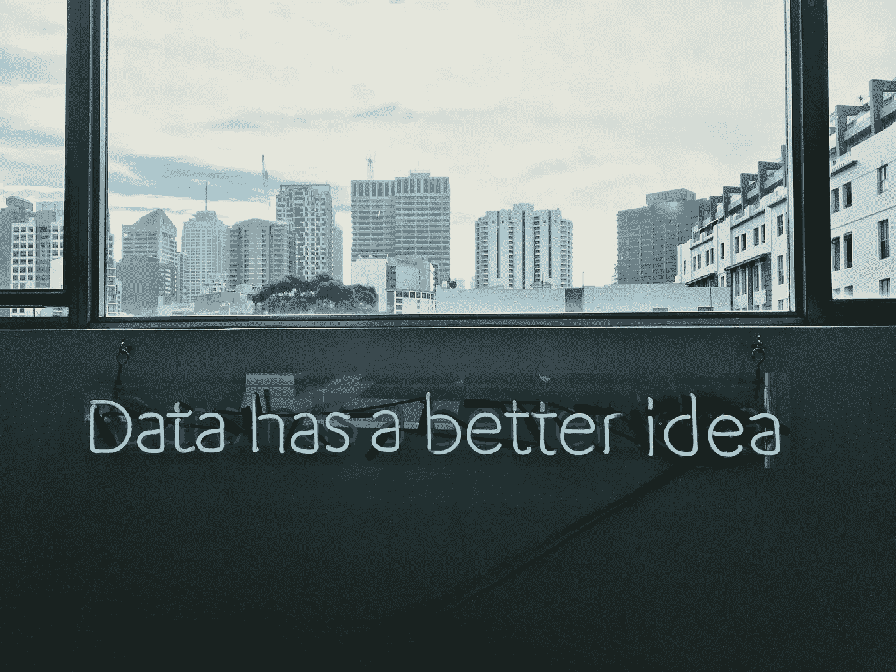

# 数字时代的稀缺

> 原文：<https://towardsdatascience.com/scarcity-of-the-digital-age-e0eafed6c2bf?source=collection_archive---------32----------------------->

## 焦点

## 如何分配 21 世纪最重要的资源

稀缺。这是我们必须做出决定的原因。我们不能拥有一切。尽管菜单上摆满了令人垂涎的菜肴，但我们知道我们(通常)不可能把它们都吃光。稀缺资源的其他例子是金钱、时间和精力。在本文中，我介绍了另一种稀缺资源，它的分配可能需要您的一些关注。

FOCUS

## 创新不能欺骗我们的大脑

我们的大脑以不同的方式关注我们周围的世界*。我们可以有选择地关注一个单独的观察。这需要主动忽略其他干扰物。我们也可以对多种输入给予不同的关注。*

*最近，我们正在处理比过去更多的感官输入。我们的生活变得如此简单，而我们的大脑似乎比以往任何时候都更忙碌。推荐系统确切地知道展示什么来引起我们的注意。*

## *认知的下一步:记忆*

*当我们确实关注某些感官输入时，目标是 ***处理*** 这个并从中获得一些价值。这里的价值可以是娱乐性的，也可以是知识性的。尽管如此，信息过载使处理变得更加复杂。*

**

*Screens, notifications, we are always ‘ON’*

## *信息过载与我们的大脑*

*因此，接收信息和处理信息都需要集中注意力。我们接触到的信息量越来越多，这就增加了我们关注焦点的需求。与此同时，我们不能简单地“增加”我们的关注。可以通过几种方法来提高注意力。然而，这并不容易，也不是无限的。这种不断增加的需求和固定的供给使我们专注于一种 ***稀缺*** 良好。*

## *如何找到稀缺商品的最优配置？*

*在经济学中，商品的最优配置是通过设定一个单位的附加值等于一个单位的附加成本来计算的。出现的问题是，焦点的 ***值*** 是什么？这无法用货币单位来衡量。专注带来进步和思维清晰，它帮助你完成任务。*

**

*Be guided by your values through the forest of information!*

## *从为什么开始*

*以西蒙·西内克为例，我们从为什么开始。‘你为什么要关注 x？’。为了衡量专注的价值，我看的是完成我所专注的任务的价值。是学习我感兴趣的东西吗？朝着我的个人或商业目标努力？*

## *价值观，兴趣，目标…*

*如果这些话让你畏缩，我很抱歉。这些概念对我来说也不算什么。然而，我决定认真对待它，并参加了“个人领导力”课程。发现我的个人价值，并将这些与我的兴趣和目标联系起来，帮助我专注于对我来说重要的事情。*

**

*Think deeply, then act.*

## *采取行动*

*无处可逃。尽管我建议花时间仔细思考你的价值观、兴趣和目标。你必须采取行动。采取行动将在两个方面帮助你进步:*

1.  *你前进*
2.  *你重新调整*

*要么你通过从经验、导师或课程中学习来提高，要么你意识到你必须做出调整。两者都向前迈进了一步。*

## *那么，如何分配你的注意力，战胜信息过载呢？*

*一旦你知道你需要什么样的输入，你就可以扭转这个故事，利用信息过载。利用你对自己需求和匮乏的意识，明智地使用你的注意力。*

**

*The solution is in the problem*

# *工业化信息处理*

*总结这篇文章，大量的数据让我们的注意力变得麻木。我们被娱乐、信息、社交信息等淹没了。所有这些输入都需要处理，而我们的认知过程无法处理。*

*信息处理是数据科学的全部内容。数据科学是将大量数据转化为有洞察力的信息的方法。最大的困难是让社会承认和使用数据科学。*

*一旦我们的社会变得有数据素养，我们就可以使用聚类和降维等技术来为我们处理信息。我们也可以建立模型来模拟势不可挡的过程。一旦这样的模型适合，我们可以调整输入来分析单一事件，而不是一次全部。*