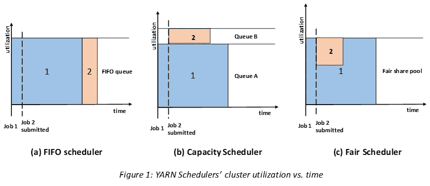
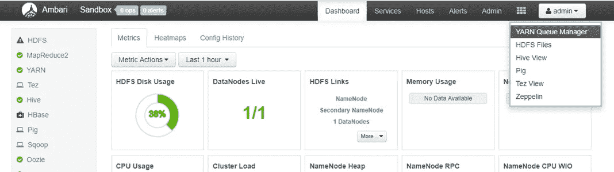
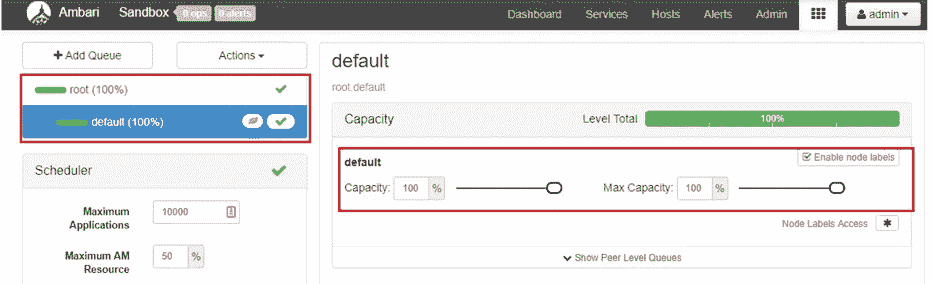
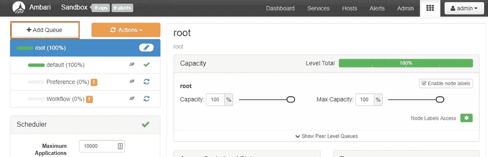
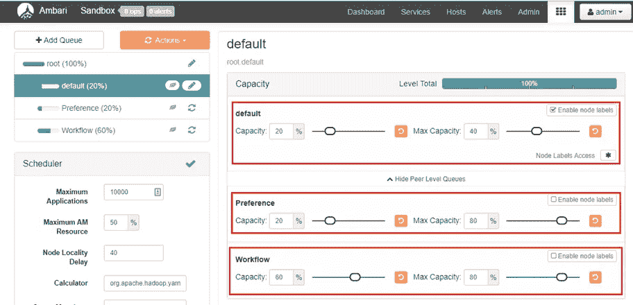
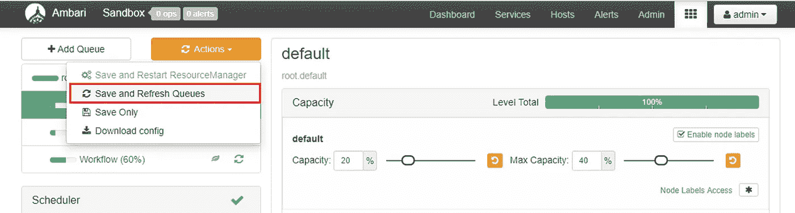

# 纱线中的调度器:从概念到配置

> 原文：<https://towardsdatascience.com/schedulers-in-yarn-concepts-to-configurations-5dd7ced6c214?source=collection_archive---------4----------------------->

## 先进先出，容量或公平调度，选择权在你。

Like this picture? See more [here.](https://www.instagram.com/bae_bilal/)

当我们开始深入大数据世界时，许多新词和缩略语开始出现——YARN 也是其中之一。Apache YARN(另一个资源协商者)是一个用于分布式计算范例的集群资源管理平台，它最常与 Hadoop 一起使用，但它也足够通用于其他平台。

在本文中，我们将不会把纱线作为一个整体来讨论，而是讨论它的一个很小但很重要的子集:调度。调度器通常处理提交给 YARN 的作业的资源分配。简而言之，例如，如果一个计算机应用程序/服务想要运行，并且需要 1GB 的 RAM 和 2 个处理器才能正常运行，那么 YARN scheduler 的工作就是根据定义的策略为该应用程序分配资源。

YARN 中有三种类型的调度器:FIFO、容量和公平。FIFO(先进先出)最容易理解，不需要任何配置。它通过将应用程序放入队列中，按照提交顺序运行应用程序。首先提交的应用程序首先获得资源，完成后，调度程序为队列中的下一个应用程序服务。然而，FIFO 不适合共享集群，因为大型应用程序将占用所有资源，并且队列将由于较低的服务率而变得更长。

Source: [Hadoop: The Definitive Guide](https://books.google.com.pk/books/about/Hadoop.html?id=bKPEwR-Pt6EC&printsec=frontcover&source=kp_read_button&redir_esc=y#v=onepage&q&f=false)

图 1 展示了三个调度器之间的区别。现在很明显，在 FIFO 的情况下，一个小任务会阻塞，直到大任务完成。Capacity scheduler 为小型作业维护一个单独的队列，以便在请求启动时立即启动它们。但是，这是有代价的，因为我们正在划分群集容量，因此大型作业将需要更多时间来完成。

公平调度器对预留容量没有任何要求。它动态地将资源平衡到所有接受的作业中。当一个作业启动时(如果它是唯一正在运行的作业)，它将获得群集的所有资源。当第二个作业启动时，它会在一些容器(容器是固定数量的 RAM 和 CPU)空闲时立即获得资源。小作业完成后，调度程序将资源分配给大作业。这消除了 FIFO 和容量调度程序中的两个缺点，即总体效果是以高集群利用率及时完成小型作业。

现在让我们来看看一些配置。我们在沙盒环境中使用 HDP 2.4(对任何 HDP 2.x 都有效)进行了这些配置。然而，默认情况下，Hortonworks 使用容量调度程序；Cloudera 默认是 Fair scheduler。合并后，他们仍然使用相同的惯例，保持业务如常，但这可能会在未来发生变化。

让我们假设您想要为您部门的需求配置能力计划程序。我们可以从将作业分为三类开始:默认、工作流和首选项。提交给调度程序的普通临时作业、摄取和 ETL 流程的工作流以及需要立即关注的任何作业的首选项的默认值。尽管 Hortonworks 默认的是容量调度器，但是您仍然可以通过使用一种叫做“*”的东西来模仿公平调度的行为。*

*首先，登录 Ambari web 控制台，从右上角的虚线菜单中选择纱线队列管理器。*

**

*在这里，您可以看到默认设置:只有一个队列(根)和一个子队列(默认)，当前分配了 100 %的资源。*

**

*接下来，点击 ***添加队列*** ，再添加两个作业队列。根据需要，您可以将资源分配给队列。*

**

*在这种情况下，让我们将 20%分配给默认值，它可以增加到 40 %，最需要资源的工作流可以获得 60–80%的资源，而 20%的首选项可以增加到 80 %,总计为 100%。*

**

*这就是我们所说的具有*队列弹性*的能力调度，例如，如果有人在优先队列中提交一个作业，它肯定会获得 20%的资源，而如果没有未完成的作业，它最多可以获得 80%的资源。保存您的更改以使其在操作菜单中生效。*

**

*以下是 Hortonworks 沙盒中容量调度程序的一些基本队列配置。*

*在结束之前，我将简单解释一下从采访角度来看很重要的先发制人的概念。如果一个队列占用的容器多于其合理的资源份额，而另一个作业正在等待其合理份额下的资源，抢占允许它从第一个队列中删除容器，并将其分配给第二个队列。然而，这是以降低集群效率为代价的。可以从`yarn.scheduler.fair.preemption` 属性启用抢占，并将其设置为`True`。*

*我想链接一下可以帮助理解纱线调度概念的参考资料。*

**1。* [*Hadoop:权威指南*](https://books.google.com.pk/books?hl=en&lr=&id=drbI_aro20oC&oi=fnd&pg=PR5&dq=hadoop+the+definitive+guide&ots=t-BmudnYe4&sig=13aEOtHxNm9HYWkSxihJgyVw1dk#v=onepage&q=hadoop%20the%20definitive%20guide&f=false)*

**2。* [*用 Apache Ambari*](https://hortonworks.com/tutorial/configuring-yarn-capacity-scheduler-with-apache-ambari/) 配置纱线产能调度器*

**3。* [*纱—产能调度*](https://hortonworks.com/blog/yarn-capacity-scheduler/)*

**4。* [*YARN 和 MapReduce 调度器*](https://www.cloudera.com/documentation/enterprise/5-8-x/topics/admin_schedulers.html)*

*[推特上的一个关注也许！](https://twitter.com/hassanmbilal)*