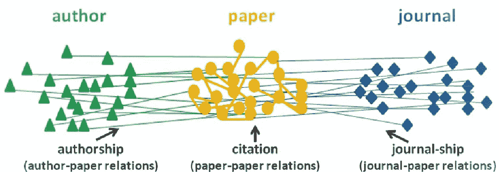
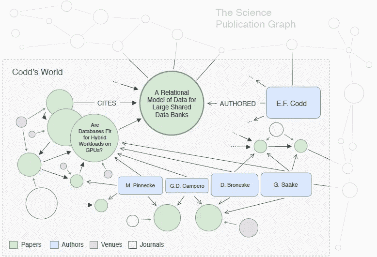

# 学术网络分析(SNA)

> 原文：<https://towardsdatascience.com/scholarly-network-analysis-22cd352c0f86?source=collection_archive---------15----------------------->

## [深入分析](https://medium.com/towards-data-science/in-depth-analysis/home)

## 科研网络研究导论

Photo by [Alfons Morales](https://unsplash.com/@alfonsmc10?utm_source=medium&utm_medium=referral) on [Unsplash](https://unsplash.com?utm_source=medium&utm_medium=referral)

R 科学和研究的飞速发展导致每天产生和收集大量的数字学术数据。这些学术数据可以是科学出版物、书籍、教材和许多其他学术信息源的形式。随着时间的推移，这些信息来源开始通过引用、合著在它们之间建立复杂的关系，并导致形成*大型学术网络*，这些网络变得越来越难以破解。

Figure 1: An Example of Heterogeneous Scholarly Network¹³

在这种情况下，学术网络分析(SNA)是对这一科学研究网络的研究，旨在发现有意义的见解，以实施数据驱动的研究决策。

**学术网络中的重要分析点**

考虑图 2 所示的原始图上的 SNA，至少有七个关注点:

Figure 2: Overview of Scholarly Network Analysis on raw graphs¹⁴

1.  **在论文上合作的作者(合著网络)**

合著网络分析可用于发现作者之间的科学合作，描绘作者的个体科学想法如何通过合作聚集在一起，以引起科学发现的爆炸。

2.**相互引用的文档(引用网络)**

**3。被共同引用的文献(共引网络)**

引用和共引网络分析用于发现被引用论文和引用这些论文的一组论文之间的关系。这在作为网络分析的基本任务之一的社区检测中证明是有用的。

4.**以类似方式引用其他文件的文件(书目耦合)**

书目耦合还包括引文分析，以查找在 bibliography⁴.中引用第三次引用作品的文献

5.**文档集中的内容聚类(主题网络)**

从底层网络中提取主题有助于发现当前的研究领域及其随时间的演变。

6.**一起出现的词群(共词)**

共词 analysis⁵通过发现关键词的共现来帮助识别特定研究领域中主题之间的关系。

7.**类型和关系的多样性(异构网络)**

异构网络 analysis⁶,⁷涉及两个或多个耦合网络的研究。例如，通过耦合合著和引文网络，发现引文随时间的演变或未来的引文。

那么，如何从学术网络分析开始呢？

基于分而治之的方法，SNA 的第一个起点是从大的出版网络中缩小范围并创建一个可管理的学术网络图。该学术图表可以基于从学术数据库收集的信息，以我们当前的研究领域(如数据库、数据科学、机器人、能源)为重点创建，可用的学术图表如 DBLP⁸作为计算机科学的书目数据库，微软学术 Graph⁹.这进一步需要一个公式化的设计方法来策划最终的学术图表进行分析。可以考虑一个起点，其可以包括从基础研究论文节点开始，通过爬行相关节点来形成学术图。

一旦我们创建了最终的图表，下一步包括制定要回答的研究问题，并相应地设计分析的切入点。根据数据所需的信息，可以有不同的入口点。其中一些包括发现网络中的潜在主题，基于引用计数或作者联系信息的分析。

图 3 描绘了在名为 *Codd 的世界*的数据库发布网络的子集上执行的一个这样的 SNA 的概述，其中学术图从 *Edgar Codd 关于关系数据库⁰* 的基础论文开始创建，并利用入口点*来发现网络中的底层主题(主题建模)*以基于主题及其在数据库社区发布图中的演变来驱动进一步的分析。此外，利用不同切入点的一些其他 SNA 研究实例包括分析引用关系以评估给定论文或作者的影响，或研究合著者行为以确定科学界分布。

Figure 3: Scholarly Network Analysis on the heterogeneous network *named as* Codd’s World¹⁴

> 本文作为学术网络分析主题的介绍性文章，分享了科学 SNA 研究工作出版物 [*Codd 的世界:数据库社区出版物 Graph*](http://ceur-ws.org/Vol-2367/paper_3.pdf) *中的主题及其演变，作者为* Rutuja Shivraj Pawar、Sepideh Sobhgol、Gabriel Campero Durand、Marcus Pinnecke、David Broneske 和 Gunter Saake，德国马格德堡奥托-冯葛利克大学

**参考文献**

[1]夏风，王巍，特肖梅格尔萨贝克勒和刘欢。大学术数据:一项调查。IEEE 大数据汇刊，3(1):18–35，2017。

[2]黄子豪和毛。用于理解学术合作和单个研究人员的知识领域的合著网络的分析和可视化。计算机图形学，成像和可视化，2006 年国际会议，18-23 页。IEEE，2006 年

[3]萨特里奥·巴斯库洛·尤多阿特莫霍和穆罕默德·李北·萨穆尔。基于 linkrank 算法的 dblp 数据样本集引文网络社区发现。Procedia 计算机科学，124:29–37，2017。

[4]凯文·博亚克和理查德·克莱文斯。共引分析、书目耦合和直接引用:哪种引用方法最准确地代表了研究前沿？

[5]秦和。透过共词分析的知识发现》1999

[6]严尔嘉和丁樱。学术网络分析。《社会网络分析和挖掘百科全书》,第 1643-1651 页。斯普林格，2014。

[7]严尔嘉和丁樱。学术网络的相似性:书目耦合网络、引用网络、共同引用网络、主题网络、共同作者网络和共同词汇网络如何相互联系。美国信息科学与技术学会杂志，63(7):1313–1326，2012

8 迈克尔·莱伊。dblp 计算机科学书目:进化，研究问题，观点。在字符串处理和信息检索国际研讨会上，第 1-10 页。斯普林格，2002 年。

[9]阿纳·辛哈、、、达林·艾德、许宝俊和王宽山。microsoft 学术服务(mas)和应用程序概述。《第 24 届万维网国际会议论文集》，第 243-246 页。美国计算机学会，2015。

[10]埃德加·F·科德。大型共享数据库的数据关系模型。美国计算机学会通讯，13(6):377–387，1970 年。

[11]马克·纽曼.网络.牛津大学出版社，2018 年。

[12]，，，，，张，，等。挖掘学术大数据中的顾问-被顾问关系:一种深度学习方法。第 16 届 ACM/IEEE-CS 数字图书馆联合会议论文集，第 209-210 页。ACM，2016。

[13]严，尔嘉，，和。" P-Rank:衡量异质学术网络声望的指标."贾斯特 62(2011):467–477。

[14] Pawar，R.S .，Sobhgol，s .，Durand，G.C .，Pinnecke，m .，Broneske，d .和 Saake，g .，2019 年。Codd 的世界:数据库社区出版图中的主题及其演变。在 *Grundlagen von Datenbanken* (第 74–81 页)。