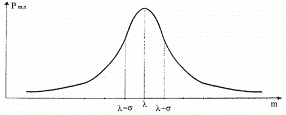
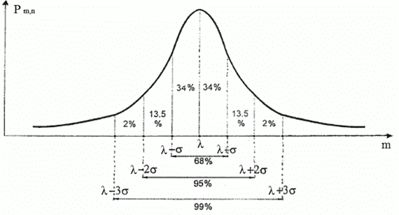
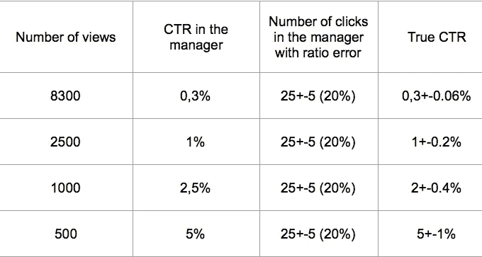
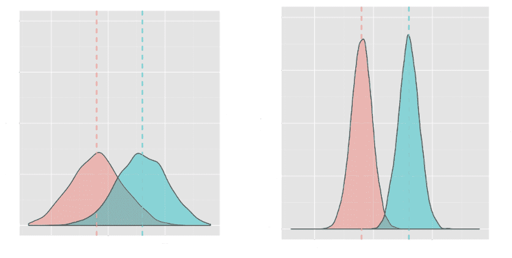

# 脸书广告的科学方法

> 原文：<https://towardsdatascience.com/scientific-approach-to-facebook-ads-661ce129bf38?source=collection_archive---------17----------------------->

## 需要多少次浏览才能确定新创意不起作用，设计师们又一次不得不为他们的晚餐而歌唱？有多少浏览网站的用户意识到弹出购买按钮是个坏主意？

[unsplash.com](https://unsplash.com/photos/AGqzy-Uj3s4)

***这篇文章是为谁写的***

从事广告活动和登录页面有效性优化的专家总是发现他们自己在问完全相同或相似的问题。对于那些用于测试新渠道和假设的计划预算也是如此。在寻找答案的时候，你可以依靠直觉，但是最好回到概率论的基础上，让你计算出所需的顺序。

***引入术语***

直觉表明，测试时间越长(在其他条件相同的情况下)，结果就越精确。但是*更精确*是什么意思，什么时候会变得足够精确？为了回答这些问题，让我们通过广告浏览量和点击量来介绍一些概率论术语。

让一个随机事件成为我们广告的单一视图。这种事件有两种结果:用户要么点击具有 CTR 概率的广告，要么不点击具有 100% CTR 概率的广告。

一个随机的点击数被记录在一系列默认长度的视图中，这个数字就是我们的随机值。因为，如果我们再次用同样数量的视图重复这个实验，我们会得到不同数量的点击。我们永远也不能提前说出准确的点击次数，但我们可以通过计算一系列视图的点击期望来推测。

我们只需要将一次浏览中的点击概率，即我们的点击率，乘以适当的浏览次数。例如，当点击率为 1%时，250 次浏览的点击率期望值为 2.5。按照纯粹的逻辑，我们理解一半的用户(可能是美人鱼？)不会点击我们的广告，因此在广告管理器中，我们会看到大约两三次点击。

但是，如果我们继续测试我们的 250 个视图系列，并记录每个系列的点击数，我们将得到一个接近预期的平均值。这里，这种实验的次数越多，平均值就越接近预期值。这是对符合我们直觉的概率论大数定律的一种相当轻率的解释。

***导致需要计算置信区间***

你可能会问:“很明显，精确是指接近期望(即，一个更小的变量范围)，但我们为什么需要这个？”

在广告管理器中，如果有一千次点击，我们会得到十次点击，系统会自豪地说点击率是 1%。高兴得要命，我们会去旅行，但回来后我们会发现，在第一次数千次浏览后，点击率只有 0.6%。真是一团糟！但是，当然，我们既没有考虑到观众，也没有考虑到创作倦怠。问题是，你的第一千次浏览比平均水平要好，经理显示的点击率与实际相差甚远。但是随着一系列更长的观点，它接近了它的真正价值。单独使用 CTR 很方便，因为它不依赖于视图的数量。它的精确程度直接取决于点击次数的精确程度。

作为一个真正的 CTR，我会考虑我们在文章开头定义随机事件时提到的概率。因为该值被设置为无穷大，并且广告管理器中的 CTR 倾向于在延长一系列视图时达到该值，因为真实的 CTR 被用于计算点击期望。

预测你创意的未来效果需要了解真实的 CTR。但这是不可能的(除非你的预算是无穷无尽的)，因此你只能通过钥匙孔进行窥探。用数学术语来说，真实 CTR 的潜在范围可以根据我们用测试预算购买的数据来粗略估计。现在是公式登场的时候了。

***关于泊松分布***

一个意想不到的免责声明:不要把这篇文章当作精确计算的正式指南。它的科学特性只是用来粗略地计算。

泊松分布可以帮助定义在 n 个视图上获得 m 次点击的概率，

其中 p 是真实的 CTR，λ是从真实的 CTR 和 n 个视图中得出的，是对这种大小的采样的点击期望。不幸的是，这只适用于 10 阶的λ，这会降低所有进一步计算的精度。

但是不要害怕公式，因为我们只需要它的图形

该图显示了 n 次浏览的真实点击率转化为随机点击数的概率。您可能会看到概率峰值的形式，以及在 n 个视图上的点击期望及其在峰值上的近似值。在图表的底部(或峰值的根部),当点击数量远离预期时，我们的一系列视图的实现可能性较小。因此，确定一系列视图的点击数的可能值的范围意味着确定我们的峰值有多宽。

随机值相对于其期望值的程度范围称为离差，其根是标准偏差(图上的 s ),实际上决定了峰宽。

最终，为了进行计算，需要弄清楚实现一系列视图的概率是在顶部还是在底部。换句话说，某个样本的点击量不会超过期望值的标准差的概率是多少？而恰好是 70%左右。

***计算置信区间***

有问题的音程，

被称为置信水平为 70%的置信区间。我们将进一步关注它。

我们非常幸运，因为*泊松分布的离差等于它的期望，即等于* λ，以及标准偏差值——等于λ的根。因此，70%置信区间如下

假设我们广告的真实点击率是 1%，那么 900 次点击的预期点击率就是 9。因此，我们有

这意味着，在 900 次浏览后，70%的情况下，我们将获得 6 到 12 次点击(9 次仍然是最有可能的)。将这些值除以浏览量，我们很容易猜到广告经理显示的点击率在 0.67%到 1.33%之间。在 ads 管理器中，这个范围可以称为 CTR 的置信区间。

因此，如果你对点击率超过 1%感到满意，而你的前 900 次浏览没有幸运地获得 0.67%的点击率，那么这个在未来会表现良好的广告可能会被不必要的删除。在这种情况下，测试期应该被延长。

但是等等，你很可能会问为什么我们要预测真实的点击率，并在此基础上做出结论，如果事实上任务恰恰相反——在广告管理器的点击率基础上定义潜在的真实点击率。你是对的。从技术上来说，这样的计算应该更复杂，但最终它会在上述相同的领域结束。所以，不要害怕表面上的困难。现在让我们对提到的每件事做一个简短的总结。

***间歇结论***

理解误差比比理解置信区间更容易，置信区间中的比率误差是期望偏差与正确期望的比率。在我们的情况下，我们有

除了与我们没有包括在 70%置信区间中的 30%的情况相关的误差之外，前面提到的例子的误差率不小于 33%。在这 30%中，我们可以得到不包含在置信区间中的任意随机点击数。

那么，我们得出的结论是什么？例如，我们可以得出结论**测试的准确性(即比率误差的小)不取决于累积的随机事件的数量，而是取决于成功的数量，或者不取决于查看的数量，而是取决于点击的数量。**

这就是为什么没有共同的边界来决定进行测试的正确程度。如果除了从测试运行依赖的持续时间来谈论登录页面，我们需要提到 CTR 依赖和转换依赖。但是你必须随时准备好自己定义每个特定案例的边界。

就固定的真实 CTR 值而言，精确度随着视图数量的增加而增加。让我回忆一下，点击期望值是通过将固定的真实点击率值乘以点击次数来确定的，并向您显示，当点击期望值增加时，错误率在下降

此外，您可能会注意到下降的以下规律性— **我们测试的时间越长，准确性增长得越慢，**意味着测试应该按时结束。否则，时间和预算就没有得到有效的利用。

但是*准时*是什么意思呢？要求的准确度是多少？那要由你来决定。唯一可以确定的是，在点击 25-30 次之后，准确率会以一种非常缓慢的速度增长。

***一个逆向任务***

让我们回到计算置信区间，并最终弄清楚如何在广告管理器中粗略地绘制潜在的真实点击率。

我们已经确定，在广告管理器中，n 个视图的真实 CTR 有 70%的概率被实现为相关置信区间内的一个值，这意味着管理器中的每个 CTR 是各种真实 CTR 的过多置信区间的一部分。我们只需要确定哪些最小和最大真实点击率可以在我们的经理身上实现(具有给定的准确度)。长话短说，我们需要找到这样的真实点击率，它们与经理的点击率在置信区间的边界上相对应。

因此，看看广告经理，在那里看到一定的点击率，我们将最终回答关于我们广告的潜在真实点击率的问题。答案将是真实 CTR 的范围

让我们通过将上面提到的图片翻译成点击期望的语言来找出 CTR1 和 CTR2，回忆置信区间的宽度。因此，λ是广告管理器中的点击次数，而带有数字的λs 对应于 CTR1 和 CTR2

等式的左边部分对应于左置信区间的右边界。它的右边部分是右音程的左边界。他们的交汇点正好对应我们的点击量。

这是方程式的解

可能看起来很恶心。但是如果管理器中的点击次数明显大于 1，就可以丢弃它，这样解决方案就相当不错了。因此，点击次数的计算置信区间为

看起来是不是很眼熟？所以，结果是我们不需要解任何方程，因为在精确度上有一点点误差，我们已经把逆向任务转换成了直接任务。

***例证***

好吧，让我们用一个恰当的例子来说明上述的方法。

1.  我们在管理器中看到每 1000 次点击有 25 次。系统会为我们计算点击率。也就是 2.5%。
2.  现在我们计算点击次数的平方根。因此，我们得到了我们的标准差，即置信区间的宽度。对我们来说，是 5。
3.  然后我们计算点击次数的置信区间(25–5；25+5)= (20;30)
4.  然后我们计算真实 CTR 的相关区间。我们只需将之前计算的值除以点击次数(并计算百分比)(2%；3%)
5.  利润

顺便说一下，评估测试准确度的程度需要误差比，误差比是通过将标准偏差除以点击次数来计算的

***基准表***

为了方便起见，我会在下面放一个表格，说明上面提到的所有内容，并展示广告测试所需的浏览次数(一组 25 次点击，之后准确度会慢慢增加),具体取决于其 CTR

***AB 测试***

如果在你看来，70%的置信区间加上 20%的误差率给出了相当不准确的结果，欢迎你使用宽度不是两倍而是四倍于标准差的 95%的置信区间。在这种情况下，我们需要用点击次数的根来代替它的双倍值。所以，20%的相对准确度将在 100 次点击时达到。

上述推理很可能为测试持续时间设置一个理论下限。对于较短的测试，样品将没有代表性。然而，我们很少对适当测试的准确性感兴趣，因为我们通常需要将我们的结果与默认结果进行比较，例如，在媒体计划中详细说明或通过其他(已经测试过的)广告获得的结果，或者与 A/B 测试中第二个变量的结果进行比较。

就第一种情况而言，如果测试结果即使在置信区间的上界也不令人满意，测试可以提前完成。例如，如果我们有 9 次点击率为 0.9%的点击，而真实点击率的 70%范围是(0.6%；1.2%)而我们需要不低于 2%的点击率，等待 25 次点击是没有用的。达到这种结果的机会非常小，因为即使是 95%的真实 CTR 范围也只有(0.3%；1.5%).

在 A/B 测试的情况下，有两个图形有自己的宽度。测试的准确度取决于它们重叠的程度(指数随时间变化)。你可能会问为什么。事情是这样的，在某个特定的时刻，我们变量的每一个结果看起来都像图表上的一条垂直线(或者水平轴上的一个点)。如果这种重叠很大，在某个时刻，左边的结果可能实际上属于右边的图，而右边的结果属于左边的图。如果我们提前完成测试，我们将选择一条死路，尽管在那一刻它似乎是一条胜利之路。左图上的测试准确度与右图相比还有很大的差距。

然而，电子邮件营销或 UX/XI 专家可以在他们专业工具的界面上计算 A/B 测试的程度，或者至少使用在线服务。因此，与广告经理打交道的人以及因此进行大量 A/B 测试的人可以使用下面的建议。

计算图表的准确交叉点是一项具有挑战性的任务，因此我们只能根据真实 CTR 范围的交叉点做出决定。在这种情况下，最好使用 95%的间隔。如果最初相关区间彼此远离，我们可以提前完成测试。但是，如果它们重叠，我们应该继续进行测试，直到缺少重叠的时刻或达到代表性抽样的时刻。代表性的程度取决于重叠的程度。如果 90%的区间重叠，而 70%的区间不重叠，那么每个变量点击 30 次就足够了。但是，如果 70%的区间也重叠，这意味着各种变体的有效程度彼此非常接近，那么没有一百次点击就不行。

***结案陈词***

最后，我要提醒你的是，上面提到的一切都可能在漏斗的任何阶段使用，不仅适用于视图(条目)和点击，也适用于从销售线索到购买的转化。唯一的保留是指泊松分布，因为它只对低概率的随机值有效。因此，我们将无法使用我们的方法来实现从填充铅表格的一行到另一行的高转换系数。

很有可能将漏斗作为一个整体来分析，即从广告点击到整个漏斗的最终转化的转化准确率，尽管中间有过多的微转化。因此，我们只需要将我们的随机事件称为广告点击，将结果称为最终的转化或缺乏转化。这最终有助于我们定义(我不能说计算)必要的方法，根据随机事件的相同 25-30 个成功结果，通过媒体规划进行假设检验。