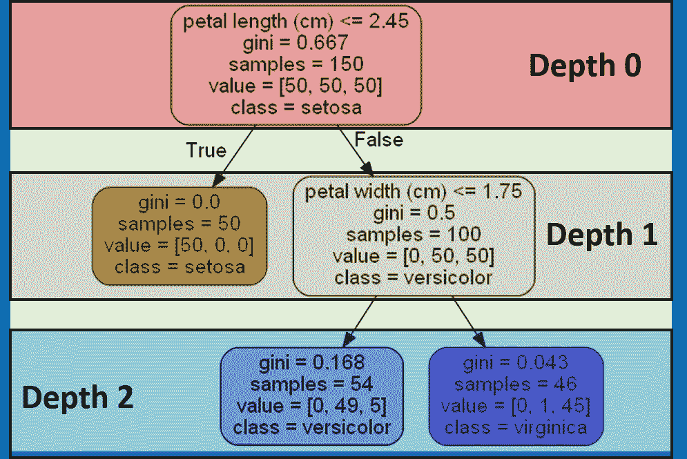

# sci kit-学习决策树解释

> 原文：<https://towardsdatascience.com/scikit-learn-decision-trees-explained-803f3812290d?source=collection_archive---------0----------------------->

## 使用决策树进行训练、可视化和预测

Photo by [Lukasz Szmigiel](https://unsplash.com/@szmigieldesign?utm_source=unsplash&utm_medium=referral&utm_content=creditCopyText) on [Unsplash](https://unsplash.com/search/photos/tree?utm_source=unsplash&utm_medium=referral&utm_content=creditCopyText)

D 决策树是随机森林中最重要的元素。它们能够拟合复杂的数据集，同时允许用户看到决策是如何做出的。当我在网上搜索的时候，我找不到一篇清晰的文章可以很容易地描述它们，所以我在这里写下我到目前为止学到的东西。值得注意的是，一个单独的决策树不是一个很好的预测器；然而，通过创建它们的集合(森林)并收集它们的预测，可以获得最强大的机器学习工具之一——所谓的随机森林。

`Make sure you have installed pandas and scikit-learn on your machine. If you haven't, you can learn how to do so [here](https://medium.com/i-want-to-be-the-very-best/installing-keras-tensorflow-using-anaconda-for-machine-learning-44ab28ff39cb).`

# Scikit 学习决策树

让我们从使用 [iris 花卉数据 se](https://en.wikipedia.org/wiki/Iris_flower_data_set) t 创建决策树开始。iris 数据集包含四个特征、三类花卉和 150 个样本。

**功能:**萼片长(厘米)、萼片宽(厘米)、花瓣长(厘米)、花瓣宽(厘米)

**类:**刚毛藻、云芝、海滨草

从数字上看，刚毛花用 0 表示，杂色花用 1 表示，海滨花用 2 表示。

为简单起见，我们将使用所有特征训练决策树，并将深度设置为 2。

# 可视化决策树

当然，我们仍然不知道这个树是如何对样本进行分类的，所以让我们通过首先使用 Scikit-Learn[export _ graphviz](https://scikit-learn.org/stable/modules/generated/sklearn.tree.export_graphviz.html)模块创建一个点文件，然后使用 [graphviz](http://graphviz.org/) 处理它来可视化这个树。

这将创建一个名为 tree.dot 的文件，需要在[*graphviz*](http://graphviz.org/)*上进行处理。*这里有一个 [YouTube 教程](https://www.youtube.com/watch?v=RYm8lskGiYk)向你展示如何用 graphviz 处理这样一个文件。最终结果应该类似于**图-1** 所示；但是，即使训练数据相同，也可能会生成不同的树！

**Figure-1) Our decision tree:** In this case, nodes are colored in white, while leaves are colored in orange, green, and purple. More about leaves and nodes later.

单一决策树是一种被称为*白盒*的分类器的经典例子。白盒分类器做出的预测很容易理解。这里有一篇关于黑白盒分类器的优秀[文章](https://www.linkedin.com/pulse/white-box-black-choosing-machine-learning-model-your-vidyadhar-ranade/)。

# 了解节点的内容

在**图-1** 中，可以看到每个盒子都包含几个特征。让我们从描述最顶层节点的内容开始，最常见的是称为*根节点*。根节点深度为零，参见**图-2** 。节点是决策树上的一个点，在这里提出一个问题。该操作将数据分成更小的子集。

**Figure-2) The depth of the tree:** The light colored boxes illustrate the depth of the tree. The root node is located at a depth of zero.

**花瓣长度(cm) < =2.45:** 决策树问的第一个问题是花瓣长度是否小于 2.45。根据结果，它要么遵循正确的路径，要么遵循错误的路径。

**Gini = 0.667:**Gini score 是一个量化节点/叶子纯度的指标(一点关于叶子的更多内容)。大于零的基尼系数意味着包含在该节点内的样本属于不同的类别。基尼系数为零意味着该节点是纯的，在该节点中只存在一类样本。你可以在这里找到更多关于杂质测量[的信息。请注意，我们的基尼系数大于零；因此，我们知道包含在根节点中的样本属于不同的类。](https://www.bogotobogo.com/python/scikit-learn/scikt_machine_learning_Decision_Tree_Learning_Informatioin_Gain_IG_Impurity_Entropy_Gini_Classification_Error.php)

**samples = 150:** 由于 iris flower 数据集包含 150 个样本，因此该值设置为 150。

**value = [50，50，50]:**`value`列表告诉你在给定的节点上有多少样本属于每个类别。列表的第一个元素显示属于 setosa 类的样本数，列表的第二个元素显示属于 versicolor 类的样本数，列表的第三个元素显示属于 virginica 类的样本数。注意这个节点不是一个纯粹的节点，因为不同类型的类包含在同一个节点中。我们已经从基尼系数中知道了这一点，但是真的看到这一点还是很好的。

**class = setosa:**`class`值显示给定节点将做出的预测，它可以从`value`列表中确定。节点中出现次数最多的类将被选为`class`值。如果决策树在根节点结束，它将预测所有 150 个样本都属于 setosa 类。当然这没有意义，因为每个类都有相同数量的样本。在我看来，如果每个类别的样本数量相等，决策树被编程为选择列表中的第一个类别。

# 理解树是如何分裂的

为了确定使用哪个要素进行第一次分割(即生成根结点)，该算法选择一个要素并进行分割。然后，它会查看子集，并使用基尼系数来衡量它们的不纯度。它对多个阈值这样做，并确定给定特征的最佳分割是产生最纯子集的分割。对训练集中的所有特征重复这一过程。最终，根节点由产生具有最纯子集的分裂的特征来确定。一旦确定了根节点，树的深度就会增长到 1。对树中的其他节点重复相同的过程。

# 理解一棵树如何做出预测

假设我们有一朵花，有`petal_length = 1`和`petal_width = 3`。如果我们遵循**图-1** 所示的决策树的逻辑，我们会看到我们最终会出现在橙色框中。在**图-1** 中，如果一个节点问的问题结果是真(假)，我们就向左(右)移动。橙色框深度为 1，参见**图-2** 。因为这个盒子里没有东西生长出来，所以我们称它为*叶节点*。注意这与真实的树有相似之处，参见**图-3** 。此外，请注意基尼系数为零，这使它成为一片纯粹的树叶。样本总数为 50。在结束于橙色叶节点的 50 个样本中，我们可以看到它们都属于 setosa 类，参见这个叶的`value` 列表。因此，树将预测样本是 setosa 花。

**Figure-3) Real tree vs Decision Tree Similarity:** The tree on the left is inverted to illustrate how a tree grows from its root and ends at its leaves. Seeing the decision tree on the right should make this analogy more clear.

让我们挑选一个更有趣的样本。比如`petal_length = 2.60`和`petal_width = 1.2`。我们从询问花瓣长度是否小于 2.45 的根节点开始。这是假的；因此，我们移至右侧的*内部节点*，这里基尼系数为 0.5，样本总数为 100。这个深度为 1 的内部节点会问“*花瓣宽度小于 1.75* 吗？”在我们的例子中，这是真的，所以我们向左移动，最后到达深度为 2 的绿色叶子节点。决策树会预测这个样本是杂色花。你可以看到这是最有可能的情况，因为在绿叶节点结束的 54 个样本中有 49 个是杂色花，见这个叶子的`value`列表。

# 使用训练树对新样本进行预测

现在我们知道了决策树是如何工作的，让我们来做预测。输入应在一个列表中，并按`[sepal length, sepal width, petal length, petal width]`排序，其中萼片长度和萼片宽度不会影响**图-1** 所示决策树的预测；因此，我们将可以给它们分配一个任意的值。

输出应该是:

This is exactly what we predicted by following the Decision Tree logic.

# sci kit-学习决策树参数

如果你看一下决策树分类器可以采用的[参数，你可能会感到惊讶，让我们来看看其中的一些。](https://scikit-learn.org/stable/modules/generated/sklearn.tree.DecisionTreeClassifier.html)

**标准**:该参数决定如何测量分割的杂质。默认值是“基尼系数”,但你也可以用“熵”来衡量杂质。

**拆分器:**这是决策树搜索拆分特征的方式。默认值设置为“最佳”。也就是说，对于每个节点，该算法考虑所有特征并选择最佳分割。如果您决定将分割器参数设置为“随机”，则将考虑要素的随机子集。然后，将由随机子集中的最佳特征进行分割。随机子集的大小由 max_features 参数决定。这也是随机森林得名的部分原因。

**max_depth:** 这决定了树的最大深度。在我们的例子中，我们使用深度为 2 来构建决策树。默认值设置为无。这通常会导致过度拟合的决策树。深度参数是我们可以调整树的方式之一，或者限制它的增长方式以防止**过度拟合**。在**图-4** 中，你可以看到如果不设置树的深度会发生什么——纯粹的疯狂！

**Figure-4) A fully grown Decision Tree:** In the tree shown above, none of the parameters were set. The tree grows to a fully to a depth of five. There are eight nodes and nine leaves. Not limiting the growth of a decision tree may lead to over-fitting.

**min_samples_split:** 为了考虑分裂，节点必须包含的最小样本数。默认值是 2。您可以使用此参数来调整您的树。

**min_samples_leaf:** 需要被视为叶节点的最小样本数。默认值设置为 1。使用此参数来限制树的增长。

**max_features:** 寻找最佳分割时要考虑的特征数量。如果未设置该值，决策树将考虑所有可用的功能来进行最佳分割。根据您的应用，调整这个参数通常是个好主意。[这里有一篇文章推荐如何设置 max_features。](https://stats.stackexchange.com/questions/324370/references-on-number-of-features-to-use-in-random-forest-regression)

出于语法目的，让我们设置一些参数:

# 结束语

现在您知道了如何使用 Scikit-learn 创建决策树。更重要的是，你应该能够将它可视化，并理解它是如何对样本进行分类的。需要注意的是，我们需要限制决策树的自由度。有几个参数可以正则化一棵树。默认情况下，max_depth 设置为 none。所以一棵树会长满，往往会造成过拟合。此外，单个决策树不是一个非常强大的预测器。

决策树的真正力量在培养大量决策树时表现得更加明显，同时限制它们的增长方式，并收集它们各自的预测以形成最终结论。换句话说，你种植了一片森林，如果你的森林在性质上是随机的，使用 bagging 的概念，并带有`splitter = "random"`，我们称之为随机森林。Scikit-Learn 随机森林中使用的许多参数与本文中解释的参数相同。因此，在使用大家伙之前，理解什么是单个决策树以及它是如何工作的是一个好主意。

你可以在 [LinkedIn](https://www.linkedin.com/in/frank-ceballos/) 找到我，或者访问我的[个人博客](https://www.frank-ceballos.com/)。