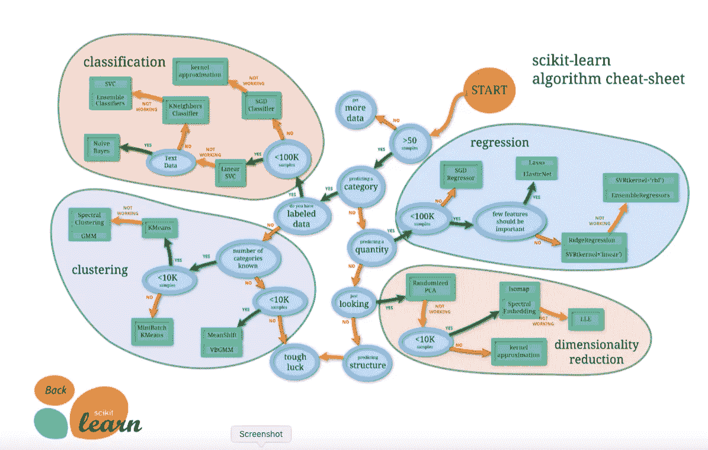
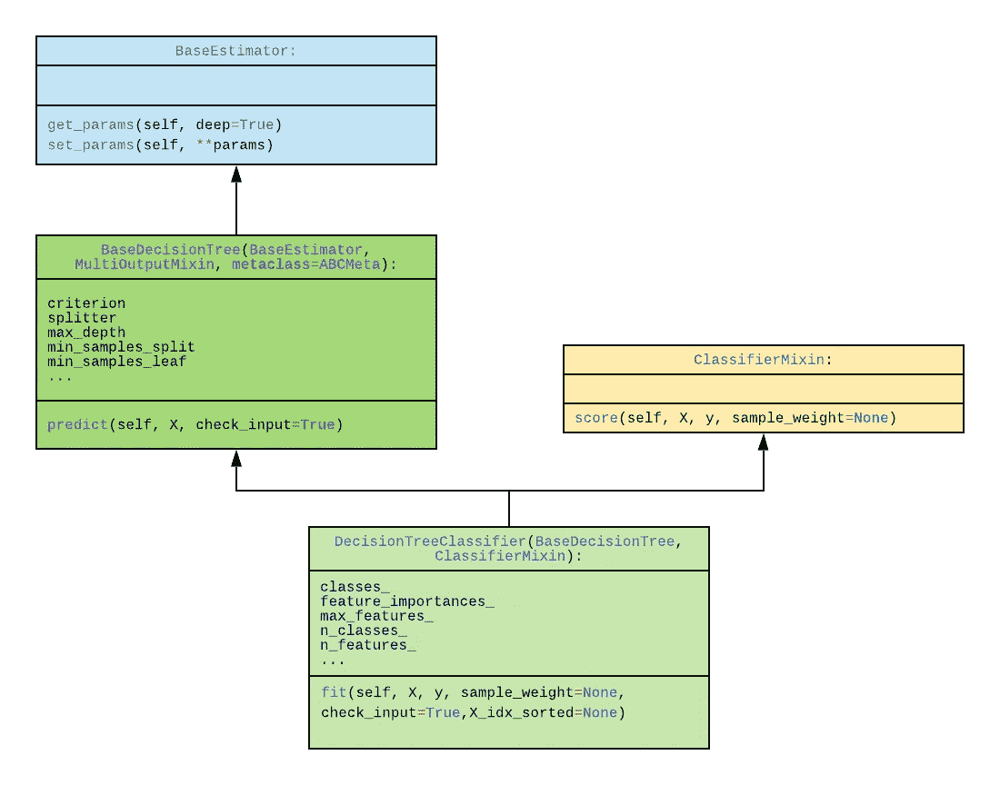
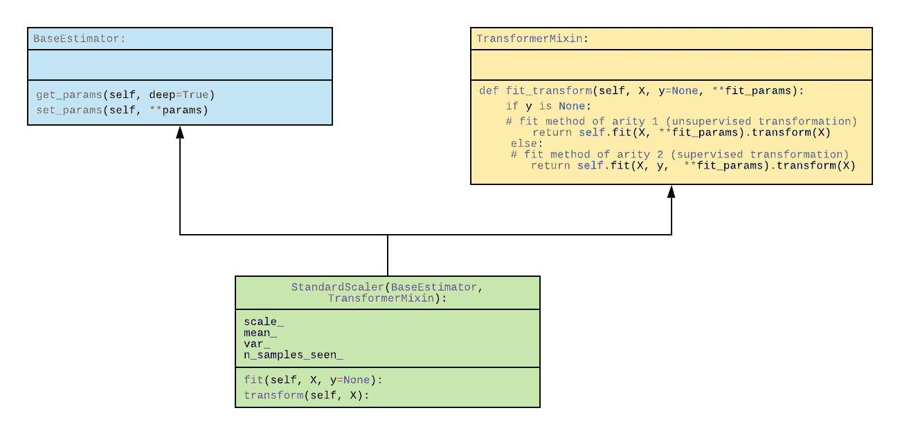

# sci kit-了解设计原则

> 原文：<https://towardsdatascience.com/scikit-learn-design-principles-d1371958059b?source=collection_archive---------11----------------------->

## 优雅、进步、务实

## 介绍

这篇博客文章是对 Scikit-Learn 库的设计原则的简要反思。需要澄清的是:这是*而不是*使用 Scikit-Learn 的教程。Scikit-Learn 是一个强大、丰富和广泛的 Python 库，用于实现机器学习。该库提供用于建模(例如，分类、回归和聚类算法)、模型选择(例如，网格搜索)、预处理(例如，特征提取)等的工具。我坚持认为，这个库的成功与其强大而深刻的功能一样，与它的界面和易用性密切相关。

如下面的 [Scikit-Learn“算法备忘单”图](https://scikit-learn.org/stable/tutorial/machine_learning_map/index.html)所示，这个库非常大，非常丰富:

但是在这篇博客中，我采用了一种不同的方法，从一个不同的角度来看问题:我不太关注 Scikit-Learn 的功能，而更关注它的设计能力，这样，我借此机会反思了一些我最喜欢的软件模式和设计主题。这篇文章的灵感来自经典论文“[机器学习软件的 API 设计:来自 scikit-learn 项目](https://arxiv.org/abs/1309.0238)的经验”(以及其他来源——见下面的参考文献)。Scikit-Learn 文档(通过[scikit-learn.org](http://scikit-learn.org)，在下面的参考资料中注明)也是最棒的，反映了与库本身一样的深思熟虑和清晰的设计和组织。

Scikit-Learn 库提醒人们设计模式在软件设计中的力量。关于设计模式的开创性工作——[设计模式:可重用面向对象软件的元素](https://en.wikipedia.org/wiki/Design_Patterns)——提倡“编程对接口的重要性，而不是对实现的重要性。”Scikit-Learn 在其语义非常简单的接口后面隐藏了巨大的复杂性。换句话说，这个库非常容易“开箱即用”。当然，理解机器学习算法的细节很重要，成功的 Scikit-Learn 模型需要进行适当的调整以产生良好的预测；但是，即使是默认的超参数通常也会产生合理的结果。(事实上，对于最近的分类模型，我发现在运行网格搜索后，决策树的 ***fit*** 方法的默认参数比推荐的超参数产生了更好的结果！)

此外，因为 Scikit-Learn 是一个*库*而不是一个框架，所以使用起来要简单得多。该库的用户只需要导入他们想要使用的给定功能所需的包，然后从具体的类中实例化对象。不需要从指定的类层次结构继承，也不需要反转控制。

## 接口

该库是围绕三个基本 API(接口)组织的:****预测器*** 和 ***转换器*** 。重要且关键的是，这些接口是互补的——它们并不代表类之间的严格界限或精确的语义分离，而是一种重叠。例如，决策树分类器既是估计器又是预测器——稍后会详细介绍。*

## *评估者*

*估计器代表 Scikit-Learn 中的核心接口。所有的学习算法，不管是有监督的还是无监督的，分类，回归，还是聚类，都实现了 Estimator 接口，并公开了一个 ***fit*** 方法。*

*估计器的 ***拟合*** 方法将(训练)特征向量(“样本”或“预测器”)以及(训练)目标标签(在监督学习的情况下)作为输入，通过这种方式，估计器“学习”如何对看不见的数据进行预测(同样，在监督学习的情况下)。*

*一个关键的设计原则是，估计器的实例化(例如，您表示模型的超参数)与学习过程(您用训练数据(您的特征向量，例如，“X_train”)拟合模型)是分离的；以及您的训练标签/目标变量，例如“Y_train”)。也就是说，当你构造一个估计器(比如前面提到的决策树分类器)时，你传入超参数，但是你传入的是训练数据的 ***而不是***；训练数据通过 ***fit*** 方法传入。正如“API 设计…”一文中提到的，这种分离类似于“[部分函数应用](https://en.wikipedia.org/wiki/Partial_application)”的思想，其中某些参数被绑定(或冻结)到一个函数，然后该函数(及其冻结的参数)被传递到另一个函数——一种高阶函数，或函数组合。事实上，这种“模式”可以说是由 Python 标准库通过 functools.partial 支持的。*

*这种解耦也可以通过更具侵入性的类机制来实现，也就是说，通过引入另一个类层次结构。然而，Scikit-Learn 的创建者明智地选择了更务实的道路，即使表面上看起来 Estimator 类似乎合并了两个语义边界。*

*从机器学习的角度来看，估计器是一个*

> *管理模型的估计和解码的对象。该模型被估计为以下确定性函数:*
> 
> *-对象构造中提供的参数或 set_params 提供的参数；*
> 
> *-如果估计量的 random_state 参数设置为 None，则为全局 numpy.random 随机状态；*
> 
> *-以及传递到最近一次对 fit、fit_transform 或 fit_predict 的调用的任何数据或样本属性，或者在对 partial_fit 的一系列调用中以类似方式传递的数据。" *(Scikit-Learn 词汇表)**

## *预言者*

*Scikit-Learn 界面选择的一个令人困惑的方面是预测器与估计器的分离；预测器扩展了估计器接口，对于一个要“工作”的给定模型，它必须实现(并公开)一个 ***预测*** 方法。事实上，Scikit-Learn 的词汇表将预测器定义为“支持预测和/或 fit_predict 的估计器”然而 Scikit-Learn 通过 API 在语义上将这两个概念分开。虽然这不是一个关于如何使用库的教程，虽然这可能是显而易见的，但是模型作为预测器接口的一部分实现的*方法做了预测结果的工作——给定测试特性；并且在模型被训练之后，预测器返回给定输入特征向量的预测标签。预测器也可以提供概率和预测分数，这是另一个设计原则的一部分(稍后讨论)。**

**下面的类图表示了一个通用分类器——决策树——的特定类层次结构，其中我们看到该类既作为一个估计器(事实上它的 ***通过继承是*** 一个估计器)又作为一个预测器——因为它实现了 ***预测*** 方法。此外，它提供的 ***score*** 方法(返回给定测试数据和标签的平均准确度)，源自一个“mixin”类——“classifier mixin”。所谓的“mixin”类是分离和打包特定功能(通常通过单个类方法提供)的标准方式，用于简单继承，同时避免“可怕的菱形模式”，这是多重继承的一个危险。**

****

**虽然类机制很好地协调和平衡了设计和实现的复杂性，但代码接口非常简单易用，允许您用三行代码实例化、拟合和使用模型:**

## **变形金刚(电影名)**

**毫不奇怪，变压器会修改数据。“API 设计…”一文说得好:**

> **预处理、特征选择、特征提取和降维算法都作为库中的转换器提供。**

**像模型一样，变形金刚也需要安装，一旦安装完成，就可以调用它们的 ***转换*** 方法。为了保持库的优雅和一致的简单性， ***fit*** 方法总是返回它所调用的 ***估计器*** ，允许您链接 fit 和 transform 方法。为了方便起见，变形金刚还支持一个***fit _ transform***方法，因此用户可以一步完成这两个操作。**

**下面的类图显示了 StandardScaler 转换器也是一个估计器，并且也混合了 TransformerMixin 类。然而，使用这个转换器的代码非常简单。**

****

## **透明度**

**用于构建估计器和转换器的所有超参数，以及拟合和预测的结果，对于界面的用户来说都是可见的公共属性。从表面上看，这似乎违背了封装和信息隐藏原则，这些原则长期以来一直是面向对象设计的标志，在面向对象设计中，对象状态通常只能通过类方法的中介来实现。但是这种设计选择极大地简化了库(通过避免访问方法的扩散):因为接口已经是一致的(并且既清晰又有说服力)，添加免费的方法来获取关键的模型属性或预测结果只会降低其有效性。**

## **核心数据结构**

**该库的设计者同样做出了直接而具体的决定，将机器学习所需的核心数据表示基于 Numpy 多维数组——而不是引入一组定制的类来封装表示特征和标签/目标的数据。与许多其他选择一样，这降低了进入的障碍，可以说，用户不必学习机器学习数据表示的新的类层次结构，以及确保时间和空间方面的性能，因为 Numpy 使用 c 针对性能进行了优化。**

## **合成估算器-管道**

**所有核心语义组件——估计器、预测器和转换器——之间的一致和统一接口为该库提供了额外的能力和灵活性，允许用户通过将估计器链接在一起来组成新的或增强的功能。记住，变压器是一种估计器(回想一下上面的 StandardScaler 的类图，从 BaseEstimator 派生而来)，Scikit-Learn 提供了一个管道类，允许用户将多个变压器链接在一起；因为所有的转换器共享相同的接口，所以管道可以将用户的数据适配到所有的转换器(通过迭代构造它的转换器的集合)，然后，如果 ***fit_transform*** 也被调用，则应用转换并返回转换后的数据。下面的代码片段演示了用相似特征的平均值填充缺失值(通过 SimpleImputer 类)，然后缩放数据(通过 StandardScaler 类)是多么容易。**

## **通过 Duck-Typing 的可扩展性**

**我想提到的最后一个设计原则是库对所谓的[鸭式输入](https://docs.python.org/3/glossary.html#term-duck-typing)的依赖，以允许对库进行扩展。鸭子类型化意味着如果一个类支持一个特定的方法——也就是说，如果它“看起来像一只鸭子”——那么它可以与同一接口的其他对象互换使用——也就是说，它 ***是一只*** 鸭子。这避免了对继承的需要，从理论上讲，这使得代码不那么紧密耦合、脆弱和复杂。也就是说，如果用户想要扩展库，例如，通过编写定制的转换器，他们不一定需要从 Scikit-Learn 类继承。通过这种方式，库的创建者将 Pythonic 的灵活性和实用性带到了 Scikit-Learn。**

## **结论**

**数据科学家，无论是学生还是专业人士，都很幸运拥有如此丰富和设计良好的库，如 Scikit-Learn，它允许我们用漂亮和设计良好的代码来处理复杂的机器学习问题。**

## **参考**

**Lars Buitinck，Gilles Louppe，Mathieu Blondel，Fabian Pedregosa，Andreas Mueller，Olivier Grisel，Vlad Niculae，Peter Prettenhofer，Alexandre Gramfort，Jaques Grobler，Robert Layton，Jake Vanderplas，Arnaud 乔利，Brian Holt，gal Varoquaux，“机器学习软件的 API 设计:scikit-learn 项目的经验”，[https://arxiv.org/abs/1309.0238](https://arxiv.org/abs/1309.0238)，2013 年。**

**aurel in géRon，使用 Scikit-Learn 和 TensorFlow 进行机器学习，O'Reilly Media，2013 年**

** [## sci kit-学习

### 编辑描述

scikit-learn.org](https://scikit-learn.org)**