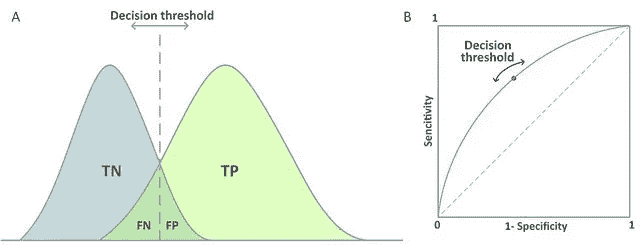

# Scikit-Learn 与机器学习的 MLR

> 原文：<https://towardsdatascience.com/scikit-learn-vs-mlr-for-machine-learning-exxact-blog-e8eb173a5d65?source=collection_archive---------29----------------------->

## 检查两个库的 ML 工作流


Image Source: stokpic

Scikit-Learn 以其易于理解的 API 而闻名，对于 Python 用户来说，MLR 成为了流行的 Caret 包的替代品，提供了更多的算法套件和一种调整超参数的简单方法。这两个包在某种程度上是相互竞争的，因为许多参与自动分析的人转向 Python 进行机器学习，R 进行统计分析。

偏爱 Python 的原因之一可能是因为当前机器学习的 R 包是通过包含该算法的其他包提供的。这些包通过 MLR 调用，但是仍然需要额外的安装。甚至需要外部特征选择库，并且它们还需要满足其他外部依赖性。

Scikit-Learn 被称为许多机器学习算法的统一 API，不需要用户调用任何库。

**这绝不意味着怀疑 R。**不管在线调查结果如何，R 仍然是数据科学领域的一个重要组成部分。任何有统计学或数学背景的人都会知道为什么你应该使用 R(不管他们自己是否使用它，他们认识到了它的吸引力)。

现在，我们将看看用户如何经历典型的机器学习工作流。在 Scikit-Learn 中，我们将继续学习 MLR 中的逻辑回归和决策树。

# 创建您的培训和测试数据

*   `train <- sample(1:nrow(data), 0.8 * nrow(data))`
*   `test <- setdiff(1:nrow(train), train)`
*   MLR 没有用于子集数据集的内置函数，因此用户需要依赖其他 R 函数来实现这一点。这是一个创建 80/20 训练测试集的例子。

# 选择算法

*   `makeLearner('classif.rpart')`。这个算法被称为学习器，这个函数被调用来初始化它。
*   `makeClassifTask(data=, target=)`。如果我们正在做分类，我们需要进行一个调用来初始化一个分类任务。这个函数将接受两个参数:训练数据和目标变量的名称。

# 超参数调谐

在任一软件包中，优化超参数时都有一个过程要遵循。您首先需要指定要更改哪些参数以及这些参数的间距。然后进行网格搜索或随机搜索，以找到参数估计的最佳组合，从而获得最佳结果(即误差最小化或精度最大化)。

**Scikit-Learn**

```
C = np.logspace(0, 4, 10)
max_iter= [100,110,120,130,140]
hyperparameters = dict(C=C, penalty=penalty, dual=dual, max_iter=max_iter)
GridSearchCV(logreg, hyperparameters, cv=5, verbose=0)
clf.fit(x_train, y_train)
```

最低贷款利率（minimumlendingrate）

```
makeParamSet( makeDiscreteParam("minsplit", values=seq(5,10,1)), makeDiscreteParam("minbucket", values=seq(round(5/3,0), round(10/3,0), 1)), makeNumericParam("cp", lower = 0.01, upper = 0.05), makeDiscreteParam("maxcompete", values=6), makeDiscreteParam("usesurrogate", values=0), makeDiscreteParam("maxdepth", values=10) )
ctrl = makeTuneControlGrid()
rdesc = makeResampleDesc("CV", iters = 3L, stratify=TRUE)
tuneParams(learner=dt_prob, resampling=rdesc, measures=list(tpr,auc, fnr, mmce, tnr, setAggregation(tpr, test.sd)), par.set=dt_param, control=ctrl, task=dt_task, show.info = TRUE) )
setHyperPars(learner, par.vals = tuneParams$x)
```

# 培养

这两个软件包都提供了训练模型的单行代码。

这可以说是这个过程中最简单的步骤之一。最困难的步骤是调整超参数和特征选择。

# 预言；预测；预告

就像训练模型一样，预测只需要一行代码就可以完成。

Scikitlearn 将返回预测标签的数组，而 MLR 将返回预测标签的数据帧。

# 模型评估

评估监督分类器最流行的方法是一个混淆矩阵，你可以从中获得准确度、误差、精确度、召回率等。

**Scikit-Learn**

*   `confusion_matrix(y_test, prediction)`或者
*   `classification_report(y_test,prediction)`

**MLR**

*   `performance(prediction, measures = list(tpr,auc,mmce, acc,tnr))`或
*   `calculateROCMeasures(prediction)`

这两个软件包都提供了多种获取混淆矩阵的方法。**然而，对于尽可能简单的信息视图，python 不如 r 信息丰富。第一个 Python 代码将只返回一个没有标签的矩阵。用户不得不返回到文档中去辨认哪些列和行对应于哪个类别。**第二种方法具有更好和更丰富的输出，但它只会产生精确度、召回率、F1 分数和支持度；但这也是不平衡分类问题中更重要的性能指标。

# 判定阈值(即改变分类阈值)

分类问题中的阈值是将每个实例分类到预测类别中的给定概率。默认阈值将始终为 0.5(即 50%)。这是在 Python 和 R. R 中进行机器学习时的一个主要区别。R . R 提供了一行代码的解决方案来操纵阈值以解决类的不平衡。Python 对此没有内置函数，而是由用户通过定义自己的自定义脚本/函数来以编程方式操纵阈值。



pair of graphs showing decision thresholds

**Scikit-Learn**

*   在 Scikitlearn 中没有一种标准的阈值方法。查看这篇文章，你可以自己实现它:**在 Scikit-Learn 中微调分类器**

**MLR**

*   `setThreshold(prediction, threshold)`。mlr 中的这一行代码将自动更改您的阈值，并可以作为参数来计算您的新绩效指标(即混淆矩阵等)。)

# 结论

最后，在处理机器学习时，mlr 和 Scikitlearn 都有各自的优点和缺点。这是使用其中一种进行机器学习的比较，并不能作为使用其中一种而不是另一种的理由。对这两方面都有所了解，才能给职场上的人带来真正的竞争优势。对流程的概念性理解将使工具的使用更加容易。

*原载于 2019 年 8 月 21 日*[*【https://blog.exxactcorp.com】*](https://blog.exxactcorp.com/scikitlearn-vs-mlr-for-machine-learning/)*。*