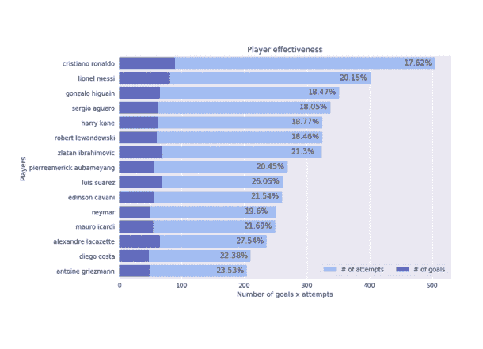

# 体育界数据科学/分析的范围

> 原文：<https://towardsdatascience.com/scope-of-analytics-in-sports-world-37ed09c39860?source=collection_archive---------10----------------------->

你好世界！！在本文中，我们将讨论在体育界，先进的[分析](https://www.indiumsoftware.com/advanced-analytics/)和[预测建模](https://www.indiumsoftware.com/predictive-analytics/)如何胜过常规的定制/传统分析。我们已经见证了人工智能和最先进的机器学习模型如何超越旧的分析师方法，其分析已经重塑了许多企业的运营。令人惊讶的是，尽管有如此丰富的数据，体育分析的采用却相当坎坷和不均衡。

只是在最近，体育分析已经成熟，即使如此，还有足够的渗透空间。2016–2022 年体育分析预测估计，2022 年，40.1%的 CAGR 可能达到 39.7 亿美元的价值。认识到我们将在体育世界中处理的数据范围，利用分析是非常有意义的。每天，体育界都在不断提高其使用体育分析工具来提高胜率的能力。

## 为什么体育分析正在改变世界？

基本上，体育分析是为直接参与比赛的运动队或体育博彩公司进行的。

体育分析可以解释为使用与任何体育或游戏相关的数据。像统计球员，天气情况，球队最近的胜败等。有了这些数据，我们可以创建预测性的机器学习模型，代表管理层做出明智的决策。运动分析的主要目标是提高团队表现，增加赢得比赛的机会。一场胜利的价值说明了一切，并以不同的形式表现出来，如涓涓细流渗透到体育场座位上的球迷、电视合同、球迷商店商品、停车、特许权、赞助、注册、保留和当地自豪感。

## 主要团队及其分析合作伙伴

*   皇家马德里和微软，世界上最大的足球俱乐部之一-皇家马德里-正在使用微软技术来转变其运营、性能、健身以及与 5 亿全球球迷的关系。
*   曼联和怡安，像全球成千上万的企业一样，曼联足球俱乐部依赖怡安作为长期值得信赖的顾问，寻找创新的解决方案，使他们在竞争中保持领先地位。

正如我们所见，顶级全球体育品牌使用先进的体育分析，在整体表现、健身和与粉丝的关系方面保持领先。

## 体育分析用例

## ***预测分析***

主要用例是进行预测分析，这可以提供关于团队在比赛日应该如何的见解。哪个实习生给的团队表现更好，增加了团队的获胜概率。

使用我们的机器学习模型，我们可以预测比赛日哪个球员在哪个位置上表现更好。我们的模型将建立在球员的数据基础上，他在与对手的比赛中表现如何，比赛条件如比赛是主场还是客场，等等。因此，在给定比赛条件和我们面对的对手的情况下，我们可以预测哪些球员适合哪个位置。

*   ***球员分析*** ，我们可以通过分析每个球员的训练模式和饮食图表来改善他们在球场上的表现和健康水平，然后根据我们的分析改进这些。
*   ***团队分析*** ，使用团队统计数据，我们可以建立最先进的机器学习模型，如深度神经网络、支持向量机等，以帮助团队管理人员计算获胜组合及其概率。
*   ***粉丝管理分析*** ，有了社交把手数据，我们可以在粉丝群内发现模式，使用聚类算法形成聚类/群组，针对目标群体开展活动。知道了最能吸引粉丝的因素，团队管理层就可以专注于改善这一方面，从而获得新的粉丝群并留住老粉丝。

## 使用高级可视化技术提供见解

在当今以数据为中心的世界中，数据可视化是一个至关重要的工具，体育领域也不例外。使用表格格式的原始数据，管理层无法获得清晰的见解，并且需要很长时间来浏览整个数据并掌握内容。因此，以图形格式呈现数据使管理层能够看到通过图形和图表直观呈现的分析，因此他们可以掌握困难的概念或识别新的见解。

图形表示的下一步是交互式可视化，您可以通过使用 tableau、clickview 和 rshiny 应用程序等技术深入了解图表和图形，以获得区域级别的更多详细信息和洞察力，从而以交互方式改变您看到的数据深度及其处理方式，从而将这一概念向前推进一步。

*   ***球队经理仪表盘，*** 球员比赛表现统计数据将以互动仪表盘格式呈现，以便更好地了解比赛情况。
*   ***球迷仪表盘*** ，球迷可以获得自己喜欢的球员的比赛数据，并可以与对手或同队的其他球员进行比赛对比。

## 了解粉丝网络

每个运动队都有自己热情的粉丝群，他们需要一种方式来更好地与他们联系，无论他们在世界的哪个角落。我们的反应式仪表板允许他们与粉丝一对一互动，创建有针对性的促销活动，并使用收集的数据来跟踪和分析粉丝行为。这样管理层就知道，是什么驱使他们的球迷为他们的球队疯狂，并为此付出更多。

*   *找到共同兴趣，利用从脸书、推特、Instagram 等社交平台收集的数据，我们可以分析最吸引球队热情粉丝的因素，并据此开展宣传活动。*

## *进入体育赌博的世界*

*体育分析不仅对体育领域内外产生了巨大影响，还促进了体育博彩行业的发展，该行业约占全球博彩行业的 13%。价值在 7，000-1，000 亿美元之间的体育博彩在各种群体中非常流行，从狂热的体育迷到休闲赌徒，你很难找到一项职业体育赛事不依赖结果。许多赌徒被体育赌博所吸引，因为他们在做决定时有大量的信息和分析。*

*我们到此结束，希望我已经给了一些体育分析世界的介绍。查看其他作品[这里](https://medium.com/@athithyavijay)。关于未来的讨论，请联系[媒体](https://medium.com/@athithyavijay)、 [Linkedin](https://www.linkedin.com/in/vijay-athithya-79830ba1/) 、[脸书](https://www.facebook.com/vakky.vj)。*