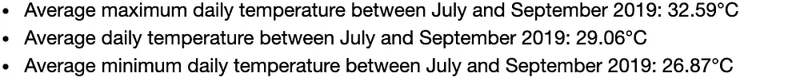
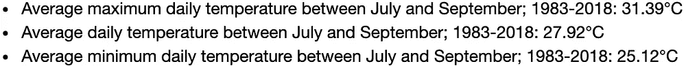
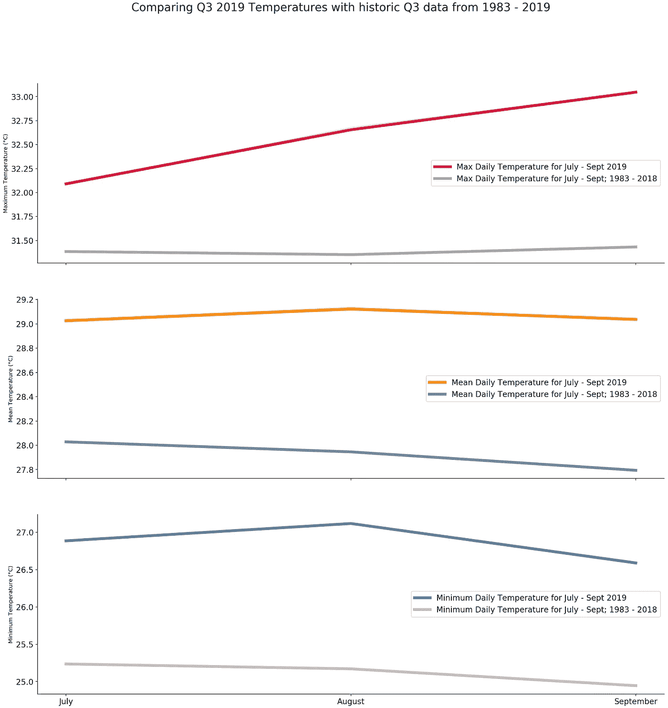
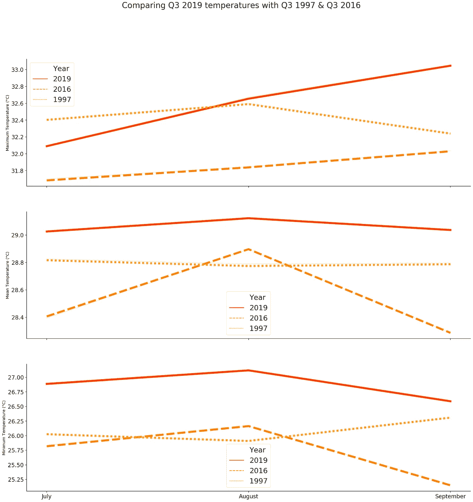
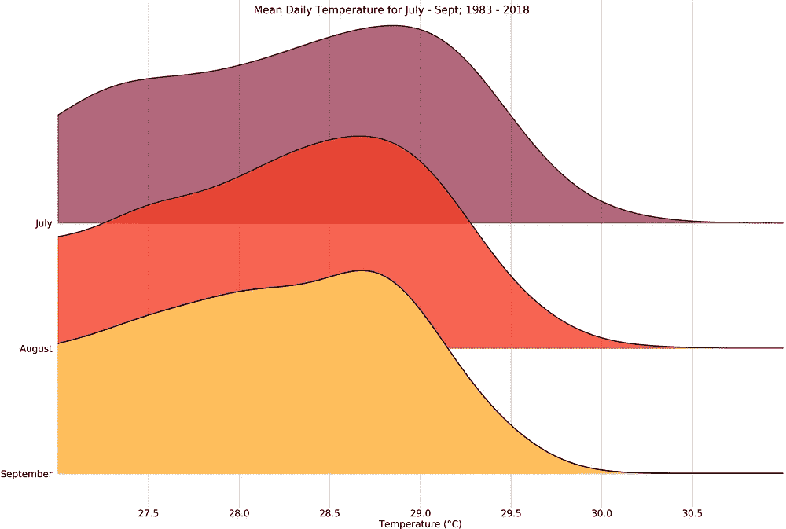
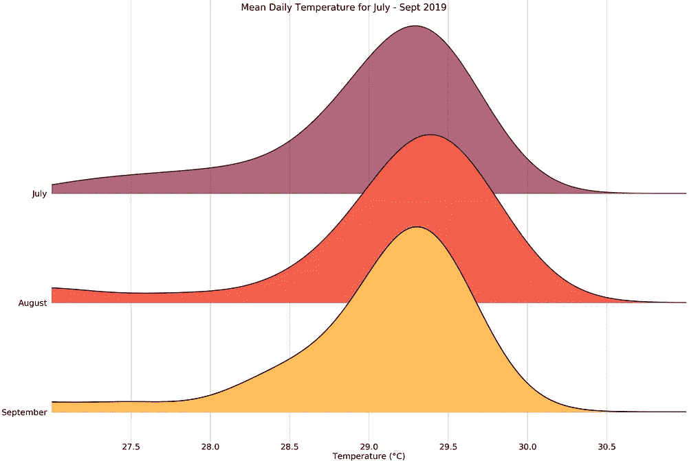
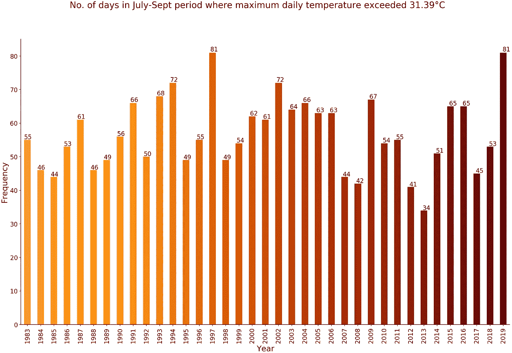
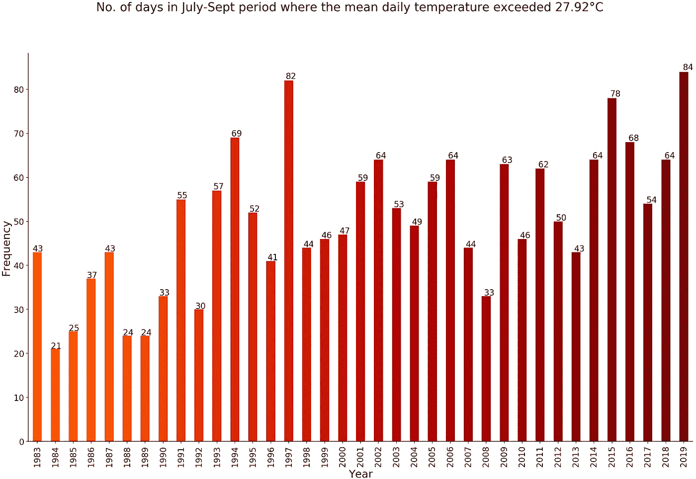

# 酷热:随着全球纪录的暴跌，圣保罗遭遇了有史以来最热的第三季度之一

> 原文：<https://towardsdatascience.com/scorcher-as-global-records-tumbled-spore-baked-under-one-of-the-warmest-q3-ever-436837cb5b0?source=collection_archive---------35----------------------->

7 月至 9 月是这个城市国家过去 36 年来经历的最热的三个月之一，2019 年将打破气温纪录。

File photo, circa Singapore 2015\. Photo: Chua Chin Hon

新加坡也未能幸免于最近席卷全球的[创纪录热浪。](https://www.bbc.com/news/science-environment-49753680)

如果有什么不同的话，对这个城市国家 2019 年 7 月至 9 月的天气数据的检查表明，新加坡遭受了一场长时间的热浪，其强度明显高于同期的长期平均水平*(即 2019 年第三季度数据与往年第三季度数据的对比)*。

在 2019 年第三季度的 92 天中，有 84 天，即 10 天中的 9 天，日平均气温超过了 7 月至 9 月 27.92 摄氏度的长期平均值，这是自 1983 年以来的最高水平。

2019 年第三季度还有 81 天的日最高气温超过了同期 31.39 摄氏度的长期平均气温，与 1997 年新加坡和世界遭受厄尔尼诺效应[冲击](https://sg.news.yahoo.com/el-nino-and-its-effects-on-the-world-061623781.html)时创下的当前纪录持平。

气象局早些时候表示，2019 年 8 月[可能是自 1929 年](https://www.channelnewsasia.com/news/singapore/august-2019-singapore-weather-driest-warmest-met-service-11858082)有记录以来最干燥和最温暖的 8 月，2019 年[将创造新的温度记录](https://www.straitstimes.com/singapore/environment/2019-poised-to-be-really-hot-year)。

目前还不清楚新加坡的天气是否已经转向新常态。但是趋势线确实指向一个令人担忧的方向。

# 数据和基准

比较天气记录总是很棘手，即使对于像新加坡这样的小城市国家也是如此。这在很大程度上取决于您使用的数据，以及用于比较的基准和时间框架。

在这篇文章中，我将使用 36 年的天气数据集，这是我之前从新加坡气象局的网站上收集的。因此，这里提到的“长期”是指 1983 年至 2019 年(9 月)之间的时期。这些数据在早期的 [Jupyter 笔记本](https://github.com/chuachinhon/weather_singapore_cch/blob/master/notebooks/1.0_data_cleaning_cch.ipynb)中进行了预处理，我已经用 2019 年 7 月至 9 月的数据进行了更新。

为了确保进行同类比较，我主要将 2019 年第三季度的数据与前几年的第三季度数据进行比较。如果你对所有季度进行比较，结果会有所不同，包括 12 月这样较冷的月份。

# **数据探测和温度记录**

浏览数据，很快就发现 2019 年第三季度没有打破任何*单日*气温记录。

例如，在过去的 36 年里，最高日最高温度是 36 摄氏度，记录在一个闷热的 1998 年 3 月 26 日。但 2019 年第三季度记录的最高日最高气温“仅”为 34.3 摄氏度(9 月 28 日)，远低于该数据集中的纪录。

1998 年 5 月的两天——5 月 21 日和 5 月 28 日——共同保持了 30.9 摄氏度的最高日平均气温纪录，比 1983 年至 2019 年期间的日平均气温高出约 3.23 摄氏度。这一长期纪录几乎没有受到 2019 年第三季度最高日平均气温 29.8℃(8 月 12 日和 8 月 16 日记录)的威胁。

虽然 2019 年第三季度的数据没有打破任何单日记录，但仔细观察发现，这一时期的平均气温都高于长期平均水平。

例如，2019 年 7 月至 9 月的日平均最高气温为 32.59 摄氏度，比 1983 年至 2019 年期间的长期平均气温 31.52 摄氏度高出 1.07 摄氏度。

同样，2019 年第三季度的日平均气温和日平均最低气温分别比这两个类别的长期平均气温高 1.39 摄氏度和 1.97 摄氏度。

当你比较苹果和苹果时，这种趋势变得更加明显，也就是说，相互比较第三季度的温度记录，而不是整体的长期平均值，其中包含较冷的月份。

2019 年第三季度的日平均最高气温(32.59 摄氏度)比 1983 年至 2019 年期间同类第三季度长期平均气温 高 1.2 摄氏度**。**

同样，2019 年第三季度的日平均气温和日平均最低气温都高于 1983 年至 2018 年第三季度的长期平均气温。

这可以通过一些图表得到最好的说明。

# 2019 年第三季度与第三季度长期天气数据

至少可以说，这种对比是惊人的。2019 年第三季度的平均气温在所有三个类别中都明显升高，包括最低日气温，这意味着我们将迎来更热的白天和更温暖的夜晚。

By default, Seaborn line plots aggregate over multiple y values at each value of x and shows an estimate of the central tendency and a confidence interval for that estimate — which was turned off for this chart.

2019 年第三季度的记录也违背了长期趋势，如灰色线条所示。总的来说，从七月到九月，气温往往会下降。

但引人注目的是，2019 年第三季度的最高日气温随着月份的推移而飙升，从 7 月到 9 月平均呈现持续上升的趋势。与此同时，2019 年 9 月底的日平均气温几乎与 7 月初持平，与第三季度末略有降温的长期趋势形成鲜明对比。

2019 年第三季度的最低日气温遵循了更符合长期趋势的形状，但它比我们在 1983 年至 2018 年期间经历的温度高得多，如上图的第三个子图所示。

# 2019 年第三季度与 2016 年第三季度和 1997 年第三季度

我们还可以做**单年对比**。对于下面的图表，我选择了 2016 年和 1997 年第三季度的数据，因为这两年都有很长的高温期。

新加坡气象局称 [2016 年是这个城市国家](https://www.straitstimes.com/singapore/environment/2016-is-hottest-year-on-record-for-singapore-and-the-world)有记录以来最热的一年。1997 年，由于“T4”厄尔尼诺现象，新加坡和当时世界上的许多地方一样，遭受了长时间的酷热和干燥天气。

一眼看去，很明显，2019 年第三季度的温度-由红色实线代表-比 2016 年和 1997 年的类似时期更高。

正如媒体今年早些时候报道的那样，2019 年看起来肯定会打破新加坡的年度气温记录。

# 快乐图或堆积密度图

流行的 [joyplots](https://github.com/sbebo/joypy) 提供了另一种方式来可视化 2019 年第三季度与过去 36 年同期相比有多激烈。我将绘制一个版本来比较日平均气温。

这些差异再次显而易见:2019 年第三季度的日平均气温分布(右侧图表)与长期趋势(左侧图表)相比，显示出明显的右移，标志着一个更高的温度时期。

# 比较日平均温度和日最高温度高于长期平均温度的天数

说明 2019 年第三季度相对于其他年份的第三季度有多热的另一种方法是比较数据集中汞飙升至第三季度长期平均值以上的天数。

**我要用的两个基准是:**
***31.39℃**:1983 年至 2018 年间 7 月至 9 月间记录的日平均最高气温。

***27.92℃**:1983 年至 2018 年间 7 月至 9 月间记录的日平均气温。

2019 年第三季度，有 81 天的日最高气温超过了同期 31.39 摄氏度的长期平均气温，与 1997 年创下的当前纪录持平。

在 2019 年第三季度的 10 天中有 9 天(准确地说是 92 天中的 84 天)，日平均气温超过了 7 月至 9 月 27.92 摄氏度的长期平均值。按照这个标准，这是我们自 1997 年以来看到的最高水平。如果您使用不同的基准进行比较，结果会明显不同。

# **2019 年第三季度是有记录以来最热的第三季度吗？**

没有完整的数据——新加坡有文字记载的温度记录可以追溯到 1929 年——很难说清楚。这在很大程度上还取决于您采用的比较基准和时间框架。

我不是训练有素的气象学家，也不是新加坡天气专家，所以我不能说我在这里使用的基准和假设是否反映了该领域可接受的规范。

但 2019 年第三季度肯定是我们在新加坡过去 36 年中看到的最温暖的三个月之一，也可能是未来更不舒服的时期的一个迹象。

这篇文章的 Jupyter 笔记本可以在[这里](https://github.com/chuachinhon/weather_singapore_cch/blob/master/notebooks/4.0_scorcher2019_cch.ipynb)找到，旁边还有[处理过的数据集](https://github.com/chuachinhon/weather_singapore_cch/blob/master/data/weather.csv)。

我之前尝试想象和分析新加坡不断变化的天气模式，可以在这里找到[这里](/visualising-singapores-changing-weather-patterns-1983-2019-a78605fadbdf)和[这里](/detecting-abnormal-weather-patterns-with-data-science-tools-5fae48586469)。

像往常一样，如果你发现任何错误，ping 我@

推特: [@chinhon](https://twitter.com/chinhon)

领英:[www.linkedin.com/in/chuachinhon](https://www.linkedin.com/in/chuachinhon/)