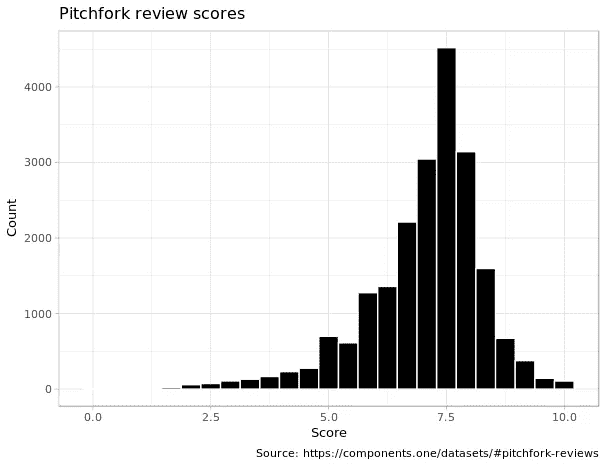
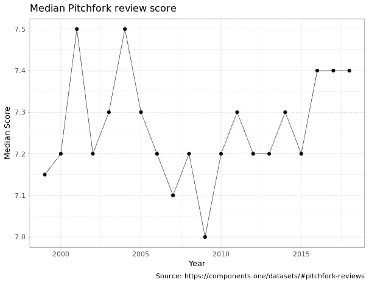
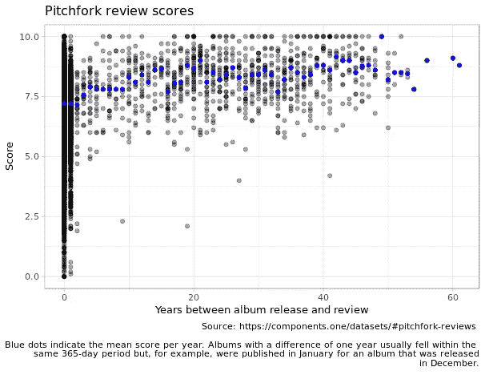
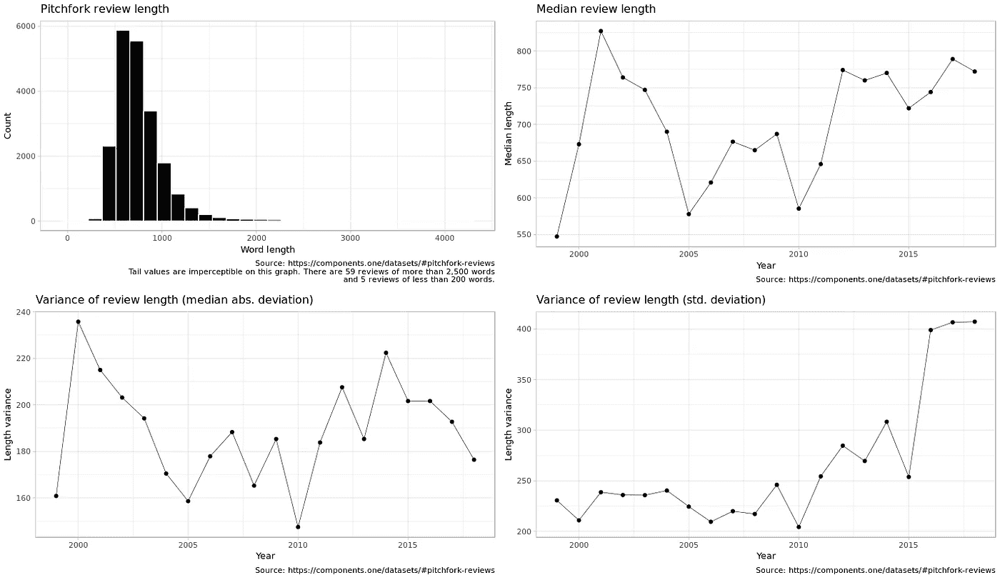
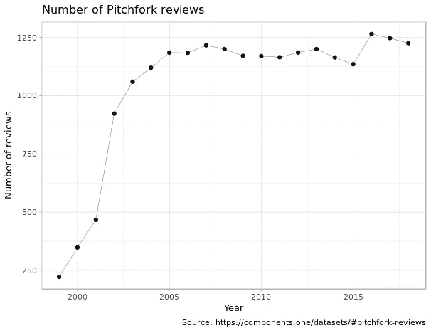

# 评分和排列

> 原文：<https://towardsdatascience.com/scored-and-arranged-4f09fb3b314f?source=collection_archive---------33----------------------->

## [深入分析](https://medium.com/towards-data-science/in-depth-analysis/home)

## 和 Nick Scavo 对 20，783 个 Pitchfork 评论的探索性数据分析

*数据集使用:*[*20783 条干草叉评论*](https://components.one/datasets/#pitchfork-reviews)

[*尼克·詹姆斯·斯加沃*](https://twitter.com/_SCVSCV) *是一位居住在纽约的音乐家和作家。他与实际的学校合作进行各种个人和合作项目，定期向微型混音带提供评论和论文，并与现代艺术博物馆 PS1、艺术家空间、新博物馆、根茎、控制合成器和电子设备合作，并在 NTS 电台常驻。他是* [*发行项目室*](https://issueprojectroom.org/) *的传播总监兼助理策展人。*

*在整个访谈中,“钟形曲线”一词被不严格地用来指任何单峰分布，其中中间值附近的值表示评估分数的中间值，而不是指对称分布。*

安德鲁·汤普森(Andrew Thompson):我认为应该从 Pitchfork 的分数分布图开始，看看 Pitchfork 是如何对事物进行评级的，以此来考虑 Pitchfork 评级的想法和这个评估系统。

Fig. 1

这是他们分数分布的直方图。干草叉的平均分数几乎正好是 7，中位数是 7.3。从你的角度来看，干草叉评级系统是什么？它的意图和效果是什么？

尼克·斯加沃:当你看到这样一个模型时，我不禁会想到根据钟形曲线来评分。因此，很明显，从专家或教授到评论家，都存在一种假定的教育权力动态，以某种方式给表演打分。我觉得在批评史上，你通常没有一个实际的数值。在很大程度上，在 20 世纪艺术史中，你有某种智力参与。但在 21 世纪初，随着 Pitchfork 和类似的出版物的出现，评论家们通过在工业化条件下运作来反映他们正在处理的内容——他们开始给美学作品赋予数字价值。我认为这可能是相对特定于音乐形式的——例如，在视觉艺术中看到量化的价值是很奇怪的。你能想象有人给 MoMA 最近的展览打分吗？

没有，但是你会看到一些量化电影的尝试，这可以追溯到 90 年代

像罗杰·伊伯特一样

**在**:右，拇指向上拇指向下，这已经转移到烂番茄汇总成元评论的任何内容。有了 Pitchfork，它总是把像罗杰·伊伯特这样的人和使用这种系统的其他人区分开来，这是他们声称评估一件作品的准确性——这是一种分米精度，可以衡量一件事情的好坏。当你说某样东西是 7.7 时，你是说它不是 7.6 或 7.8，它就是这么有价值。甚至没有恒星系统的模糊性，比如一到五颗恒星。就像他们试图超越任何一种分数的可解释性或三星级评论可能暗示的任何普遍性的承认，相反，它传达了这种科学主义。

**NS** :这很奇怪，因为虽然它看起来像是精确或科学的，就像钟形曲线一样，但它是一种更相关的数字。之所以评分是 7.7 而不是 7.6，是因为也许另一张专辑被给了 7.6，我们需要看着那张专辑断言这张专辑更好。因此，在某种程度上，它遵循一条线，这条线是根据一系列相互发展的点绘制的——这就是你在这里看到的:音乐评论的独特分布。当你回顾过去的一年，回顾 2010 年所有最好的新音乐时，你会看到 Pitchfork 的作者给出的一系列文化价值观，然后你会看到给它们的不同的数字分数。这总是很奇怪，因为你会有人给某张专辑打 10 分，但往往这张专辑不是年度最佳专辑。这是一个非常松散的，有争议的，相关的数字情况，几乎有一个错误的或伪量化发生。

是的，我的意思是，毫无疑问这是假的。这里面也有愤世嫉俗的唯物主义。我记得在我听了 Sote 的*设计的神圣恐怖*之后，我想这是我去年听到的最好的事情之一，我认为我真正理解了艺术体验的概念，当我听到这个想法时，就像打开了世界。干草叉给了它…让我看看他们给了它什么。他们有 7.8 分。这张专辑的体验是完全非物质的，对吗？看到这张专辑的评分降到 7.8 分，我对音乐的精神感到非常矛盾。

我百分之百同意。归根结底，这是建立权力或权威的一种方式。这是对客观性的一种尝试，但我认为它不适用于这种情况。我的意思是，很明显，干草叉评论是一个作家量化的尝试。但是，作为一名读者，我们的任务是对量化做出回应——我是同意还是不同意这一点？人们对这种情况很着迷。这就是为什么人们总的来说对社论或专栏文章着迷——他们想不同意作者的观点，当他们看到一个分数时，这几乎是一种耸人听闻的挑衅。他们甚至不用读任何东西。他们只是看到这个荒谬的数字，只是对它吐口水，然后你在午夜的时候在互联网上等待下一个 Pitchfork 评论——我真的不认为现在是这样了，但在其全盛时期，有一段时间我会在午夜刷新页面，看看新的 Pitchfork 对一张专辑的评论，只是看看它被赋予了什么价值。在 2008 年和 2009 年左右，那是独立在线网络博客“品味制作”的巅峰时期。我觉得这已经从信息来源的纯粹多样性中扩散了一点点。当你看这个分布时，我认为你能做的最安全的事情就是给某样东西打 7.8 分。它本质上只是确认记录——你必须质疑以这种方式写评论的目的。在这种情况下，我认为这是公关周期的一部分。一个极低的评价或者一个极高的评价都有一种耸人听闻的性质，这将在公共话语中造成某种破裂。如果一张专辑获得了 Pitchfork 10，这是非常罕见的事情。记录低于 3、2 或 1 的情况同样罕见。我会对这些数据提出这样的问题:也许从 2009 年、2010 年开始，随着音乐变得更加工业化，通过 Pitchfork 这样的东西在我们的消费中变得更加普遍，我只能猜测平庸、中值/均值评论的实际数量只会上升。

Fig. 2.1

Fig 2.2

**在**:好吧，让我们看看……中间值有一点移动(图 2，顶部)，但方差实际上已经下降了(图 2，底部)。

**NS** :相当狂野。早期互联网音乐评论的自由自在的日子。

自 2001 年以来，它下降了…那是什么…超过 30%。所以你在某种程度上是对的。随着时间的推移，分数越来越接近中间值。

我认为这表明它已经变得不那么独立了。当你有一个更大的分数偏差时，你会有非常不同的观点，对音乐做出非常不同的断言。你会看到人们一路向左，然后一路向右，而不是更多的中间路线评论，我认为这是一种正常化，反映了我们在过去 20 年里看到的每一种经济趋势——包括美国的政治话语。

**AS** :万物无情同质化。

**NS** :不要太随意地使用这个词，但这是一种超正常化，这种字面意义上的将偏差挤压到更紧密的集合中。东西靠得更近了，它们受到限制，不能像以前那样移动。

**AT** :我的意思是，一方面，看着这张原始图表，也许可以说，工作确实是按照这种形状进行的，大部分工作都很一般:有大量糟糕的工作，但有一小部分确实很棒。那么有没有什么可以说这反映了艺术的现实呢？即使他们的数字系统是一种虚假的客观性，在这种虚假的客观性中，它正在描绘出事物的形状？

我认为这是一个我们必须质疑的说法。我认为这是一个在我们看待事物的方式中占主导地位的模型，钟形曲线，其中大部分作品是平庸的，很少一部分是精选的，天才的作品。这是一个我们不得不质疑的神话，因为它在西方思想和资本主义中占据主导地位。这是一个模型，我们已经被编程为定期查看。我会说——我不相信品味的完全相对主义，但我想也许有一个更少等级，也许更分散的模型，来描述我们如何思考我们与艺术和审美体验的关系，这也许会看起来完全不同于钟形曲线。

**在**:你几乎可以把这两个图表连在一起【图 1 和图 2，底部】，并且说评论感觉几乎应该反映自然模型的想法。我刚才说的这个想法:这难道不反映自然吗？钟形曲线是自然的。显然，我们已经通过相信一切都必然符合钟形曲线，展示了历史上各种各样的问题。干草叉持续的时间越长，他们就越觉得自己需要为了牛市曲线而坚持下去，如果他们偏离了 7.3，7.4，这在某种意义上是不自然的。我认为这是一个好主意:也许有更多的作品，如果不是天才的话——也许我们应该完全抛弃天才作品的想法。

是的，我觉得我们有很多实验性的和批判性的模型来量化我们听音乐的体验，这真的很令人兴奋，值得谈论和思考。你可以提出一个又一个完全破坏钟形曲线的模型。你也可以用全新的方式用这些模型来写音乐。Pitchfork 特别令人沮丧的一点是，他们的音阶变得如此之小，这是他们一遍又一遍地使用同一个模型的近 20 年历史。我认为你看着这些数据并从中提取各种假设是正确的。当我们看这些数据时，我们看到的是我们在世界其他地方看到的同样令人沮丧的现实，那就是事情变得越来越不明显，越来越中间，越来越自动连接，在同样的 7.8 或 7.3 或 7.4 之后也是如此。如果你看看过去五年中最好的新音乐，实际上我们有更多市场准备好的，市场友好的最好的新音乐。所以它实际上是在执行一个行业功能。它以一种野心家的方式表现的能力被赋予了价值，因为这关系到音乐行业对它的期望，即销售唱片，成功巡演，在流媒体平台上表现出色。

这可能很难做到，因为它受制于历史的经济流动，但我很好奇，过去五年最好的新音乐是否比 90 年代或 21 世纪初或那个时候最好的新音乐有更好的盈利能力。

**:如果不引入外部数据，只看评论本身，很难说，比如巡演收入、专辑销量或流媒体数据等等。但是我之前看这些数据时发现，Pitchfork 给 10 分的东西往往是这些怀旧的回顾。**

****

**Fig. 3.1**

****

**Fig. 3.2**

****NS** :哦耶。再版。**

****在**处:右，龙刚。**

**NS :在这里，我们有后知之明是 20/20 的想法。当你能够回顾文化并说，那正是那个时代的时代精神时，你会有一个更完美的愿景。那张唱片确实总结了发生的 X 件事或其他什么。现在真正弄清楚什么是重要的要困难得多，尤其是当它变得模糊到第 n 度的时候。**

****在**的时候:感觉那个时候评审也不再冒险了，对吧？如果你对一个已经确立的批评意见表示肯定，你们两个都不会冒险，同时也把自己描绘成一个圣徒，对一张专辑的名声和它在音乐史上的地位负责。**

**越往后，分数越高。所以当你到了 10 年、20 年的时候，事情并不真的…过去有一些神圣的东西。**

****NS** :我记忆中最难忘的 10 叉之一是电台司令的*小子 A* 。那是 2000 年左右的事了，当时我还很年轻，我觉得这个记录无可否认是完美的 10 分。根据我当时的教育和音乐听力，这是一本关于什么是好的实验音乐唱片的大部头。尽管我在 2000 年的时候认为这是一张晦涩难懂、声音怪异的专辑，但这时候电台司令并不是一个小乐队。Pitchfork 给这个记录打 10 分是一个非常有品牌效应的决定。许多其他出版物，大众媒体音乐出版物，都在谴责和反对他们从 *OK 电脑*转移声音。每个人都表现得很惊讶。但这也是 Pitchfork 的一个转变，因为我认为他们的受欢迎程度在 2003 年后呈指数增长，并持续到后期。**

**我也想知道，在音乐评论文本中存在的形容词的分布是怎样的。**

****AT** :你是说形容词的数量？**

**是的，比如音乐评论家在多大程度上依赖于用形容词来描述声音，以及形容词对我们理解声音的意义有多大帮助？有一种趋势是叙述音乐，用描述性的词来描述它，比如“粗糙”或者用隐喻，比如“往钢铁上泼水”。**

**形容词使用 Python 的空间库及其最大的英语语料库来识别。SpaCy 非常好，但是像所有自然语言处理工具一样，它并不完美。这里存在一些小错误，主要是在很少使用的单词的尾部，像“gyaaaah”这样的单词被标记为形容词。少数单词也没有被正确地识别为形容词，其中包括“天才”，不幸的是，图书馆总是将其识别为名词。**

****AT** :在你看来，这些词有什么问题，一个人应该如何写音乐？**

**随着写作音乐和定期量化音乐并试图证实这种量化的实践，我们常常不得不去看实际的文本，去看那些用来赋予事物意义的词。因此，为了支持某事的 8.8 或其他什么，我们必须看看用来庆祝它们的形容词，并确定其在英语中的含义。通常这种语言无论如何都不是对音乐的实际辩护。这种写作不包含政治论点主张其意义，或社会评论。我们可能会在评论中偶尔看到这种情况，但我想说的是，捍卫可量化分数地位的主要方法是这种类型的描述性语言，这些脆弱的词——你可以像剥颜料一样剥下它们，它们就这样脱落了，当你剥去所有这些词时，你还剩下什么？《音乐评论》本身的实际主张是什么？**

**当你看这些评论时，这个人到底想说什么？这是一件很奇怪的事情？这就像一首时髦的音乐？在语言中，很难找到什么是真实的，用数字表示的量。这就是为什么我对形容词或者陈词滥调感兴趣，因为我觉得这些是第一道防线。**

****在**:所以这几乎就像量化的价值必须证明自己，几乎通过使用这些词，每个词本身都有一个值，并聚集在所有其他词的顶部，这相当于这个等于 8.1 或什么的马赛克。**

****NS** :是的，因为正如我们已经说过的，数字使语言尴尬。作者知道这一点，必须用语言来证实。那是给作者的简报——他们必须以书面形式证实它，他们不能只给出一个数字。我们看到的一件事是大量的假设，这些假设反映了量化音乐本身的基本假设。你知道，我只是在意识形态上有所不同。我们必须——我的意思是，我也一直这么做，我经常用这样的语言来描述音乐。**

**我也一直在使用这样的语言。和“斯塔克”一样，我也一直用“斯塔克”这个词。不一定用声音，但是我们用形容词来描述事物，比如“缥缈的”。如果是“缥缈”，是不是一定要不说是缥缈？**

**我真的对这些词没有问题，事实上，我认为它们让人联想到某些画面。通常，这些单词是我们已经非常具体地理解的关系建立的单词——这是语言的惊人之处之一，它被编码为具有这些特定的互文意义，当你将它们配对在一起时，它们创建了这些富有诗意和表现力的酷结构，可以触及事物的核心。我想说的是，这些词和数字之间的关系完全是个问题，在语言中用来捍卫数字的策略是我希望看到进一步证实的东西，我希望梳理出这些说法。也可能只是纯粹的诗歌。如果这只是纯粹的诗歌，那就更让人质疑这个数字的用途了。**

**基本上你要做的就是描述…这有点，我确定在电影中有这些书面的比喻。在影评中，影评人经常说:“不要只叙述情节”，这在影评中是不被认可的。而在很多方面，音乐评论不具备这一点。音乐评论希望你讲述专辑的架构，因为它在大多数时候并不明显。实际上只是不明显。听音乐只是一种幻觉。**

****在**:我想我总是在 Pitchfork 的语言中看到的是他们总是无法做到这一点，对吗？你对写声音有自己的想法。我不认为写声音是不可能的，但我认为写声音比写其他任何东西都难。**

****NS** :当然，我认为音乐的幻觉性质让我们真的依赖某些语言修辞，真的让我们特别依赖形容词和这种真正描述性的语言来赋予它实质。从本质上来说，我们通过使用这些东西，自动地将叙事雕刻成声音，或者我们在谈论它时，给它一些它不具备的东西——那就是语言。或者我们必须通过隐喻来谈论它，或者我们必须赋予它社会或政治的价值来做到这一点。我认为在实际的评论文章中，有一些非常正式或结构性的东西是我想要注意的。如果我们在一个段落试图做的事情中分离出某些段落，比方说评论是七个段落，你可能会有三个或四个段落只是描述专辑。你可能会有一两个段落给出某种社会或政治背景，更广泛，然后具体到艺术家的职业生涯或什么的。所以你有这些非常具体的关键议程，它们实际上被编码到音乐评论的各个段落中。这可能是一个更大的数据项目，但几乎像给那些数字或东西。**

**就我而言，如果我们看看这个偏差[图 2，底部]，如果我们得到越来越多相似的评分评论，我也会争论这些评论的实际形状，评论的文本变得越来越相似。所以基本上我们得到了这些回流的形式，它们遵循非常特定的脚本，以相似的方式给可能相同的音乐赋予相同的乐谱。所以我的意思是，在那个关头，除了肯定一般的公关活动，还有什么意义呢？在那一点上，它就变成了一种存在主义。就像，嗯，我们为什么要写音乐？这就是为什么我认为这个钟形曲线模型会破裂。实际发生了什么？**

**如果你回去读一些早期的干草叉评论，有一些真正奇怪的写作。在某种程度上，这是一个实验平台，随着事情沿着轨迹发展，这条线穿过更长的轨迹，你只会得到更多的一致性。你说的关于新询价 T3 的*也有点像[。作为一个出版平台，我认为*新的调查*最初是为一些非常狂热的写作或其他东西而设计的——论战、评论、文化下层阶级自由写作的一些出口。但是当它本身成为一个机构时，你就有了为新的调查*写的东西意味着什么，你就有了你最终的这种形状或这种形式——这是它实际上试图做的事情的代表。*](https://components.one/posts/the-production-of-space/)***

****AT** :这只是评论的长度。**

****

**Fig. 4\. *During the interview, the standard deviation (bottom right) was used to measure the variance of article length. This was arguably a mistake, although arguably not: While the standard deviation is considered formally improper method for the measure of variance for non-normal distributions (like the right-skewed distributions of review length), it is considered so because of the weight it places on outliers — in this case, unusually long articles. The discussion surrounded the idea of a normalization of writing in Pitchfork. If that type of homogenization had occurred, it would essentially preclude the existence of outliers almost altogether. It’s possible that although even if formally improper, the standard deviation, given the weight it does place on outliers, is a valid measurement in this particular instance. Still, the median absolute deviation is included in this array for clarity (bottom left). It shows no such increase in variance. Regardless, both graphs refute the hypothesis at hand — that Pitchfork’s articles have become more regular in size — and either statistic was capable of momentarily disrupting a stream of criticism and prompting a consideration of Pitchfork’s virtues.***

**在采访过程中，标准差(右下)用于测量文章长度的方差。这可能是一个错误，但也可能不是:虽然标准偏差被正式认为是非正态分布(如综述长度的右偏分布)方差测量的不当方法，但它被认为是如此，因为它对异常值(在这种情况下，异常长的文章)施加了权重。讨论围绕着干草叉书写规范化的想法。如果这种类型的均质化已经发生，它将基本上完全排除离群值的存在。尽管形式上不合适，但考虑到标准差对异常值的权重，它可能是这种特定情况下的有效度量。**

**尽管如此，为了清楚起见，这个数组中包含了中值绝对偏差(左下方)。它显示方差没有这样的增加。无论如何，这两个图表都驳斥了手头的假设——Pitchfork 的文章在大小上变得更加规则——并且这两个统计数据都能够暂时打断一连串的批评，并促使人们考虑 Pitchfork 的优点。**

****NS** :长度上去了。**

****在**:嗯，长度的方差上升了【图 4，右下】。这些年来的长度是全面的(图 4，右上方)，没有真正的模式。这是所有评论的评论长度分布图(图 4，左上角)。这并不能告诉你太多，事实上中值评论大约是 700 字。但这是长度的方差。所以现在的差异比以前要大得多。**

****NS** :是有评论还是有特写？**

****AS** :一切都是有分数的。因此，至少就评论的规模而言，我们可能必须在这方面对他们宽容一点。这就引出了另一个问题，干草叉有什么好的地方吗？在一天结束的时候，我宁愿干草叉存在，也不愿干草叉不存在，没有任何东西可以替代它。它仍然是康泰纳仕旗下的音乐出版物，根本不用写 Sote。他们可以完全忽略这些音乐，也不会有主流出版物讨论它们。所以在看到他们的方差上升的图表中，我想借此机会说一些关于他们的好话。**

**可能只是因为他们出版了更多，所以基于他们出版的规模会有更多的差异。有各种各样的事情可能会发生。**

****AS:** 但它们实际上已经趋于平稳[图 5]。现在一年大概有 1200 条评论。我不知道这两者相比如何—**

****

**Fig. 5**

****NS** :很多。我是说那就像一台机器，写了那么多东西。这很酷，我是说我喜欢这个事实。我想我要强调的一件事是，我认为这个模型有一系列的假设，我认为像 Pitchforks 这样的网站以他们这样做的方式量化审美体验，我认为这就是你所说的那种叙事性的东西，它如何与其他领域中存在的某些经济模型相匹配。但我也认为它存在于可量化的列表和内容排名中，这种情况不在审查范围之内。但我认为这最终是一种资本主义的思维方式。**

****AT** :就像美国大学已经被这个系统毁了，对吗？我自己的大学，天普大学，他们的商学院因为捏造这些数据而陷入排名丑闻。**

**因为他们可以通过夸大这些数字来吸引更多的钱。**

****在**:在*美国新闻*中拥有更高的排名所带来的全部好处。**

**这是我们在几乎所有事情中都会遇到的同样的问题。在某种程度上，我几乎喜欢这种扁平化。如果说资本主义现实主义做了什么，那就是平抑了这种极端化，我们认为音乐是我们可以逃避的特殊的小东西，但当我们看到它如何在文化上改变自己时，我们看到的是同样的老一套。在这种情况下，我认为扁平化是有益的，因为它允许我们看到事物的本来面目，以及在出版和批评中使用的某些策略的动机，评论排名或其他。但是我的想法是，我们可以用很多其他的模式来谈论音乐。它必须是这个非常明显的，反映了一套非常具体的价值观吗？那是…当然，问题是，我们怎么才能爬上去呢？我们怎样才能让人们用这些术语或其他什么来写作呢？因为这就是我们所理解的。然后我们进入一个非常具体的政治讨论。**

****AT** :这是很多数据可视化本身的问题。希望这不是我们现在正在做的事情的问题。但我为组件制作的第一件作品，就像是对顺序和数字的盲目崇拜。当你把一个数字或一种定量方法的出现与某样东西联系起来的时候，你就把它放在了遥不可及的地方，不仅仅是因为大多数人不使用这些方法，而且即使是那些真正理解这些方法的人也被它的存在所吸引，事实上你知道这种光芒来自哪里，你会情不自禁地感觉到它的温暖。**

**数字的出现几乎让语言变得尴尬，如果这有意义的话。说某事得到负面评价。就像今天，詹姆斯·布雷克，歌手，制作人，2010 年，2011 年我最喜欢的艺术家之一，因为他开始了这种新的制作风格，喜欢空间配音音乐，同时也是一个歌手兼作曲家，他制作了这张新专辑，他变得非常主流，我仍然尊重的少数几个干草叉作家之一发表了一篇评论，一个叫菲利普·舒尔伯恩的家伙，他给了这张唱片 5.8 分。我和他是脸书的朋友，他发了一条微博，“今天在 Twitter 上过得很糟糕”，因为他被这位艺术家的粉丝们激怒了，因为他给了这张唱片 5.8 分，而 Pitchfork 有着给他的唱片提供最佳新音乐的巨大历史。所以基本上就像，你知道他是一个非凡的作家，但 5.8 级的出现对詹姆斯·布雷克的粉丝来说是如此的可耻，以至于他们可以看看菲利普·舒尔伯恩的作品，然后就把他撕成碎片。文字变成了这种脆弱的防御，数字的存在和它如此强大的权威几乎吸引了人们去看这种语言，他们开始把它撕裂。在那一点上，这种语言实际上变得很可笑，因为你开始看它，这个数字只是在嘲笑这种语言。这个数字根本不在乎语言，整个事情就这样分崩离析了。**

****在**:谁也不在乎谁。**

****NS** :差不多就是这诡异古怪的一对。然后你看着语言，模因开始产生，引用作者的话。如果你从中抽象出任何一句话，它看起来都很可笑。但是他有一个关于詹姆斯·布雷克职业生涯的观点，他在某种程度上做了很好的讨论。如果你只是边喝啤酒边和那个人聊他对音乐的看法——他住在巴塞罗那，在巴塞罗那的一个酒吧里，我肯定你会更开心地谈论唱片，或者实际上更多地了解他对唱片的看法。**

****AT** :但是，你可以有一个没有号码的对话版本。去掉这个号码，你就可以在酒吧里进行那次谈话了。**

**再次，我认为是权威赋予了它那种耸人听闻的品质，并基本上使整个事情成为这个机器的一部分，你希望人们有那种反应，因为你想把事情放在美好的小地方并对它们进行排序。每个人都喜欢列清单。这是人类喜欢做的一件大事。我也喜欢列清单。我认为，列出一个 100 比 1 的列表，其中 1 是最好的，100 是最差的，与列出一个向各个不同方向扩散的疯狂的分形列表有很大的区别。**

****AT** :对分类顺序的需求是如此强烈，以至于即使我们知道这个数字是扯淡，我们还是会情不自禁地对它做出反应，并以某种方式受到它的影响。**

**T2:我们要么庆祝它的存在，要么被它压迫。它实际上是权力的替身。它最终消除了关于音乐的语言和文字所能有效做到的细微差别，这是一个人在聆听体验中非常微妙、亲密的反映。这个数字的存在是荒谬的。这是荒谬的。就像…什么？它以最粗俗的方式困扰着写作。**

****在**:虽然数字是干草叉存在的必要条件，对吧？康泰纳仕拥有 Pitchfork 是因为 Pitchfork 公布了一个数字，人们点击就能看到。去掉这个数字，它们就不是康泰纳仕的财产了。这又回到了这个问题上—**

****NS** :资本主义现实主义。**

**当然，我的意思是一切都回到那个问题上。但是问题是没有干草叉，没有任何东西可以替代它，还是有它。资本主义现实主义者对此的反应是，这实际上是你能得到的最好的了。在我们生活的这个系统的范围内，我们需要量化，测量任何时候的一切，Pitchfork 可能是你能得到的最好的版本。我是说，你还能得到什么？他妈的*滚石*？**

**是的，也许是大规模的。我认为这就是为什么我们把实验主义视为次要形式。你会看到这些本土的音乐写作社区或杂志或各种类型的东西，人们蜂拥而至来解决这个问题。**

****

***最初发表于*[*components . one*](https://components.one/posts/scored-and-arranged-pitchfork-reviews/)*。***