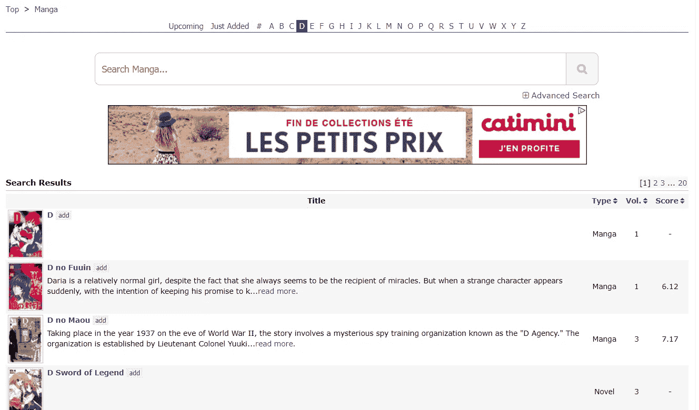
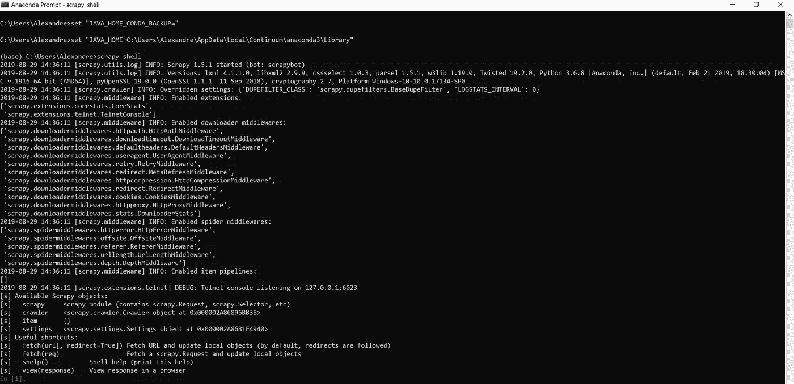
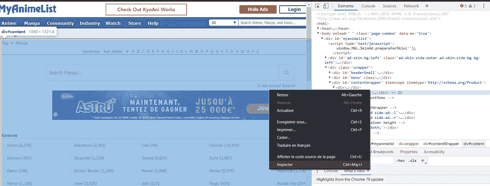
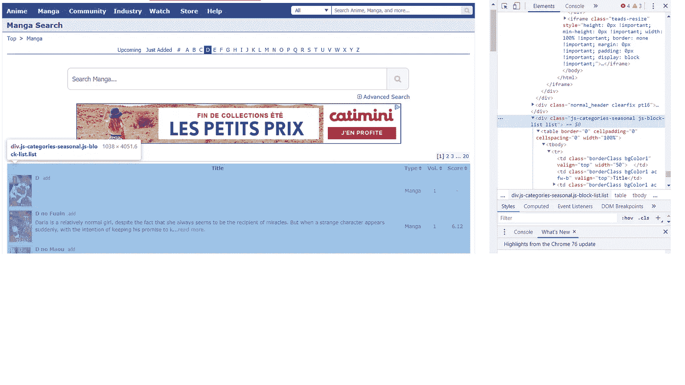

# 用 Scrapy 刮多页

> 原文：<https://towardsdatascience.com/scrape-multiple-pages-with-scrapy-ea8edfa4318?source=collection_archive---------2----------------------->

## 一个用 Scrapy 成功完成你的网络抓取项目的完整例子


[Tetiana Yurchenko/Shutterstock.com](https://www.shutterstock.com/image-vector/concepts-creative-process-big-data-filter-509934118)

在这篇文章中，我将开发一个**网络爬虫**，它将从`myanimelist`上可用的每个漫画中收集信息。为此，我们将迭代几个页面和子页面来创建一个完整的数据集。

# 什么是 Scrapy？

`Scrapy`是*“一个从网站提取你需要的数据的开源协作框架”。*

# 我为什么选择 Scrapy？

有几种类型的框架库允许我们进行网络抓取。尤其是 Scrapy、Selenium、BeautifulSoup，仅举几个最著名的例子。

Scrapy 是一个专门创建的工具，用于请求、抓取和保存 web 上的数据，它本身就足以构建一个健壮的 web 抓取项目，而 BeautifulSoup 是一个实用程序包，只对我们访问 web 页面的元素有用，它通常需要导入额外的库，如 requests 或 urllib2 和其他库，以具有 Scrapy 功能的范围。

此外，

*   Scrapy 强加了关于代码结构的习惯用法，这使得新手可以在网上找到非常有意义的例子，并很快掌握这个框架。
*   我们有一个特定于 scrapy 的 Shell，在准备部署之前，它可以用来调试脚本。
*   在一个 Scrapy 命令行中创建项目构建所需的所有附加文件(如 Django)。
*   最后 Scrapy 非常快，可以同时刮几十页。此外，还可以调整脚本的速度或其他参数。

开始你的项目吧！

我将向你展示完成一个抓取项目所需的每个步骤，并用 Scrapy 建立你的第一个数据集，在本教程中，我们将只使用:

*   Anaconda 的命令提示符(任何其他要安装 scrapy 和 python 的命令提示符都可以)
*   Scrapy 的壳
*   Python 3.x

开始我们的项目，我们将安装 Scrapy。

```
pip install scrapy
​
conda install scrapy
```

然后，仍然在 anaconda 命令提示符下，我们将指向我们选择的文件，并告诉 Scrapy 我们想要开始一个新项目。我们将这个文件夹称为 MEDIUM_REPO。

```
cd /d c://path/MEDIUM_REPO
​
scrapy startproject WebCrawler
```

因此，Scrapy 已经创建了我的刮刀所需的每个文件，让我们来看看。其结构如下:

```
WebCrawler
│   scrapy.cgf
└───WebCrawler
│   │   __init__
│   │   items.py
│   │   middlewares.py
│   │   pipelines.py
│   │   settings.py
│   │
│   └───__pycache__
│   │   scrapy.cgf
│   │
│   └─── spiders
│   │   __pycache__
│   │   __init__ 
│   │   your spider here
```

我们需要知道什么？Scrapy 给了我们几个. py 文件，我们不一定要接触它们，但有时它会很有用，这就是你需要知道的:

*   settings.py 给了你修改每秒/每个 ip 的请求数量的权利，添加一些扩展，错误处理程序和其他一些特性
*   Pipelines.py 让你有可能编写一些管道来以你想要的格式编写你的输出，尽管 scrapy 已经有了一些内置的命令来编写 json、csv、jsonlines 等等。
*   **Items.py，**抓取的主要目标是从非结构化数据源中提取结构化数据，Scrapy spiders 可以将提取的数据以 Python dicts 的形式返回。为了定义通用的输出数据格式，Scrapy 提供了`[Item](https://doc.scrapy.org/en/latest/topics/items.html#scrapy.item.Item)`类。`[Item](https://doc.scrapy.org/en/latest/topics/items.html#scrapy.item.Item)`对象是用来收集抓取数据的简单容器。它们提供了一个类似于[字典的](https://docs.python.org/2/library/stdtypes.html#dict) API，用一种方便的语法来声明它们的可用字段。这个文件就是在这里定义了那些`[Item](https://doc.scrapy.org/en/latest/topics/items.html#scrapy.item.Item)`
*   允许你编写自己的蜘蛛中间件。

# 写你的刮刀

在这个阶段，我们将能够开始编写我们的蜘蛛。首先，让我们看看我们要抓取什么，更准确地说是我们要抓取的页面的 HTML 代码。在这个项目中，**我们的目标是收集网站上所有的漫画及其相关的各种信息**。因此，我们将尝试抓取的网站结构如下:

```
[https://myanimelist.net](https://myanimelist.net)
└───https://myanimelist.net/manga.php
│   │   page A
│   │       └─── Page 1 to n 
│   │           └───    informations of several manga
│   │   page B
│   │   page C
│   │   .... 
│   │   page Z
```

我们可以看到漫画是按字母顺序排序的，在每个漫画中，都有 n 个子页面，包含了具有相同字母的其他漫画。如果我们点击其中的一个页面，我们可以看到有几个漫画的子页面，包括分数、概要、标题、数量和漫画类型。



我们可以看到的另一点是，对于每个页面，子页面的确切数量是未知的。我们将如何处理这些多个页面和子页面呢？让我们分阶段进行。

1.  首先，我们需要确定如何检索单个页面上的信息。
2.  然后我们必须找出如何从一个子页面移动到下一个子页面。
3.  最后是如何从一个字母转到另一个字母。

# 刮你的第一页！

让我们从一个页面开始，不管它是哪一个，我们将检索它的 URL 并通过 Scrapy 的 Shell 打开它。



让我们让 Scrapy 向一个 URL 发送一个请求。

```
url = 'https://myanimelist.net/manga.php?letter=B]'
fetch(url)
```

这里，我们在 anaconda 命令提示符中启用了 Scrapy shell 接口。Scrapy 在我们的请求返回给我们一个响应对象，我们将使用它来访问页面的 HTML 代码元素。

```
type(response)
scrapy.http.response.html.HtmlResponse
```

由于这个响应对象，我们将能够访问页面的特定元素。为此，我们将使用开发者工具或 google chrome 工具来检查 HTML 代码。为此，只需将自己定位在您想要右键单击的页面上，然后单击已检查。



我们现在可以访问该页面的源代码。我们可以看到，列表形式的第一页上的所有漫画都包含在属于类“class = " js-categories-seasonal js-block-list list”的 division 标签< div >中，我们将对该列表进行迭代，以提取每个漫画的特征。



```
#css
for sub_block in response.css('div.js-categories-seasonal tr ~ tr') :
    do_something
​
#xpath 
for sub_block in response.xpath('//div[@class="js-categories-seasonal js-block-list list"]/tr') :
    do_something
```

*   **标题**

我们编写了第一行代码来迭代列表中的每个漫画。现在我们需要编写允许我们访问感兴趣的元素的代码。通过我们的 devs 工具，我们试图检索标题，我们可以看到它包含在一个标签< a >下，这个标签指定了一个锚或者一个超链接。

```
<a class="hoverinfo_trigger fw-b" href="[https://myanimelist.net/manga/4499/B_-_Wanted](https://myanimelist.net/manga/4499/B_-_Wanted)" id="sarea4499" rel="#sinfo4499">
    <strong> B - Wanted </strong> == $0
</a>
```

这个标题实际上链接到几个元素，一个唯一的 id，一个指向关于这个特定漫画的更多信息的 URL，以及用粗体写的标题(见:强标签)。这里，我们只需要标题，所以我们将寻找标签< strong >下的文本。要选择 HTML 代码中的特定元素，有两种常用的方法，可以通过 css 路径(参见:级联样式表)或 xpath (xpath 是一种查询语言，用于选择 XML 文档中的节点)进行访问。

```
#Take the first manga as illustration
sub = response.css('div.js-categories-seasonal tr ~ tr')[0]
#xpath method 
title = sub.xpath('//a[@class="hoverinfo_trigger fw-b"]/strong/text()').extract_first().strip()#css method
title = sub.css('a[id] strong::text').extract_first().strip()
print(title) 
'B - Wanted'
```

我们做了什么？

*   通过语法“//”使用 xpath，我们可以选择 HTML 代码中出现的所有< a >，并指出将 URL 链接到标题的特定类，现在我们在这个标签中，所以我们可以选择粗体文本，并通过 scrapy `[extract_firs](https://docs.scrapy.org/en/latest/topics/selectors.html)t`方法提取它，这相当于 extract()[0]。
*   对于 CSS 方法，我们直接在标签中使用 id，它和 URL 一样是唯一的，所以这是相同的操作。

```
#xpath 
synopsis = sub.xpath('//div[@class="pt4"]/text()').extract_first()
#css
synopsis = sub.css("div.pt4::text").extract_first()
```

*   **类型|分数|卷数**

寻找分数时，我们发现了一个相当有趣的结构，其中我们感兴趣的下 3 条信息彼此相邻。让我们详细介绍一下这个结构:

```
<tr>
└───    <td> ... </td>
└───    <td>
│   │   └─── div
│   │   └─── a
│   │   └─── div
</td>
└─── td (type informations) </td>
└─── td (numbers of volumes informations) </td>
└─── td (rating informations) </td>
</tr>
```

我们的 3 条信息包含在标签< tr >中，它只是 HTML 中的一行。这一行可以包含几个单元格< td >。因此，这里有几种方法来选择可用的元素。我们可以通过指示元素在结构中的位置来访问元素，或者指示信息的特定类别，并自己索引结果。

```
#we can acces of the child of our 3 previous td and extract it 
#css
type_= sub.css('td:nth-child(3)::text').extract_first()
volumes=  sub_block .css('td:nth-child(4)::text').extract_first().strip()
rating =  sub_block .css('td:nth-child(5)::text').extract_first().strip()#xpath 
informations = sub.xpath("//tr/td[@class='borderClass ac bgColor0']/text()").extract().strip()
#the 3 first information are type - volumes- score  so :
type_ = d[:1]
volumes = d[:2]
rating = d[:3]
```

所以，写在一块，我们得到:

```
for sub_block in response.css('div.js-categories-seasonal tr ~ tr'):
                {  "title":  sub_block .css('a[id] strong::text').extract_first().strip(),
                "synopsis": tr_sel.css("div.pt4::text").extract_first(),
                "type_": sub_block .css('td:nth-child(3)::text').extract_first().strip(),
                "episodes": sub_block .css('td:nth-child(4)::text').extract_first().strip(), 
                "rating": sub_block .css('td:nth-child(5)::text').extract_first().strip(),
            }
```

我们在一页纸上收集了所有的数据。现在我们进入第二步，从当前页面过渡到下一个页面。如果我们检查允许我们访问下一个页面的图，我们会看到所有指向下一个页面的 URL 都包含在一个< span >中，它允许我们通过指示这个标签的类来对元素进行分组，我们访问超链接< a >和定义链接目的地的元素 *href* 。

```
response.xpath('//span[@class="bgColor1"]//a/@href').extract()
#output
['/manga.php?letter=B&show=50', 
'/manga.php?letter=B&show=100', 
'/manga.php?letter=B&show=950',
'/manga.php?letter=B&show=50', 
'/manga.php?letter=B&show=100', '/manga.php?letter=B&show=950'
]
```

发生了什么事？我们拿到了接下来的两页，最后一页，一式两份。如果我们更仔细地观察，我们会看到页面呈现如下:[1] [2] [3] … 20]，这就是为什么我们没有获得所有的 URL，因为在[3]和[20]之间没有指向 URL 的指针。为了弥补这一点，我们将迭代页面[1]以获得[2]和[2]以获得[3]到[n]，这里 n=950)。

```
next_urls = response.xpath('//span[@class="bgColor1"]//a/@href').extract()for next_url in next_urls:
    yield Request(response.urljoin(next_url), callback=self.parse_anime_list_page)
```

为了用 Scrapy 做到这一点，我们将使用一个名为`[url_join](https://doc.scrapy.org/en/latest/topics/request-response.html)`的函数，它将允许我们简单地将我们项目的基本 URL[[https://myanimelist.net](https://myanimelist.net)]与下一页的 URL[`manga.php?letter=B&show=50`]连接起来。

既然已经定义了这一步，我们仍然需要找到迭代每个字母的方法，以获得字母表中的所有漫画。仍然感谢我们应用于字母选择栏的检查工具，我们可以看到每个 URL 都包含在一个 division < div >中，并且有一个唯一的 id 指向一个导航栏。所有这些都包含在一个条目列表< li >中，最后是一个锚和一个 href(具体地说，URL 总是包含在一个 href 标签中)。

```
"""
we can define the xpath of every url easily thanks to navbar id 
then each url are stored in a < li > = list of item then an hyperlink tag < a > followed by a href so we can wrote that :
"""
 xp = "//div[@id='horiznav_nav']//li/a/@href"
```

一旦完成这些，我们就已经编写了成功完成项目所需的 99%的代码！现在有必要将所有这些形式化，以便在页面上迭代并启动我们的蜘蛛。我们主要在 shell 上工作，现在我们必须写一个集成了 Scrapy 的习惯用法的脚本。

当我们开始我们的项目时，我们定义了一个 URL，并在上面启动了一个`[fetch](https://doc.scrapy.org/en/latest/topics/request-response.html)`命令来发送请求，Scrapy 提出了一个与函数`[Requests](https://doc.scrapy.org/en/latest/topics/request-response.html)`功能相同的函数，除了发送一个请求之外，这个函数将参数`[Callbacks](https://doc.scrapy.org/en/latest/topics/request-response.html)`作为参数，或者我们传递另一个函数，在这个函数中，我们编写所有指向要废弃的元素的脚本。

重要的一点是，我们的 python 类必须**继承**scrapy . Spider 类，以便访问它的所有组件，并通过命令行授权启动蜘蛛。也可以给我们的蜘蛛命名，这将是一个启动快捷方式，使我们的任务更容易。

我们的机器人已经准备好抓取网页，所以现在你必须把它保存在蜘蛛文件夹中，如上图所示。现在让我们打开一个命令提示符，指向包含我们的蜘蛛的文件夹。

```
cd /d C:\Users\xxxxx\Documents\MEDIUM_REPO\WebCrawler\WebCrawler\spidersscrapy crawl Manga -o dataset_name.jsonlines
```

您的数据集准备好了，祝贺您！

# **总结**

在数据是一种非常珍贵的资源的时代，知道如何创建自己的数据集可能是一笔可观的资产。这有时需要做大量的工作，但这种技能在数据科学中是必不可少的，而且它也是构建贴近您内心的开发项目的主要资产。如果你对这篇文章有任何问题或评论，请在下面随意评论。