# 使用 Python 和 Google BigQuery 抓取 Reddit 数据

> 原文：<https://towardsdatascience.com/scrape-reddit-data-using-python-and-google-bigquery-44180b579892?source=collection_archive---------8----------------------->

## 访问 Reddit API 和 Google Bigquery 的用户友好方法

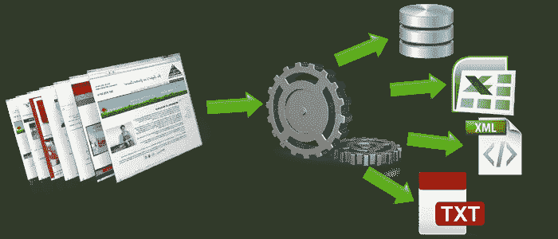

[source](http://webdata-scraping.com/web-scraping-trending-technique-in-data-science/)

Reddit 是最古老的社交媒体平台之一，就其用户和每年产生的内容而言，它仍然保持着强劲的势头。在古老的用户界面背后，是数百万用户每天以问题和评论的形式创造的信息宝库。

在这篇文章中，我们将一步一步地看到如何使用 python 和 Google Bigquery 从 Reddit 网站获取数据。为了说明这一过程，我决定提取关于插队者的数据，这些人切断了他们的电缆连接并购买了流媒体网站订阅，因为这一现象令我感兴趣。

作为第一步，让我们了解 Reddit 网站的结构。

## Reddit 中的信息是如何组织的？

这个网站被分成不同的**子栏目，**每个用户根据自己的兴趣选择他们想要订阅的子栏目。这些包括音乐子编辑区，在那里可以分享关于音乐的链接，体育子编辑区，人们可以详细谈论体育，或者在我们的例子中，人们可以讨论有线连接或他们新的流媒体订阅。

**向上投票和向下投票**系统是 Reddit 的精髓，因为它显示了社区成员对特定主题的一致意见。一个帖子获得的支持票越多，它在网站上的显示就越显著。值得注意的是，评论和帖子一样重要，因为它们经常成为扩展的嵌套讨论。

## **让我们从 Reddit 的数据收集开始**

## **Reddit API:**

而网络抓取是著名的(或臭名昭著的！)从网站收集数据的方式，很多网站都提供 API 来访问它们在网站上托管的公共数据。这是为了避免抓取机器人产生的不必要的流量，经常导致网站崩溃，给用户带来不便。甚至 Reddit 也提供这种易于访问的 API。

以下是你在这个练习中需要的东西:

1.  **Python 3.x** :你可以在这里下载
2.  Jupyter 笔记本电脑:我们将把它作为我们的交互控制台
3.  **Reddit 账户**:你必须创建一个 [Reddit](https://www.reddit.com/) 账户

在获得所需主题的数据之前，您需要遵循几个步骤。

1.  **创建一个应用:**

注册后的第一步是创建一个应用程序来获取 Oauth 密钥以访问数据。点击[这里](https://www.reddit.com/prefs/apps)开始。

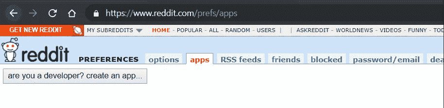

creating an app

单击创建一个应用程序，如快照所示。然后出现如下所示的对话框。

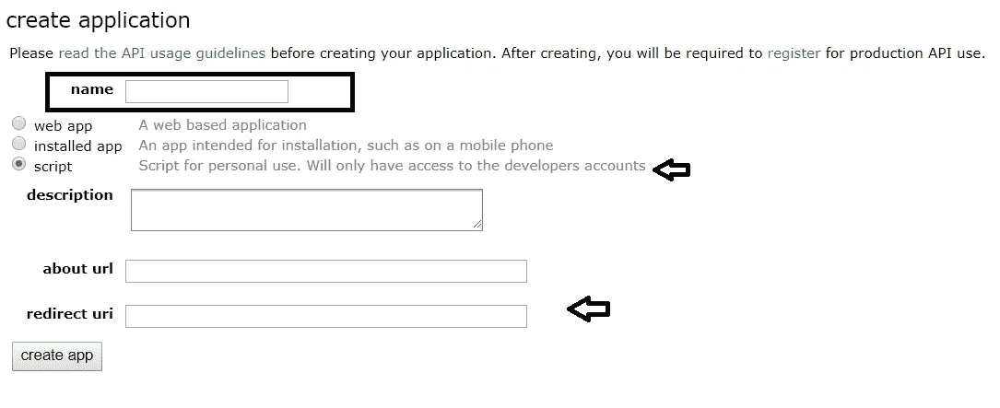

在对话框中输入应用程序的名称，然后单击脚本，因为我们将把它用于个人用途。确保在重定向 URL 框中输入 [http://localhost:8080](http://localhost:8080) 。如果您需要任何澄清，您可以参考 [praw 文档](https://praw.readthedocs.io/en/latest/getting_started/authentication.html#script-application)。现在点击底部的创建应用程序按钮。

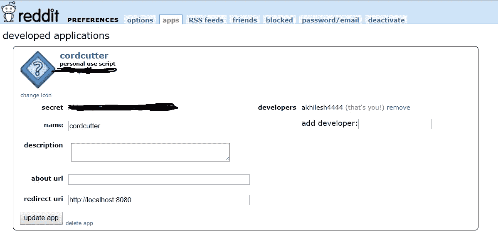

现在您的应用程序已经创建好了。将您的 14 字符个人使用脚本和 27 字符密钥存储在安全的地方。现在，您已经拥有了 OAuth2 身份验证连接到 Reddit API 所需的所有凭证。

现在是时候打开 Jupyter 笔记本了！

**2。建立连接**

我们在这个练习中需要的包装是 praw 和熊猫。PRAW 是说唱歌手的缩写，我们将使用它向 Reddit API 发出请求。确保您已经安装了这两个软件。第一步是导入这些包

```
import praw
import pandas
```

导入包后的下一步是使用我们之前创建的凭证建立与 Reddit API 的连接。Client_id 将是您的 14 个字符的个人使用脚本密钥，client_secret 是您的 27 个字符的秘密密钥。用户名和密码是您的 Reddit 帐户凭据。其余的代码将保持不变。

```
reddit = praw.Reddit(user_agent='Comment Extraction (by /u/USERNAME)',client_id='**********',client_secret="***********",username='********', password='*******')
```

通过运行上面的代码片段，我们将建立连接并将该信息存储在一个名为 reddit 的变量中。

**3。获取数据**

正如我们之前所讨论的，我们将专注于为“cordcutter”子编辑获取数据。

**标题、分数、url、id、评论数量、创建日期、正文**是从 Reddit API 获取数据时可用的字段。但是在我们的分析中，我不会考虑任何时间方面，我们主要关注的是从子编辑中获取正文(评论)。参考 [praw 文档](https://praw.readthedocs.io/en/latest/code_overview/models/subreddit.html)了解不同种类的实现。这里，我将代码限制为所需的输出，它只是所有注释的正文文本。

为了让所有的评论都包含嵌套回复，我必须想出一个包含 3 个部分的嵌套代码。

**获取评论 id 列表**

```
comm_list = []
header_list = []
i = 0
for submission in reddit.subreddit('cordcutters').hot(limit=2):
    submission.comments.replace_more(limit=None)
    comment_queue = submission.comments[:]
```

在这个循环中，首先我们在循环开始时获取每个提交信息，然后提取所有的评论 id 并将它们存储在 list 中。

在这里。hot(limit)可以是任何数字，具体取决于您的要求。我在这里将它设置为 2 来说明输出，但是将其设置为 None 将获取 cordcutter subreddit 中所有的顶级提交。replace_more(limit=None)将帮助我们考虑包含嵌套回复的评论。

该循环的输出如下所示:

```
[Comment(id='ed5ssfg'),
  Comment(id='ed64a72'),
  Comment(id='edth3nc'),
  Comment(id='ed680cg'),
  Comment(id='ed699q2'),
  Comment(id='ed80ce8'),
  Comment(id='edau9st'),
  Comment(id='edcx477'),
  Comment(id='ee0fp3g'),
  Comment(id='ed5qrvh')]
```

**获取所有嵌套回复**

我们就要得到我们想要的数据了。在这部分代码中，我们将获得之前获得的每个注释 id 的主体。如果评论有嵌套回复，它将进入下一个循环，并以类似的方式提取信息。

```
while comment_queue:
    header_list.append(submission.title)
    comment = comment_queue.pop(0)
    comm_list.append(comment.body)
    t = []
    t.extend(comment.replies)
    while t:
        header_list.append(submission.title)
        reply = t.pop(0)
        comm_list.append(reply.body)
```

到目前为止，我们从 Reddit 下载了评论，并且需要一些预处理来将其下载为 csv 格式。

下面是经过整理的代码

```
comm_list = []
header_list = []
i = 0
for submission in reddit.subreddit('cordcutters').hot(limit=2):
    submission.comments.replace_more(limit=None)
    comment_queue = submission.comments[:]  # Seed with top-level
    while comment_queue:
        header_list.append(submission.title)
        comment = comment_queue.pop(0)
        comm_list.append(comment.body)
        t = []
        t.extend(comment.replies)
        while t:
            header_list.append(submission.title)
            reply = t.pop(0)
            comm_list.append(reply.body)df = pd.DataFrame(header_list)
df['comm_list'] = comm_list
df.columns = ['header','comments']
df['comments'] = df['comments'].apply(lambda x : x.replace('\n',''))
df.to_csv('cordcutter_comments.csv',index = False)
```

您可以在我的 github 资源库中找到代码的最终版本。

[](https://github.com/akhilesh-reddy/Cable-cord-cutter-lift-and-sentiment-analysis-using-Reddit-data) [## akhilesh-Reddy/使用 Reddit 数据的电缆切割升降机和情感分析

### 从 Reddit 抓取数据并执行命名实体识别，对评论进行主题建模以了解公众…

github.com](https://github.com/akhilesh-reddy/Cable-cord-cutter-lift-and-sentiment-analysis-using-Reddit-data) 

我们的最终输出如下所示:

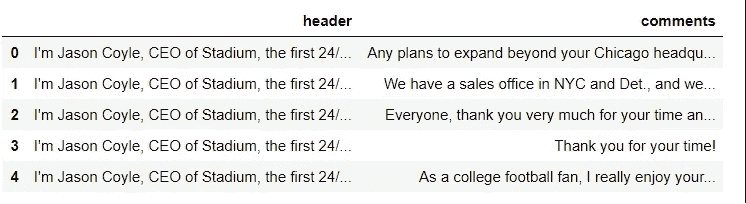

我们有自己的数据，但这里有一个挑战。一般来说，使用 Reddit API 获取几个月的历史数据需要更多的时间。感谢[pushshift . io](https://pushshift.io/)(Reddit 上的又名 [/u/Stuck_In_The_Matrix](https://www.reddit.com/user/Stuck_In_the_Matrix) )的杰森·迈克尔·鲍姆加特纳，我们清理了多年的 Reddit 历史数据，并将其存储在 Bigquery 中，这是本文的第二部分。

## **big query 中的 Reddit 数据:**

对于那些不知道 Bigquery 是什么的人来说，

> Google BigQuery 是一个[企业数据仓库](https://cloud.google.com/solutions/bigquery-data-warehouse)，它通过使用 Google 基础设施的处理能力实现超快速 SQL 查询来解决这个问题。

最好的部分是查询这些数据将是免费的。Google 免费提供第一个 10GB 的存储和第一个 1 TB 的查询内存，作为免费层的一部分，我们的任务需要不到 1 TB 的内存。

**让我们看看如何查询这些信息。**

首先点击这个 [Google BigQuery](https://bigquery.cloud.google.com/) 链接开始。Google 会自动使用您浏览器中存储的 Google 凭据让您登录。如果这是您第一次使用 BigQuery，将会出现一个对话框，要求您创建一个项目。

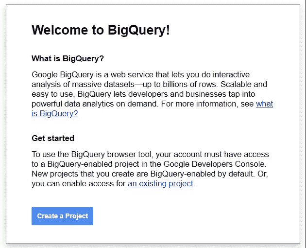

点击创建一个项目按钮。

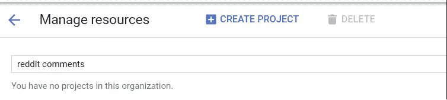

为该组织命名，然后单击顶部的 create project。

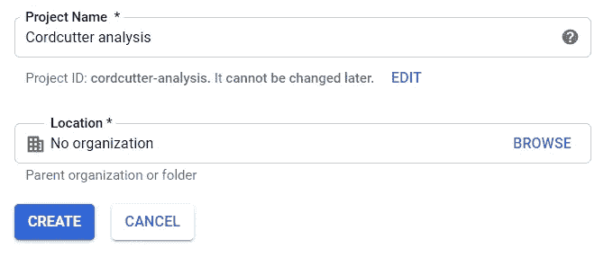

给出项目的名称，您可以暂时保留位置框。然后点击创建。现在您已经创建了您的项目，一个仪表板出现在屏幕上。

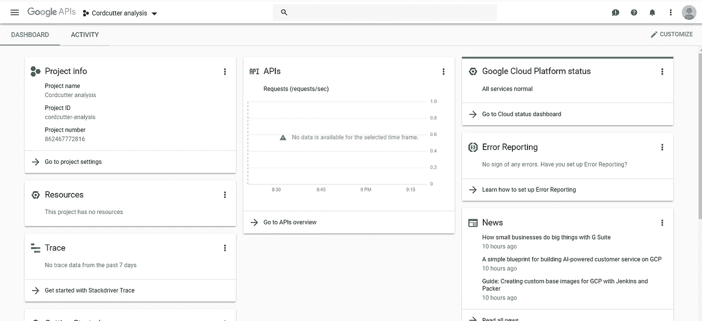

现在在这之后，点击 [*链接*](https://bigquery.cloud.google.com/table/fh-bigquery:reddit_comments.2015_05) 。这将在您创建的项目下打开 reddit 数据集。在左侧，您将看到在模式名 fh-bigquery 下每个月更新的数据集。

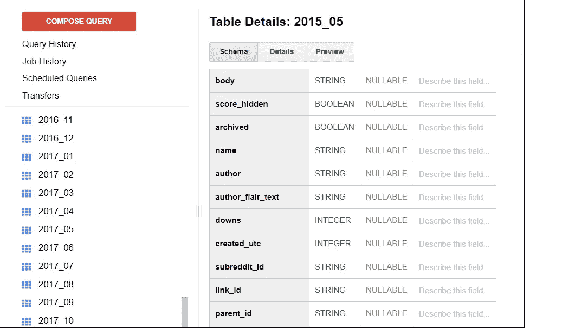

让我们运行查询，从表中获取一个月的数据。

```
select subreddit,body,created_utc
from `fh-bigquery.reddit_comments.2018_08` 
where subreddit = 'cordcutters'
```

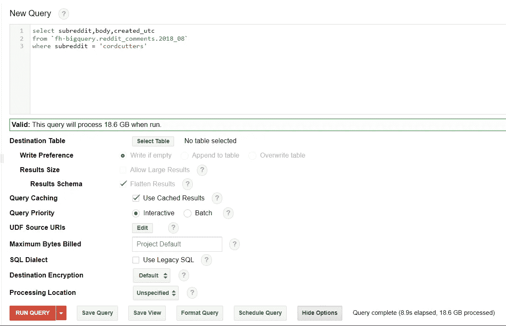

这将得到所有关于“割线者”subreddit 的评论。但是请确保您没有选中选项中的“使用遗留 sql”复选框，因为上面的代码片段是在标准 SQL 中。但是，您可以选择您所选择的 sql，并相应地对代码进行更改。

这是结果的样子，您可以通过单击“下载为 csv”按钮下载 CSV 格式的结果。

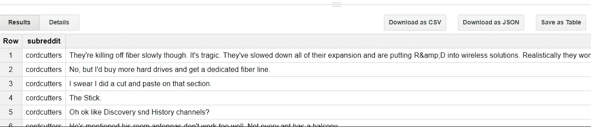

在这里，我只是专注于获取我们需要的数据。如果你想在 bigquery 上更多地使用 reddit 数据，你可以参考 Max Woolf 的这篇[文章](https://minimaxir.com/2015/10/reddit-bigquery/)，这篇文章更详细地介绍了 Bigquery 中的 Reddit 数据。

## 总结:

在这篇文章中，我们看到了如何创建 OAuth2 凭据以连接到 Reddit，向 Reddit API 发出数据请求以获取最新数据，并通过 Google Bigquery 快速查询历史数据。

除了通过 API 和 Bigquery 获取数据，您可能会发现使用 Selenium 和 python 进行 web 抓取很有趣。下面是一篇由 UT Austin 的同学( [Atindra Bandi](https://towardsdatascience.com/@bandiatindra) )写的文章。

[](/web-scraping-using-selenium-python-8a60f4cf40ab) [## 使用 Selenium-Python 进行 Web 抓取

### 在这篇文章中，你将学习如何浏览一个网站的多个页面并收集大量数据…

towardsdatascience.com](/web-scraping-using-selenium-python-8a60f4cf40ab) 

那都是乡亲们！请继续关注我在未来几周发布的关于推荐系统、数据科学统计和数据可视化的一系列文章的更新。