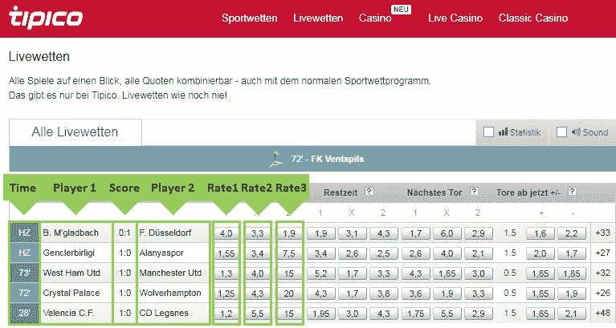
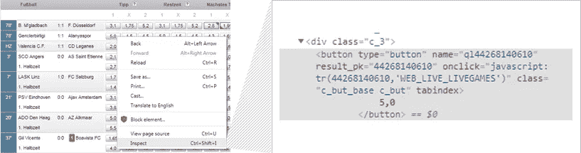
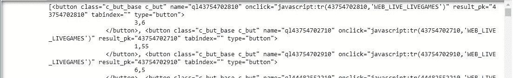
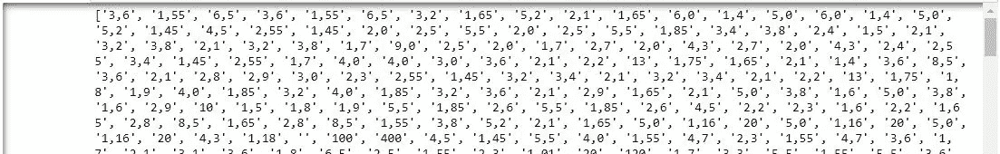
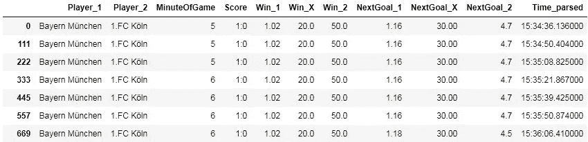
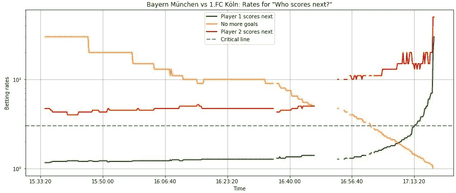

# 收集和探索体育博彩数据——套利可能吗？用代码进行实际分析。

> 原文：<https://towardsdatascience.com/scraping-and-exploring-sports-betting-data-is-arbitrage-possible-a-hands-on-analysis-with-code-2ba656d7f5b?source=collection_archive---------4----------------------->


Photo by [Richard Boyle](https://unsplash.com/@hellorich?utm_source=medium&utm_medium=referral) on [Unsplash](https://unsplash.com?utm_source=medium&utm_medium=referral)

## 如何下载实时体育博彩时间序列数据，解析它并使用 Python 分析套利机会

谁不想拥有一台**无风险盈利机**？我想每个人都想有一个。利用不同市场或博彩公司之间的价格差异(在这种情况下是博彩利率差异)的做法也被称为**套利**。这个想法是在样本空间的每一个结果上下赌注，并在每一个案例中产生利润。在足球比赛中，你可以打赌哪个玩家赢了一场比赛，也就是说，样本空间将由三种结果组成:“玩家 1 赢”、“平局”和“玩家 1 输”。

在我们深入分析之前，我们应该先看看数据收集和我们将涉及的更多主题:

1.  **网页抓取**现场投注数据( **BeautifulSoup** )
2.  将结果存储在**数据帧** ( **熊猫**)中
3.  **自动化**带有功能的刮削过程
4.  **使用 **matplotlib-pyplot** 的结果可视化**
5.  首先进行**套利分析**和利润计算

关于这个数据，我已经提出了许多其他令人兴奋的主题，但是我现在将它们排除在范围之外。(可能会在下一篇文章中跟进。)

*   来自多个网站的网络抓取和数据整合
*   衍生投注/交易策略的规则，包括模拟和评估自动化策略的性能
*   驱动因素分析:是什么驱动了下注率的演变(可能包括来自会议直播行情的文本分析)
*   大概还有很多更有趣的话题；很高兴听取您的意见

**法律免责声明:**我不是法律专家，也不在这里提供任何行动建议，只是纯粹的技术解释。网站的大规模抓取会导致高流量，从而加重他们的负担。我相信，如果你在访问网站，你应该始终考虑他们的服务条款，最好事先获得像刮擦这样的项目的许可。此外，我不提倡赌博，不管是哪种赌博。

# 1.网络抓取现场投注数据(BeautifulSoup)

为了收集数据，我们将使用 library BeautifulSoup。我已经通过命令行下载并安装了它:

*pip 安装美丽组 4*

安装完成后，我们可以开始导入所有相关的库。

```
from bs4 import BeautifulSoup
import urllib.request
import re
```

我们现在可以使用它们来检索任何页面的源代码并解析它。
我选择了德国博彩网站 tipico.de 的现场投注页面。

```
url = “[https://www.tipico.de/de/live-wetten/](https://www.tipico.de/de/live-wetten/)"try:
 page = urllib.request.urlopen(url)
except:
 print(“An error occured.”)soup = BeautifulSoup(page, ‘html.parser’)
print(soup)
```

上面的代码检查它是否可以访问页面，然后打印出页面的整个 html 源代码。按照惯例，这将被分配给一个名为“soup”的变量，长度大约为 200-300 页 A4 纸，取决于当前在线下注的数量。

下一步，我们希望以一种结构良好的方式只提取相关的信息。让我们看看网站，看看我们关注哪些信息。



首先，我们可以尝试提取用绿色标记的七个值:时间、玩家的名字、当前分数和每种可能结果的比率。这里，比率 1 对应于玩家 1 赢，比率 2 对应于平局，比率 3 对应于玩家 1 输。要做到这一点，用浏览器检查元素是很方便的(右击并用 Chrome ' Inspect ')。



我们看到费率存储在“c_but_base c_but”类的按钮中。为了提取费率，我们将使用 soup.find_all 来获取该类的所有按钮。

```
regex = re.compile(‘c_but_base c_but’)
content_lis = soup.find_all(‘button’, attrs={‘class’: regex})
print(content_lis)
```



为了去掉 html 代码，我们使用。getText()函数，然后将所有按钮的值存储在一个列表中，并删除换行符和制表符。

```
content = []
for li in content_lis:
 content.append(li.getText().replace(“\n”,””).replace(“\t”,””))
print(content)
```



其他变量可以类似地查询。你可以在 Github 上的我的笔记本里找到细节。如果有不清楚的地方，不要犹豫问问题。

# 2.将结果存储在数据框中(熊猫)

有了原始的和解析过的数据，我们现在想以一种实用的方式来构造它。我们理解游戏有一个时间，两个玩家，一个分数，每排十一个比率。至于比率，我们只想存储“谁赢了比赛”的三个比率和“谁进了下一个球”的三个比率，因为这些在大多数下注方上都是可用的，并且以后将允许我们有高度的可比性。

```
N_games = 10 # number of games observed, say we want the first 10
N_players = 2 # number of players per game
N_outcomes = 11 # number of possible outcomes (Win, lose, tie, Next goal etc.)
df = []
for i in range(N_games):
    df.append([datetime.now(), content_names[i*N_players], content_names[1+i*N_players], content_minute[i],
        content_score[i], content[i*N_outcomes], content[1+i*N_outcomes], content[2+i*N_outcomes],
        content[6+i*N_outcomes], content[7+i*N_outcomes], content[8+i*N_outcomes]])pdf = pd.DataFrame(df, columns = ['Time', 'Player_1', 'Player_2', 'MinuteOfGame', 'Score', 'Win_1', 'Win_X', 'Win_2', 'NextGoal_1' , 'NextGoal_X' , 'NextGoal_2' ])pdf.head()
```


(注:在我的笔记本里，还有两个变量，j 和 k，它们是用来除 bug 的，当每场比赛多了一行‘上半场比赛结果’。为了简单起见，我将它排除在描述之外。)

# **3。具有功能的刮削过程的自动化**

要多次重复这个刮削过程，可以方便地写成一个函数:

```
**def get_soccer_rates_tipico**():
    """
    This function creates a table with the live betting information,
    this includes a timestamp, the players, the score and the rates
    for each party winning and scoring the next goal.

    Arguments:
    None

    Returns:
    pdf -- pandas dataframe with the results of shape (N_games, 11)
    """

   ... FULL CODE ON GITHUBreturn pdf
```

返回的表格的形状取决于当前正在进行的游戏的数量。我已经实现了一个功能，查找第一个网球比赛条目，以计算实况足球比赛的总数，并获得所有比赛。

现在我们可以把它写成一个循环，以固定的时间间隔重复这个刮擦函数。

```
**def repeat_scraping**(timedelay, number_of_scrapes, filename = 'bet_rates_scraping_tipico.csv'):
    """
    This function repeadetly calls the scraping function to create a timeseries of scraping data. The time interval between scrapes and number of scrapes in total are taken as argument. The result is saved in a csv-file.

    Arguments:
    timedelay -- delay between each scrape request in seconds (min. 15 sec recommended due to processing time) number_of_scrapes --  number of scrape requests 

    Returns:
    Void
    """        
           ... FULL CODE ON GITHUB dataframe = pdf.to_csv(filename, index=False)

# Check processing time and add sleeping time to fit the timedelay
        time_run = time.time() - start_time
        time.sleep(timedelay - time_run)
```

请注意，页面的加载和解析可能需要 10 秒钟。我们可以使用*时间*库来跟踪我们的函数从睡眠时间中减去它需要多长时间来调整时间延迟(假设所有查询花费的时间大致相同)。

我们可以调用这个函数来抓取整个游戏，例如 15 秒的时间延迟和 500 个查询，即覆盖 125 分钟。

```
repeat_scraping(15, 500, 'scraping_500x15s.csv')
```

# **4。使用 **matplotlib-pyplot** 对结果进行可视化和分析**

作为第一步，在导入数据后，我们需要做一些数据清理。这包括用零填充所有汇率的 NaNs，用点替换逗号，并将它们转换为浮点类型。

```
dataframe = pd.read_csv('scraping_500x15s.csv', encoding = 'unicode_escape')
dataframe = dataframe.fillna(0)
ratecols = ['Win_1','Win_X','Win_2','NextGoal_1','NextGoal_X','NextGoal_2']
dataframe[ratecols] = dataframe[ratecols].apply(lambda x: x.str.replace(',','.')).astype(float)
```

因为我们希望每分钟查询多次，所以“游戏的一分钟”不够精确，因此，我们添加了查询时间戳。

```
dataframe['Time_parsed'] = 0
# Check for dates without milliseconds and add .000 to have a consistent formatting
dataframe.Time.iloc[np.where(dataframe.Time.apply(lambda x: True if len(x) == 19 else False))] \
= dataframe.Time.iloc[np.where(dataframe.Time.apply(lambda x: True if len(x) == 19 else False))].apply(lambda t: t + ".000")
dataframe.Time_parsed = dataframe.Time.apply(lambda x: datetime.strptime(x, '%Y-%m-%d %H:%M:%S.%f').time())
dataframe = dataframe.drop(['Time'], axis=1)
```

现在，我们可以探索第一场比赛的数据并可视化结果。让我们看看牌桌上的第一位玩家:

```
df1 = dataframe[dataframe[‘Player_1’] == dataframe[‘Player_1’][0]]
df1
```



我们现在有拜仁慕尼黑 vs 1 的数据。科隆俱乐部比赛从第 5 分钟开始，每 15 秒一次。下面的图表显示了下一个进球得分率的变化。我在 y 轴上使用了对数标度来计算超过 30 的比率。此外，我还加入了一条比率为 3 的水平线，表明了一种简单的套利形式:如果所有报价都大于 3，那么你可以通过对所有三种结果进行均匀分布的押注(例如，每人 100 €)来产生无风险利润。

```
# Data for plotting
t = df1.Time_parsed.values
w1 = df1.NextGoal_1.values
w2 = df1.NextGoal_X.values
w3 = df1.NextGoal_2.values# Plot setup
fig, ax = plt.subplots(figsize=(15, 6))        
ax.plot(t, w1, marker ='', label = 'Player 1 scores next' ,color = 'green', linewidth = 2)
ax.plot(t, w2, marker ='', label = 'No more goals', color = 'orange', linewidth = 2)
ax.plot(t, w3, marker ='', label = 'Player 2 scores next', color = 'red', linewidth = 2)
plt.axhline(y=3., label = 'Critical line', color='grey', linewidth = 2, linestyle='--') # Line for arbitrage detectionax.set(xlabel='Time', ylabel='Betting rates', title=str(np.unique(df1.Player_1)[0]) + ' vs ' + \
               str(np.unique(df1.Player_2)[0]) + ': Rates for "Who scores next?"')
ax.grid()
plt.legend()ax.set_yscale('log')
```



在我的笔记本里，你会发现一个自动为所有游戏创建剧情并保存为图片的功能。

# 5.首先进行**套利分析**和利润计算

回到我们寻找套利交易的想法，很可能不太可能在一个网站上找到它们。我相信利用多个庄家之间的信息差异实现套利投注的可能性更大。但是，我们现在将只研究对 Tipico 数据的分析。这种分析可以很容易地扩展到多个网站。

一个简单的数学问题:
假设 n 是一个事件的可能结果的数量，q_i 是每个结果的比率，那么如果所有 1/q_i 之和小于 1，套利是可能的。

```
df2['Check_a_1'] = df2.Win_1.apply(lambda x: 1/x)
df2['Check_a_2'] = df2.Win_X.apply(lambda x: 1/x)
df2['Check_a_3'] = df2.Win_2.apply(lambda x: 1/x)
df2['Check_a_sum']=0
df2['Check_b_1'] = df2.NextGoal_1.apply(lambda x: 1/x)
df2['Check_b_2'] = df2.NextGoal_X.apply(lambda x: 1/x)
df2['Check_b_3'] = df2.NextGoal_2.apply(lambda x: 1/x)
df2['Check_b_sum']=0
df2['Check_a_sum'] = df2.Check_a_1 + df2.Check_a_2 + df2.Check_a_3
df2['Check_b_sum'] = df2.Check_b_1 + df2.Check_b_2 + df2.Check_b_3
df2['Arbitrage_flag']=0
arb_idx = np.unique(np.append(np.where(df2.Check_a_sum <= 1)[0],np.where(df2.Check_b_sum <= 1)[0]))
df2.Arbitrage_flag[arb_idx] = 1
```

如果我们想获得一个独立于结果的利润，我们需要根据利率来分配赌注。当你考虑利率 *q* 乘以金额 *s* 等于利润 *p* 以满足 *p_i = p_j，*你得到 s_j = q_i/q_j * s_i。

```
# Give the first bet the weight of 1 and adjust the other two bets accordingly
df2['Win_1_betting_fraction'] = 1
df2['NextGoal_1_betting_fraction'] = 1
... FULL CODE ON GITHUB
df2['Win_profit_percentage'] = df2.Win_1 * df2.Win_1_betting_amount * 100 - 100
```

在我收集的数据中，我发现了以下例子:

> 下一个进球得分率:
> 球员 1: 1.70
> 不再进球:4.70
> 球员 2: 7.00
> 
> 这就导致了如下投注金额分布:
> 投注 1: 62.32%
> 投注 2: 22.54%
> 投注 3: 15.14%
> 
> **这导致了 5.9%的确定利润。**

(在我看来很奇怪，我在一个单一的网站上找到了套利的机会。可能是抓取数字时出现了错误，我会对此进行调查。)

正如所展示的，这个过程使你能够计算出一个赌注组合的确定利润。现在就看你自己去寻找积极的价值观了！

# 包扎

在本文中，您可以学习如何使用 Python 和 BeautifulSoup 加载和解析 web 页面，只提取想要的信息并将其加载到结构化数据表中。为了提取时间序列，我们研究了如何将其实现为函数，并以固定的时间间隔重复我们的查询。之后，我们编写代码来自动清理数据，然后进行可视化和额外的计算，使数据可以被解释。

我们已经看到，套利赌博很可能是可能的——如果不是在一个网站上，那么通过与多家博彩公司联合下注。(请注意，我不是在推广赌博和/或网络搜集，即使是套利交易也可能存在风险，例如延迟或取消交易。)

非常感谢您花时间阅读这篇文章！

我非常感谢并欢迎您的反馈和意见。
你可以通过 LinkedIn 联系我:[https://www.linkedin.com/in/steven-eulig-8b2450110/](https://www.linkedin.com/in/steven-eulig-8b2450110/)
……你可以在这里找到我的 github 包括 Jupyter 笔记本:
https://github.com/Phisteven/scraping-bets

干杯，
史蒂文