# 搜集和探索整个英语有声目录

> 原文：<https://towardsdatascience.com/scraping-and-exploring-the-entire-english-audible-catalog-ea279cd09f88?source=collection_archive---------20----------------------->

上周，我使用 Python 的 HTML-Requests 包编写了一个脚本，从 Audible 获取有关他们当前的“买一送一”信用销售中的程序的信息。在对线程超参数进行试验后，我设法让我的脚本的性能达到每秒 55 个条目，这意味着 Audible 的大约 40 万个程序的整个英文目录可以在大约两个小时内完成。几个小时后，我有了一个完整的数据集。

(注:如果你喜欢代码，可以直接跳转到[刮痧笔记本](https://github.com/tobymanders/Data_Analysis/blob/master/audible_eda/audible_scraper.ipynb)和[分析笔记本](https://github.com/tobymanders/Data_Analysis/blob/master/audible_eda/audible_data_analysis.ipynb)。你也可以下载[整个数据集](https://drive.google.com/file/d/1btf5Eq6U-GfG3iScpX6lMluCt6SgS45c/view?usp=sharing)。)

在加载和处理数据以消除重复并转换对象类型后，我有 352，686 个条目，包含以下字段:标题、作者、类别(流派)、长度、讲述者、价格、评级(在源处四舍五入到 0.5 的增量)、评级计数、发布日期和 URL。

*#我们的数据中音频的总长度是多少？*

230 年，235 天，15 小时

*#哪几个类别的时长和收视率最高？*

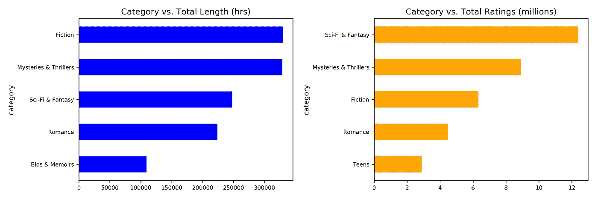

有趣的是，总时长排名前三的类别与收视率排名前三的类别正好相反。换句话说，“科幻&奇幻”节目每小时的参与度(即评论数量)比“小说”节目高得多。看看能不能进一步量化。由于每小时的评论数量可能比每个标题的评论数量更不公平(我们假设一些流派的标题平均比其他流派的长)，让我们采用后者。让我们看看这一替代指标是否会延续敬业度趋势。

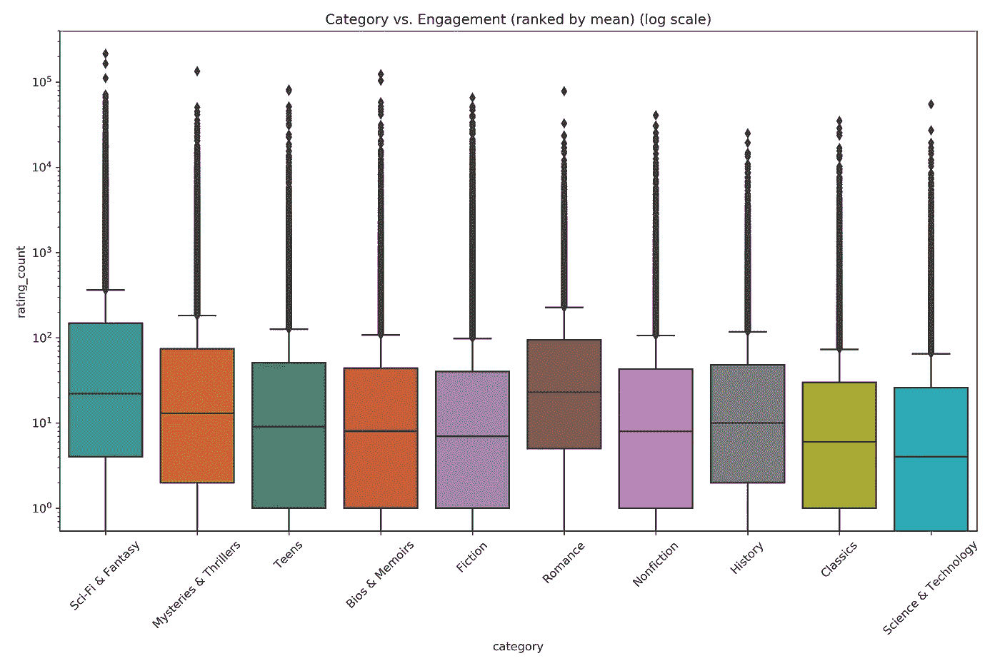

Categories sorted from left to right by mean number of reviews.

这里有几个有趣的发现:首先，按每个标题的平均评论数计算，“科幻与幻想”仍然是最高的参与度。然而，现在当考虑评论的中位数而不是平均数时，它输给了“浪漫”(22 对 23)。此外,“浪漫”评论的分布比任何其他类别都要紧密。综合这些发现，表明“浪漫”比其他类别有更多的双峰分布。我们应该预料到更多的书很少或者没有评论，这就降低了平均值。然而，受欢迎的书籍都有很多评论，提高了中位数。换句话说，“浪漫”的听众在节目选择上没有其他类型的听众大胆。

各书的评分是如何分布的？

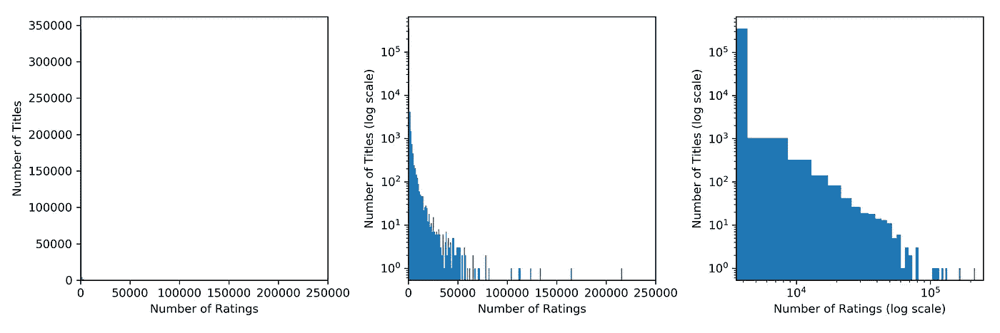

注意:第一个情节不是错误。没有非线性轴的绘图意味着评论很少的标题数量主导了绘图。事实上，在我们大约 35 万个程序中，超过 20 万个程序的总评论数不到 10 条。第二个图是一个直的 x 轴和对数标度的 y 轴，展示了超过 100，000 条评论的极少数图书——准确地说是 7 个。第三个图向我们展示了评级计数的对数与评级计数频率的对数大致呈线性变化。换句话说，高层是孤独的。

*#那些少有的> 100k 收视率的书是什么？*

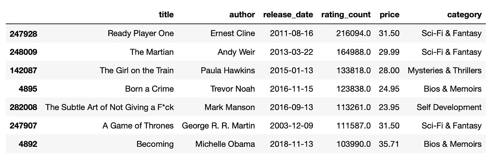

Ready Player One dominates the field in number of ratings.

需要注意的是:所有这些产品都比整个 Audible 目录 15.42 美元的平均价格要贵得多。所代表的类别比我们想象的更加多样化:两部科幻小说，一部奇幻小说，一部惊悚小说，两部自传和一部自助小说。除了一本，所有的书都是在过去十年发行的。一号玩家有大量的评论。事实上，**这个标题的评论比其他 174，000 个节目加起来还多。**

*#哪些作者的评分最高？*

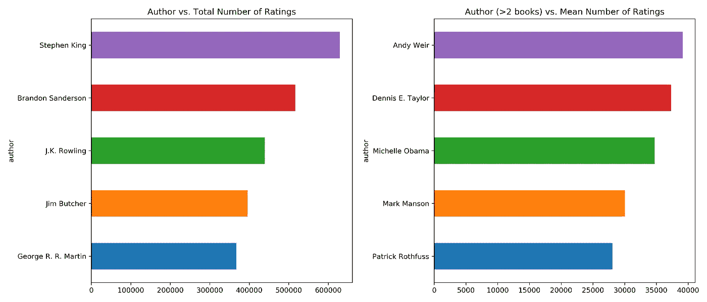

斯蒂芬·金以超过 600，000 条评论赢得了他的书籍评论总数的冠军。令人印象深刻的是[他收视率最高的头衔](https://www.audible.com/pd/11-22-63-Audiobook/B005UR3VFO?qid=1561787500&sr=1-95&pf_rd_p=e81b7c27-6880-467a-b5a7-13cef5d729fe&pf_rd_r=4J20H7H6997HA7FQ79X1&ref=a_search_c3_lProduct_2_45)只有 51695。他在排行榜的首位证明了他的多产。他在 Audible 上有 130 个单独的录音，没有被我们的重复搜索筛选掉。

在第二个图中，我们考虑了 Audible 上有两个以上标题的作者的每个节目的平均评论数(以便筛选“一炮走红的奇迹”及其样本/替代版本)。在《火星人》的鼓舞下，安迪·威尔摘得桂冠，后者是第二大冠军。

*#哪些作者的书名数量和记录小时数最多？*

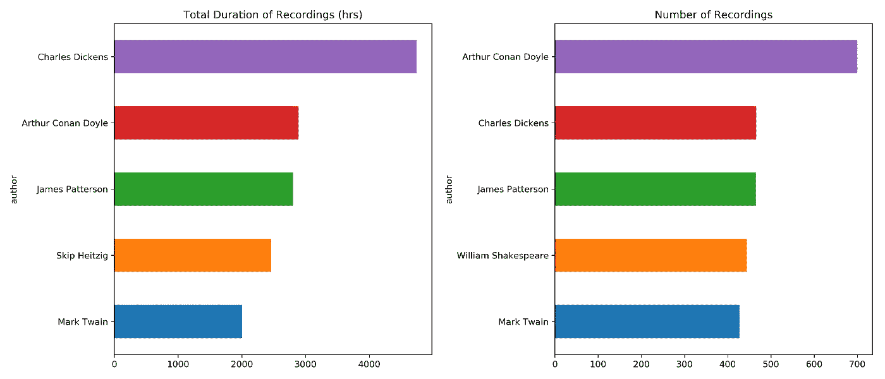

继续调查我们数据集中最多产的作者，我们查看音频的总持续时间和录音数量(不包括期刊)。查尔斯·狄更斯(Charles Dickens)在 audible 上以近 5000 小时的总时长独占鳌头。他和排名第二的阿瑟·柯南·道尔似乎都从 Audible 上对他们作品的多次翻译中受益匪浅。单单《双城记》就有 37 个不同的版本！詹姆斯·帕特森没有这种优势，他在当代作家中胜出。

多伊尔和狄更斯切蛋糕的方式略有不同，他们交换了 Audible 的唱片数量。亚瑟·柯南·道尔的作品在 Audible 上总共有 706 个版本。

*#哪些解说员收视率最高？*

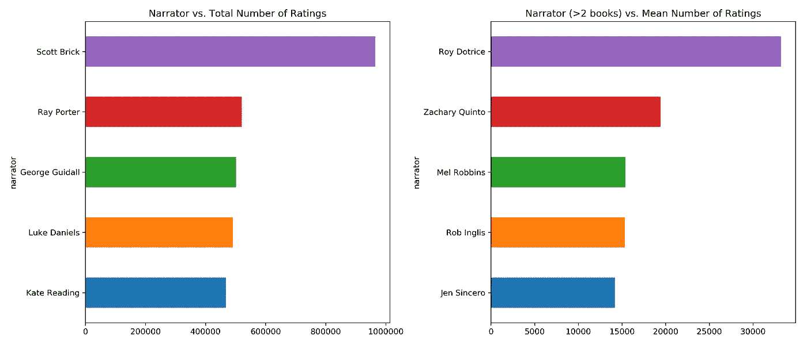

斯科特·布里克叙述的标题(658 个！)获得了最高的收视率，几乎是原来的两倍。同上，我们看右边有最大“影响”的叙述者(至少按每部作品的评分数)。罗伊·多特里斯(拥有 10 本书)因其讲述《冰与火之歌》的作品而位居榜首，该书是我们七本收视率突破 10 万的书中的第一本。

*#哪些解说员在 Audible 上的时间最长？*

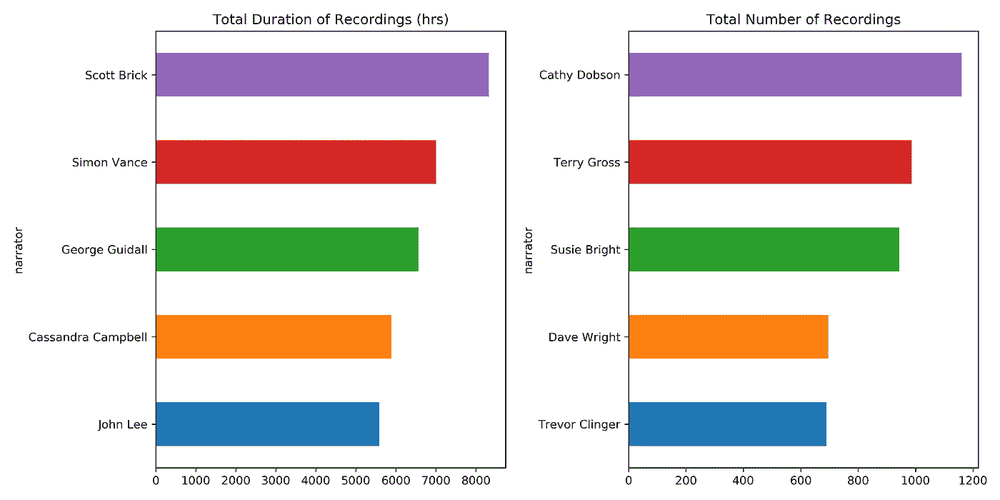

我们看到了同一枚硬币的两面——Scott Brick 在小时数方面的产量最高，有 658 本书，平均每本书 12 小时 39 分钟。凯茜·多布森以 1161 个冠军的数量获胜，平均每个冠军 2 小时 53 分钟。

*#标题发布日期与评论数量有什么关系*

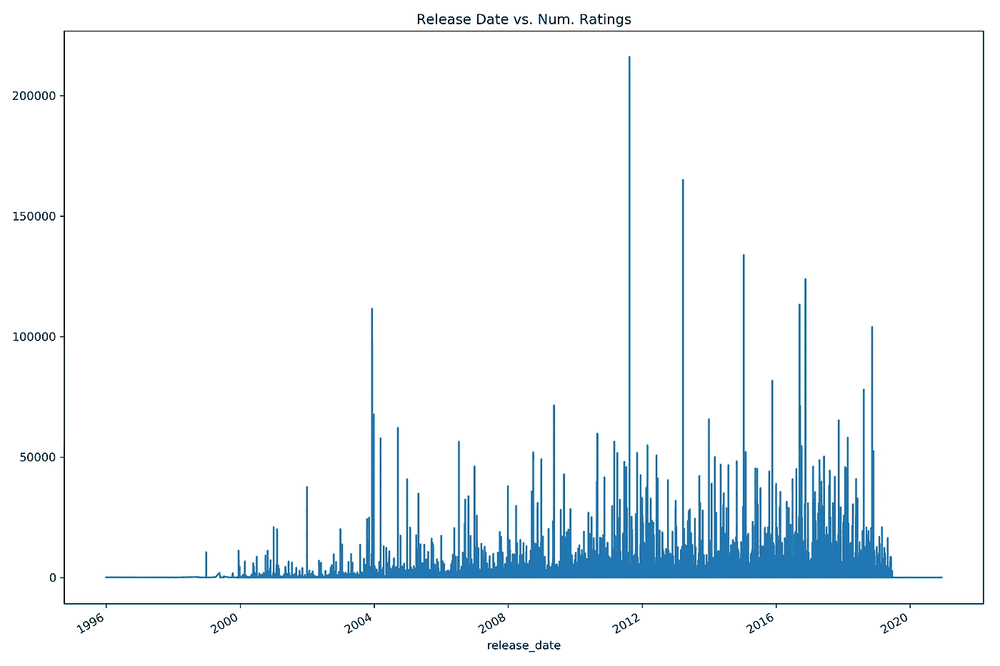

We can see a spike for each of the 7 outliers above.

虽然我们可能会认为老书会因为有更多时间积累评分而受益，但我们看到了相反的趋势。最近的节目更有可能获得更多的评论。

从 1996 年开始，每个季度发行了多少本书？

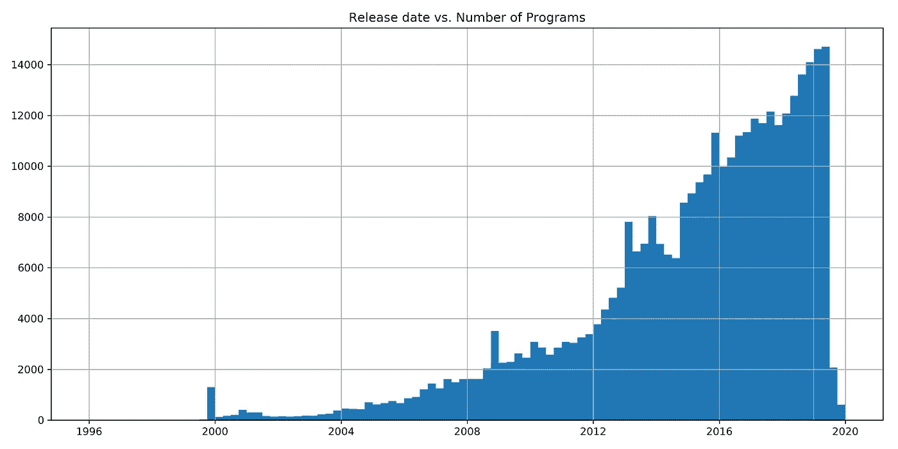

Histogram of release dates with one bin per quarter.

请注意，在 1999 年的最后一个季度，有一个大箱子。事实上，在我们的数据集中最常见的日期是 1999 年 12 月 16 日。虽然你可能认为这个日期是追溯到所有早期的标题，但事实并非如此。数据集中的最小日期是 1995 年 12 月 1 日，也就是 Audible 成立的那一年。此外，谷歌没有从 1999 年 12 月有关 Audible 的新闻中得到多少回报，尽管该公司经历了多事之秋。最初的创始人在 10 月份刚刚去世。

另一个有趣的发现是，2015 年期间，电影发行量连续三个季度下降。事实上，这种下降使得 2015 年成为自 2002 年以来唯一一个发行数量少于前一年的年份。

旁注:数据集中最新的日期是莎伦·波顿的《投毒者》2020 年 12 月 10 日。

*#所有节目的价格分布是怎样的？*

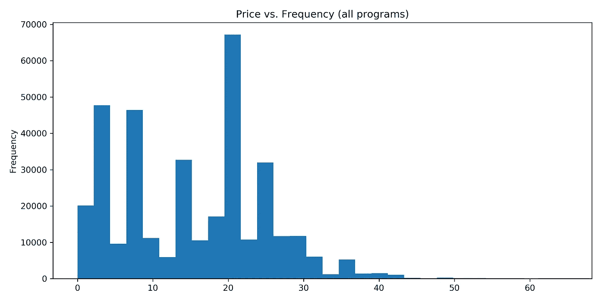

所有书籍的平均价格是 15.43 美元，顺便提一下，这个价格接近某些每月有声计划的 15 美元的价格。在每 5 美元的区间都有峰值，正如我们所预期的给出 4.99 和 9.99 美元的定价方案。

#不同类别的价格有何不同？

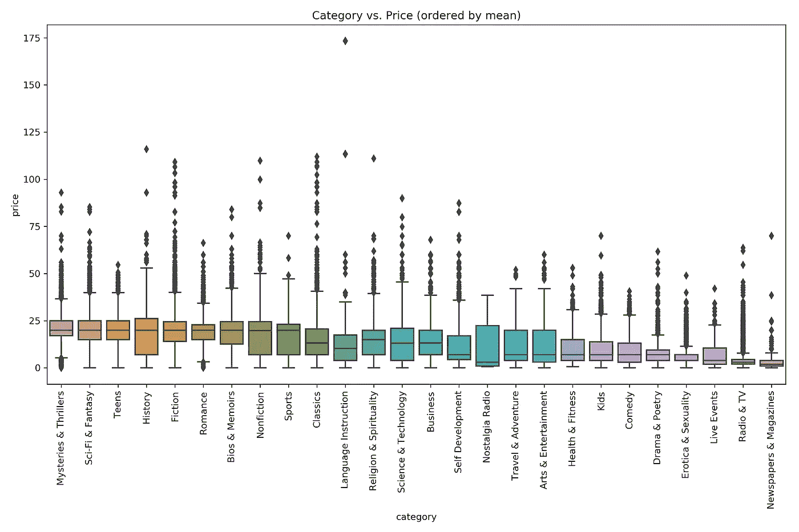

Categories ranked, left to right, by mean price

《神秘与恐怖小说》的平均价格最高，为 20.53 美元。报纸和杂志的平均价格最低，为 2.81 美元。这里没有什么大的惊喜。
我们可以从我们的箱线图中看到我们可能最昂贵的标题——“语言教学”类别中的异常值。让我们找出它是什么。

*# Audible 上最贵的节目是什么？*

173.27 美元可以买到所有音频中最贵的英文标题，以及 982 分钟(约 16 小时)的西班牙语教学。

*#每小时最贵的节目是什么？*

每单位长度最贵的节目是杰夫·哈撒韦的 1 分钟长的节目杰作，价格为 10.49 美元——或每小时 629.40 美元。

*#节目时长分布(不含期刊)？*

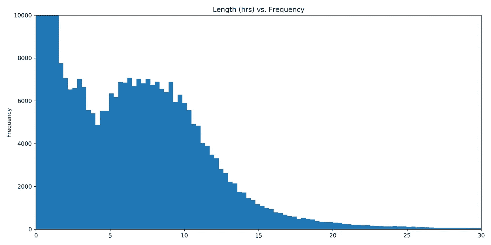

报纸和杂志、广播和电视、现场活动和戏剧和诗歌不包括在这个图表中，因为它们主要是非常短的节目。我们可以看到还是有不少短的(<5 hour) programs, but there’s a nice bell curve of longer titles with median right around 7 hours.

We might infer that this length plot is a composite result of combining a long-form distribution with a shorter-form distribution. Let’s look at categories and see if we can pinpoint which are which.

*#按类别划分长度分布是怎样的？*


Categories ordered, left to right, by decreasing mean length

事实上，我们发现不同类别的长度分布不同。“报纸和杂志”的平均节目长度最短，为 28 分钟。《科幻与幻想》的平均时长最长，刚刚超过 9 小时。

我们马上会在箱线图中看到一些长度异常值，我们稍后会探讨这些异常值，但首先，让我们验证一下关于复合分布的理论。

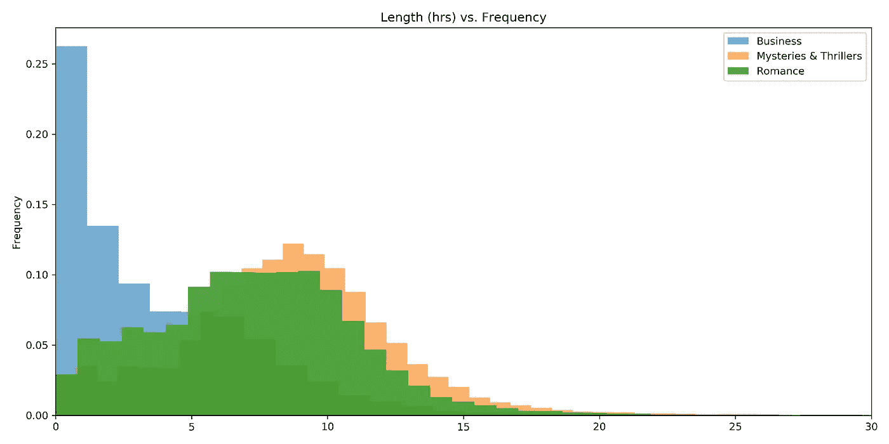

#最后，Audible 上最长的书有哪些？

```
df.nlargest(5, 'length')
```

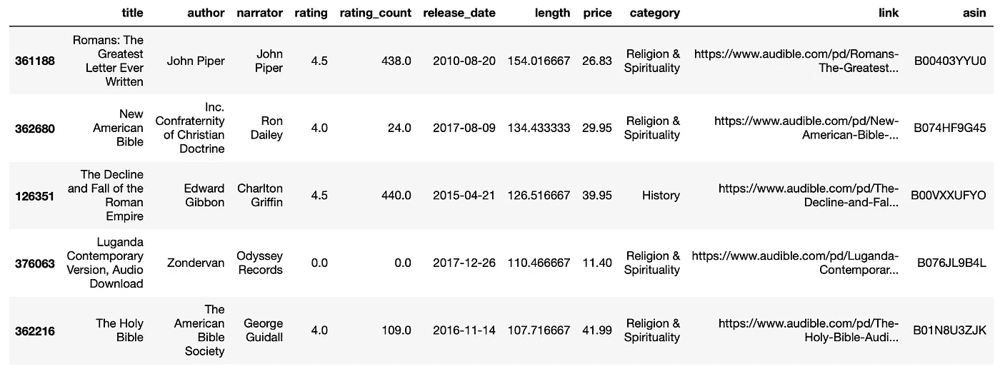

Audible 上 5 个最长的节目中有 4 个属于“宗教与精神”类别。最长 154 小时。唯一不属于这一类别的书名是爱德华·吉本 19 世纪的长篇历史《罗马帝国的衰亡》(The Decline and Fall of The Roman Empire)，多年来，这本书都让我在夜里不时地眼皮上下起伏。

所以我们有它。我们已经依次查看了我们的大部分功能:作者、叙述者、收视率、发布日期、长度、价格和类别。我们查看了业内最多产的名字以及最长、最贵的图书。我们还没有探索的唯一功能是“评级”栏本身，这是因为当我们抓取时，我们只能从我们可以访问的 html 中捕捉 0.5 的等级。有了这些链接，我们就可以自由地从页面中为单个节目重新抓取更精细的评级，但我们会把它留到以后再做。