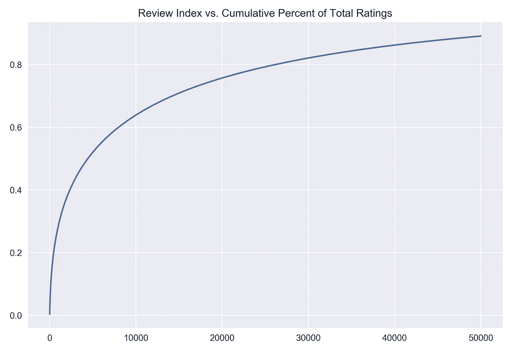
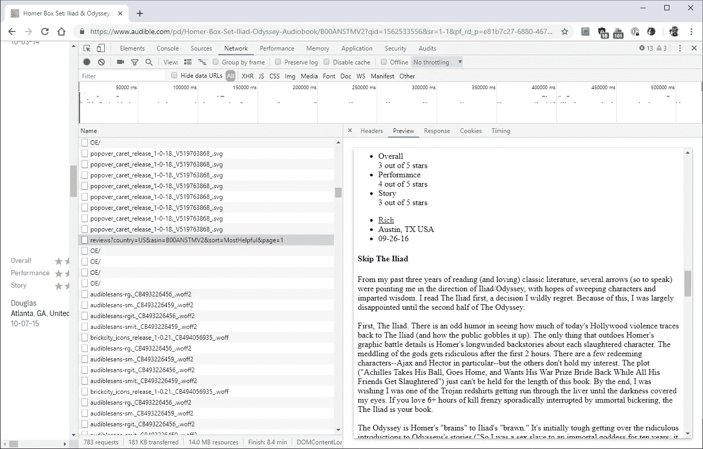
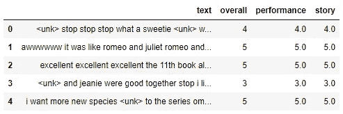
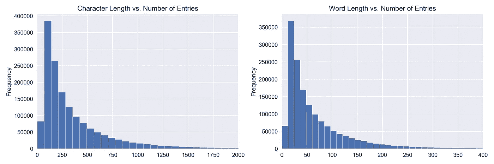
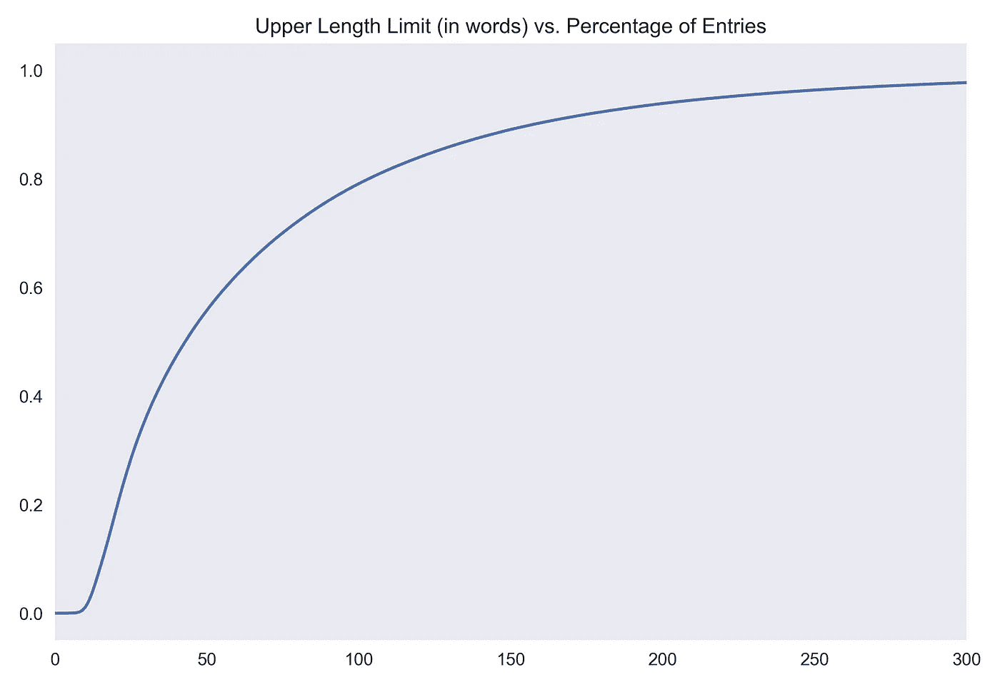
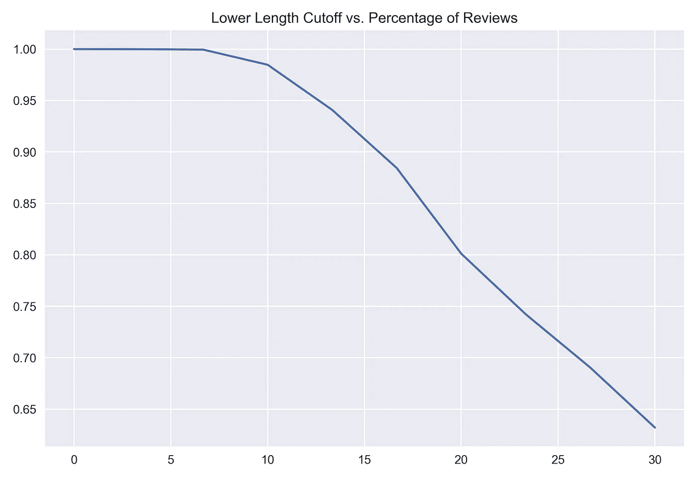
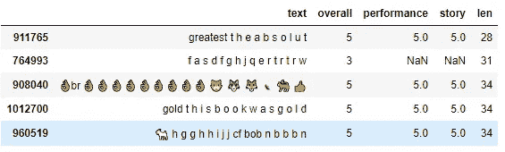
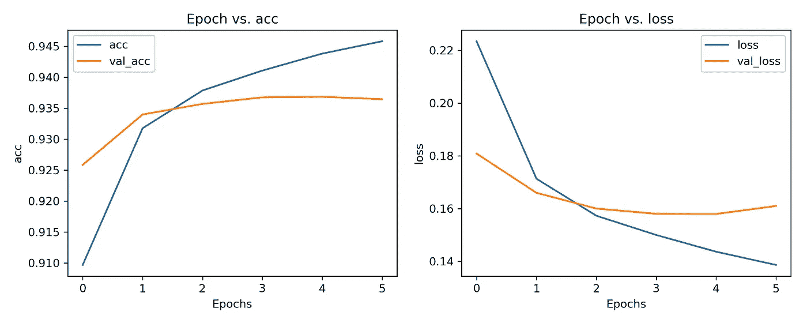
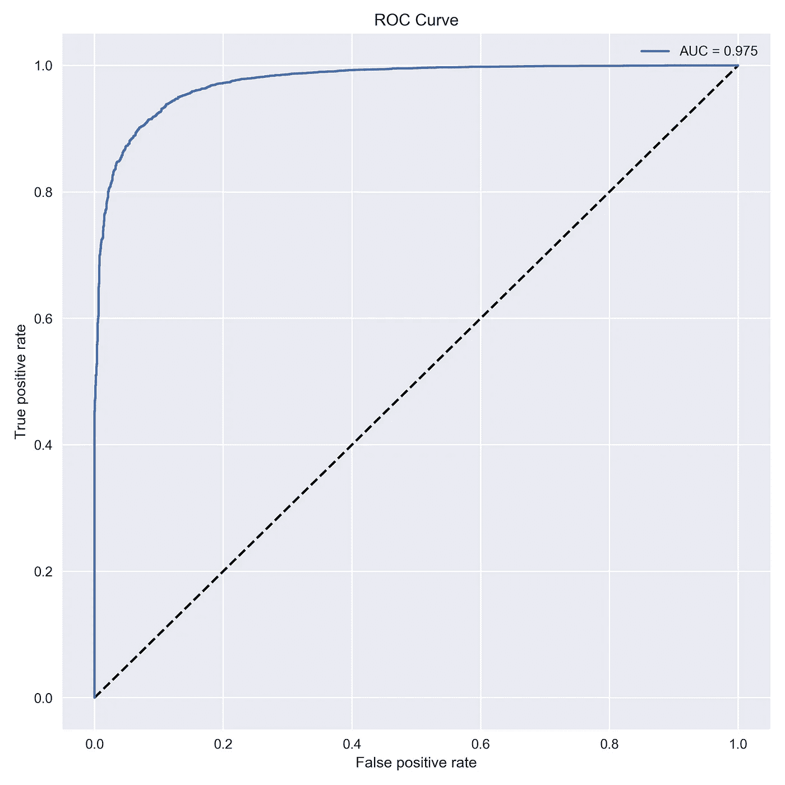
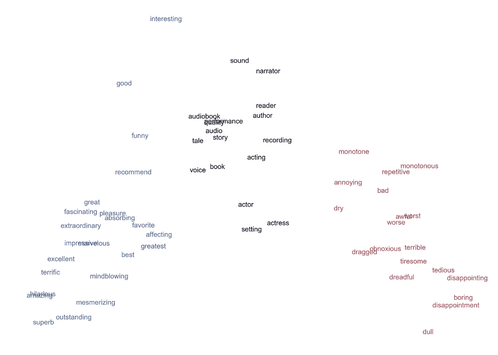

# 150 万条有声评论的情感分析

> 原文：<https://towardsdatascience.com/scraping-and-sentiment-analysis-of-1-5-million-audible-reviews-3502fa6bc86c?source=collection_archive---------41----------------------->

在这个项目的第一部分中，我们收集并探索了一个数据集，其中包括 Audible 上每个英语节目的 [ASIN](https://en.wikipedia.org/wiki/Amazon_Standard_Identification_Number) 、收视率和一个单独的 URL。

我们将通过使用这些字段收集尽可能多的文本评论和附带评级来继续我们离开的地方。然后，我们将训练一些 LSTM 神经网络，将评论分为正面或负面。

(注:此处可跳转至刮痧笔记本[，此处](https://github.com/tobymanders/Data_Analysis/blob/master/audible_eda/audible_reviews_scraper.ipynb)可跳转至数据预处理及情绪分析笔记本[。你可以在这里下载所有评论的数据集。)](https://github.com/tobymanders/Data_Analysis/blob/master/audible_eda/audible_review_classifier.ipynb)

# 1.抓取 150 万条评论



我们之前检查了 Audible 目录中的收视率分布，注意到收视率极度集中于顶部的少数几个节目(标题排名的对数和评论数量的对数之间大致呈线性关系)。

今天，我们将利用这种偏态优势，最大限度地提高每小时的评论数量。假设每个标题的书面评论数量与每个标题的评级数量成比例，**我们可以预计大约 50%的网站评论将集中在我们数据集中前 1%的节目中**。

从 HTML 中抓取这些评论有一个障碍。大多数最受欢迎图书的评论都隐藏在“查看更多”按钮下。



单击该按钮时检查网络请求为我们提供了一个解决方案。我们找到一个链接，指向一个只有评论文本和评级的备用页面。通过增加这个 URL 中的页码，直到 HTML 变成空白，我们可以收集给定节目的所有评论和评级。因为这个页面加载速度非常快(并且因为我们使用了 16 个线程)，我们能够在合理的时间内从排名前 6% (26，101)的节目中抓取排名前 80%的评论。

刮的时候，我们会趁机做一些家务。我们将使用我们的文本来训练一个机器学习模型，以将评论分为好评(4 或 5 星)或不好评(1、2 或 3 星)。如果我们把标题和作者留在我们的评论文本中，我们的模型很可能会“记住”，比如说，一个给定的程序有非常高的评论分数。这对于归纳来说不是一个好兆头，所以我们想从评论中删除作者和标题。我们现在就做，这样我们就不需要为每次审核存储这些信息了。

用一个普通的词来替换单词的过程叫做“解块”。除了取消每个评论的作者和标题，我们还会用单词“stop”替换句号，去掉所有其他标点符号，并将所有文本改为小写。这减少了数据集中的“单词”数量。

几个小时后，我们有超过 150 万的评论和评级。

# 2.准备数据

虽然我们实际上为每个评论刮出了三个评级，“总体”、“故事”和“表现”，但我们将专注于“总体”列作为我们的标签。我们将为将来的分析保存另外两列。

为了使我们的数据和目标形成我们需要训练的模型，我们需要完成以下预处理任务:

1.  根据频率从我们数据中的顶部 *vocab_size* 单词创建一个词汇表，其中 *vocab_size* 是一个超参数。
2.  ‘unk’—即替换为“<unk>”—我们的数据集中不在我们的词汇表中的所有单词。</unk>
3.  将所有条目填充或截断到某个公共长度， *seq_length* ，也是一个超参数。
4.  对数据集中的所有单词进行标记化(即转换为整数)。
5.  从“总体”列创建二进制标签。

我们的目标是将数据 X 作为形状为 *(num_reviews，seq_length)* 的整数数组，将标签 y 作为长度为 *num_reviews* 的整数向量。



The first few entries. Text normalized and authors and titles removed.

为了决定上限和下限，让我们来看看分布。



Distributions of text character and word length over all reviews.



上面的长度与频率图显示了类似指数衰减的现象。96.4%的评论短于 250 字。我们将选择它作为我们的 *seq_length* 。



下限呢？左边的图表向我们展示了我们的数据集中剩下的绝大多数(> 98%)评论(在之前删除了带有空白文本的条目之后)都超过了 10 个单词。我们将用它作为下限。

按字符长度排序，我们看到最短的评论超过 10 个“单词”。



Shortest reviews with >10 ‘words’. Note that ‘words’ are everything between spaces.

我们的下一个任务是从我们所有的评论中构建一个词汇表。我们将使用一个计数器字典来统计每个单词在我们的数据集中的频率，然后我们将选择最频繁的 10，000 个单词来构建我们的词汇表，我们将使用这些单词来“取消”我们的数据集，即使用单词“unk”替换我们词汇表中没有的每个单词。我们还想将数据集转换成一个数字数组，即“令牌”，我们可以在同一个函数中完成这两项任务。

在一些示例文本上测试我们的功能:

```
sample = ‘i really loved dfalkjf especially the introduction’
...
print(tokenize_text(sample))Unk ID: 24
[4, 56, 79, 24, 301, 1, 1190]
```

请注意，无法识别的“dfalkjf”被赋予了“unk”标记 24。其余的标记对应于单词在我们的词汇表中的排名。

在填充、截断和标记之后，我们的数据看起来是这样的:

```
array([[  24,    0,    0, ...,   24,   24,   24],
       [  24,    9,   11, ...,   24,   24,   24],
       [ 149,  149,  149, ...,   24,   24,   24],
       ...,
       [ 131,   32,  873, ...,   24,   24,   24],
       [   5, 3312,  368, ...,   24,   24,   24],
       [ 172,  195,    1, ...,   24,   24,   24]])
```

注意每行末尾的 24 列，这是用“unk”标记填充的。

最后，我们根据“总体”评级创建二元标签，发现大约 79%的评论获得 4 星或 5 星评级。这个数字值得注意，因为它意味着即使是最简单的模型(总是预测 1)也能获得 79%的准确率。那是要打破的数字。

# 3.训练模型

既然准备步骤已经完成，我们就可以训练我们的模型了。使用 TensorFlow 和 Keras 层，我们可以使用不同数量的参数尝试许多不同的架构。我们所有的模型都将有一个嵌入作为第一层，它将每个单词转化为一定长度的向量，一个超参数。

我们所有的模型也将至少有一个 RNN 层(特别是长短期记忆或 LSTM 层)。该层将在向前和向后传递中使用。在每种情况下，LSTM 层将输入具有 relu 激活函数的密集层和具有 sigmoid 激活函数的输出层，这将产生 0 和 1 之间的值，该值将被阈值化以提供类别预测。

我们将添加的其他层将是丢弃层，以减少过度拟合，包括嵌入层后的一种特殊类型的丢弃层，它会丢弃整个一维特征图而不是单个单词，以及一个一维卷积层，它将学习一组过滤器，这些过滤器将从相邻单词之间的关系中提取特征。我们还将尝试堆叠两层 LSTMs。

我们将利用二进制交叉熵损失、Adam 优化器，并且我们将采用早期停止回调，这将在验证损失开始增加时停止训练。



The training set and validation set accuracy for one of our best models. The validation loss bottomed out on the 5th epoch and training was stopped early.

# 3.结果

表现最好的模型确实是最复杂的——在大约 155，000 条评论的未知测试集上有 93.8%的准确率。然而，值得注意的是，最不复杂的模型达到了 93.1%的准确率。

我们最简单的模型只包含三个隐藏层:一个嵌入长度只有 8 的嵌入层，一个只有 8 个单元的 LSTM，一个只有 16 个单元的全连接层。它共有 81k 个参数，训练时间为 53 分钟。

```
model = tf.keras.Sequential([ **tf.keras.layers.Embedding(vocab_size, 8),
    tf.keras.layers.Bidirectional(tf.keras.layers.LSTM(8)),
    tf.keras.layers.Dense(16, activation='relu'),** tf.keras.layers.Dense(1, activation='sigmoid')
])
```

我们最复杂的模型，也是最终的赢家，除了 LSTM 层之外，还有 7 个隐藏层，包括下降层、卷积层和池层:

```
model = tf.keras.Sequential([ **tf.keras.layers.Embedding(vocab_size, 128),
    tf.keras.layers.SpatialDropout1D(rate=0.4),
    tf.keras.layers.Conv1D(filters=32, kernel_size=3,                                                           padding='same', activation='relu'),
    tf.keras.layers.MaxPooling1D(pool_size=2),
    tf.keras.layers.Bidirectional(tf.keras.layers.LSTM(128)),
    tf.keras.layers.Dense(128, activation='relu'),
    tf.keras.layers.Dropout(rate=0.4),** tf.keras.layers.Dense(1, activation='sigmoid')
])
```



对于二元分类，受试者工作特征(ROC)曲线给出了模型区分能力的良好概念。它反映了这样一个事实，即随着您降低最终概率输出的阈值，您会捕获更多的真阳性，但也会捕获更多的假阳性。一个完美的模型会给正面例子分配比负面例子更高的概率，因此降低阈值会捕获更多的正面例子，而不会捕获更多的负面例子。因此，曲线将切割靠近左上角。AUC 相当于测量 ROC 曲线下的面积(越接近 1 越好)。这里，我们的模型对测试数据的 AUC 为 0.975。

让我们通过例子来测试我们的模型，并输入几段文本。我们给它四个序列。小于 0.5，模型预测为负；大于 0.5，为正。

> “这本可怕的书太可怕了。真的，太可怕了。”

我们的模型对此的正确评分为 0.01，即尽可能接近 0。

> “我喜欢这本书。这太棒了，太搞笑了，太神奇了。”

这个得了 0.99 分。不如来点暧昧的:

> “这本书还可以，但它让我感到难过。”

0.52.我们的模型被撕破了。把积极的和消极的词语结合起来怎么样:

> “故事确实很棒，但叙述者很恐怖。”

0.72.该模型更重视“非常棒”部分，而不是“讲述者很可怕”部分。也许如果我们在“性能”评级上重新训练我们的模型，我们会得到不同的结果。

最后，让我们看看我们的模型已经学习的单词嵌入。我们词汇表中每个单词的学习向量应该反映关于该单词的一些有用信息，用于预测正面或负面评论。为了可视化这些表示之间的空间关系，我们需要将单词向量减少到更易于人类理解的维数。

主成分分析(PCA)是一种转换数据的方法，使其信息最丰富的维度(即包含最大方差的维度)与轴对齐(即结果的第一维)。我们将使用 PCA 将我们的 128 维嵌入向量减少到 2 维，以便我们可以可视化单词之间的关系:



A 2D representation (the first two principal components) of our learned word embeddings for 61 key words.

我们词汇中 61 个常用词的前两个主要成分形成了上面这张惊人的图表。在这里，一般不喜欢的词，如“迷人的”和“优秀的”，被渲染成蓝色；喜欢的词，如“可怕的”和“无聊的”，用红色呈现，中性的词，如“表演”和“书”用黑色呈现。

我们的嵌入清楚地反映了这些术语的极性。甚至更好的关系似乎被表现出来。例如，我们凭直觉知道“单调”和“单调”、“更差”和“最差”、“乏味”和“无聊”、“声音”和“讲述者”、“音频”和“质量”等密切关系。

通过在整个词汇上重复这个过程，并且只看第一个主成分，我们可以识别出具有最积极和最消极显著性的单词。价值最高的词是‘well spent’[原文如此]。

价值最低的那个词？

“退款”。

最后，让我们对整个训练集进行预测，找出“最差”和“最好”的评论。

“最差”评论:

> 浪费，浪费，浪费。保存您的信用。
> 
> 怎样才能让<标题>更好？
> 
> 没有什么能让这本书变得更好。被警告。这本书甚至没有一些人说的那么有趣。为什么要买一本很搞笑的僵尸恐怖书？
> 
> **你认为你的下一首歌会是什么？**
> 
> 不确定，除了说一些关于僵尸或天启的事情，但肯定不是这本书的作者或叙述者。
> 
> **你不喜欢<解说员>的什么表现？**
> 
> 她的声音。这样她让所有的角色听起来都一样。
> 
> 你不喜欢这本书……但它有什么可取之处吗？
> 
> 零…更糟糕的是，因为它是数字媒体而不是实体书，我甚至不能烧它来预热。我读过比这本书更好听/读的服务条款。
> 
> **还有其他意见吗？**
> 
> 我是任何形式的僵尸和启示录故事的忠实粉丝..这本书虽然不应该被写，更不用说…

“最佳”评论:

> **牛逼**
> 
> 牛逼牛逼牛逼牛逼牛逼<unk>牛逼 <unk><unk>牛逼牛逼<unk>牛逼<unk>牛逼 <unk><unk>牛逼<unk>牛逼<unk>牛逼<unk>牛逼牛逼</unk></unk></unk></unk></unk></unk></unk></unk></unk></unk>