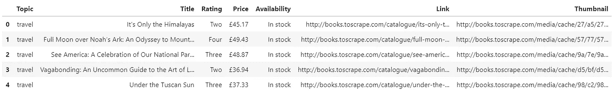
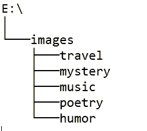
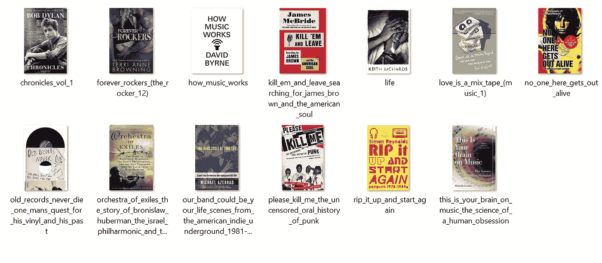

# 抓取继续:用 Python 下载图像

> 原文：<https://towardsdatascience.com/scraping-continued-download-images-with-python-6122623f3d82?source=collection_archive---------12----------------------->

大约一周前，我写了一篇关于网络抓取的文章。本文介绍了使用 Python 的 [BeautifulSoup](https://www.crummy.com/software/BeautifulSoup/bs4/doc/) 库获取数据的一些基本概念，并进一步利用 [Pandas](https://pandas.pydata.org/) 的能力将获取的数据存储到 DataFrame 对象中。

Photo by [Max Duzij](https://unsplash.com/@max_duz?utm_source=medium&utm_medium=referral) on [Unsplash](https://unsplash.com?utm_source=medium&utm_medium=referral)

浏览那篇文章是这篇文章的先决条件，*因为你还能如何获得数据？如果你已经熟悉网页抓取的概念，你就不必通读了，只需在底部抓取代码即可。总之，这里有一个链接:*

 [## 没有数据集？没问题。自己刮一个。

### 使用 Python 和 BeautifulSoup 的强大功能来收集对您重要的数据。

towardsdatascience.com](/no-dataset-no-problem-scrape-one-yourself-57806dea3cac) 

如果你是阅读这篇文章的人之一，你可能会想知道整个故事就是这样( ***剧透警告:*** *它不是*)。
快速浏览一下获取的数据，你会看到雄伟的 ***缩略图*** 栏，如果你把它和这篇文章的标题联系起来，就不难得出这个故事还没有结束的结论。

今天的文章将处理从缩略图 URL 下载图像的过程。

***但是我为什么要下载图片呢？***

我很高兴你问了。也许你的数据科学项目需要通过[卷积神经网络](https://en.wikipedia.org/wiki/Convolutional_neural_network)进行图像分类。让我们想象下面的场景——你想开发一个算法，它能够根据一些缩略图的特征来预测图书的主题(流派)(*嗯，实际上是一个很好的项目想法！*)。

我绝不是 CNN 的专家，但我将向您展示如何根据流派将图像下载到各自的子目录中。事不宜迟，我们开始吧！

# 一点点准备工作

你真的认为没有这个你就能逃脱吗？

虽然，我会尽量把这部分说得简短一些。归结起来就是做一些库导入和导入以前抓取的数据。代码如下:

Imports — [https://gist.github.com/dradecic/04cbe16e067ea66bf750eb8fdd1c4845](https://gist.github.com/dradecic/04cbe16e067ea66bf750eb8fdd1c4845)

简单回顾一下——下面是 ***df*** 的样子:

Head of df

所有的准备工作现在都完成了——没那么糟糕，对吧？

# 下载图像

你期待已久的部分来了。但是在给你代码之前，这里是应该发生的事情的概要:

1.  一个变量 ***BASE_DIR*** 被声明，为图像存储根目录的名称
2.  声明了一个变量 ***SUB_DIRS*** ，它是一个数组，保存了数据集中所有不同的主题
3.  将创建根目录以及所有子目录(如果它们不存在的话)
4.  基于不同的主题值过滤数据集
5.  使用 ***urllib*** 下载缩略图
6.  执行一些替换以使文件名格式正确

*呀呀*。听起来工作量很大。但它实际上不是——拜托，我们谈论的是 Python！

下面是代码片段。我强烈建议您阅读每一行，甚至可以一行一行地执行，以便更好地理解为什么所有东西都是这样工作的。

Image Downloader — [https://gist.github.com/dradecic/d26d44d7e145577a1ded06f28559499b](https://gist.github.com/dradecic/d26d44d7e145577a1ded06f28559499b)

运行此代码单元将创建以下目录结构:

Directory Structure

此外，在每个子目录中，您会看到一堆图像:

Music Subdirectory

# 结论

这是一篇相当短的文章——但我更喜欢那些较长的文章。使您不想立即关闭浏览器窗口。

像往常一样，在您选择的数据集上使用这项新获得的技能。看看有没有可能不下载图片而下载别的东西(*有可能*)。如果你对 CNN 和深度学习感兴趣，但在网上找不到相关的数据集，那就自己做一个。没有限制。

感谢阅读…

*喜欢这篇文章吗？成为* [*中等会员*](https://medium.com/@radecicdario/membership) *继续无限制学习。如果你使用下面的链接，我会收到你的一部分会员费，不需要你额外付费。*

 [## 通过我的推荐链接加入 Medium-Dario rade ci

### 作为一个媒体会员，你的会员费的一部分会给你阅读的作家，你可以完全接触到每一个故事…

medium.com](https://medium.com/@radecicdario/membership)