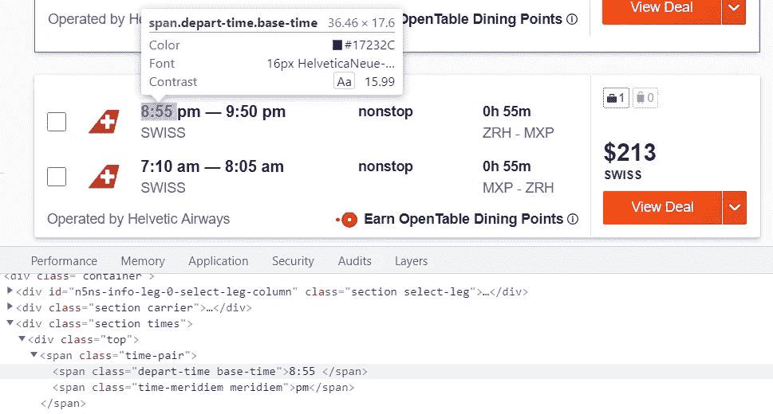
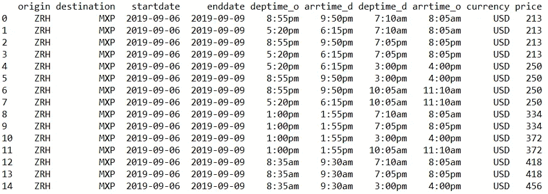
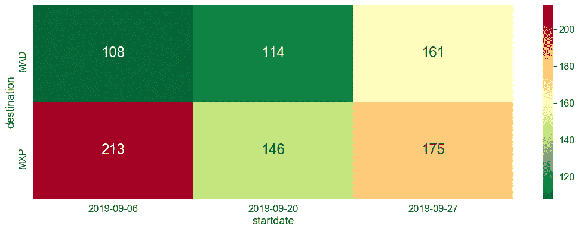

# 使用 Python 抓取飞行数据

> 原文：<https://towardsdatascience.com/scraping-flight-data-using-python-e71b97e859d3?source=collection_archive---------11----------------------->

## 计划下一次周末旅行的无聊方式

假设我们想计划下一次周末旅行。计划是去米兰或马德里。关键是我们真的不在乎，我们只是在寻找最好的选择。这有点像德国足球运动员安迪·穆勒曾经说过:*米兰或者马德里，只要是意大利*。

第一步，我们只是像往常一样寻找航班。对于这个例子我们使用 [*皮艇*](http://www.kayak.com) 。一旦我们输入了搜索标准，并设置了一些额外的过滤器，如 *Nonstop* ，我们可以看到，有趣的是，我们浏览器中的 URL 也相应地进行了调整

我们实际上可以将这个 URL 分解成不同的部分:起点、终点、开始日期、结束日期和一个后缀，告诉 [*Kayak*](http://www.kayak.com) 只寻找直接连接，并按价格对结果进行排序。

现在，总的想法是从网站的底层 html 代码中获取我们想要的信息(例如，价格、出发和到达时间)。要做到这一点，我们主要依靠两个包。第一个是*硒*，基本控制你的浏览器，自动打开网站。第二个是*美汤*，它帮助我们将杂乱的 HTML 代码重塑为更有结构性和可读性的格式。从这道汤里，我们可以很容易地得到我们想要的美味。

所以让我们开始吧。首先我们需要设置元素。为此，我们需要下载一个浏览器驱动程序，例如 [*ChromeDriver*](http://chromedriver.chromium.org/downloads) (确保它对应于您安装的 Chrome 版本)，我们必须将它放在与我们的 Python 代码相同的文件夹中。现在我们加载几个包，告诉 *selenium* 我们要使用 *ChromeDriver* ，让它从上面打开我们的 URL。

一旦网站加载完毕，我们需要找出如何获取与我们相关的信息。以出发时间为例，使用浏览器的 inspect 特性，我们可以看到 8:55pm 出发时间包含在一个名为*出发时间基准时间*的 span 中。

如果我们现在将网站的 html 代码传递给 *BeautifulSoup* ，我们可以专门搜索我们感兴趣的课程。然后可以用一个简单的循环提取结果。因为对于每个搜索结果，我们得到一组两个出发时间，我们还需要将结果重新整形为逻辑出发-到达时间对。

我们用类似的方法计算价格。但是，在检查价格元素时，我们可以看到 [*Kayak*](http://www.kayak.com) 喜欢为其价格信息使用不同的类。因此，我们必须使用正则表达式来捕捉所有情况。此外，价格本身被进一步包装，这就是为什么我们需要使用一些额外的步骤来达到它。

现在，我们将所有内容放入一个漂亮的数据框架中，得到

差不多就是这样了。我们已经将最初飞行中的 html 代码中混乱的所有信息整理成形。繁重的工作完成了。

为了方便起见，我们现在可以将上面的代码封装到一个函数中，并在三天的旅程中使用不同的目的地和起始日组合来调用该函数。当发送几个请求时， [*Kayak*](http://www.kayak.com) 可能会不时地认为我们是一个机器人(谁能责怪他们呢)，解决这个问题的最好方法是不断地改变浏览器的用户代理，并且在请求之间等待一段时间。我们的**整个代码**将会是这样的:

一旦我们指定了所有的组合并收集了各自的数据，我们就可以使用来自 *seaborn* 的热图很好地可视化我们的结果

就这样决定了。下一站:马德里！仅 108 美元，这是我们在 9 月份挑选的三个周末中最便宜的选择。期待着吃一些美味的小吃。