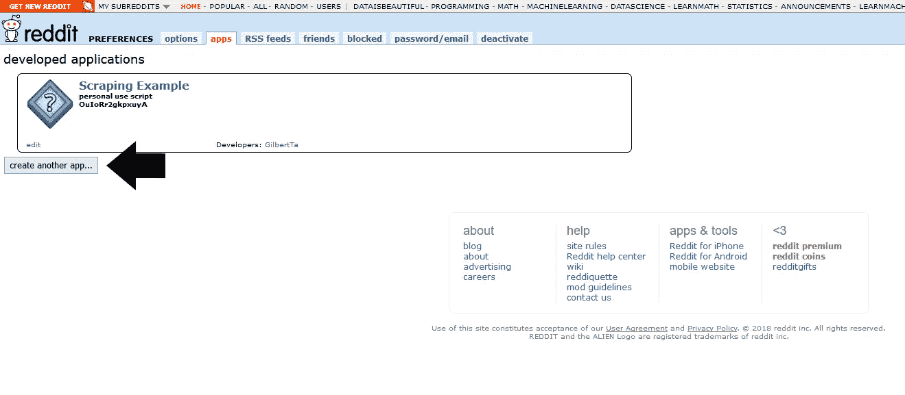
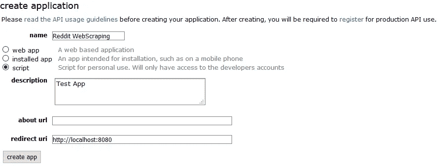
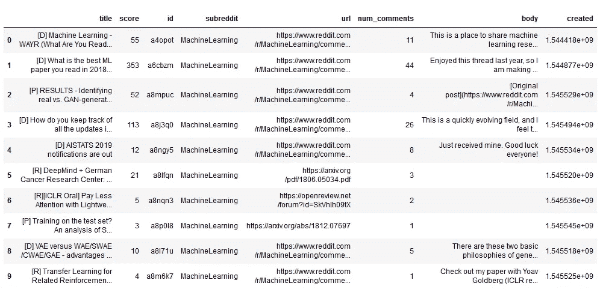

# 抓取 Reddit 数据

> 原文：<https://towardsdatascience.com/scraping-reddit-data-1c0af3040768?source=collection_archive---------1----------------------->

## 如何使用 Python Reddit API 包装器从 Reddit 抓取数据(PRAW)


Photo by [Fabian Grohs](https://unsplash.com/@grohsfabian?utm_source=medium&utm_medium=referral) on [Unsplash](https://unsplash.com?utm_source=medium&utm_medium=referral)

顾名思义，PRAW 是 Reddit API 的 Python 包装器，它使你能够从子编辑中抓取数据，创建机器人等等。

在这篇文章中，我们将学习如何使用 PRAW 从不同的子编辑中抓取帖子，以及如何从特定的帖子中获取评论。

# 入门指南

PRAW 可以使用 pip 或 conda 安装:

现在 PRAW 可以通过写:

```
import praw
```

在它被用来收集数据之前，我们需要验证自己的身份。为此，我们需要创建一个 Reddit 实例，并为其提供一个`client_id`、`client_secret`和一个`user_agent`。

为了获得认证信息，我们需要创建一个 reddit 应用程序，方法是导航到[此页面](https://www.reddit.com/prefs/apps)并单击**创建应用程序**或**创建另一个应用程序。**



Figure 1: Reddit Application

这将打开一个表单，您需要在其中填写名称、描述和重定向 uri。对于重定向 uri，你应该选择`http://localhost:8080`，正如优秀的 [PRAW 文档](https://praw.readthedocs.io/en/latest/getting_started/authentication.html#script-application)中所描述的。



Figure 2: Create new Reddit Application

按下**创建应用程序**后，一个新的应用程序将会出现。在这里，您可以找到创建`praw.Reddit` 实例所需的认证信息。


Figure 3: Authentication information

# 获取子编辑数据

现在我们有了一个`praw.Reddit`实例，我们可以访问所有可用的函数并使用它，例如从机器学习子编辑中获取 10 个“最热门”的帖子。

输出:

```
[D] What is the best ML paper you read in 2018 and why?
[D] Machine Learning - WAYR (What Are You Reading) - Week 53
[R] A Geometric Theory of Higher-Order Automatic Differentiation
UC Berkeley and Berkeley AI Research published all materials of CS 188: Introduction to Artificial Intelligence, Fall 2018
[Research] Accurate, Data-Efficient, Unconstrained Text Recognition with Convolutional Neural Networks
...
```

我们还可以通过指定“all”作为子编辑的名称，得到所有子编辑的 10 个“最热门”的帖子。

输出:

```
I've been lying to my wife about film plots for years.
I don’t care if this gets downvoted into oblivion! I DID IT REDDIT!!
I’ve had enough of your shit, Karen
Stranger Things 3: Coming July 4th, 2019
...
```

这个变量可以被迭代，包括文章标题、id 和 url 在内的特征可以被提取并保存到一个`.csv`文件中。



Figure 4: Hottest ML posts

使用 subreddit 对象上的`.description`函数可以获得 subreddit 的一般信息。

输出:

```
**[Rules For Posts](https://www.reddit.com/r/MachineLearning/about/rules/)**
--------
+[Research](https://www.reddit.com/r/MachineLearning/search?sort=new&restrict_sr=on&q=flair%3AResearch)
--------
+[Discussion](https://www.reddit.com/r/MachineLearning/search?sort=new&restrict_sr=on&q=flair%3ADiscussion)
--------
+[Project](https://www.reddit.com/r/MachineLearning/search?sort=new&restrict_sr=on&q=flair%3AProject)
--------
+[News](https://www.reddit.com/r/MachineLearning/search?sort=new&restrict_sr=on&q=flair%3ANews)
--------
...
```

# 从特定帖子中获取评论

您可以通过创建/获取一个`Submission`对象并遍历`comments`属性来获取帖子/提交的评论。要获得 post/submission，我们可以遍历 subreddit 的提交，或者使用`reddit.submission`指定一个特定的提交，并向其传递提交 url 或 id。

要获得**顶级**注释，我们只需迭代`submission.comments`即可。

这对于某些提交是有效的，但是对于其他有更多评论的提交，这段代码将抛出一个 AttributeError，表示:

```
AttributeError: 'MoreComments' object has no attribute 'body'
```

这些`MoreComments` 对象代表在网站上遇到的“加载更多评论”和“继续此主题”链接，在[评论文档](https://praw.readthedocs.io/en/latest/tutorials/comments.html)中有更详细的描述。

去掉了`MoreComments`对象，我们可以在打印正文之前检查每个注释的数据类型。

但是 Praw 已经提供了一个名为`replace_more`的方法，它取代或移除了`MoreComments`。该方法采用一个名为 limit 的参数，当该参数设置为 0 时，将删除所有的`MoreComments`。

以上两个代码块都成功地迭代了所有的**顶级**注释，并打印了它们的正文。输出如下所示。

```
Source: [https://www.facebook.com/VoyageursWolfProject/](https://www.facebook.com/VoyageursWolfProject/)
I thought this was a shit post made in paint before I read the title
Wow, that’s very cool.  To think how keen their senses must be to recognize and avoid each other and their territories.  Plus, I like to think that there’s one from the white colored clan who just goes way into the other territories because, well, he’s a badass.
That’s really cool. The edges are surprisingly defined.
...
```

然而，评论部分可以任意深入，大多数时候我们当然也想得到评论的评论。`CommentForest`提供了`.list` 方法，可以用来获取评论区内的所有评论。

上面的代码将首先输出所有的顶级注释，然后是二级注释，依此类推，直到没有剩余的注释。

# 推荐阅读

[](/web-scraping-using-selenium-and-beautifulsoup-99195cd70a58) [## 使用硒和美丽素的网刮

### 如何使用 Selenium 在页面之间导航，并使用它来废弃加载了 JavaScript 的 HTML。

towardsdatascience.com](/web-scraping-using-selenium-and-beautifulsoup-99195cd70a58) 

# 结论

Praw 是 Reddit API 的 Python 包装器，它使我们能够通过一个干净的 Python 接口使用 Reddit API。该 API 可用于网络抓取，创建一个机器人以及许多其他。

本文介绍了身份验证、从子编辑获取帖子以及获取评论。要了解更多关于 API 的信息，我建议看一看他们的[优秀文档](https://praw.readthedocs.io/en/latest/index.html)。

如果你喜欢这篇文章，可以考虑订阅我的 Youtube 频道，在社交媒体上关注我。

本文涵盖的代码可以从 [Github 资源库](https://github.com/TannerGilbert/Tutorials/tree/master/Reddit%20Webscraping%20using%20PRAW)获得。

如果你有任何问题、建议或批评，可以通过 Twitter 或评论区联系我。