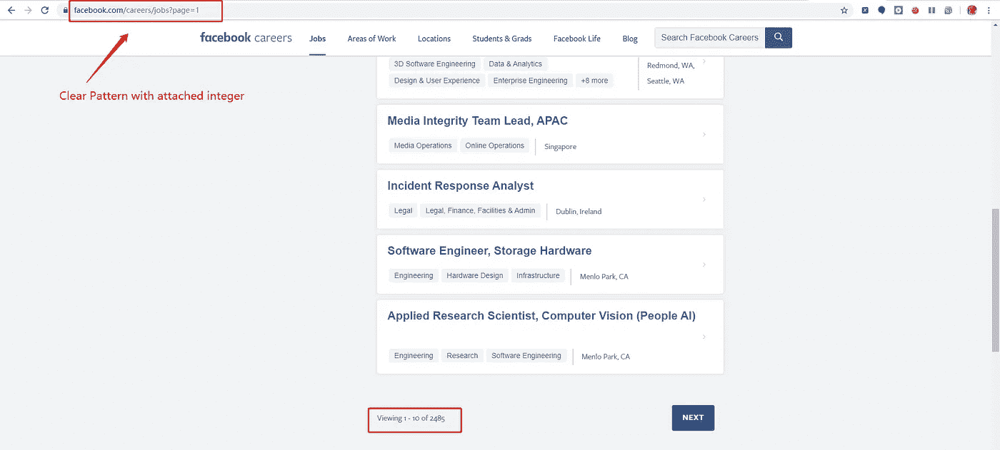
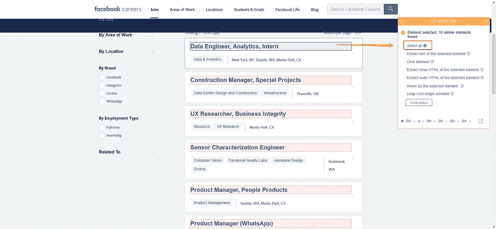
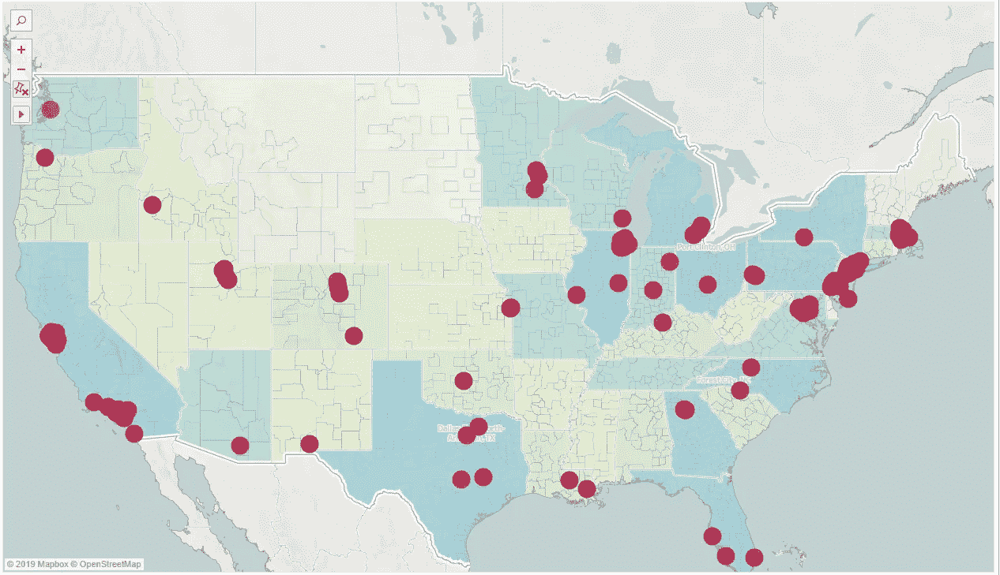

# 一步一步地刮财富 500 强公司的招聘板

> 原文：<https://towardsdatascience.com/scraping-the-fortune-500-company-job-boards-step-by-step-a124cf8bc364?source=collection_archive---------18----------------------->

Photo by: [Matthew Henry](https://burst.shopify.com/@matthew_henry)

我想你同意我的观点，Linkedin 在整合工作岗位和激励专业人士方面非常成功。招聘人员更有可能在 Linkedin 上搜索候选人，比所有其他招聘平台加起来还要多。

事实上，这是一个真实的事实:谁拥有求职者市场，谁就拥有数十亿美元的市场。的确，怪物，招募者知道这一点。甚至**谷歌**也在 2017 年开始分享就业市场的馅饼。

公司不断花钱寻找适合合适工作的候选人。因此，我们仍然有很大的潜力去开拓就业市场。

在这篇文章中，我将带你从零开始构建一个财富 500 强招聘网站的整个过程。此外，我将解析 Linkedin 的商业模式来推动你的业务。

一个招聘网站就像一个媒体代理，为合适的候选人和潜在的公司牵线搭桥。雇主付费在网站上发布职位列表，求职者向感兴趣的公司发送简历和求职信。因此，工作列表的质量和数量对你的网站生存至关重要。有两种方法可以增加招聘网站上的招聘数量:

**1。从公司网站的职业栏中搜集工作列表**

**2。从工作列表搜索引擎上刮下来的，像确然和 Monster.com**

# **第一种方法:**

因为每个公司都有自己的网站，我们需要为他们所有人建立一个蜘蛛。一个传统的方法是用美汤写 python。这导致高的初始成本和维护成本。由于每个网站都有独特的布局，我们需要为每个公司写一个单独的脚本。此外，该网站可能会改变其网页结构。因此，我们必须重写脚本，并建立一个新的蜘蛛抓取网站。此外，有这么多的网站，只有由一群技术专家来完成，才能使你的网站持续下去。多增加一个劳动力的高边际成本对企业来说是站不住脚的。

[网页抓取工具](https://www.octoparse.com/)作为成本低得多的最有效的替代工具派上了用场。它允许我们自动化整个抓取过程，而无需编写脚本。Octoparse 脱颖而出，成为最好的网页抓取工具。它将使首次入门者和有经验的技术专家都能通过点击式可视化界面提取数据。

由于有 500 个网站，我将在本文中以脸书就业委员会为例。([*这是财富 500 强企业网站排行榜，欢迎充分利用*](https://docs.google.com/spreadsheets/d/1SlNYZxOvpuQejYWhM7S81v3Hi_BqfbynVqwiS_XUTBI/edit?usp=sharing) *)。*)

可以看到，该网页包含十个列表，分布在多个页面上。我们将点击每个工作列表，提取每个**职位**、**位置**、**职责**、**最低和首选要求**。对于像这样带有**嵌套列表** ( *列表包含额外列表*)的网页，我们可以**预处理 URL 列表，这样我们就可以获得所有列表页面的 URL，而无需分页。**

**1。一个 URL 遵循一个一致的模式，在末尾有一个固定的主机名和一个页面标签。当您分页时，编号会相应地改变。因此，我们将第一个页面的 URL 复制到一个电子表格中，向下拖动以获得网站 URL 的列表。**

**2。然后我们用 Octoparse 建立了一个带有这个列表 URL 的爬虫。**

**现在你可以开始提取了**

通过内置的浏览器，我们可以用给定的命令提取网页上的目标元素。在这种情况下，我们单击页面中的一个工作列表，并选择“**全选**”来创建一个包含所有列表的循环。

**3。**然后选择**循环点击每个元素**来浏览每个详细页面。

你应该可以得到一个工作列表，像这样提取出来。同样，从详细页面中选择提取元素，包括[演示 _ 脸书 _ 职业 _ 列表](https://docs.google.com/spreadsheets/d/1OwFX3n-hr1eLS5DWAt6UwYtFInxX4dheUwT35qiO3T4/edit?usp=sharing) **职位**、**地点**、**职责**、**最低和首选要求**。

遵循同样的想法，我们可以用 Octoparse 创建任意多的爬虫。因此，高维护成本的风险被最小化。您可以设置擦除计划，并通过 API 将最新作业列表传送到您的数据库。

# **第二种方法:**

像 Monster.com 的****这样的工作搜索引擎提供了大量的工作列表。我们可以用一个爬虫从大公司和小公司获得这些工作信息。另一方面，如果你从求职引擎上找工作，这不会给你带来竞争优势。最平易近人的解决办法就是找个小众。我们可以缩小到特定的群体，而不是一个范围很广的网站。它可以根据供求关系进行创作。在这种情况下，我收集了 10000 份工作列表和相关的位置，并将它们与地图进行比较，以查看数据科学职位在地理上是如何分布的。****

********

****数据科学职位主要集中在沿海地区，西雅图和纽约的需求最高。考虑到这一点，这将是一个绝佳的机会，可以帮助更多的科技公司通过当地的数据科学家社区找到合适的候选人。****

****我有一个类似的视频，指导[如何搜集工作列表。](https://www.youtube.com/watch?time_continue=3&v=kSIx1-RokR0)****

## ******Linkedin 为什么成功？******

****从一个昙花一现的人物到一个巨人，Linkedin 在商业策略上非常老练。以下是受它们启发的四个因素，它们将在许多层面上有益于您的企业:****

*   ****[找到合适的传播者](/influencer-marketing-using-web-scraping-568ef4c072c3):首先要邀请“冠军”和行业领袖来宣传你的网站。这些冠军具有魅力效应，将转化为精英聚集。****
*   ****社交网络社区:用户一旦聚集在一起，就承载了更多的商业价值。社区产生 UGC(用户生成内容)，吸引更多优质用户分享自己的想法。这些是提高竞争力的资产。****
*   ****可信度:求职网站的目标是帮助他们获得职业发展。说“帮助别人就是帮助自己”有点老生常谈，但如果你在追求一个成功的企业，这是正确的心态。****

## ****最后的想法？****

****我相信边做边学。就像布兰森说的，“你不是靠遵守规则学会走路的。你在实践中学习，在跌倒中学习。”这就是你成功的方法。****

## ****引用:****

****[https://www . statista . com/statistics/976194/annual-revenue-of-LinkedIn/](https://www.statista.com/statistics/976194/annual-revenue-of-linkedin/)****

****[https://towards data science . com/influencer-marketing-using-web-scraping-568 ef4c 072 C3](/influencer-marketing-using-web-scraping-568ef4c072c3)****

*****原载于 2019 年 8 月 16 日*[*【https://www.octoparse.com】*](https://www.octoparse.com/blog/scraping-the-fortune-500-company-job-boards)*。*****