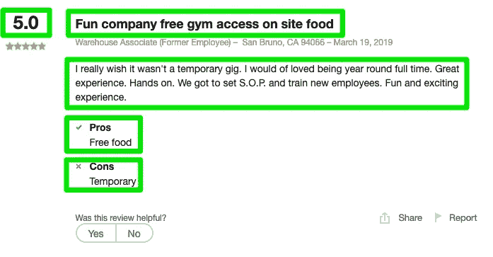
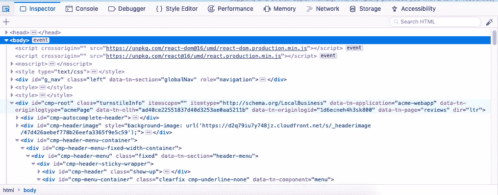
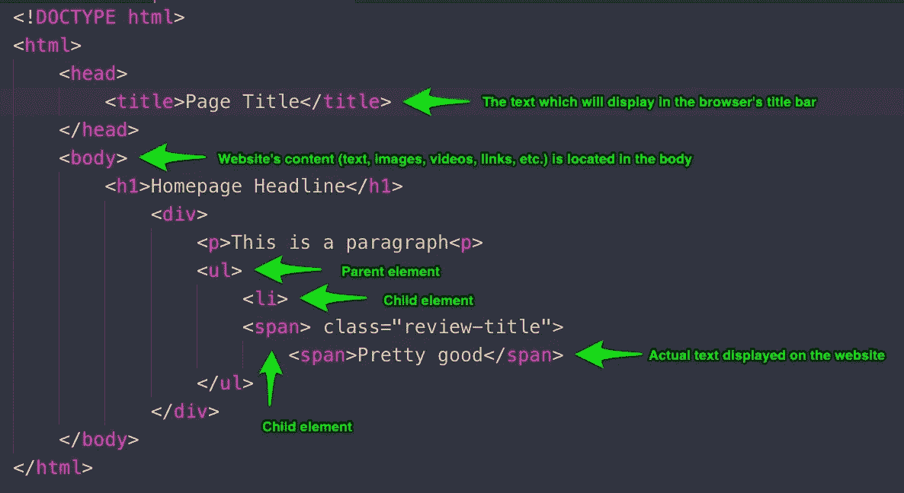
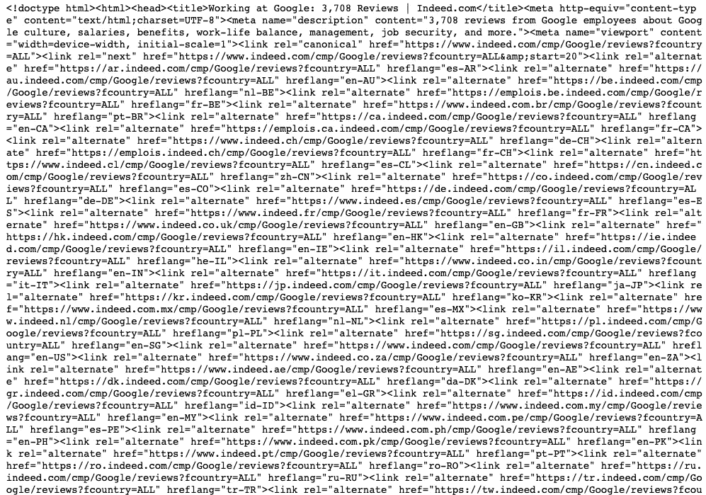
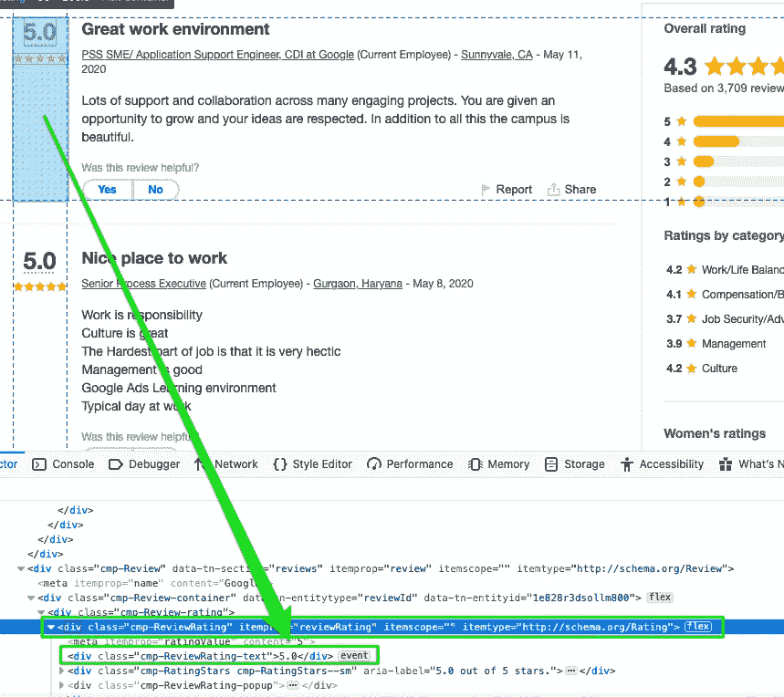
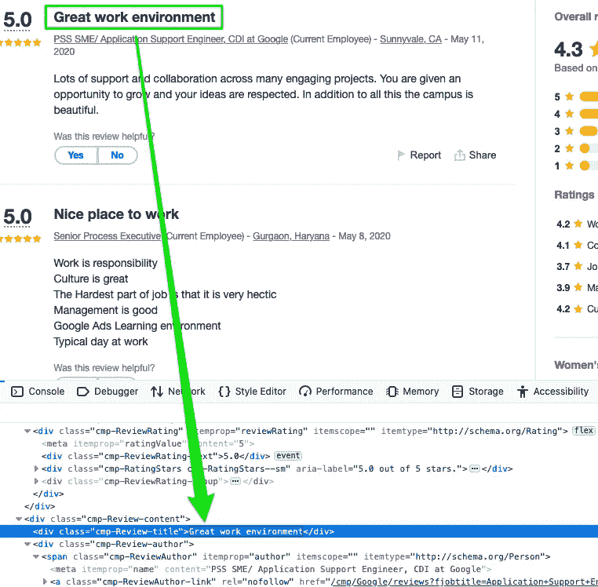
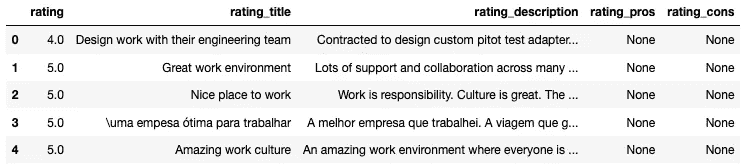

# NLP 第 1 部分|使用 BeautifulSoup 和 Python 抓取 Web

> 原文：<https://towardsdatascience.com/scraping-the-web-using-beautifulsoup-and-python-5df8e63d9de3?source=collection_archive---------3----------------------->


Photo by [Patrick Selin](https://unsplash.com/@patuphotos?utm_source=medium&utm_medium=referral) on [Unsplash](https://unsplash.com?utm_source=medium&utm_medium=referral)

数据是任何数据科学项目的核心，然而我们常常认为数据的可用性是理所当然的，尤其是当它整齐地出现在 SQL 数据库中或者更好地出现在我们的收件箱中时。

也就是说，由于其特定的性质，有时您正在寻找的数据并不容易获得。这个问题的一个可能的解决方案是**网络抓取**的想法，或者通过仔细阅读特定网站的 HTML 从该网站提取信息。例如，让我们说你正在计划一个假期，你在寻找机票何时开始销售。是的，你可以每小时浏览同一个旅游网站，希望价格会下降，但更有效的方法是每小时浏览旅游网站，并有一个输出文件为你提供最新的票价。

## 放弃

许多网站不希望自己的数据被窃取，尤其是当这些数据包含可识别的用户信息时(如脸书、Linkedin 等)。).请考虑您选择刮取哪些数据以及刮取的频率。

## NLP 系列

这个简短的教程是关于自然语言处理(NLP)的 3 部分系列的第一部分。在这个系列中，我们将探索抓取网站数据的技术，预处理并准备好数据以供分析，最后从我们的 NLP 数据中收集见解。

[NLP 第二部](https://medium.com/@kamilmysiak/preprocessing-text-data-using-python-576206753c28)

[NLP 第三部](https://medium.com/@kamilmysiak/nlp-part-3-exploratory-data-analysis-of-text-data-1caa8ab3f79d)

# 从 Indeed.com 搜集公司评论

在这个例子中，让我们尝试抓取 indeed.com，但具体来说是公司评论。让我们针对员工的评分、评估职称、评估描述以及优点和缺点。



## HTML 基础

在我们真正开始收集信息之前，我们需要熟悉 HTML 的基本结构，因为我们实际上将使用 HTML 标签来标识我们希望收集的信息。

我们可以通过在您当前的浏览器中打开开发者工具来访问网站的 HTML。比如 Firefox(选项→ Web Developer → Inspector)。所有这些蓝色的“div”标签、箭头、类和 id 就是你当前所在网站的 HTML。



在我们研究 indeed.com 的 HTML 之前，让我们用下面的例子回顾一下它的基本结构。



HTML 描述了网站的底层结构。换句话说，它标识了网站将有一个标题，多个段落，一个嵌入的视频，一个结束页脚，等等。HTML 不会描述这些组件将如何排列，它们的样式、大小、颜色等。

HTML 代码本质上是分层的，缩进的标签(即。

、

## Python 代码

首先，我们需要导入所需的库。

```
from bs4 import BeautifulSoup
import lxml
import requests
import pandas as pd
import numpy as np
```

导入的“request”库有一个 get()函数，它将向 indeed.com 服务器请求 URL 的内容，并将服务器的响应存储在“base_url”变量中。如果我们打印“base_url”变量，我们将实际看到页面的整个 HTML。

```
base_url = requests.get('[https://www.indeed.com/cmp/Google/reviews?fcountry=ALL&start='](https://www.indeed.com/cmp/Google/reviews?fcountry=ALL&start='), timeout=5)print(base_url.text)
```



让我们首先定义一个名为“parse”的函数，它需要一个参数，这个参数将是我们试图解析/抓取的页面的实际 URL。接下来，我们将使用 BeautifulSoup 类创建器来解析所提供网站的内容(HTML 代码)。我们将使用“lxml”解析器，以防 HTML 格式不完美。更多关于 BeautifulSoup 可用的不同解析器的信息，请访问这个[链接](https://www.crummy.com/software/BeautifulSoup/bs4/doc/#specifying-the-parser-to-use)。

> 请记住，网站通常会通过更改容器中项目的名称或父/子关系来调整其 HTML 脚本。这些变化需要你调整你的职能。该函数于 6 月 20 日进行了调整，以修复新实现的 indeed.com HTML 脚本

```
def parse(full_url):
    **page_content = BeautifulSoup(full_url.content, 'lxml')**
    containers = page_content.findAll('div', 
                 {'class':'cmp-Review-container'})
    df = pd.DataFrame(columns = 
         ['rating', 'rating_title',  'rating_description',
                         'rating_pros', 'rating_cons'])

    for item in containers:
        try:
            rating = item.find('div', 
                     {'class': 'cmp-ReviewRating-text'})
                     .text.replace('\n', '')
        except:
            rating = None
        try:
            rating_title = item.find('div', 
                           {'class': 'cmp-Review-title'})
                           .text.replace('\n', '')
        except:
            rating_title = None
        try:
            rating_description = item.find('span', 
                                 {'itemprop': 'reviewBody'})
                                 .text.replace('\r', '. ')
        except:
            rating_description = None
        try:
            rating_pros = item.find('div', 
                          {'class': 'cmp-ReviewProsCons-prosText'})
                          .text.replace('\n', '')
        except:
            rating_pros = None
        try:
            rating_cons = item.find('div', 
                          {'class': 'cmp-ReviewProsCons-consText'})
                          .text.replace('\n', '')
        except:
            rating_cons = None
        df = df.append({'rating': rating, 
             'rating_title': rating_title, 
             'rating_description': rating_description,
             'rating_pros': rating_pros, 
             'rating_cons': rating_cons}, ignore_index=True)
    return df
```

接下来，我们需要更仔细地检查 HTML 以识别哪个根容器(即哪个父标签)容纳包含我们要抓取的信息的子/嵌套标签。让我们导航到“[https://www.indeed.com/cmp/Google/reviews?fcountry=ALL&start =](https://www.indeed.com/cmp/Google/reviews?fcountry=ALL&start=)”，因为我们将收集员工对谷歌的评论。打开您的开发工具，观察网站的 HTML。请注意，一旦您访问了网站的 HTML，在网站上移动鼠标光标会导致特定区域高亮显示，并且 HTML 似乎会随着您移动光标而改变。当您移动光标时，您的开发者工具会自动将您带到网页上突出显示部分的 HTML 部分。这非常有帮助，因为我们可以快速识别 HTML 代码中需要更详细检查的部分。

如果您还记得，在本教程中，我们感兴趣的是收集员工的总体评分、考核标题、考核描述、优点和缺点。我们需要识别哪个 HTML 标签是所有这些信息的容器或家。通过将鼠标光标移动到适当的位置，我们看到所有我们想要抓取的信息都整齐地包含在一个根元素中。通过检查下面的 HTML，我们可以看到“

”现在移动到一个不同的评论，您将看到名为“cmp-Review-container”的同一个类属性，它存储该评论的数据。

因此，我们将使用“findall()”方法提取所有具有“cmp-Review-container”类属性的“div”容器。接下来，我们将创建一个名为“df”的空 pandas 数据帧，我们将把抓取的数据追加到该数据帧中。

```
def parse(full_url):
    page_content = BeautifulSoup(full_url.content, 'lxml')
    **containers = page_content.findAll('div', 
                 {'class':'cmp-Review-container'})
    df = pd.DataFrame(columns = 
         ['rating', 'rating_title',  'rating_description',
                         'rating_pros', 'rating_cons'])**

    for item in containers:        
        try:
            rating = item.find('div', 
                     {'class': 'cmp-ReviewRating-text'})
                     .text.replace('\n', '')
        except:
            rating = None
        try:
            rating_title = item.find('div', 
                           {'class': 'cmp-Review-title'})
                           .text.replace('\n', '')
        except:
            rating_title = None
        try:
            rating_description = item.find('span', 
                                 {'itemprop': 'reviewBody'})
                                 .text.replace('\r', '. ')
        except:
            rating_description = None
        try:
            rating_pros = item.find('div', 
                          {'class': 'cmp-ReviewProsCons-prosText'})
                          .text.replace('\n', '')
        except:
            rating_pros = None
        try:
            rating_cons = item.find('div', 
                          {'class': 'cmp-ReviewProsCons-consText'})
                          .text.replace('\n', '')
        except:
            rating_cons = None
        df = df.append({'rating': rating, 
             'rating_title': rating_title, 
             'rating_description': rating_description,
             'rating_pros': rating_pros, 
             'rating_cons': rating_cons}, ignore_index=True)
    return df
```

既然我们已经为所有想要抓取的数据确定了容器，那么让我们更深入地研究 HTML，以确定包含实际数据的元素。首先，评论评级再次位于“cmp-Review-container”容器中，但是向下钻几层，我们会发现“< div”标记具有“cmp-ReviewRating-text”类属性，它实际上存储了“5.0”评级。让我们记下存储这些数据的标签和类属性，因为下面的 python 脚本需要这些信息。我们对希望提取的所有剩余数据重复该过程。



> 这是对你的挑战。为什么我们要用(")替换回车(" \r "))为我们评分 _ 描述？提示:标题为“工作环境棒”和“工作环境好”的评论有什么区别？在下面的评论中发表你的答案吧！😉

一旦我们为数据确定了合适的标签，让我们把注意力转回到 python 代码上。我们可以在 for 循环中使用 try/except 块，通过 find()方法在容器中搜索已识别的标签。我们使用 find()而不是 findall()，因为我们只希望返回第一个匹配，因为我们使用了 for 循环。最后，我们将抓取的数据追加回之前创建的空数据帧中。

```
def parse(full_url):
    page_content = BeautifulSoup(full_url.content, 'lxml')
    containers = page_content.findAll('div', 
                 {'class':'cmp-Review-container'})
    df = pd.DataFrame(columns = 
         ['rating', 'rating_title',  'rating_description',
                         'rating_pros', 'rating_cons']**)**

    for item in containers:        
        try:
            **rating = item.find('div', 
                     {'class': 'cmp-ReviewRating-text'})
                     .text.replace('\n', '')**
        except:
            rating = None
        try:
            **rating_title = item.find('div', 
                           {'class': 'cmp-Review-title'})
                           .text.replace('\n', '')**
        except:
            rating_title = None
        try:
            **rating_description = item.find('span', 
                                 {'itemprop': 'reviewBody'})
                                 .text.replace('\r', '. ')**
        except:
            rating_description = None
        try:
            **rating_pros = item.find('div', 
                          {'class': 'cmp-ReviewProsCons-prosText'})
                          .text.replace('\n', '')**
        except:
            rating_pros = None
        try:
            **rating_cons = item.find('div', 
                          {'class': 'cmp-ReviewProsCons-consText'})
                          .text.replace('\n', '')**
        **except:
            rating_cons = None
        df = df.append({'rating': rating, 
             'rating_title': rating_title, 
             'rating_description': rating_description,
             'rating_pros': rating_pros, 
             'rating_cons': rating_cons}, ignore_index=True)**
    return df
```

我们还没有完成，因为如果您要执行“parse()”函数，您将获得一个只有 20 条记录的数据帧，这是因为我们只抓取了一页。

为了抓取所有剩余的评论页面，我们首先创建一个新的空数据框架，在遍历所有页面时收集所有的评论。接下来，我们初始化一个计数器变量 20，因为每页有 20 条评论。接下来，我们创建一个 while-loop，它将迭代直到评论的数量等于或大于 4000。为什么是 4000？所有页面上有将近 4000 条个人评论(在撰写本文时)。接下来，当 while 循环遍历每个页面时，我们在 base_url 的末尾添加增量 20。在 base_url 的末尾增加 20 将为您希望访问的页面创建一个新的 url。例如，“[https://www.indeed.com/cmp/Google/reviews?fcountry=ALL&start =](https://www.indeed.com/cmp/Google/reviews?fcountry=ALL&start=)40”将把我们带到评论的第二页。接下来，我们再次请求并获取 while 循环正在迭代的页面的整个 HTML。我们在页面上应用 parse()函数，将新抓取的评论添加到我们的数据帧中。最后，我们将计数器增加 20，以便 while 循环在下一页上迭代。

```
base_url = '[https://www.indeed.com/cmp/Google/reviews?fcountry=ALL&start='](https://www.indeed.com/cmp/Google/reviews?fcountry=ALL&start=')all_reviews_df = pd.DataFrame(columns = ['rating', 'rating_title', 
'rating_description','rating_pros', 'rating_cons'])num_reviews = 20# you can adjust this number on how many reviews you which to scrape
while num_reviews < 3000:  

    full_url = base_url + str(num_reviews)

    get_url = requests.get(full_url, timeout=5)  

    partial_reviews_df = parse(get_url)       all_reviews_df = all_reviews_df.append(
                     partial_reviews_df, ignore_index=True) 

    num_reviews += 20
```



剩下要做的就是将我们的数据帧移动到一个 csv 文件中。

```
all_reviews_df.to_csv('indeed_scrape.csv')
```

我希望你喜欢这个教程。我喜欢你的反馈，欢迎在下面评论。

别忘了挑战！

# 谢谢！