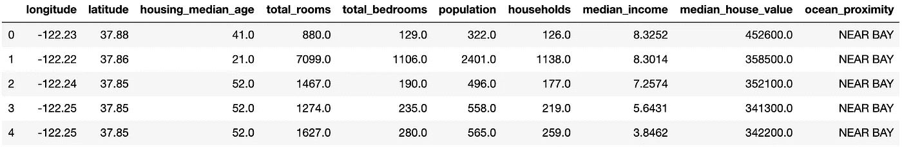
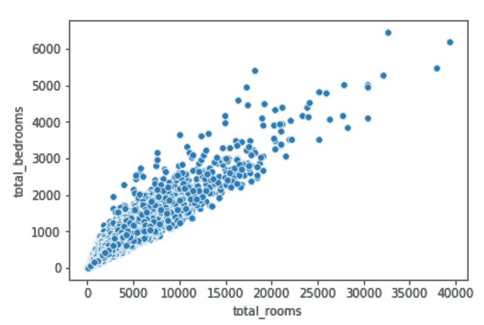
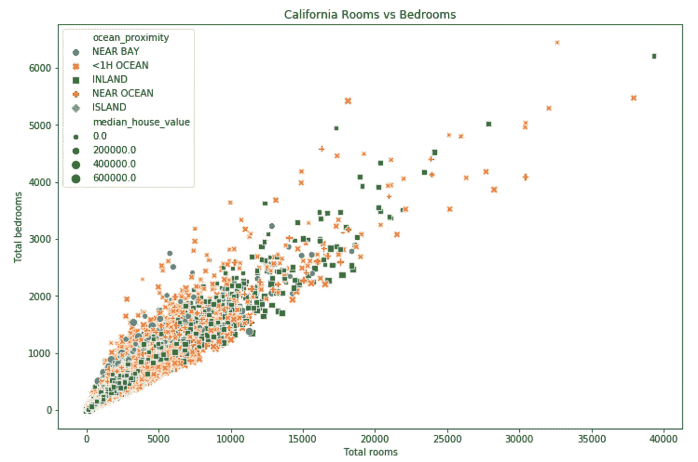
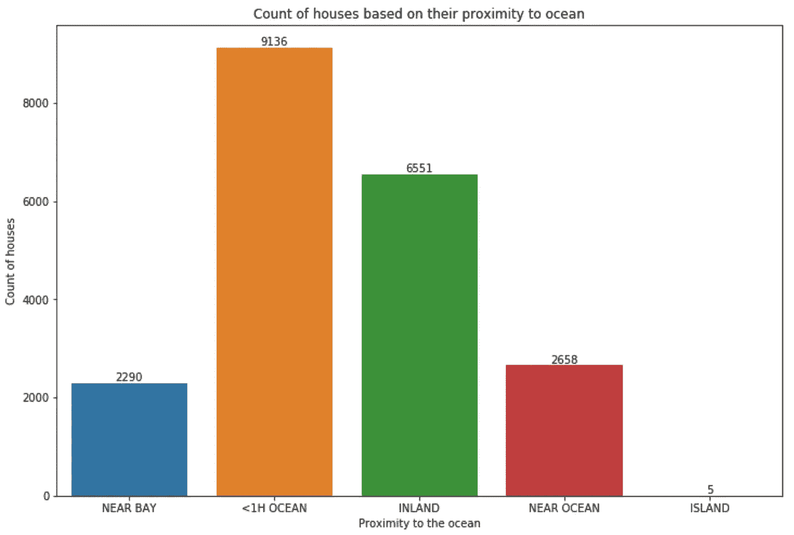
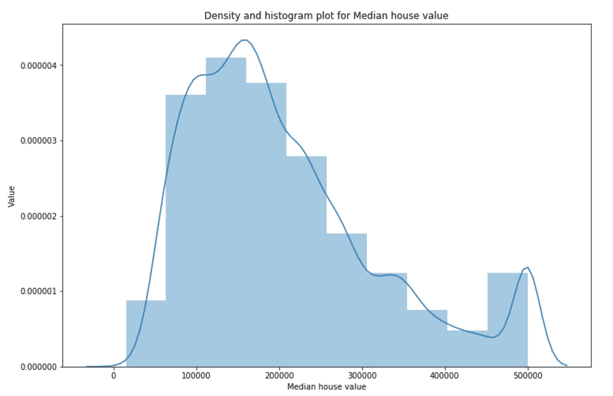
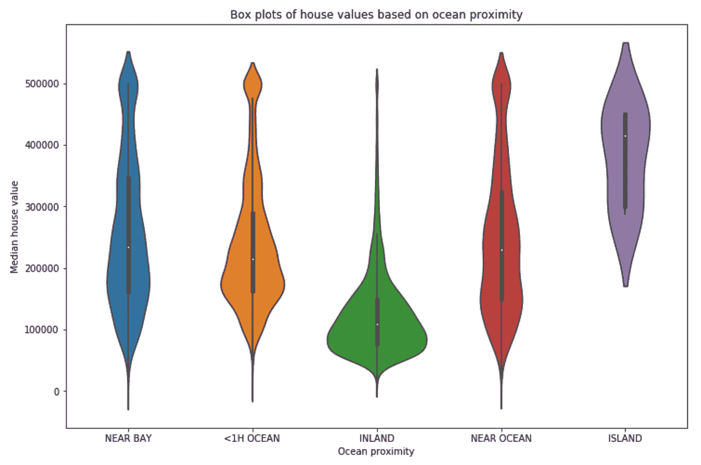
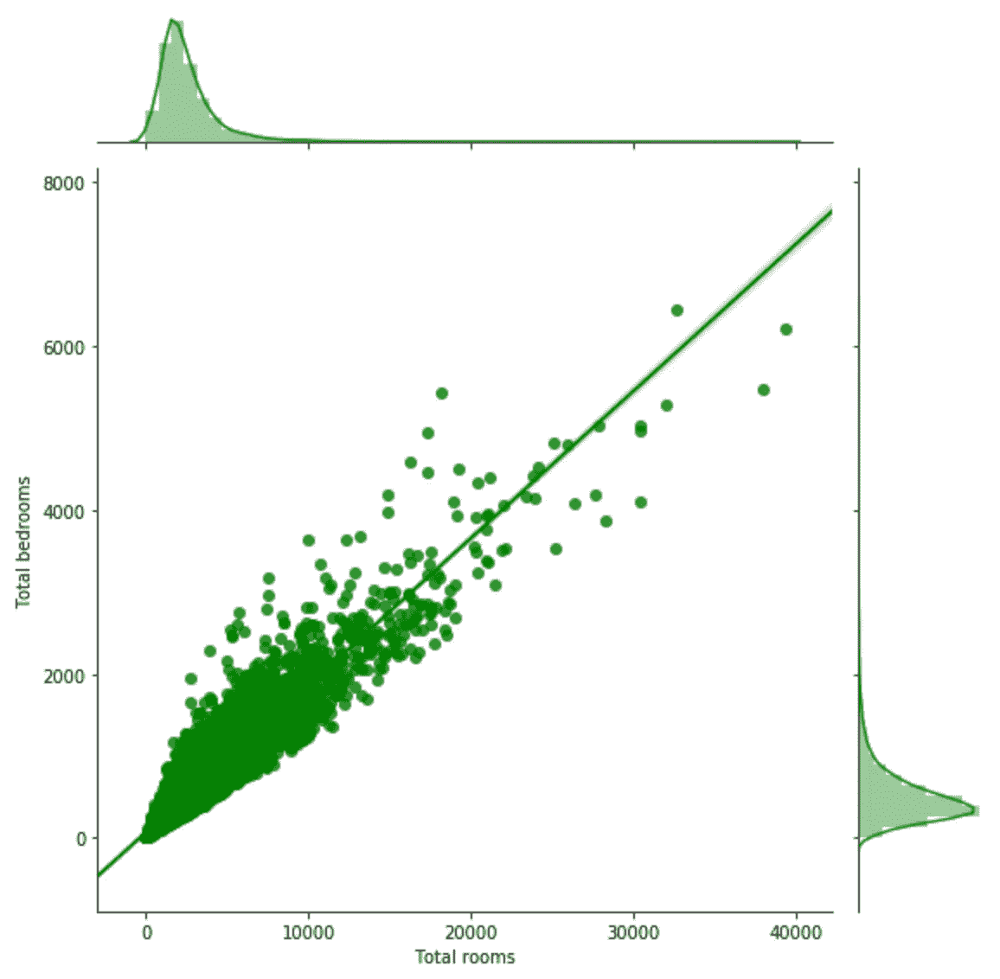
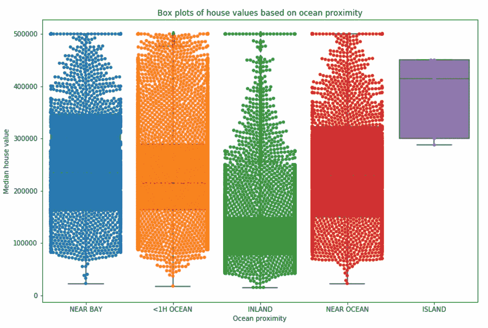
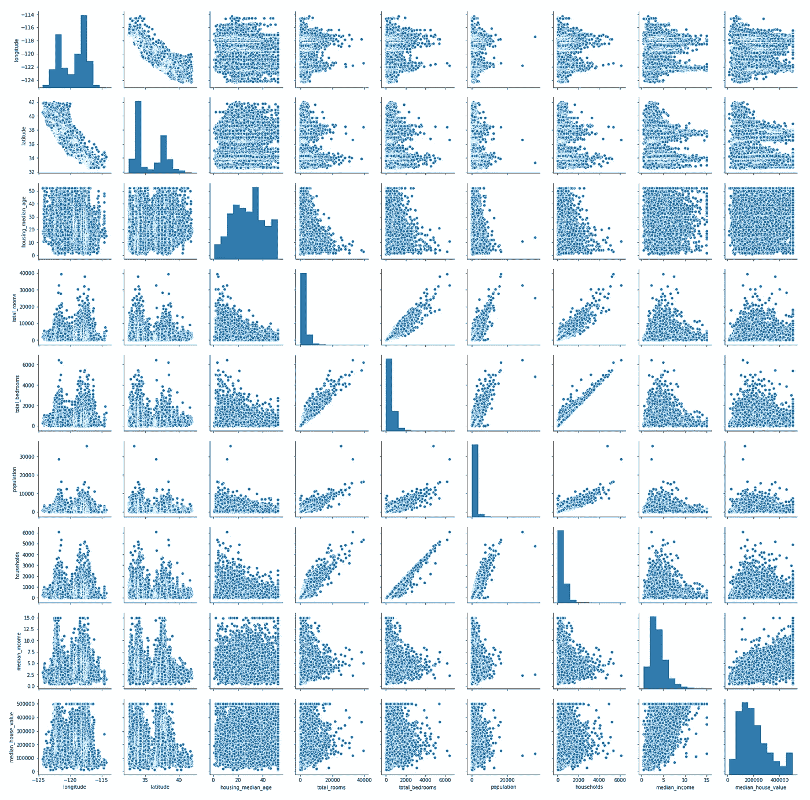

# seaborn——让绘图变得有趣

> 原文：<https://towardsdatascience.com/seaborn-lets-make-plotting-fun-4951b89a0c07?source=collection_archive---------5----------------------->

Python 中的 Seaborn 库简介

Photo by [Isaac Smith](https://unsplash.com/@isaacmsmith?utm_source=medium&utm_medium=referral) on [Unsplash](https://unsplash.com?utm_source=medium&utm_medium=referral)

如果您曾经在 Python 中使用过诸如线图、条形图和其他图，您一定会遇到名为 matplotlib 的库。当我开始使用 Python 进行可视化时，我甚至写了一篇关于如何使用 matplotlib 使数据可视化变得有趣的激动人心的文章，您可以在下面阅读:

 [## matplotlib——让数据可视化变得有趣

### 使用 Matplotlib 创建世界各地人口密度的美丽可视化。

towardsdatascience.com](/matplotlib-making-data-visualization-interesting-8bac1eb3d25c) 

虽然 matplotlib 库相当复杂，但情节并不那么精炼，不会是任何人出版的首选。这就是 seaborn 参与进来的原因。

> Seaborn 是一个基于 matplotlib 的 Python 数据可视化库。它提供了一个高层次的界面来绘制有吸引力的和信息丰富的统计图形。— [seaborn](https://seaborn.pydata.org/)

这个库是可视化的下一步。我们可以制作美丽的情节，甚至只需一个命令就可以制作多个情节。让我们开始探索 seaborn 吧。随附的 GitHub 存储库如下:

 [## kb22/理解-Seaborn

### 此时您不能执行该操作。您已使用另一个标签页或窗口登录。您已在另一个选项卡中注销，或者…

github.com](https://github.com/kb22/Understanding-Seaborn) 

# 输入数据

为了理解不同的情节，我从 Kaggle 中选择了一个关于[加州房价](https://www.kaggle.com/camnugent/california-housing-prices)的数据集。因此，我的第一步是导入允许我读取 CSV 文件的`pandas`库，然后使用`head(5)`打印行数、列名和前 5 行。

我们的数据集有 **20640 行和 10 列**，它们的名称在上面的要点中有描述。我们也来看看前 5 排是什么样子的。

dataset.csv

# 海生的

先从进口`matplotlib`说起吧。请注意，我使用的是 matplotlib 版本 3.0.3，而不是最新版本，因为有一个错误会破坏热图，使其变得无用。然后，我导入了`seaborn`。最后，为了确保 Jupyter 中的情节显示在笔记本中，我们使用了命令`%matplotlib inline`。

让我们开始探索剧情吧！

## 散点图

当我们想要显示两个要素或一个要素与标注之间的关系时，散点图非常有用。这很有用，因为我们还可以描述每个数据点的大小，给它们涂上不同的颜色，并使用不同的标记。让我们看看 seaborn 中的基本命令是做什么的。

Scatter plot in seaborn

上图描述了`total_rooms`和`total_bedrooms`之间的关系。仅仅一个命令就完成了这一切，但是等等，还有更多。

使用 figsize，我将大小增加到 12x8。然后，我用基于`median_house_value`的每个数据点的大小、基于`ocean_proximity`的使用`hue`的颜色和基于`ocean_proximity`的使用`style`的标记更新了散点图命令。此外，没有适当的标题和轴标签的图是不完整的，所以我也添加了它们。

Updated scatter plot using seaborn

正如你所看到的，这个情节看起来比上一个好得多，还包括一个很好的图例，所以任何人都可以看到和理解这个情节——这是它应该的方式。

## 计数图

计数图根据某个分类列自动计算数据点，并将数据显示为条形图。这在分类问题中非常有用，我们想看看不同的类是否有相同的大小。然而，由于这不是一个分类数据，并且只有一个分类列，所以我决定使用它。

seaborn 中的情节允许我们使用`annotate`将`text`添加到每个条形中。仔细观察数据集，我们会发现许多元数据信息都丢失了。例如，列`ocean_proximity`的值`<1H OCEAN`在任何地方都没有描述过。人们应该始终收集元数据信息，并使用具有适当信息的数据集。因为这只是理解图的参考数据集，所以没什么大不了的。

Count plot using seaborn

在上面的图中，我们可以看到该列的数据高度倾斜。让文本和条形在一起真的很有用，因为仅从图上看，最后一个类型`ISLAND`看起来像是零值。

## 直方图

直方图是显示连续数据点并查看其分布情况的有效方法。我们可以看到，大部分值都在较低的一侧，或较高的一侧，或均匀分布。

seaborn 的`dist`图根据数据生成直方图和密度线。我定义了总共 10 个容器，这样整个`median_house_value`被分配到 10 个不同的桶中。

Histogram (with density) in seaborn

正如我们所看到的，分布似乎很正常，在较高的一侧有一个轻微的峰值。上图中的蓝线定义了密度的分布。

## 小提琴情节

在与 seaborn 合作之前，我总是在各种文章中看到这些看起来很奇怪的情节，并想知道它们是什么。然后，我阅读了它们，发现它们是小提琴图，非常类似于箱线图，根据密度描绘宽度，以反映数据分布。在 seaborn，创建一个小提琴情节只是一个命令。

Violin plot in seaborn

在我们继续之前，让我们看看如何理解这些情节。考虑绿色地块`INLAND`。从零延伸到大约 250000 的黑线是 95%的置信区间。内部的黑色厚块是四分位数范围，意味着大约 50%的数据位于该范围内。图的宽度基于数据的密度。我们可以理解为这个特定数据集的直方图，以黑线为 x 轴，被完全平滑并旋转 90 度。

## 热图

相关矩阵有助于我们了解所有特性和标签之间的相互关系以及依赖程度。`pandas`数据帧有一个名为`corr()`的函数，它会生成一个关联矩阵，当我们将它输入到 seaborn 热图时，我们会得到一个漂亮的热图。将`annot`设置为 True 可确保相关性也用数字定义。

Heatmap in seaborn

虽然整个情节很有用，但我们可以从最后一栏开始，注意每个特征如何与标签`median_house_value`相关联。`median_income`与值为`0.69`的标签最相关。

## 联合地块

联合图是散点图与密度图(直方图)的组合，用于我们尝试绘制的两种特征。seaborn 的联合图允许我们甚至使用`kind`作为`reg`单独绘制一个线性回归。我用`height`作为`8`定义了正方形的尺寸，用`green`定义了颜色。

Joint plot in seaborn

绿线表示基于数据点的线性回归。

## 带群图的箱线图

箱线图将信息分成独立的四分位数和中位数。当与`swarm`图重叠时，数据点分布在其位置上，因此完全没有重叠。

Box plot (and swarm plot) in seaborn

从上面的印迹中，我们可以看到`ocean_proximity`中五个类别的箱线图是如何描述的。数据点揭示了数据是如何分布的。

## 配对图

成对绘图会在每对要素和标注之间产生大量绘图。对于要素/标注的每个组合，此图显示一个散点图，对于每个组合本身，它显示一个直方图。该图本身对于获取手头数据的精华非常有用。

Pait plot in seaborn

上面的图包含了大量的信息，而且只需要一个命令。

# 结论

在本文中，我们探索了一些无限的 seaborn 情节，可以更好地理解该库如何工作以及它能够做什么。不断练习和试验，因为选择几乎是无限的。

这里还有一些你可能会喜欢的文章:

 [## matplotlib——让数据可视化变得有趣

### 使用 Matplotlib 创建世界各地人口密度的美丽可视化。

towardsdatascience.com](/matplotlib-making-data-visualization-interesting-8bac1eb3d25c)  [## 使用 Python 中的多个绘图库在地图上绘制商业位置

### 比较地图打印库

towardsdatascience.com](/plotting-business-locations-on-maps-using-multiple-plotting-libraries-in-python-45a00ea770af)  [## numpy——Python 变得高效

### 文章列举了几个提高 Python 效率和速度的 Numpy 函数，并介绍了 4 个 Numpy 函数

towardsdatascience.com](/numpy-python-made-efficient-f82a2d84b6f7)  [## Google Colab——您在云上的 Python 工作空间

### 了解 Google Colab

towardsdatascience.com](/google-colab-your-python-workspace-on-cloud-c3aed424de0d) 

欢迎分享你的想法、想法和建议。我很乐意收到你的来信。也可以通过 [LinkedIn](https://www.linkedin.com/in/bhanotkaran22/) 联系我。