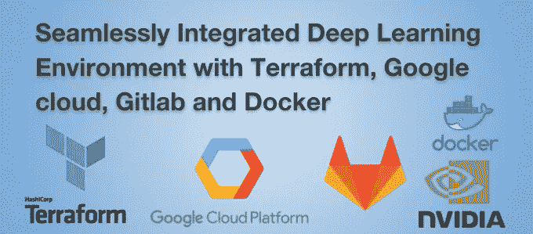
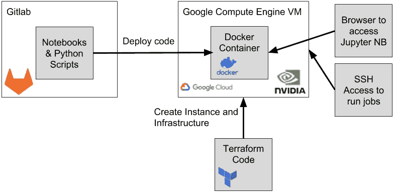
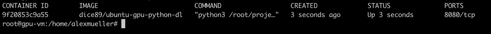

# 将深度学习环境与 Terraform、Google cloud、Gitlab 和 Docker 无缝集成

> 原文：<https://towardsdatascience.com/seamlessly-integrated-deep-learning-environment-with-terraform-google-cloud-gitlab-and-docker-faee4b351e94?source=collection_archive---------13----------------------->



当你开始一些严肃的深度学习项目时，你通常会遇到需要一个合适的 GPU 的问题。购买适合深度学习工作负载的合理工作站很容易变得非常昂贵。幸运的是，云中有一些选项。我尝试的一个方法是使用美妙的谷歌计算引擎。在 GCE 中，GPU 可以作为实例的外部加速器。目前，有这些 GPU 可用(价格为美国中心 1)。

*   英伟达特斯拉 P4:每月每 GPU 1267.28 美元
*   NVIDIA Tesla V100:每个 GPU 每月 306.60 美元
*   英伟达特斯拉 P100:每月每 GPU 746.06 美元
*   NVIDIA Tesla K80:每月每 GPU 229.95 美元

手动配置通常不是您可以轻松扩展的事情，所以我做了一些调查，看是否有方法可以尽可能无缝地扩展我的环境，并以同样的方式破坏它。因此，我找到了一个解决方案，使用 terraform 在谷歌计算平台上建立基础设施。源代码从 Git 部署，Docker 容器自动启动，安装了所有必要的依赖项，如 tensorflow、keras 和 jupyter。在这篇博文中，我将指导你如何轻松设置环境的各个步骤。一些工作基于这个 git 库:[https://github.com/Cheukting/GCP-GPU-Jupyter](https://github.com/Cheukting/GCP-GPU-Jupyter)

# 你会从博文中学到什么？

*   以自动化的方式使用 GPU 设置 GCE 实例
*   如何与 GCP 一起使用 terraform
*   如何将 Gitlab 存储库的代码部署到 GCE 实例中



What we will build in this blog post.

如上图所示，我将向您展示如何编写一个 terraform 脚本，该脚本自动启动一个 Google compute engine 虚拟机，在其上安装 CUDA、Docker 等，并最终使用来自另一个外部 Git 存储库(在我们的例子中是来自 gitlab)的代码启动一个 Docker 容器。这个 Docker 容器运行的是 jupyter 笔记本服务器，可以通过浏览器从外部访问。此外，我将向您展示如何使用 Docker 在虚拟机中运行笔记本之外的更长时间的任务。

# TL；速度三角形定位法(dead reckoning)

只是想试试，那就去看看 TL；DR 部分，列出了所有必要的命令。

# 为您的 python 代码创建 Gitlab 库

如果你已经有一个想要给我们的知识库，请随意。否则，现在应该创建一个新的存储库。https://gitlab.com/[。你所有的 ml 和 data exploration 代码都将进入这个库。我们将把它与基础设施代码分开。](https://gitlab.com/)

同样，在这个 Gitlab 存储库中，您现在可以添加所有代码，例如，创建一个简单的 train.py python 文件来训练神经网络，并在最后保存训练好的权重。这里可以找到一个非常简单的例子:https://gitlab.com/dice89/deep-learning-experiments

这个 repo 只包含一个用于数据探索的 Jupyter 笔记本和一个用于训练 RNN·LSTM 文本生成模型的 *train.py* 。

# 创建您自己的 Docker 图像/使用现有的图像

您可以采用现有的 Docker 图像，也可以创建自己的图像。为了简单起见，我们将使用预构建的 Docker 映像，其中安装了 python 3.5 环境，并包含了合理的深度学习用例所需的所有库。它应该包含第一次尝试所需的一切:python 3。x，tensorflow-gpu，numpy，pandas，sklearn，keras

如果你感兴趣，你可以看看这张图片:https://hub.docker.com/r/dice89/ubuntu-gpu-python-dl/

# 使用 Terraform 配置和启动实例

Terraform 是一个“基础设施即代码”工具包，允许您通过编写代码来定义、创建和销毁基础设施。这带来了很多好处:例如，你不需要像在 GCP 控制台中那样通过 UI 来配置任何东西。此外，默认情况下，您的整个基础设施配置都有文档记录，因为它是可读的代码，在 git 存储库中有理想的版本。我一年前才发现 Terraform，已经无法想象没有它如何建立基础设施。Hashicorp 发现了可编码和可版本化基础设施的完美结合，这可以用编码者的心态来理解。您只需要一些 terraform 文件和 terraform CLI 来创建您的基础架构。

添加新的 Google compute 实例很容易创建，如下所示:

Example of a gcloud compute instance creation with terraform.

在创建实例之前，您需要预先执行一些步骤:

*   创建 gcloud 帐户([https://cloud.google.com/](https://cloud.google.com/))
*   安装 gcloud CLI 工具作为 [Google Cloud SDK](https://cloud.google.com/sdk/docs/) 的一部分
*   使用您的终端“gcloud auth login”登录 gcloud

在下面的代码片段中，您将创建一个 gcloud 项目，将执行上下文设置为您的当前帐户，创建一个能够创建新实例的服务帐户，最后下载私钥以在 terraform 中使用该服务帐户。

在您的 CLI 中执行这些命令，并用您想要的项目名称替换<your>。这可能需要一些时间，主要是因为激活了计算 API。</your>

在我们开始实例之前，让我们看一下关于如何配置一个支持 GPU 的 Google compute 实例的细节。*不幸的是，你必须为 GPU 申请一个配额(直到 2018 年 12 月没有它，它一直为我工作)。请听从本* [*Stackoverflow 文章*](https://stackoverflow.com/questions/45227064/how-to-request-gpu-quota-increase-in-google-cloud) *的建议。处理此请求可能需要 2 个工作日。*

Google Compute Instance with a GPU

正如您在第 19 行中看到的，我们向该实例添加了一个 Tesla K80 GPU，启动时我们在一个脚本中执行一些操作( *start-up-script.sh* )。如下所示:

Setting up Ubuntu VM to run with CUDA

在这个脚本中，我们安装所有需要的库，为用户添加一个 ssh 密钥，并运行 Docker 容器，将端口 80 暴露给外界。因此，我们可以到达 jupyter 笔记本服务器。请注意，创建此实例后，任何知道 IP 的人都可以访问您的笔记本。即使对于像这样的短命环境，这也应该改变。现在创建一个新的 ssh 密钥，以便能够将我们的代码从 Gitlab 部署到实例中。

```
ssh-keygen -t rsa -b 4096 -C “your_email@example.com”
```

为了使它工作，您必须将占位符“在此添加您的 SSH 密钥”替换为您生成的私有(！！！)在*启动脚本. sh* 中输入 ssh 密钥。请注意:不要与任何人分享您的密钥！从这个存储库中克隆完整的配置，然后更改您的 ssh 密钥:[https://gitlab.com/dice89/google-cloud-gpu-vm.](https://gitlab.com/dice89/google-cloud-gpu-vm.)(不要将您的私钥提交给任何 git 存储库)另外，确保您的 credentials.json 在这个文件夹的根目录中(不要提交 credentials.json)。您还必须将这个 ssh 密钥添加到您的 gitlab 帐户，以便可以部署来自 Gitlab 存储库的代码。

现在我们准备创建机器。这仅用 3 个 bash 命令就可以实现！🚀

填写您的 GCP 项目 id 类型“是”,您的实例将被创建(还要考虑这将导致的成本，免费层不包括 GPU)。创建实例后，您将看到一个发布到命令行的 IP 地址。这是您的公共 IP，您的 jupyter 实例将在该 IP 下可用。可能需要几分钟的时间，直到*启动脚本. sh* 完成并安装好所有东西。

在脚本完成之前，让我们花点时间来研究一下这个实例。为了做到这一点，你必须 ssh 到它。幸运的是，谷歌为我们提供了一个命令。

```
gcloud compute --project “<your>_dl” ssh --zone “europe-west1-d” “gpu-vm”
```

*start-up-script.sh* 作为根用户运行，因此，您必须切换到您的根控制台来查看发生了什么。

```
sudo su
cd /var/log
tail -f syslog | grep startup-script
```

现在我们在实例上，可以检查，例如，是否安装并使用了 GPU。

```
nvidia-smi -l 1
```

我们还可以安装 htop，因为它可以方便地监控正在运行的进程的内存消耗:

```
sudo apt-get install htop
```

过一会儿，您可以检查是否已经有 Docker 容器在运行:

```
docker ps
```

如果你在这个概览上看到你的 Docker 容器，你已经准备好在显示的 IP 下登录你的 jupyter 笔记本。

此外，如果你进入路径*~/data science/deep-learning-experiments*，你会看到它会自动挂载到你的 Docker 容器中的 */root/project* 下，并包含你的 gitlab 库的内容，如 *train.py* 。

# 在 jupyter 外执行训练任务

Jupyter 非常适合一些数据探索或实验代码。然而，训练深度学习模型需要很多时间，你不能承受 jupyter 会话崩溃和丢失所有训练进度。幸运的是，有一种补救方法。通过运行 Docker 容器作为守护进程，运行 python 脚本来训练您的模型，您可以非常容易地训练一个新模型。例如，在我们的示例类型中，您需要做的所有事情都是。

```
docker run --runtime=nvidia -d -v ~/datascience:/root/project dice89/ubuntu-gpu-python-dl python3 /root/project/deep-learning-experiments/train.py
```

如果您现在检查 *docker ps* ，您会看到类似这样的内容:



要查看训练任务的日志，只需输入:

```
docker logs <your_container_id_from docker ps>
```

最后，您将使用 Git 存储库中的代码以可重复的方式训练您的模型。当您完成并保存和储存了您的体重后，您只需输入:

```
terraform destroy \
  -var 'project_id=<your>-dl' \
  -var 'region=europe-west1-d'
```

如果您需要相同的环境，只需输入:

```
terraform apply \
  -var 'project_id=<your>-dl' \
  -var 'region=europe-west1-d'
```

所以，这就是这个关于如何使用云资源创建深度学习环境的小演练。祝你试用愉快，如果你有任何改善环境的建议，请给我一些反馈。

# TL；速度三角形定位法(dead reckoning)

下面是使用预定义的 Docker 容器创建环境的说明。用你喜欢的前缀替换<your>。</your>

1.创建 gcloud 帐户

2.安装 g cloud CLI:https://cloud.google.com/sdk/docs/downloads-interactive

```
curl [https://sdk.cloud.google.com](https://sdk.cloud.google.com) | bash
exec -l $SHELL
gcloud init
```

3.创建 Gcloud 帐户和项目(替换<your>)</your>

```
gcloud projects create <your>-dl --enable-cloud-apis
gcloud config set project  <your>-dl
gcloud services enable compute.googleapis.com
```

4.安装地形:[https://www.terraform.io/intro/getting-started/install.html](https://www.terraform.io/intro/getting-started/install.html)

```
brew install terraform
```

6.(如果你想给它部署一些代码的话是可选的)Fork 和 git 克隆深度学习实验

[https://git lab . com/dice 89/deep-learning-experiments/forks/new](https://gitlab.com/dice89/deep-learning-experiments/forks/new)

```
git clone [git@gitlab.com](mailto:git@gitlab.com):<your_user>/deep-learning-experiments.git
```

7.Git 克隆代码，用 GPU 定义 Google 计算引擎 VM

```
git clone git@gitlab.com:dice89/google-cloud-gpu-vm.git
cd google-cloud-gpu-vm
```

6.创建 ssh 密钥

```
ssh-keygen -t rsa -b 4096 -C “your_email@example.com”
```

7.将私有 ssh 密钥添加到 Google 云基础架构“start_up_script.sh”

8.将公共 ssh 密钥添加到您的 Gitlab 帐户

9.创建一个 GCP 服务帐户并获取凭据

```
gcloud iam service-accounts create gcp-terraform-dl --display-name gcp-terraform-dlgcloud projects add-iam-policy-binding  <your>-dl \
            --member='serviceAccount:gcp-terraform-dl@<your>-dl.iam.gserviceaccount.com' --role='roles/owner'gcloud iam service-accounts keys create 'credentials.json' --iam-account='gcp-terraform-dl@<your>-dl.iam.gserviceaccount.com'
```

10.初始化你的地形环境

```
terraform init
```

11.启动环境

```
terraform apply \
  -var 'project_id=<your>-dl' \
  -var 'region=europe-west1-d'
```

稍等片刻(大约 5-10 分钟),查看您的 jupyter 笔记本电脑服务器的 IP 地址:

```
terraform show | grep assigned_nat_ip
```

要 ssh 到您计算实例:

```
gcloud compute — project “<your>-dl” ssh — zone “europe-west1-d” “gpu-vm”
```

12.破坏环境

```
terraform destroy \
  -var 'project_id=<your>-dl' \
  -var 'region=europe-west1-d'
```

*如果你发现教程有什么问题，请向我反映！我非常希望它保持最新。*